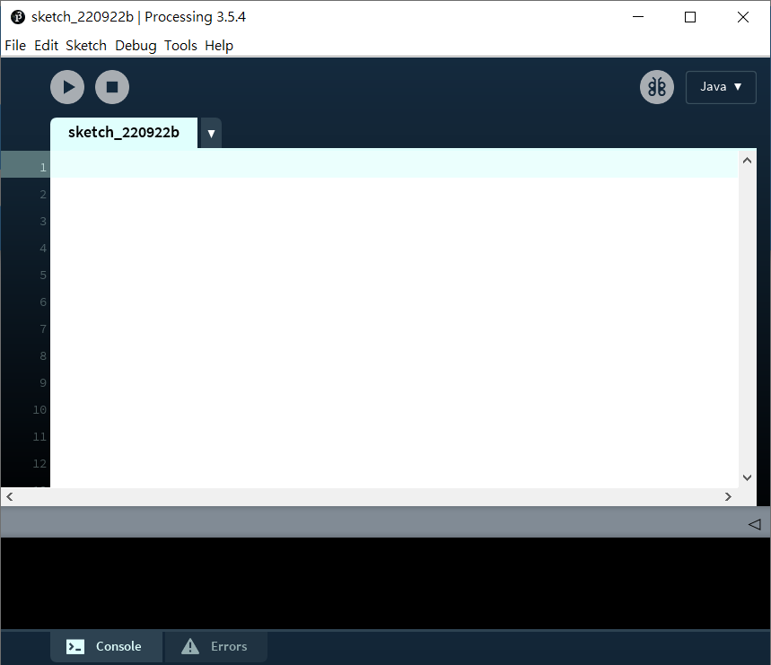
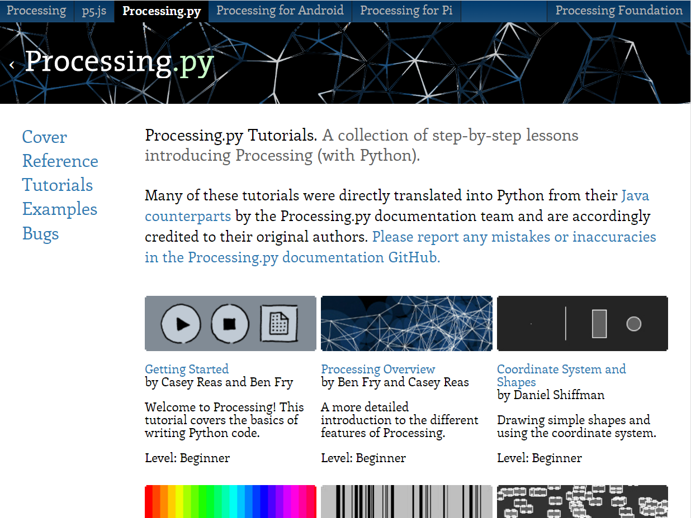
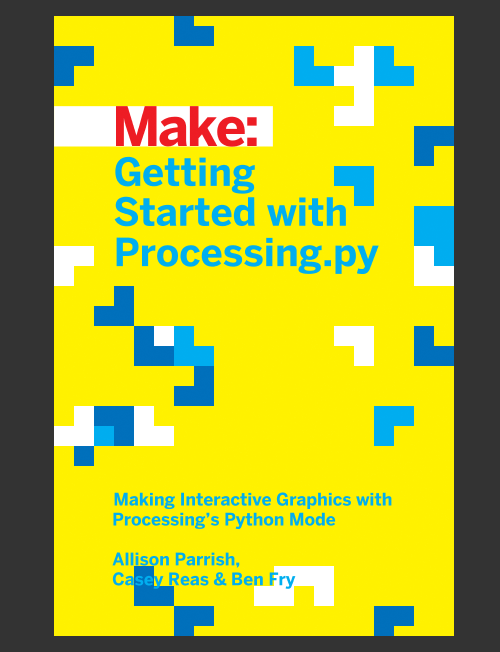

# 0. Getting started with processing.py

[toc]

## 介紹

Processing是一個開源的程式語言，同時也是一個程式語言集成開發環境(IDE)。

> Processing是一種開源程式語言，專門為電子藝術和視覺交互設計而創建，其目的是通過可視化的方式輔助編程教學，並在此基礎之上表達數字創意。

Processing語言其實是java語言，但針對圖形圖像的語法進行簡化，非常方便繪畫一些能跟使用者互動的簡單圖形，對編程藝術表達，編寫小遊戲都十分合適。

Processing除了java版本(這合本機電腦運行)，也有：JavaScript版本(專門適合於製作網頁版本)，Android版(顧名思意就是專門用於Android系統)和Python版本，甚至有Ruby語言版本。

由於Processing是java語言，所以Python版本其實是用Jython將你寫的python語言編譯成java語言再運行的。好消息是：基乎所有2.x版本的python指令，都能在Processing python版本中運行，例如複數(complex number)、排列(Permutation )和組合(Combination)，或其他不依賴C語言的模組。可惜的是，python常用的numpy，scipy等工程模組，由於都是用C語言運行，所以processing python版本並不支援。

## Processing下載和資訊

你可以到這裡下載和得到更多資訊。

> https://py.processing.org/

這裡也有完整的教程，教你怎麼下載processing，下載python模組，以至一此常用的指令教程和資訊，我們這個網站沒有很基礎的下載、座標、指令和語法使用的教程，如果你對寫遊戲時的processing指令和卜語法有疑問，都可以在這個網站中得到答案。

> https://py.processing.org/tutorials/
>
> 

## Getting started with processing.py (書本介紹)

Getting started with processing系列是一套三本的processing編程教學系列，分別為processing, p5.js和processing.py，內容幾乎都是一樣的，但就著三種語言，在語法上有所不同，也有一些該語法獨有的功能。

這個系列的書是我見過最好的編程入門書本，深入淺出一步一步教授基礎語法和功能，配合processing本身方便繪圖和互動的功能，使用者能深入淺出地學習編程語法。建議在開始學習本網站內容前，先行閱讀一下這系列的書，令你對編程有所了解。

