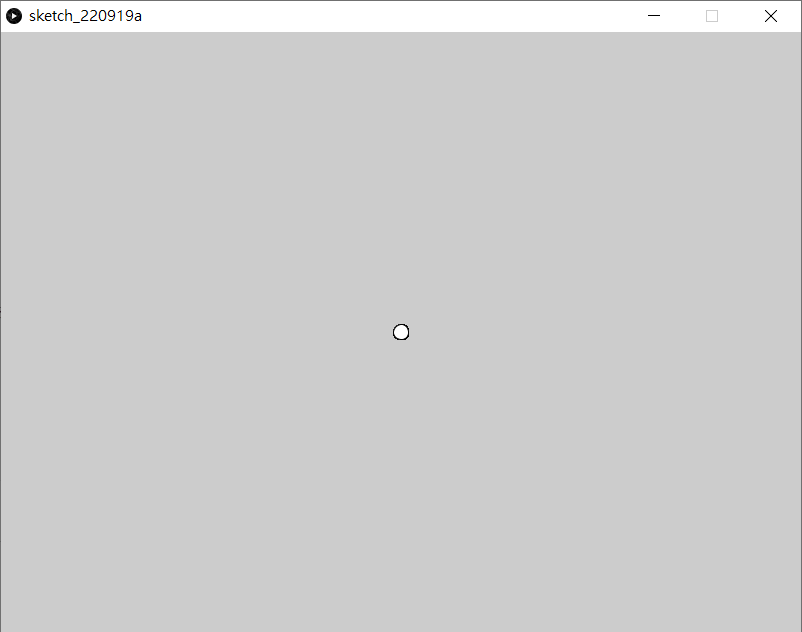
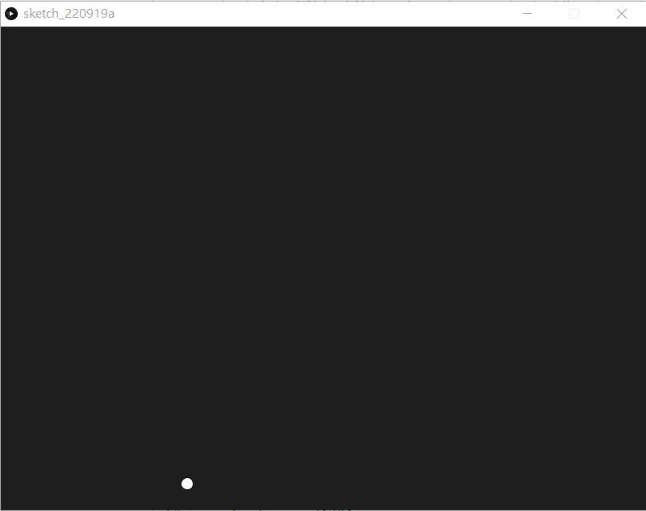
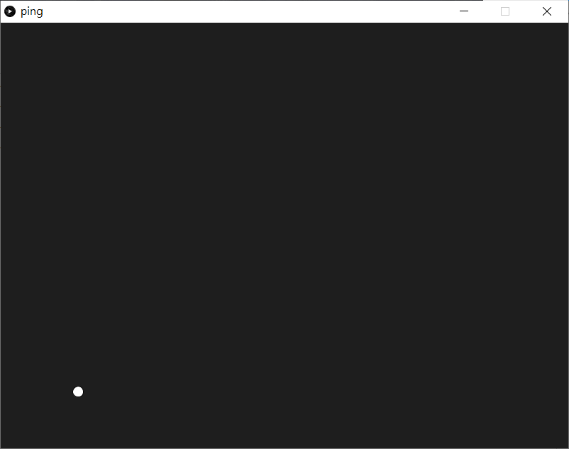
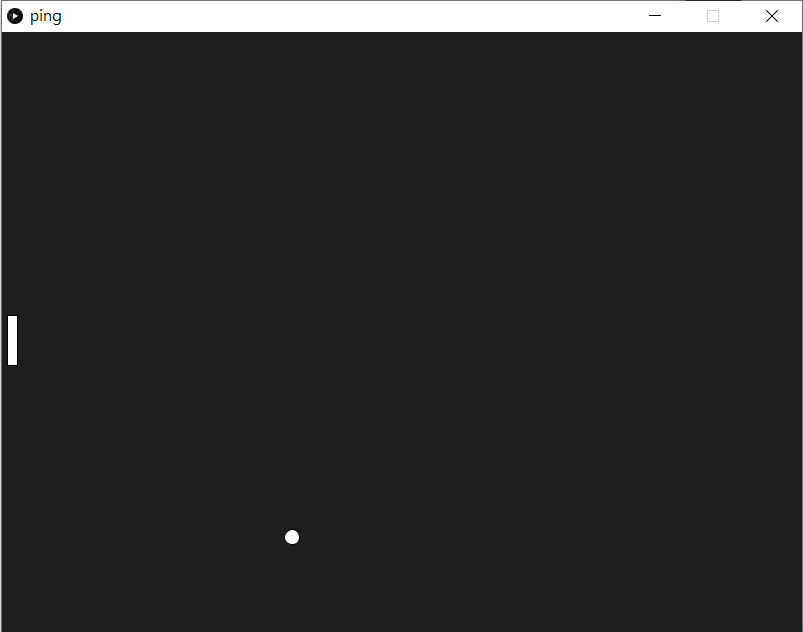
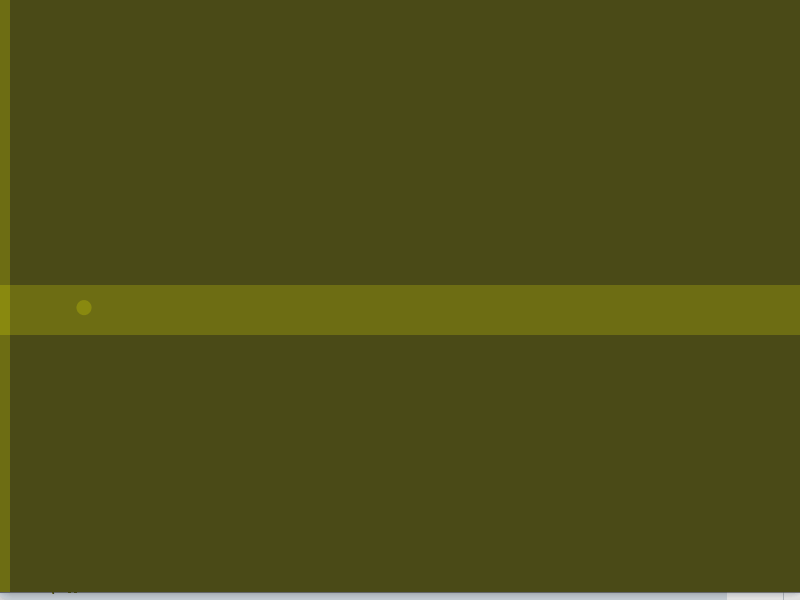
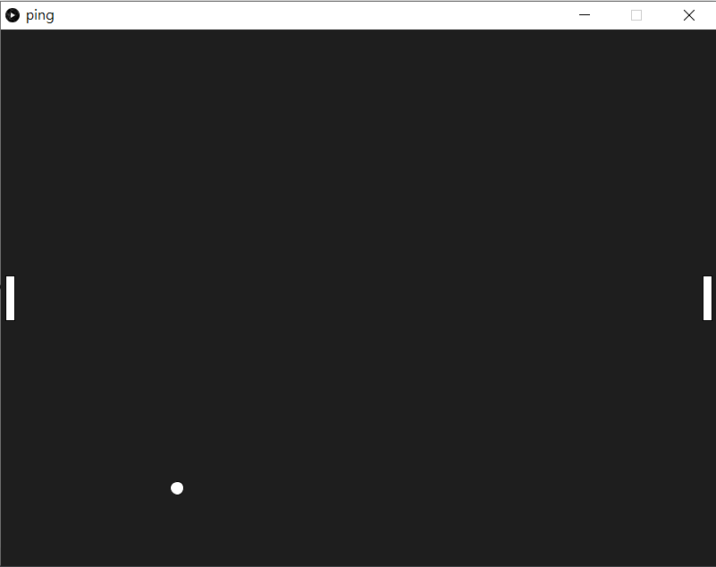
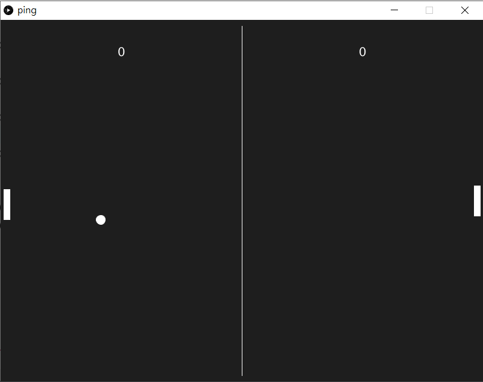

# 1. Pong Game

> 《乓》（英語：Pong）是雅達利在1972年11月29日推出的一款投幣式街機遊戲。《乓》是一款乒乓球遊戲，其英文名稱「Pong」來自乒乓球被擊打後所發出的聲音。《乓》很多時候也被認為是電子遊戲歷史上第一個街機電子遊戲。在此遊戲中，玩家的目的就是在模擬乒乓球比賽中奪取高分以擊敗電腦玩家。此遊戲的開發者為艾倫·奧爾康。


[TOC]

## 1.0 本章重點

1. 建立processing.py程式最基本函數
2. 劃圓和長方型
3. 認識變數，認識`global`
4. 認識keyPressed鍵盤輸入

## 1.1 開始遊戲

```python
def setup():
    size(800, 600)
def draw():
    ellipse(width/2, height/2, 15, 15)
```



Processing.py的程式碼，內置已經有兩個函數，分別為`setup()`和`draw()`，顧名思義，`setup()` 只會在程式執行時執行一次，而`draw()`則有點像arduino的`loop()`，會不斷重覆。而程式中`width`和`height`是關鍵字，對應就是`size()`中的長和寬。

下一步，就要令中間的球移動。

##1.2 令球移動

###創建一個會動的球

```python
ballX=0
ballY=0
ballSpeedX=0
ballSpeedY=0

def setup():
    global ballX, ballY, ballSpeedX, ballSpeedY
    
    size(800, 600)
    ballX = width/2
    ballY = height/2
    ballSpeedX = -1
    ballSpeedY = random(-2, 2)
    
def draw():
    global ballX, ballY, ballSpeedX, ballSpeedY
   
    background(30)
    ballX += ballSpeedX
    ballY += ballSpeedY
    ellipse(ballX, ballY, 15, 15)
```



```python
ballX=0
ballY=0
ballSpeedX=0
ballSpeedY=0
```

1創建4個變數，分別為`ballX`, `ballY`, `ballSpeedX`和`ballSpeedY`。對應的是球的x和y座標，球的x和y的速度。之後在`setup()`中預設球的位置和初速。(之所以不在一開始宣告就設定它們的值，而是在`setup()`中，是因為之後restart game時會方便很多)


```python
global ballX, ballY, ballSpeedX, ballSpeedY
```

Python語言跟其他語言比有點特別，所有的global變數，不需要特別宣告，就可以在所有函數中應用，但如果要在函數中要改變global變數的話，就需要在函數之內用keyword `global`將global變數宣告一次。


```python
ballX = width/2
ballY = height/2
ballSpeedX = -1
ballSpeedY = random(-2, 2)
```

一開始球在瑩幕正中，預設向player1(左邊)放向發去，所以`ballSpeedX`一開始是`-1`。


```python
ballX += ballSpeedX
ballY += ballSpeedY
```

之後每次`draw()`不停重覆時，就更新球的x和y座標，將其加上球的速度，這樣球就會不停移動。


###令球懂得撞牆反彈

```python
ballX=0
ballY=0
ballSpeedX=0
ballSpeedY=0

def setup():
    global ballX, ballY, ballSpeedX, ballSpeedY
    
    size(800, 600)
    ballX = width/2
    ballY = height/2
    ballSpeedX = -1
    ballSpeedY = random(-2, 2)
    
def draw():
    global ballX, ballY, ballSpeedX, ballSpeedY
   
    background(30)
    ballX += ballSpeedX
    ballY += ballSpeedY
    
    if ballY <= 0 or ballY >= height:
        ballSpeedY *= -1;
    
    ellipse(ballX, ballY, 15, 15)
```



```python
if ballY <= 0 or ballY >= height:
	ballSpeedY *= -1;
```

要令球懂得在上和上反彈，就要知道它的y座標，所以就用`if`去判斷它的y座標，如果是少於`0`或者大於`height`的話，則代表球已經出界，超出瑩幕範圍，這時就將球的y速度反轉，球就會反彈。(這也是為什麼需要特別去設定一個球的x和y速度的變數，而不直接用`ballX+=1`或`ballY+=1`)

## 1.3 製作player1球拍

###製作球拍

```python
ballX=0
ballY=0
ballSpeedX=0
ballSpeedY=0

player1X = 0
player1Y = 0

def setup():
    global ballX, ballY, ballSpeedX, ballSpeedY, player1X, player1Y
    
    size(800, 600)
    ballX = width/2
    ballY = height/2
    ballSpeedX = -1
    ballSpeedY = random(-2, 2)
    
    player1X = 10
    player1Y = height/2
    
def draw():
    global ballX, ballY, ballSpeedX, ballSpeedY, player1X, player1Y
   
    background(30)
    ballX += ballSpeedX
    ballY += ballSpeedY
    
    if ballY <= 0 or ballY >= height:
        ballSpeedY *= -1;
    
    ellipse(ballX, ballY, 15, 15)
    
    if keyPressed:
        if key == 'W' or key == 'w':
            player1Y -= 3
        if key == 'S' or key == 's':
            player1Y += 3
    
    rectMode(CENTER)
    rect(player1X, player1Y, 10, 50)
```



下一部就是要製作player的球拍，球拍我們用一個長方形去表示。


```python
player1X = 0
player1Y = 0
```

宣告2個變數，是球拍中心的xy座標位置。


```python
player1X = 10
player1Y = height/2
```

在`setup()`處，設定球拍的初始位置。


```python
if keyPressed:
	if key == 'W' or key == 'w':
		player1Y -= 3
	if key == 'S' or key == 's':
		player1Y += 3

rectMode(CENTER)
rect(player1X, player1Y, 10, 50)
```

在`draw()`的最下面，加入控制球拍的指令。`keyPress`為keyword，當你鍵盤任意按鍵初按下時就會是`True`，相反則為`False`。`key`也是keyword，用來回傳鍵盤按下的鍵相應的值，但值得注意的是，`key`並不會自動測空，舉例如果按了一下`k`，在按下一個按鍵之前，`key`會一直都是`k`

### 令球拍懂得反彈球

```python
ballX=0
ballY=0
ballSpeedX=0
ballSpeedY=0

player1X = 0
player1Y = 0

def setup():
    global ballX, ballY, ballSpeedX, ballSpeedY, player1X, player1Y
    
    size(800, 600)
    ballX = width/2
    ballY = height/2
    ballSpeedX = -1
    ballSpeedY = random(-2, 2)
    
    player1X = 10
    player1Y = height/2
    
def draw():
    global ballX, ballY, ballSpeedX, ballSpeedY, player1X, player1Y
   
    background(30)
    ballX += ballSpeedX
    ballY += ballSpeedY
    
    if ballY <= 0 or ballY >= height:
        ballSpeedY *= -1
    
    if ballX <= 10 and ballY >= player1Y - 25 and ballY <= player1Y +25:
        ballSpeedX *= -1
    
    ellipse(ballX, ballY, 15, 15)
    
    if keyPressed:
        if key == 'W' or key == 'w':
            player1Y -= 3
        if key == 'S' or key == 's':
            player1Y += 3
    
    rectMode(CENTER)
    rect(player1X, player1Y, 10, 50)
```


```python
if ballX <= 10 and ballY >= player1Y - 25 and ballY <= player1Y +25:
	ballSpeedX *= -1
```

加入這一段程式，當球的中心座標符合三個範圍的話，球就會反彈(為簡化程式，沒有計算球的半徑，你可以自行考慮加入)



## 1.4 製作player2球拍

```python
ballX=0
ballY=0
ballSpeedX=0
ballSpeedY=0

player1X = 0
player1Y = 0

player2X = 0
player2Y = 0

def setup():
    global ballX, ballY, ballSpeedX, ballSpeedY, player1X, player1Y, player2X, player2Y
    
    size(800, 600)
    ballX = width/2
    ballY = height/2
    ballSpeedX = -1
    ballSpeedY = random(-2, 2)
    
    player1X = 10
    player1Y = height/2
    
    player2X = width - 10
    player2Y = height/2
    
def draw():
    global ballX, ballY, ballSpeedX, ballSpeedY, player1X, player1Y, player2X, player2Y
   
    background(30)
    ballX += ballSpeedX
    ballY += ballSpeedY
    
    if ballY <= 0 or ballY >= height:
        ballSpeedY *= -1
    
    if ballX <= 10 and ballY >= player1Y - 25 and ballY <= player1Y +25:
        ballSpeedX *= -1
        
    if ballX >= width - 10 and ballY >= player2Y - 25 and ballY <= player2Y +25:
        ballSpeedX *= -1
    
    ellipse(ballX, ballY, 15, 15)
    
    if keyPressed:
        if key == 'W' or key == 'w':
            player1Y -= 3
        if key == 'S' or key == 's':
            player1Y += 3
        if key == 'O' or key == 'o':
            player2Y -= 3
        if key == 'L' or key == 'l':
            player2Y += 3
    rectMode(CENTER)
    rect(player1X, player1Y, 10, 50)
    rect(player2X, player2Y, 10, 50)
```



```python
player2X = 0
player2Y = 0
```

同樣地，加入變數去記錄球拍2的座標。


```python
player2X = width - 10
player2Y = height/2
```

在`setup()`中設定初始值。


```python
if ballX >= width - 10 and ballY >= player2Y - 25 and ballY <= player2Y +25:
	ballSpeedX *= -1
```

跟player1的球拍一樣，player2的球拍，要加入判斷式，如果球的x座標大於`width-10`，即player2球拍的右邊，同一時間又介乎於球拍的y輻範圍當中，就會反彈。


```python
rect(player2X, player2Y, 10, 50)
```

最後將player2的球拍畫出來。

## 1.5 計分

```python
ballX=0
ballY=0
ballSpeedX=0
ballSpeedY=0

player1X = 0
player1Y = 0

player2X = 0
player2Y = 0

score1 = 0
score2 = 0

def setup():
    global ballX, ballY, ballSpeedX, ballSpeedY, player1X, player1Y, player2X, player2Y, score1, score2
    
    size(800, 600)
    ballX = width/2
    ballY = height/2
    ballSpeedX = -1
    ballSpeedY = random(-2, 2)
    
    player1X = 10
    player1Y = height/2
    
    player2X = width - 10
    player2Y = height/2
    
    score1 = 0
    score2 = 0
    
def draw():
    global ballX, ballY, ballSpeedX, ballSpeedY, player1X, player1Y, player2X, player2Y, score1, score2
   
    background(30)
    ballX += ballSpeedX
    ballY += ballSpeedY
    
    if ballY <= 0 or ballY >= height:
        ballSpeedY *= -1
    
    if ballX <= 10 and ballY >= player1Y - 25 and ballY <= player1Y +25:
        ballSpeedX *= -1
        
    if ballX >= width - 10 and ballY >= player2Y - 25 and ballY <= player2Y +25:
        ballSpeedX *= -1

    if ballX <= 0:
        score2+=1
        ballX = width/2
        ballY = height/2
        ballSpeedX = 1
        ballSpeedY = random(-2, 2)
        
    if ballX >= width:
        score1+=1
        ballX = width/2
        ballY = height/2
        ballSpeedX = -1
        ballSpeedY = random(-2, 2)
    
    ellipse(ballX, ballY, 15, 15)
    
    if keyPressed:
        if key == 'W' or key == 'w':
            player1Y -= 3
        if key == 'S' or key == 's':
            player1Y += 3
        if key == 'O' or key == 'o':
            player2Y -= 3
        if key == 'L' or key == 'l':
            player2Y += 3
    rectMode(CENTER)
    rect(player1X, player1Y, 10, 50)
    rect(player2X, player2Y, 10, 50)
    
	textSize(60)
	textAlign(CENTER, CENTER)
    text(score1, width/4, 50)
    text(score2, width*3/4, 50)
    stroke(255)
    line(width/2, 10, width/2, height - 10)
```



```python
score1 = 0
score2 = 0
```
先宣告兩個變數去儲存兩個玩家的分數。再在`setup()`時設定為`0`


```python
if ballX <= 0:
	score2+=1
	ballX = width/2
	ballY = height/2
	ballSpeedX = 1
	ballSpeedY = random(-2, 2)

if ballX >= width:
	score1+=1
	ballX = width/2
	ballY = height/2
	ballSpeedX = -1
	ballSpeedY = random(-2, 2)
```
如果球的x座標少於`0`或者大於`width`，則代表球已經出了界，這時就要為相對應的玩家加上一分，而球的球速也要重新放到起始點再來一局。


```python
textSize(60)
textAlign(CENTER, CENTER)
text(score1, width/4, 50)
text(score2, width*3/4, 50)
stroke(255)
line(width/2, 10, width/2, height - 10)
```
最後，在`draw()`的最底下，加上文字，用來顯示兩個分數。

## 1.6 重啟遊戲

```python
ballX = 0
ballY = 0
ballSpeedX = 0
ballSpeedY = 0

player1X = 0
player1Y = 0

player2X = 0
player2Y = 0

score1 = 0
score2 = 0

def setup():
    global ballX, ballY, ballSpeedX, ballSpeedY, player1X, player1Y,  player2X, player2Y, score1, score2
    
    size(800, 600)
    ballX = width/2
    ballY = height/2
    ballSpeedX = -1
    ballSpeedY = random(-2, 2)
    
    player1X = 10
    player1Y = height/2
    
    player2X = width - 10
    player2Y = height/2
    
    score1 = 0
    score2 = 0
    
    
def draw():
    global ballX, ballY, ballSpeedX, ballSpeedY, player1X, player1Y, player2X, player2Y, score1, score2
    
    background(30)
    ballX += ballSpeedX
    ballY += ballSpeedY
    
    if ballY <= 0 or ballY >= height:
        ballSpeedY *= -1
    
    if ballX <= 10 and ballY >= player1Y - 25 and ballY <= player1Y +25:
        ballSpeedX *= -1
    
    if ballX >= width - 10 and ballY >= player2Y - 25 and ballY <= player2Y +25:
        ballSpeedX *= -1
        
    if ballX <=0:
        score2 += 1
        ballX  = width/2
        ballY = height/2
        ballSpeedX = 1
        ballSpeedY = random(2, -2)

    if ballX >= width:
        score1 += 1
        ballX  = width/2
        ballY = height/2
        ballSpeedX = 1
        ballSpeedY = random(2, -2)   
    
    ellipse(ballX, ballY, 15,15)
    
    if keyPressed:
        if key == 'W' or key == 'w':
            player1Y -=3
        if key == 'S' or key == 's':
            player1Y +=3
        if key == 'O' or key == 'o':
            player2Y -=3
        if key == 'L' or key == 'l':
            player2Y +=3
        if key == 'R' or key == 'r':
            setup()   
    rectMode(CENTER)
    rect(player1X, player1Y, 10, 50)
    rect(player2X, player2Y, 10, 50)
    
    textSize(60)
    textAlign(CENTER, CENTER)
    text(score1, width/4, 50)
    text(score2, width*3/4, 50)
    stroke(255)
    line(width/2, 10, width/2, height - 10)
```


```python
if key == 'R' or key == 'r':
	setup()   
```

在按鍵當中，加入指令，如果按下`r`鍵的話，就重新執行一次`setup()`，將所有變數都變回預設值，這也是為甚麼我們經常多此一舉，明明一開始已宣告了一個變數，但又要在`setup()`中設定它的值多一次。

## 1.7 考考你

請自行為遊戲加入：

1. 嘗試加快球和球拍的移動速度；
2. 球並非一接觸到球拍就會立即反彈，如果將球拍和球一放大就會尤其明顯，嘗試將球接觸到球拍的時機修改一下令遊戲看起來更正常；
3. 將球拍的長度設定成一個變數，另外開設變數(例如叫`counter1`, `counter2`)，球每次撞上球拍，`counter1`或`counter2`都會對應地加1(視乎撞上的是player1還是player2)，而隨著每次球撞到球拍，球拍的長度都會相應地減少，令遊戲越來越難玩。

## 附錄. 同一時間操控多個按鍵(選項)

*<u>這一節的內容會比較進階，內面的內容會涉及到**列表(list)**, **函數(function)**和**event**，建議你可以先看看第二節的內容再回來修改這一節的遊戲。</u>*

當你自己一個人在測試時，你應該不太會發現這問題，但如果真的兩個人一起玩時，就會發現，當一個人在按按鍵，另一個玩家就會停下來。這是因為在processing.py的程式，在每次`draw()`執行時`key`只會有一個值，所以當一個按鍵按下時，另一個是不會有反應的。

要解決這個問題，就需要有一個變數去紀錄低按鍵的變化。

```python
ballX = 0
ballY = 0
ballSpeedX = 0
ballSpeedY = 0

player1X = 0
player1Y = 0

player2X = 0
player2Y = 0

score1 = 0
score2 = 0

Keys = [False, False, False, False, False]

def setup():
    global ballX, ballY, ballSpeedX, ballSpeedY, player1X, player1Y,  player2X, player2Y, score1, score2
    
    size(800, 600)
    ballX = width/2
    ballY = height/2
    ballSpeedX = -1
    ballSpeedY = random(-2, 2)
    
    player1X = 10
    player1Y = height/2
    
    player2X = width - 10
    player2Y = height/2
    
    score1 = 0
    score2 = 0
    
    
def draw():
    global ballX, ballY, ballSpeedX, ballSpeedY, player1X, player1Y, player2X, player2Y, score1, score2
    
    background(30)
    ballX += ballSpeedX
    ballY += ballSpeedY
    
    if ballY <= 0 or ballY >= height:
        ballSpeedY *= -1
    
    if ballX <= 10 and ballY >= player1Y - 25 and ballY <= player1Y +25:
        ballSpeedX *= -1
    
    if ballX >= width - 10 and ballY >= player2Y - 25 and ballY <= player2Y +25:
        ballSpeedX *= -1
        
    if ballX <=0:
        score2 += 1
        ballX  = width/2
        ballY = height/2
        ballSpeedX = 1
        ballSpeedY = random(2, -2)

    if ballX >= width:
        score1 += 1
        ballX  = width/2
        ballY = height/2
        ballSpeedX = 1
        ballSpeedY = random(2, -2)   
    
    ellipse(ballX, ballY, 15,15)
    
    if Keys[0] and player1Y > 0:
        player1Y -=3
    if Keys[1] and player1Y < height:
        player1Y +=3
    if Keys[2] and player2Y > 0:
        player2Y -=3
    if Keys[3] and player2Y < height:
        player2Y +=3
    if Keys[4]:
        setup()
  
    rectMode(CENTER)
    rect(player1X, player1Y, 10, 50)
    rect(player2X, player2Y, 10, 50)
    
    textSize(60)
    textAlign(CENTER, CENTER)
    text(score1, width/4, 50)
    text(score2, width*3/4, 50)
    stroke(255)
    line(width/2, 10, width/2, height - 10)
        
def setKey(input, state):
    if input == 'W' or input == 'w':
        Keys[0] = state
    if input == 'S' or input == 's':
        Keys[1] = state
    if input == 'O' or input == 'o':
        Keys[2] = state
    if input == 'L' or input == 'l':
        Keys[3] = state
    if input == 'R' or input == 'r':
        Keys[4] = state

def keyPressed():
  setKey(key, True)


def keyReleased():
  setKey(key, False)
```


```python
Keys = [False, False, False, False, False]
```

在程式的最上方宣告變數中，開一個`Keys`的列表(list)變數。至於列表(list)是甚麼，可以參考[這裡](https://www.runoob.com/python/python-lists.html)。

```python
def setKey(input, state):
    if input == 'W' or input == 'w':
        Keys[0] = state
    if input == 'S' or input == 's':
        Keys[1] = state
    if input == 'O' or input == 'o':
        Keys[2] = state
    if input == 'L' or input == 'l':
        Keys[3] = state
    if input == 'R' or input == 'r':
        Keys[4] = state

def keyPressed():
  setKey(key, True)


def keyReleased():
  setKey(key, False)
```

在程式的最低下，新增3個函數。由於在`draw()`的內置變數`key`每次只會有一個值，所以我們新增一個函數(function)叫`setKey()`，當每次特定的按鍵(w, s, o, l, r)按下時，就將相對應的`Keys[]`內容轉成`True`，相反當按鍵釋放時就設為`False`。

```python
if Keys[0] and player1Y > 0:
    player1Y -=3
if Keys[1] and player1Y < height:
	player1Y +=3
if Keys[2] and player2Y > 0:
	player2Y -=3
if Keys[3] and player2Y < height:
	player2Y +=3
if Keys[4]:
	setup()
```

最後在`draw()`中，將原本的按鍵部分，修改成剛剛設定的`Keys[]`列表，順便也加一些限制給它以免玩家的球拍會飛出畫面以外。
