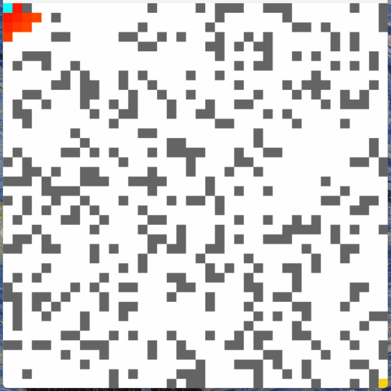

# 10.1 Wavefront algorithm

Wavefront 演算法是BFS(廣度優先搜索)演算法的其中一種，常見於2D網格地圖中用以找尋路徑。在wavefront算法中，隊列以源節點初始化，算法通過按照節點距離源節點的特定順序將相鄰節點添加到隊列中來進行進展。這創建了一個從源節點向外擴展的“wavefront”。

<iframe src = "/interactive/wavefront/index.html" width = "100%" height = "650"></iframe>

[toc]

##10.1.1 準備網格2D地圖

```python
# A demo about wavefront algorithm
cols = rows = 20

def setup():
    global spots
    size(800, 800)
    textAlign(CENTER, CENTER)
    rectMode(CENTER)
    spots = [[Spot(i, j) for i in range(cols)] for j in range(rows)]

def draw():
    background(51)
    for i in range(cols):
        for j in range(rows):
            spots[i][j].show()

class Spot:

    def __init__(self, _i, _j):
        self.w = width/cols
        self.h = height/rows
        self.i = _i
        self.j = _j
        self.x = _i * self.w + self.w/2
        self.y = _j * self.h + self.h/2

    def show(self):
        fill(255)
        rect(self.x, self.y, self.w, self.h)
```


這裡介紹多一個可以快速開始2D list的方法。在以前的做法中，我們會用到兩個for loop，而在第一個for loop中會加入一個暫存的list，例子如下:

```python
for i in range(cols):
    temp = []
    for j in range(rows):
    	temp.append(Spot(i,j))
    spots.append(temp)
```

但其實可以用一個較簡單的方法。Python提供一個先寫結果，再寫condition的寫法，for loop和if都有這選項，不用每次為寫一個簡單的for和if都要分兩行來寫，另一個好處是可以很容易地做到巢狀的for和if。

```python
spots = [[Spot(i, j) for i in range(cols)] for j in range(rows)]
```

##10.1.2 為每個格加入鄰居和加入牆


```python
# A demo about wavefront algorithm

cols = rows = 20
spots   = []
start = end = None


def setup():
    global spots, start, end
    size(800, 800)
    textAlign(CENTER, CENTER)
    rectMode(CENTER)
    spots = [[Spot(i, j) for j in range(rows)] for i in range(cols)]
    
    start = spots[0][0]
    end = spots[cols-1][rows-1]
    
    for i in range(cols):
        for j in range(rows):
            if spots[i][j] != start and spots[i][j] != end:
                spots[i][j].addWall()
            spots[i][j].addNeighbors(spots)
            
def draw():
    background(51)
    
    for i in range(cols):
        for j in range(rows):
            spots[i][j].show('#FFFFFF')
    start.show('#00FFFF')
    end.show('#FFFF00')


class Spot:

    def __init__(self, _i, _j):
        self.w = width/cols
        self.h = height/rows
        self.i = _i
        self.j = _j
        self.x = _i * self.w + self.w/2
        self.y = _j * self.h + self.h/2
        self.wall = False
        self.neighbors = []

    def show(self, _color):
        strokeWeight(0.5)
        stroke(127)
        if self.wall:
            fill(0)
        else:
            fill(_color)
        rect(self.x, self.y, self.w, self.h)

    def addWall(self):
    	self.wall = True if random(1) < 0.25 else False

    def addNeighbors(self, _spots):
        if self.wall == False:
            if self.j > 0 and _spots[self.i][self.j-1].wall == False:
                self.neighbors.append(_spots[self.i][self.j-1])
            if self.i < cols-1 and _spots[self.i+1][self.j].wall == False:
                self.neighbors.append(_spots[self.i+1][self.j])
            if self.j < rows-1 and _spots[self.i][self.j+1].wall == False:
                self.neighbors.append(_spots[self.i][self.j+1])
            if self.i > 0 and _spots[self.i-1][self.j].wall == False:
                self.neighbors.append(_spots[self.i-1][self.j])
```


```python
class Spot:

    def __init__(self, _i, _j):
        self.w = width/cols
        self.h = height/rows
        self.i = _i
        self.j = _j
        self.x = _i * self.w + self.w/2
        self.y = _j * self.h + self.h/2
        self.wall = False
        self.neighbors = []
```

首先為Spot class加入`self.wall`變數，用來設定當前的格是否牆。另外再加入`self.neighbors = []`的空list，用來裝起每個格的鄰居。

```python
	def addWall(self):
    	self.wall = True if random(1) < 0.25 else False

    def addNeighbors(self, _spots):
        if self.wall == False:
            if self.j > 0 and _spots[self.i][self.j-1].wall == False:
                self.neighbors.append(_spots[self.i][self.j-1])
            if self.i < cols-1 and _spots[self.i+1][self.j].wall == False:
                self.neighbors.append(_spots[self.i+1][self.j])
            if self.j < rows-1 and _spots[self.i][self.j+1].wall == False:
                self.neighbors.append(_spots[self.i][self.j+1])
            if self.i > 0 and _spots[self.i-1][self.j].wall == False:
                self.neighbors.append(_spots[self.i-1][self.j])
```

加入兩個函數，隨機抽出`0`至`1`之間的任意值，如果是少於`0.25`的話，就將`self.wall`設定成`True`，否則就是`False`。

之後就將為每一個spot加入鄰居，如果鄰居不是牆，而且又不是邊緣的話，就將旁邊的spot加入做鄰居。這裡的做法跟第7章十分相似，如果忘記的同學可以參考第7章的[7. Snake](../7/content_7.html#73-為每個格加上鄰居)。

```python
def show(self, _color):
        strokeWeight(0.5)
        stroke(127)
        if self.wall:
            fill(0)
        else:
            fill(_color)
        rect(self.x, self.y, self.w, self.h)
```

最後將顯示顏色變成一個輸入的變數。


```python
def setup():
    global spots, start, end
    #(same as before)
    
    start = spots[0][0]
    end = spots[cols-1][rows-1]
    
    for i in range(cols):
        for j in range(rows):
            if spots[i][j] != start and spots[i][j] != end:
                spots[i][j].addWall()
            spots[i][j].addNeighbors(spots)
```

在`setup()`中，加入`start`和`end`的位置，分別為於左上角和右下角。如果這個spot不是起點和終點的話，就隨機加入牆，之後就加入鄰居。

```python
def draw():
    background(51)
    
    for i in range(cols):
        for j in range(rows):
            spots[i][j].show('#FFFFFF')
    start.show('#00FFFF')
    end.show('#FFFF00')
```

最後獨立將start和end顯示成不同顏色。

##10.1.3 為每個格打上分數

```python
# A demo about wavefront algorithm

cols = rows = 20
spots   = []
start = end = None
pathIsFound = False
path = []
queue = []

def setup():
    global spots, start, end
    size(800, 800)
    textAlign(CENTER, CENTER)
    rectMode(CENTER)
    spots = [[Spot(i, j) for j in range(rows)] for i in range(cols)]
    
    start = spots[0][0]
    end = spots[cols-1][rows-1]
    
    for i in range(cols):
        for j in range(rows):
            if spots[i][j] != start and spots[i][j] != end:
                spots[i][j].addWall()
            spots[i][j].addNeighbors(spots)

    start.visit()
    queue.append(start)


def draw():
    global pathIsFound, path, queue
    
    if len(queue) == 0:
        noLoop()
        return

    background(51)

    current = queue.pop(0)
        
    for neighbor in current.neighbors:
        if not neighbor.isVisited() and not neighbor.wall:
            neighbor.visit()
            neighbor.score = current.score + 1
            queue.append(neighbor)

    for i in range(cols):
        for j in range(rows):
            spots[i][j].show('#FFFFFF')
    start.show('#00FFFF')
    end.show('#FFFF00')
    for spot in path:
        spot.show('#FF00FF')


class Spot:

    def __init__(self, _i, _j):
        self.w = width/cols
        self.h = height/rows
        self.i = _i
        self.j = _j
        self.x = _i * self.w + self.w/2
        self.y = _j * self.h + self.h/2
        self.wall = False
        self.neighbors = []
        self.visited = False
        self.score = 0

    def show(self, _color):
        strokeWeight(0.5)
        stroke(127)
        if self.wall:
            fill(0)
        else:
            fill(_color)
        rect(self.x, self.y, self.w, self.h)
        fill(0)
        text(self.score, self.x, self.y)

    def addWall(self):
        self.wall = True if random(1) < 0.25 else False

    def addNeighbors(self, _spots):
        if self.wall == False:
            if self.j > 0 and _spots[self.i][self.j-1].wall == False:
                self.neighbors.append(_spots[self.i][self.j-1])
            if self.i < cols-1 and _spots[self.i+1][self.j].wall == False:
                self.neighbors.append(_spots[self.i+1][self.j])
            if self.j < rows-1 and _spots[self.i][self.j+1].wall == False:
                self.neighbors.append(_spots[self.i][self.j+1])
            if self.i > 0 and _spots[self.i-1][self.j].wall == False:
                self.neighbors.append(_spots[self.i-1][self.j])
    
    def visit(self):
        self.visited = True
    
    def isVisited(self):
        return self.visited
```


```python
cols = rows = 20
spots   = []
start = end = None
pathIsFound = False
path = []
queue = []
```

這一步我們要先準備前置工作。開3個新的變數，`pathIsFound`用來紀錄路徑是否已經找到。`path=[]`用來裝起路徑的spot，`queue=[]`用來裝起待處理的格。


```python
class Spot:

    def __init__(self, _i, _j):
        #(same as before)
        self.neighbors = []
        self.visited = False
        self.score = 0
```

在spot class中，加入`self.visited = False`用來紀錄這格是否已經計算過，`self.score = 0`用來紀錄這一格的分數。

```python
def show(self, _color):
        strokeWeight(0.5)
        stroke(127)
        if self.wall:
            fill(0)
        else:
            fill(_color)
        rect(self.x, self.y, self.w, self.h)
        fill(0)
        text(self.score, self.x, self.y)
```

在`show()`中，將分數顯示在畫面上。

```python
    def visit(self):
        self.visited = True
    
    def isVisited(self):
        return self.visited
```

最後加入兩個函數，用來設定已訪問過和回傳是否訪問過。


```python
def setup():
    global spots, start, end
	#(same as before)
    
    start.visit()
    queue.append(start)

def draw():
    global pathIsFound, path, queue
    
    if len(queue) == 0:
        noLoop()
        return

    background(51)

    current = queue.pop(0)
        
    for neighbor in current.neighbors:
        if not neighbor.isVisited() and not neighbor.wall:
            neighbor.visit()
            neighbor.score = current.score + 1
            queue.append(neighbor)
```

在`setup()`中，先將`start`設定成已訪問過，並放入`queue`候選列。

在`draw()`中，將`queue`候選列中的第一個用`pop`釋放出來作為`current`，之後查找這個`current`的鄰居，如果沒有到訪過而且也不是牆的話，就將其設定成已訪問，並且為它的分數設成`current.score + 1`，再將這個鄰居放入`queue`候選列。

最後，在`draw()`的最上方，加入如果`queue`候選列長度為零(即已將所有鄰居都找查完，就設成`noLoop()`和`return`。

##10.1.4 找出路徑

```python
# A demo about wavefront algorithm

cols = rows = 20
spots   = []
start = end = None
pathIsFound = False
path = []
queue = []

def setup():
    global spots, start, end
    size(800, 800)
    textAlign(CENTER, CENTER)
    rectMode(CENTER)
    spots = [[Spot(i, j) for j in range(rows)] for i in range(cols)]
    
    start = spots[0][0]
    end = spots[cols-1][rows-1]
    
    for i in range(cols):
        for j in range(rows):
            if spots[i][j] != start and spots[i][j] != end:
                spots[i][j].addWall()
            spots[i][j].addNeighbors(spots)

    start.visit()
    queue.append(start)


def draw():
    global pathIsFound, path, queue
    
    if len(queue) == 0:
        noLoop()
        return

    background(51)

    current = queue.pop(0)
        
    for neighbor in current.neighbors:
        if neighbor == end:
            pathIsFound = True
            print('Avrrived at the end!')
            path.append(neighbor)
            path.append(current)
            while current != start:
                for neighbor in current.neighbors:
                    if neighbor.score == current.score - 1 and not neighbor.wall:
                        path.append(neighbor)
                        current = neighbor
                        break
            print('Path is found!')
            noLoop()
        else:   
            if not neighbor.isVisited() and not neighbor.wall:
                neighbor.visit()
                neighbor.score = current.score + 1
                queue.append(neighbor)

    for i in range(cols):
        for j in range(rows):
            spots[i][j].show('#FFFFFF')
    for spot in path:
        spot.show('#FF00FF')
    start.show('#00FFFF')
    end.show('#FFFF00')


class Spot:

    def __init__(self, _i, _j):
        self.w = width/cols
        self.h = height/rows
        self.i = _i
        self.j = _j
        self.x = _i * self.w + self.w/2
        self.y = _j * self.h + self.h/2
        self.wall = False
        self.neighbors = []
        self.visited = False
        self.score = 0

    def show(self, _color):
        strokeWeight(0.5)
        stroke(127)
        if self.wall:
            fill(0)
        else:
            fill(_color)
        rect(self.x, self.y, self.w, self.h)
        fill(0)
        text(self.score, self.x, self.y)

    def addWall(self):
        self.wall = True if random(1) < 0.25 else False

    def addNeighbors(self, _spots):
        if self.wall == False:
            if self.j > 0 and _spots[self.i][self.j-1].wall == False:
                self.neighbors.append(_spots[self.i][self.j-1])
            if self.i < cols-1 and _spots[self.i+1][self.j].wall == False:
                self.neighbors.append(_spots[self.i+1][self.j])
            if self.j < rows-1 and _spots[self.i][self.j+1].wall == False:
                self.neighbors.append(_spots[self.i][self.j+1])
            if self.i > 0 and _spots[self.i-1][self.j].wall == False:
                self.neighbors.append(_spots[self.i-1][self.j])
    
    def visit(self):
        self.visited = True
    
    def isVisited(self):
        return self.visited
```


```python
 for neighbor in current.neighbors:
        if neighbor == end:
            pathIsFound = True
            print('Avrrived at the end!')
            path.append(neighbor)
            path.append(current)
            while current != start:
                for neighbor in current.neighbors:
                    if neighbor.score == current.score - 1 and not neighbor.wall:
                        path.append(neighbor)
                        current = neighbor
                        break
            print('Path is found!')
            noLoop()
        else:   
            if not neighbor.isVisited() and not neighbor.wall:
                neighbor.visit()
                neighbor.score = current.score + 1
                queue.append(neighbor)
```

在`draw()`之中，在之前為每個鄰居都打分數的步驟之上，加入: 如果找到鄰居就是終點要怎樣做。

在打分數時，我們由起點開始，洪水式擴散出去，每走一步就將`score`加一，直到找到終點。要在終點找到路返回起點，我們只需要順著分數，在4個鄰居中選取累減的數字，就一定是返回原點的路線。

所以我們首先將`neighbor`和`current`加入`path`中，之後再找出鄰居的鄰居，如果是累減的分數，就將其加入`path`，再將這個鄰居變成`current`。

##10.1.5 將效果美化一下

```python
# A demo about wavefront algorithm

cols = rows = 40
spots   = []
start = end = None
pathIsFound = False
path = []
queue = []

def setup():
    global spots, start, end
    size(800, 800)
    textAlign(CENTER, CENTER)
    rectMode(CENTER)
    spots = [[Spot(i, j) for j in range(rows)] for i in range(cols)]
    
    start = spots[0][0]
    end = spots[cols-1][rows-1]
    
    for i in range(cols):
        for j in range(rows):
            if spots[i][j] != start and spots[i][j] != end:
                spots[i][j].addWall()
            spots[i][j].addNeighbors(spots)

    start.visit()
    queue.append(start)


def draw():
    global pathIsFound, path, queue
    
    if len(queue) == 0:
        noLoop()
        return

    background(51)

    current = queue.pop(0)
        
    for neighbor in current.neighbors:
        if neighbor == end:
            pathIsFound = True
            print('Avrrived at the end!')
            path.append(neighbor)
            path.append(current)
            while current != start:
                for neighbor in current.neighbors:
                    if neighbor.score == current.score - 1 and not neighbor.wall:
                        path.append(neighbor)
                        current = neighbor
                        break
            print('Path is found!')
            noLoop()
        else:   
            if not neighbor.isVisited() and not neighbor.wall:
                neighbor.visit()
                neighbor.score = current.score + 1
                queue.append(neighbor)


    for i in range(cols):
        for j in range(rows):
            colorMode(HSB)
            if spots[i][j].score == 0:
                spots[i][j].show(255)
            else:
                spots[i][j].show(color(spots[i][j].score*3, 255, 255))
    for spot in path:
        spot.show('#FF00FF')
    start.show('#00FFFF')
    end.show('#FFFF00')


class Spot:

    def __init__(self, _i, _j):
        self.w = width/cols
        self.h = height/rows
        self.i = _i
        self.j = _j
        self.x = _i * self.w + self.w/2
        self.y = _j * self.h + self.h/2
        self.wall = False
        self.neighbors = []
        self.visited = False
        self.score = 0

    def show(self, _color):
        # strokeWeight(0.5)
        # stroke(127)
        noStroke()
        if self.wall:
            fill(100)
        else:
            fill(_color)
        rect(self.x, self.y, self.w, self.h)
        # fill(0)
        # text(self.score, self.x, self.y)

    def addWall(self):
        self.wall = True if random(1) < 0.25 else False

    def addNeighbors(self, _spots):
        if self.wall == False:
            if self.j > 0 and _spots[self.i][self.j-1].wall == False:
                self.neighbors.append(_spots[self.i][self.j-1])
            if self.i < cols-1 and _spots[self.i+1][self.j].wall == False:
                self.neighbors.append(_spots[self.i+1][self.j])
            if self.j < rows-1 and _spots[self.i][self.j+1].wall == False:
                self.neighbors.append(_spots[self.i][self.j+1])
            if self.i > 0 and _spots[self.i-1][self.j].wall == False:
                self.neighbors.append(_spots[self.i-1][self.j])
    
    def visit(self):
        self.visited = True
    
    def isVisited(self):
        return self.visited
```



最後，我們將每個格顯示出來的框線取消，將原本純黑的牆變成深灰，並將分數以顏色去驅分而不直接寫上值，就能看到整個演算法是像洪水一樣擴散出去的，所以叫做洪水演算法。