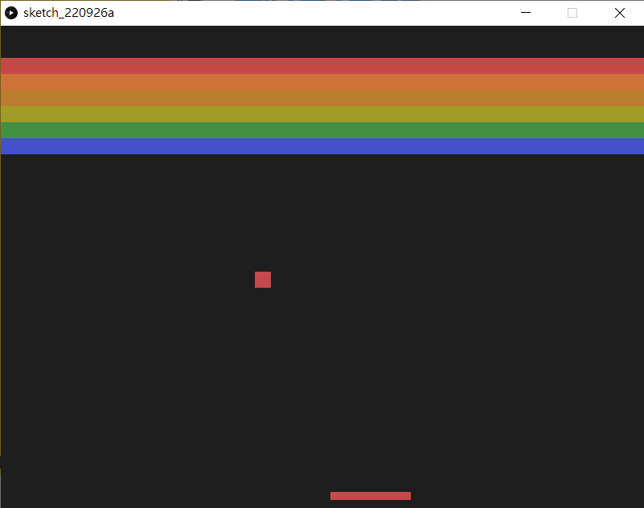
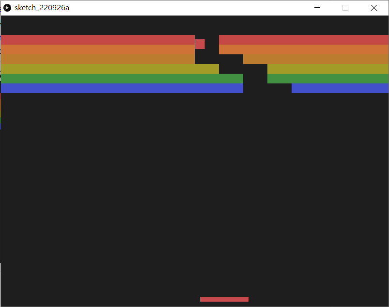

# 2.  Breakout

> 《Breakout》是一款由雅達利開發及發佈的街機遊戲。此遊戲是由諾蘭·布殊內爾和斯蒂夫·布里斯托構思，並且是參考1972年雅達利街機遊戲《乓》創作，於1976年4月發佈，並且已洐生了不少打磚塊作品，如《Gee Bee》和《快打磚塊》。


[TOC]

## 繪畫一個會彈牆的球

跟上一次一樣，我們先建立一個空間，畫一個會動的球，這個球在撞到左右兩邊的牆時會反彈。

```python
ballPosX = 0
ballPosY = 0
ballVecX = 0
ballVecY = 0

def setup():
    global ballPosX, ballPosY, ballVecX, ballVecY
    
    size(800, 600)
    
    ballPosX = width/2
    ballPosY = height-20
    ballVecX = random(-5,5)
    ballVecY = -1
    
def draw():
    global ballPosX, ballPosY, ballVecX, ballVecY
    
    background(30)
    
    ballPosX = ballPosX + ballVecX
    ballPosY = ballPosY + ballVecY
    
    if (ballPosX <= 0 or ballPosX >= width):
        ballVecX *= -1
    if (ballPosY <= 0):
        ballVecY *= -1
    
    ellipse(ballPosX, ballPosY, 20, 20)
```


###Vector(向量)

上述的程式碼沒有甚麼問題，一切都可以運作起來，但你想想，如果是2d遊戲，每個球的座標會有兩個變數，如果是3d的遊戲，每個球的座標就會是3個變數；除了變數較多外，這些變數也不好運作。

這樣介紹一個很好用的數學工具叫Vector(向量)。詳細的數學方面的教學可看看[這裡](https://mathinsight.org/vector_introduction)。

```python
ballPos = PVector()
ballVec = PVector()

def setup():
    global ballPos, ballVec
    
    size(800, 600)
    
    ballPos = PVector(width/2, height-20)
    ballVec = PVector(random(-5,5), -1)

def draw():
    global ballPos, ballVec
    
    background(30)
    
    ballPos = ballPos.add(ballVec)
    
    if (ballPos.x <= 0 or ballPos.x >= width):
        ballVec.x *= -1
    if ballPos.y <=0:
        ballVec.y *= -1
    
    ellipse(ballPos.x, ballPos.y, 20, 20)
```


```python
ballPos = PVector()
ballVec = PVector()
```

就是宣告一個空的Vector


```python
ballPos = PVector(width/2, height-20)
ballVec = PVector(random(-5,5), -1)
```

跟上面分開宣告x和y一樣，但這裡只要集中x和y宣告一次就可以了。


```python
ballPos = ballPos.add(ballVec)

if (ballPos.x <= 0 or ballPos.x >= width):
    ballVec.x *= -1
if ballPos.y <=0:
    ballVec.y *= -1
```

之前是`ballPosX`加上`ballVecX`，`ballPosY`加上`ballVecY`，這裡其實都是做同一樣的事情，只是用向量的方式進行。

如果要指定一個向量(vector)的獨立軸的值(例如x軸)，可以用這樣表示: `ballPos.x`。

## 製作會反彈球的彈板

```python
ballPos = PVector()
ballVec = PVector()

beam = PVector()

def setup():
    global ballPos, ballVec, beam
    
    size(800, 600)
    
    ballPos = PVector(width/2, height-20)
    ballVec = PVector(random(-5,5), -1)
    
    beam = PVector(width/2, height-15)
    rectMode(CENTER)

def draw():
    global ballPos, ballVec, beam
    
    background(30)
    
    ballPos = ballPos.add(ballVec)
    beam = PVector(mouseX, beam.y)
    
    if (ballPos.x <= 0 or ballPos.x >= width):
        ballVec.x *= -1
    if ballPos.y <=0:
        ballVec.y *= -1
    
    if ballPos.x >= beam.x - 25 and ballPos.x <= beam.x + 25 and ballPos.y >= height-15:
        ballVec.y *= -1
        ballVec.x += mouseX - pmouseX ;
    
    ellipse(ballPos.x, ballPos.y, 20, 20)
    rect(beam.x, beam.y, 50, 10)
```


```python
beam = PVector()
```

宣告一個叫`beam`的向量。


```python
beam = PVector(width/2, height-15)
rectMode(CENTER)
```

在`setup()`中預返`beam`的位置，將`rectMode()`設定為`CENTER`。


```python
beam = PVector(mouseX, beam.y)

if ballPos.x >= beam.x - 25 and ballPos.x <= beam.x + 25 and ballPos.y >= height-15:
    ballVec.y *= -1
    ballVec.x += mouseX - pmouseX ;
    
rect(beam.x, beam.y, 50, 10)
```

在`draw()`中，每幀都指定`beam`的位置為`(mouseX, height-15)`，跟上一次的Pong一樣，當球撞到板後，就反彈球。而今次我們最後將`beam`畫出來。

##美化一下更加像原版

```python
ballPos = PVector()
ballVec = PVector()

beam = PVector()
beamWidth = 100

def setup():
    global ballPos, ballVec, beam
    
    size(800, 600)
    
    ballPos = PVector(width/2, height-20)
    ballVec = PVector(random(-5,5), -1)
    
    beam = PVector(width/2, height-15)
    rectMode(CENTER)

def draw():
    global ballPos, ballVec, beam
    
    background(30)
    
    ballPos = ballPos.add(ballVec)
    beam = PVector(mouseX, beam.y)
    
    if (ballPos.x <= 0 or ballPos.x >= width):
        ballVec.x *= -1
    if ballPos.y <=0:
        ballVec.y *= -1
    
    if ballPos.x >= beam.x - beamWidth/2 and ballPos.x <= beam.x + beamWidth/2 and ballPos.y >= height-15:
        ballVec.y *= -1
    
    fill(198, 73, 75)
    noStroke()
    rect(ballPos.x, ballPos.y, 20, 20)
    rect(beam.x, beam.y, beamWidth, 10)
```


```python
beamWidth = 100
```

加入一個變數beamWidth用來控製球拍的寬度。


```python
if ballPos.x >= beam.x - beamWidth/2 and ballPos.x <= beam.x + beamWidth/2 and ballPos.y >= height-15:
        ballVec.y *= -1
```

原本球拍寬度為`50`時，球拍一半就是`25`，所以要用`ballPos.x >= beam.x - 25 and ballPos.x <= beam.x + 25`，現在設定了球拍的寬度為beamWidth，所以要改成為`ballPos.x >= beam.x - beamWidth/2 and ballPos.x <= beam.x + beamWidth/2 `


```python
fill(198, 73, 75)
noStroke()
rect(ballPos.x, ballPos.y, 20, 20)
rect(beam.x, beam.y, beamWidth, 10)
```

最後將球和拍畫出來。顏色跟隨原版，沒有框線。

## 製作磚頭

```python
ballPos = PVector()
ballVec = PVector()

beam = PVector()
beamWidth = 100

brickPos = []
brickState = [] 
brickWidth = 0
brickHeight = 0
brickColor = ["#C54846","#CE7238","#BB7C2F","#A29B27","#429143","#4350CC"]

def setup():
    global ballPos, ballVec, beam, brickPos, brickWidth, brickHeight
    
    size(800, 600)
    
    ballPos = PVector(width/2, height-20)
    ballVec = PVector(random(-5,5), -1)
    
    beam = PVector(width/2, height-15)
    rectMode(CENTER)
    
    brickWidth = width/16
    brickHeight = 20
    
    for i in range(6):
        elements = []
        for j in range(16):
            elements.append(PVector(j*brickWidth+brickWidth/2, i*brickHeight+50))
        brickPos.append(elements)

def draw():
    global ballPos, ballVec, beam, brickPos, brickWidth, brickHeight
    
    background(30)
    
    ballPos = ballPos.add(ballVec)
    beam = PVector(mouseX, beam.y)
    
    if (ballPos.x <= 0 or ballPos.x >= width):
        ballVec.x *= -1
    if ballPos.y <=0:
        ballVec.y *= -1
    
    if ballPos.x >= beam.x - beamWidth/2 and ballPos.x <= beam.x + beamWidth/2 and ballPos.y >= height-15:
        ballVec.y *= -1
    
    fill(198, 73, 75)
    noStroke()
    rect(ballPos.x, ballPos.y, 20, 20)
    rect(beam.x, beam.y, beamWidth, 10)
    
    for i in range(6):
        fill(brickColor[i])
        for j in range(16):
            rect(brickPos[i][j].x, brickPos[i][j].y, brickWidth, brickHeight)
```



```python
brickPos = []
brickState = [] 
brickWidth = 0
brickHeight = 0
brickColor = ["#C54846","#CE7238","#BB7C2F","#A29B27","#429143","#4350CC"]
```

在`setup()`之前，宣告所有磚的位置、狀況(是出現還是消失)、寬度、長度和每一行磚的顏色。值得注意的是`brickPos`和`brickState`，由於有6x16塊磚，而每塊磚都有自己的狀態，所以我們不可能用6x16個不同命名的變數去裝起它們，這裡我們用一個list去裝起它們。甚麼是list，可以參考[這裡](https://www.w3schools.com/python/python_lists.asp)。


```python
brickWidth = width/16
brickHeight = 20

for i in range(6):
	elements = []
	for j in range(16):
		elements.append(PVector(j*brickWidth+brickWidth/2, i*brickHeight+50))
	brickPos.append(elements)
```

按著在`setup()`中，先定義每塊磚的長和寬。利用`for` 去重覆，每次更新每塊磚的位置。由於rectMode()是用CENTER，所以每塊磚的x座標要再加上半塊磚的距離。


```python
for i in range(6):
	fill(brickColor[i])
	for j in range(16):
		rect(brickPos[i][j].x, brickPos[i][j].y, brickWidth, brickHeight)
```

最後在`draw()`中，將所有的磚畫出來。每行的磚都有自己的顏色，這時就要用之前事前已經用list存好的`brickColor[]`

## 令磚頭消失

```python
ballPos = PVector()
ballVec = PVector()

beam = PVector()
beamWidth = 100

brickPos = []
brickState = [] 
brickWidth = 0
brickHeight = 0
brickColor = ["#C54846","#CE7238","#BB7C2F","#A29B27","#429143","#4350CC"]

def setup():
    global ballPos, ballVec, beam, brickPos, brickWidth, brickHeight, brickState
    
    size(800, 600)
    
    ballPos = PVector(width/2, height-20)
    ballVec = PVector(random(-5,5), -1)
    
    beam = PVector(width/2, height-15)
    rectMode(CENTER)
    
    brickWidth = width/16
    brickHeight = 20
    
    for i in range(6):
        elements = []
        for j in range(16):
            elements.append(PVector(j*brickWidth+brickWidth/2, i*brickHeight+50))
        brickPos.append(elements)
        
    for i in range(6):
        stateElements = []
        for j in range(16):
            stateElements.append(True)
        brickState.append(stateElements)
        
def draw():
    global ballPos, ballVec, beam, brickPos, brickWidth, brickHeight, brickState
    
    background(30)
    
    ballPos = ballPos.add(ballVec)
    beam = PVector(mouseX, beam.y)
    
    if (ballPos.x <= 0 or ballPos.x >= width):
        ballVec.x *= -1
    if ballPos.y <=0:
        ballVec.y *= -1
    
    if ballPos.x >= beam.x - beamWidth/2 and ballPos.x <= beam.x + beamWidth/2 and ballPos.y >= height-15:
        ballVec.y *= -1
    
    fill(198, 73, 75)
    noStroke()
    rect(ballPos.x, ballPos.y, 20, 20)
    rect(beam.x, beam.y, beamWidth, 10)
    
    for i in range(6):
        fill(brickColor[i])
        for j in range(16):
            if isInBox(ballPos, brickPos[i][j]):
                brickState[i][j] = False
            if brickState[i][j]:
                rect(brickPos[i][j].x, brickPos[i][j].y, brickWidth, brickHeight)
                

def isInBox(_ballPos, _brickPos):
    x = _ballPos.x
    y = _ballPos.y
    bX = _brickPos.x
    bY = _brickPos.y
    w = brickWidth
    h = brickHeight
    
    if x >= bX - w/2 and x <= bX + w/2 and y >= bY - h/2 and y <= bY + h/2:
        return True
```




```
for i in range(6):
	stateElements = []
	for j in range(16):
		stateElements.append(True)
	brickState.append(stateElements)
```

在`setup()`中，加入另一個for loop，初始化`brickState`變成6x16的2d list，並將全部內容都設為`True`。


```python
def isInBox(_ballPos, _brickPos):
    x = _ballPos.x
    y = _ballPos.y
    bX = _brickPos.x
    bY = _brickPos.y
    w = brickWidth
    h = brickHeight
    
    if x >= bX - w/2 and x <= bX + w/2 and y >= bY - h/2 and y <= bY + h/2:
        return True
```

在`setup()`和`draw()`之外，加入第3個自定的函數(function)。這個函數(function)你可以隨意命名，不一定要跟我一樣，函數(function)有2個參數(parameter)，python不需要跟其他程式一樣事前定義參數(parameter)的數據格式，你導入的引數(Argument)格式是甚麼就是甚麼，一般為了方便驅分，參數的命名如果跟全域變數(global varaiable)很像的話，都會在名字前面加入`_`。


```python
for i in range(6):
    fill(brickColor[i])
    for j in range(16):
        if isInBox(ballPos, brickPos[i][j]):
            brickState[i][j] = False
        if brickState[i][j]:
            rect(brickPos[i][j].x, brickPos[i][j].y, brickWidth, brickHeight)
```

每次在繪畫磚塊之時，檢查一下球有否撞過磚塊，如果有的話, 就將其狀態(`brickState`)設定為`False`，在繪畫時就不繪畫它。
