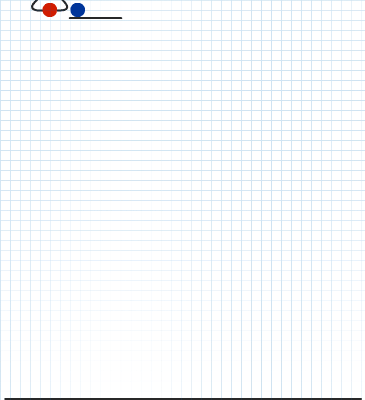
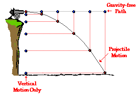

# 3. Artillery game

> 炮術遊戲（Artillery）是早期回合制策略電子遊戲的代名詞，坦克互相射擊，考慮彈道計算、地形、彈藥和風向等問題。

[TOC]

這類型的遊戲最早在1970年代中以demo遊戲出現，名叫Artillery(抱歉太舊的關係，我在維基也找不到相片)，後來隨著顯卡的提升，到1980年代在Apple II中推出過Super Artillery和Artillery Simulator。


後來再到IBM電腦年代，推出過名叫Scorched Earth的遊戲。這款遊戲除了之前炮彈互射的遊戲功能外，當炮彈打到地後，也會留下一個洞，這就需要電腦的效能支援。


按著在1995年由Team17推出的Worms(蟲蟲大戰)，就真正是經典遊戲。遊戲同樣是探用回合制，但今次蟲蟲是可以行走的，而且可以好似蜘蛛俠一樣盪來盪去(我自己玩過的版本就是，不知道1995年的初版是否可以)，而且有不同的武器可以選擇，有些是威力強大到會留下大洞的炮彈，有些是手槍和地雷等等。後來這遊戲一直都有推出不同的版本，到今天你也可以在各大遊戲平台買得到這款遊戲，玩法也差不多。(不過我記得我玩過的版本並非回合制的，而是畫面分半一同操作的，兩個人在電腦面前按著同一個鍵盤，互相找出對方)


順帶一提，千禧年初，3A大作已經十分流行，當年網路剛興起，網站流行用flash制作動畫效果，同時也興起一堆體積不大的小遊戲，例如比加超打排球，小朋友落樓梯，小朋友齊打架等等，而其中一款中外同樣經典的，就是Fleabag Vs. Mutt，我們一般會叫它貓狗大戰。玩法就跟80年的的Artillery Simulator一模一樣，都是採用回合制，設定投擲力度和角度，配合環境風速，互相擲罐子或骨頭。遊戲雖然簡單，但因遊戲體積小，容易得到容易上手，當年是跟朋友殺時間的好幫手。(我不也肯定下圖是原版flash遊戲，網路上也找不到原版的flash檔)


今章要制作的，是類似上面的Artillery Simulator和貓狗大戰的回合制遊戲。

## 3.0 本章重點

1. 向量(vector)(求大小與方向)
2. 加速度與拋物線
3. 用歐拉方法求積分解
4. 函數(Function)應用複習

## 3.1 加速度與拋物線

### 3.1.1 自由落體

> 傳說1590年伽利略曾在義大利比薩斜塔上做自由落體實驗，將兩個重量不同的球體從相同的高度同時扔下，結果兩個鉛球同時落地，伽利略在比薩斜塔做自由落體實驗的故事，記載在他的學生維維亞尼在1654年寫的《伽利略生平的歷史故事》（1717年出版）一書中，但伽利略、比薩大學和同時代的其他人都沒有關於這次實驗的的記載。對於伽利略是否在比薩斜塔做過自由落體實驗，歷史上一直存在著支持和反對兩種不同的看法。
>
> 1971年，阿波羅15號太空人在月球上同時丟下獵鷹羽毛與鐵鎚，證明伽利略理論正確。


在真空(無空氣阻力)的狀況下，一個物體自由落體的距離，受著重力影響，**落下距離與時間的平方成正比**。舉例說，在下圖是用攝影機拍攝跨度為半秒的相片(半秒20幀)，在首0.05秒落下的距離為1個單位(約12mm)，在0.1秒時，其落下距離為4個單位，在0.15秒時距離為9個單位，如此類推。


### 3.1.2 拋物運動

由於受到重力的影響，物體在被拋出後，垂直(向下)的速度會不停加速，而水平的速度則不受影響，型成的曲線就叫拋物線(Parabola)。拋物線(Parabola)在數學上是一條二次方曲線。


等等等，不要走，我知道你快要頭腦爆炸了!!!!!!

這裡不想帶出更多的數學和物理，令事情更複雜，你唯一需要知道的是：

1. 重力影響會令落下距離與時間的平方成正比，簡言之，**落下的速度與時間成正比**，地球自由落體加速度大約是10$m/s^{2}$，即在物體自由落體時，1秒後的速度大約是10$m/s$，2秒後的速度大約是20$m/s$，3秒後的速度大約是30$m/s$，如此類推。
2. 計算拋物線時，水平和垂直的距離和速度是可以分開計算的，互相獨立；
	

## 3.2 建立兩個玩家

```python
player1Height = 0
player2Height = 0

tankSize = 20 #the size of rect of the tanks

def setup():
    global player1Height, player2Height
    
    size(800, 600)
    
    player1Height = random(height*0.2, height*0.8)
    player2Height = height - player1Height

    
def draw():
    background(30)
    
    # draw the tanks
    rectMode(CENTER)
    noStroke()  #沒有框線
    fill(255, 0, 0)
    rect(100, player1Height, tankSize, tankSize)
    fill(0, 0, 255)
    rect(width - 100, player2Height, tankSize, tankSize)
    
    # draw the ground
    rectMode(CORNERS)  #use corner to corner mode
    noStroke()  #沒有框線
    fill(0, 255, 0)
    rect(0, player1Height + tankSize/2, width/2, height)
    rect(width/2, player2Height + tankSize/2, width, height)
```


```python
player1Height = random(height*0.2, height*0.8)
player2Height = height - player1Height
```

在`setup()`中，加入這兩句來初始化兩個玩家一開始的高度。由於想加一點遊戲性，盡量兩個玩家是一高一低。

## 3.3 繪畫控制的投射速度線

```python
player1Height = 0
player2Height = 0

Round = 0 			#player1 or player2
ballPos = PVector() # position of cannonball
ballVec = PVector() # velocity of cannonball

tankSize = 20 #the size of rect of the tanks

def setup():
    global player1Height, player2Height, Round, ballPos, ballVec
    
    size(800, 600)
    
    player1Height = random(height*0.2, height*0.8)
    player2Height = height - player1Height
    
    Round = 1 #一開始為player1回合
    ballPos = PVector(100, player1Height) #一開始設定為player1的位置
    ballVec = PVector(2.5, 0) #一開始指向水平右方,速度為2.5

    
def draw():
    global ballPos, ballVec, Round
    
    background(30)
    
    # draw the velocity arrow
    stroke(255, 255, 0) #框線顏色
    strokeWeight(3)  #框線粗度度
    line(100, player1Height, 100 + ballVec.x * 50, player1Height + ballVec.y *50)    
    
    # draw the tanks
    rectMode(CENTER)
    noStroke()  #沒有框線
    fill(255, 0, 0)
    rect(100, player1Height, tankSize, tankSize)
    fill(0, 0, 255)
    rect(width - 100, player2Height, tankSize, tankSize)
    
    # draw the ground
    rectMode(CORNERS)  #use corner to corner mode
    noStroke()  #沒有框線
    fill(0, 255, 0)
    rect(0, player1Height + tankSize/2, width/2, height)
    rect(width/2, player2Height + tankSize/2, width, height)
```


```python
Round = 0 #player1 or player2
ballPos = PVector() # position of cannonball
ballVec = PVector() # velocity of cannonball
```

在宣告區，開設一個變數叫`Round`紀錄現在這個回合是player1還是player2(記得`Round`要大寫, `round`是processing.py原本的指令，是用來使四捨五入的)。另外開設兩個向量變數，用來紀錄炮彈的位置和速度。


```python
Round = 1 #一開始為player1回合
ballPos = PVector(100, player1Height) #一開始設定為player1的位置
ballVec = PVector(2.5, 0) #一開始指向水平右方,速度為2.5
```

同樣地，在`setup()`區中，初始化這三個數的值，方便之後可以一鍵重啟這個遊戲。`ballPos`的值設定在player1相同的位置。而`ballVec`的初始值則設成$(5, 0)$。

## 3.4 控制投射速度線

```python
player1Height = 0
player2Height = 0

Round = 0 #player1 or player2
ballPos = PVector() # position of cannonball
ballVec = PVector() # velocity of cannonball

tankSize = 20 #the size of rect of the tanks

def setup():
    global player1Height, player2Height, Round, ballPos, ballVec
    
    size(800, 600)
    
    player1Height = random(height*0.2, height*0.8)
    player2Height = height - player1Height
    
    Round = 1 #一開始為player1回合
    ballPos = PVector(100, player1Height) #一開始設定為player1的位置
    ballVec = PVector(2.5, 0) #一開始指向水平右方,速度為2.5

    
def draw():
    global ballPos, ballVec, Round
    
    background(30)
    
    # draw the velocity arrow
    stroke(255, 255, 0) #框線顏色
    strokeWeight(3)  #框線粗度度
    line(100, player1Height, 100 + ballVec.x * 10, player1Height + ballVec.y * 10)    
    
    # draw the tanks
    rectMode(CENTER)
    noStroke()  #沒有框線
    fill(255, 0, 0)
    rect(100, player1Height, tankSize, tankSize)
    fill(0, 0, 255)
    rect(width - 100, player2Height, tankSize, tankSize)
    
    # draw the ground
    rectMode(CORNERS)  #use corner to corner mode
    noStroke()  #沒有框線
    fill(0, 255, 0)
    rect(0, player1Height + tankSize/2, width/2, height)
    rect(width/2, player2Height + tankSize/2, width, height)
    
def keyPressed():
    global ballVec
    if Round == 1:
        if key == 'W' or key == 'w':
            ballVec = ballVec.mult(1.1)
            ballVec.limit(10)
        if key == 'S' or key == 's':
            ballVec = ballVec.mult(0.9)
        if key == 'A' or key == 'a':
            ballVec = ballVec.rotate(radians(-5))
        if key == 'D' or key == 'd':
            ballVec = ballVec.rotate(radians(5))
```


```python
def keyPressed():
    global ballVec
    if Round == 1:
        if key == 'W' or key == 'w':
            ballVec = ballVec.mult(1.1)
            ballVec.limit(10)
        if key == 'S' or key == 's':
            ballVec = ballVec.mult(0.9)
        if key == 'A' or key == 'a':
            ballVec = ballVec.rotate(radians(-5))
        if key == 'D' or key == 'd':
            ballVec = ballVec.rotate(radians(5))
```

在`setup()`和`draw()`加入第三個內置的函數叫做`keyPressed()`。當`Round == 1`，即現在的玩家時player1時，按下`w`和`s`鍵，則是控制速度向量的大小，利用`PVector`內置的乘法，就可以將向量乘大或者乘小；當按下`a`或者`d`時鍵，則控制其方向的變化，同樣地，PVector內置了功能，可以將向量旋轉，不用自己做數學運算。值得一提是，processing.py所有的角度，預設都是radians(弧度)的，要用指令`radians()`將輸入的角度轉換成弧度。**<u>有關甚麼是弧度可以參考[這裡](https://www.mathsisfun.com/geometry/radians.html)，而有關甚麼是向量乘法可以參考[這裡](https://mathinsight.org/vector_introduction#scalarmultiplication)，最後向量旋轉則較為複雜，可以參考[這裡](https://matthew-brett.github.io/teaching/rotation_2d.html)。</u>**

<div style="text-align: center;">
<br  style="text-align: center;">processing的旋轉角度跟數學不同，是順時針而非逆時針的</br>
</div>

##3.5 嘗試直線發炮

```python
player1Height = 0
player2Height = 0

Round = 0 #player1 or player2
ballPos = PVector() # position of cannonball
ballVec = PVector() # velocity of cannonball

tankSize = 20 #the size of rect of the tanks

trigger = False

def setup():
    global player1Height, player2Height, Round, ballPos, ballVec, trigger
    
    size(800, 600)
    
    player1Height = random(height*0.2, height*0.8)
    player2Height = height - player1Height
    
    Round = 1 #一開始為player1回合
    ballPos = PVector(100, player1Height) #一開始設定為player1的位置
    ballVec = PVector(2.5, 0) #一開始指向水平右方,速度為2.5

    trigger = False
    
def draw():
    global ballPos, ballVec
    
    background(30)
    
    # draw the velocity arrow
    stroke(255, 255, 0) #框線顏色
    strokeWeight(3)  #框線粗度度
    line(100, player1Height, 100 + ballVec.x * 10, player1Height + ballVec.y * 10)    
    
    # draw the tanks
    rectMode(CENTER)
    noStroke()  #沒有框線
    fill(255, 0, 0)
    rect(100, player1Height, tankSize, tankSize)
    fill(0, 0, 255)
    rect(width - 100, player2Height, tankSize, tankSize)
    
    # draw the cannonball
    if trigger:
        # update the cannonball
        ballPos = ballPos.add(ballVec)
        
        # draw the cannonball
        noStroke() #無框線
        fill(127)  #灰色
        ellipse(ballPos.x, ballPos.y, 20, 20)
    
    # draw the ground
    rectMode(CORNERS)  #use corner to corner mode
    noStroke()  #沒有框線
    fill(0, 255, 0)
    rect(0, player1Height + tankSize/2, width/2, height)
    rect(width/2, player2Height + tankSize/2, width, height)
    
def keyPressed():
    global ballVec, trigger
    if Round == 1:
        if key == 'W' or key == 'w':
            ballVec = ballVec.mult(1.1)
            ballVec.limit(10)
        if key == 'S' or key == 's':
            ballVec = ballVec.mult(0.9)
        if key == 'A' or key == 'a':
            ballVec = ballVec.rotate(radians(-5))
        if key == 'D' or key == 'd':
            ballVec = ballVec.rotate(radians(5))
        
	if key == ' ':
        trigger = not trigger
	if key == 'R' or key == 'r':
		setup()
```


```python
trigger = False
```

在宣告區加多一個變數名為`trigger`，用來在確認航道時發射炮彈的。**記得在setup()區中也需要初始化一次，方便之後restart遊戲。**


```python
# draw the cannonball
if trigger:
    # update the cannonball
    ballPos = ballPos.add(ballVec)

    # draw the cannonball
    noStroke() #無框線
    fill(127)  #灰色
    ellipse(ballPos.x, ballPos.y, 20, 20)
```

在`draw()`中，加入，如果`trigger`是`True`的話(下面的`keyPressed()`函數控制)，即準備好要發射；跟之前彈珠一樣，每次`draw()`更新時，都將`ballVec`這個向量，累加到`ballPos`這個向量中，就會見到炮彈向著直線發射。


```python
if key == ' ':
	trigger = not trigger
if key == 'R' or key == 'r':
	setup()
```

在最下的`keyPressed()`函數中，加多兩個鍵盤按鍵，一個是`空白鍵`，用來發射；另一個跟之前一樣，用`r`鍵用來重設遊戲。


## 3.5 加入重力(加速度)

```python
player1Height = 0
player2Height = 0

Round = 0 #player1 or player2
ballPos = PVector() # position of cannonball
ballVec = PVector() # velocity of cannonball
ballAccel = PVector(0, 0.1) # acceleration of cannonball
                          #由於processing.py的y軸是向下的, 所以不需要轉成負數

tankSize = 20 #the size of rect of the tanks

trigger = False

def setup():
    global player1Height, player2Height, Round, ballPos, ballVec, trigger
    
    size(800, 600)
    
    player1Height = random(height*0.2, height*0.8)
    player2Height = height - player1Height
    
    Round = 1 #一開始為player1回合
    ballPos = PVector(100, player1Height) #一開始設定為player1的位置
    ballVec = PVector(2.5, 0) #一開始指向水平右方,速度為2.5

    trigger = False
    
def draw():
    global ballPos, ballVec
    
    background(30)
    
    # draw the velocity arrow
    if not trigger:
        stroke(255, 255, 0) #框線顏色
        strokeWeight(3)  #框線粗度度
        line(100, player1Height, 100 + ballVec.x * 10, player1Height + ballVec.y * 10)    
    
    # draw the tanks
    rectMode(CENTER)
    noStroke()  #沒有框線
    fill(255, 0, 0)
    rect(100, player1Height, tankSize, tankSize)
    fill(0, 0, 255)
    rect(width - 100, player2Height, tankSize, tankSize)
    
    # draw the cannonball
    if trigger:
        # update the cannonball
        ballVec = ballVec.add(ballAccel)
        ballPos = ballPos.add(ballVec)
        
        # draw the cannonball
        noStroke() #無框線
        fill(127)  #灰色
        ellipse(ballPos.x, ballPos.y, 20, 20)
    
    # draw the ground
    rectMode(CORNERS)  #use corner to corner mode
    noStroke()  #沒有框線
    fill(0, 255, 0)
    rect(0, player1Height + tankSize/2, width/2, height)
    rect(width/2, player2Height + tankSize/2, width, height)
    
def keyPressed():
    global ballVec, trigger
    if Round == 1 and not trigger:
        if key == 'W' or key == 'w':
            ballVec = ballVec.mult(1.1)
            ballVec.limit(10)
        if key == 'S' or key == 's':
            ballVec = ballVec.mult(0.9)
        if key == 'A' or key == 'a':
            ballVec = ballVec.rotate(radians(-5))
        if key == 'D' or key == 'd':
            ballVec = ballVec.rotate(radians(5))
        
	if key == ' ':
		trigger = not trigger
	if key == 'R' or key == 'r':
		setup()
```


```python
ballAccel = PVector(0, 0.1) # acceleration of cannonball
                          #由於processing.py的y軸是向下的, 所以不需要轉成負數
```

在宣告區中，加入球的加速度，今次不用在setup()中再初始化，因加速度是保持不變的。由於processing.py的y軸是向下的，所以不需要像物理一樣，將加速度設成負數。


```python
# draw the velocity arrow
if not trigger:
    stroke(255, 255, 0) #框線顏色
    strokeWeight(3)  #框線粗度度
    line(100, player1Height, 100 + ballVec.x * 10, player1Height + ballVec.y * 10)    
```

在`draw()`中，將原本繪畫速度箭頭的位置，加入發射後就會消失，否則一改變速度向量，你就會見到速度箭頭會跟著向下，會有點奇怪。

```python
def keyPressed():
    global ballVec, trigger
    if Round == 1 and not trigger:
        if key == 'W' or key == 'w':
            ballVec = ballVec.mult(1.1)
            ballVec.limit(10)
        if key == 'S' or key == 's':
            ballVec = ballVec.mult(0.9)
        if key == 'A' or key == 'a':
            ballVec = ballVec.rotate(radians(-5))
        if key == 'D' or key == 'd':
            ballVec = ballVec.rotate(radians(5))
        
	if key == ' ':
		trigger = not trigger
	if key == 'R' or key == 'r':
		setup()
```

同樣地，在`keyPressed()`函數中，原本的`if Round == 1:`，要額外加上`if Round == 1 and not trigger:`，否則在開炮後，也能"遙控"炮彈。


```python
# draw the cannonball
if trigger:
    # update the cannonball
    ballVec = ballVec.add(ballAccel)
    ballPos = ballPos.add(ballVec)

    # draw the cannonball
    noStroke() #無框線
    fill(127)  #灰色
    ellipse(ballPos.x, ballPos.y, 20, 20)
```

回到`draw()`中，要做到拋物線效果，其實很簡單，也很"物理"，加速度的意思是每一秒的速度也在累加，而球的位置則是初始位置再累加速度，所以只要在每次`draw()`更新時，將向量`ballAccel`加上向量`ballVec`，之後再將向量`ballVec`，加上向量`ballPos`，就可以模擬到拋線的效果。


## 3.6 加入風速

這類型的炮彈遊戲，為增加可玩性和模糊真實環境，會加入風速的選項。

```python
player1Height = 0
player2Height = 0

Round = 0 #player1 or player2
ballPos = PVector() # position of cannonball
ballVec = PVector() # velocity of cannonball
ballAccel = PVector(0, 0.1) # acceleration of cannonball
                          #由於processing.py的y軸是向下的, 所以不需要轉成負數

windAccel = PVector()

tankSize = 20 #the size of rect of the tanks

trigger = False

def setup():
    global player1Height, player2Height, Round, ballPos, ballVec, trigger, windAccel
    
    size(800, 600)
    
    player1Height = random(height*0.2, height*0.8)
    player2Height = height - player1Height
    
    Round = 1 #一開始為player1回合
    ballPos = PVector(100, player1Height) #一開始設定為player1的位置
    ballVec = PVector(2.5, 0) #一開始指向水平右方,速度為2.5

    trigger = False
    
    windAccel = PVector(random(-0.01, 0.01), 0)
    
def draw():
    global ballPos, ballVec
    
    background(30)
    
    # draw the velocity arrow
    if not trigger:
        stroke(255, 255, 0) #框線顏色
        strokeWeight(3)  #框線粗度度
        line(100, player1Height, 100 + ballVec.x * 10, player1Height + ballVec.y * 10)    
    
    # draw the tanks
    rectMode(CENTER)
    noStroke()  #沒有框線
    fill(255, 0, 0)
    rect(100, player1Height, tankSize, tankSize)
    fill(0, 0, 255)
    rect(width - 100, player2Height, tankSize, tankSize)
    
    # draw the cannonball
    if trigger:
        # update the cannonball
        ballVec = ballVec.add(ballAccel)
        ballVec = ballVec.add(windAccel)
        ballPos = ballPos.add(ballVec)
        
        # draw the cannonball
        noStroke() #無框線
        fill(127)  #灰色
        ellipse(ballPos.x, ballPos.y, 20, 20)
    
    # draw the ground
    rectMode(CORNERS)  #use corner to corner mode
    noStroke()  #沒有框線
    fill(0, 255, 0)
    rect(0, player1Height + tankSize/2, width/2, height)
    rect(width/2, player2Height + tankSize/2, width, height)
    
def keyPressed():
    global ballVec, trigger
    if Round == 1 and not trigger:
        if key == 'W' or key == 'w':
            ballVec = ballVec.mult(1.1)
            ballVec.limit(10)
        if key == 'S' or key == 's':
            ballVec = ballVec.mult(0.9)
        if key == 'A' or key == 'a':
            ballVec = ballVec.rotate(radians(-5))
        if key == 'D' or key == 'd':
            ballVec = ballVec.rotate(radians(5))
        
	if key == ' ':
		trigger = not trigger
	if key == 'R' or key == 'r':
		setup()
```


```python
windAccel = PVector()
```

在最上方的宣告區中，宣告一個global的變數叫`windAccel`。


```pyhton
windAccel = PVector(random(-0.01, 0.01), 0)
```

在`setup()`區中，初始化這個值。


```python
# draw the cannonball
if trigger:
    # update the cannonball
    ballVec = ballVec.add(ballAccel)
    ballVec = ballVec.add(windAccel)
    ballPos = ballPos.add(ballVec)

    # draw the cannonball
    noStroke() #無框線
    fill(127)  #灰色
    ellipse(ballPos.x, ballPos.y, 20, 20)
```

之後在draw()區中，在更新球的位置時，除了y軸的地心加速度，額外加入水平的x軸加速度。

之後就可以先試一試是否成功才進行下一步。將炮彈發射方向指向天來發射，就可以很清楚地看得到，如果風速沒有成功，炮彈會直上直下，但如果風速成功的話，就會被次向左邊或者右邊。

## 3.7 判斷是否落地

```python
player1Height = 0
player2Height = 0

Round = 0 #player1 or player2
ballPos = PVector() # position of cannonball
ballVec = PVector() # velocity of cannonball
ballAccel = PVector(0, 0.1) # acceleration of cannonball
                          #由於processing.py的y軸是向下的, 所以不需要轉成負數

windAccel = PVector()

tankSize = 20 #the size of rect of the tanks

trigger = False

def setup():
    global player1Height, player2Height, Round, ballPos, ballVec, trigger, windAccel
    
    size(800, 600)
    
    player1Height = random(height*0.2, height*0.8)
    player2Height = height - player1Height
    
    Round = 1 #一開始為player1回合
    ballPos = PVector(100, player1Height) #一開始設定為player1的位置
    ballVec = PVector(2.5, 0) #一開始指向水平右方,速度為2.5

    trigger = False
    
    windAccel = PVector(random(-0.01, 0.01), 0)

    
def draw():
    global ballPos, ballVec
    
    background(30)
    
    # draw the velocity arrow
    if not trigger:
        stroke(255, 255, 0) #框線顏色
        strokeWeight(3)  #框線粗度度
        line(100, player1Height, 100 + ballVec.x * 10, player1Height + ballVec.y * 10)    
    
    # draw the tanks
    rectMode(CENTER)
    noStroke()  #沒有框線
    fill(255, 0, 0)
    rect(100, player1Height, tankSize, tankSize)
    fill(0, 0, 255)
    rect(width - 100, player2Height, tankSize, tankSize)
    
    # draw the cannonball
    if trigger:
        # update the cannonball
        ballVec = ballVec.add(ballAccel)
        ballVec = ballVec.add(windAccel)
        ballPos = ballPos.add(ballVec)
        
        # draw the cannonball
        noStroke() #無框線
        fill(127)  #灰色
        ellipse(ballPos.x, ballPos.y, 20, 20)
    
    # draw the ground
    rectMode(CORNERS)  #use corner to corner mode
    noStroke()  #沒有框線
    fill(0, 255, 0)
    rect(0, player1Height + tankSize/2, width/2, height)
    rect(width/2, player2Height + tankSize/2, width, height)
    
    # cannonball hit the player1 ground
    hitP1Ground = isHitGround(ballPos, PVector(0, player1Height), PVector(width/2, height))
    # cannonball hit the player1 ground
    hitP2Ground = isHitGround(ballPos, PVector(width/2, player2Height), PVector(width, height))
    # cannonball hit player1 ground or player2 ground
    if hitP1Ground or hitP2Ground:
        print("something")
    
def keyPressed():
    global ballVec, trigger
    if Round == 1 and not trigger:
        if key == 'W' or key == 'w':
            ballVec = ballVec.mult(1.1)
            ballVec.limit(10)
        if key == 'S' or key == 's':
            ballVec = ballVec.mult(0.9)
        if key == 'A' or key == 'a':
            ballVec = ballVec.rotate(radians(-5))
        if key == 'D' or key == 'd':
            ballVec = ballVec.rotate(radians(5))
        
	if key == ' ':
		trigger = not trigger
	if key == 'R' or key == 'r':
		setup()
            
def isHitGround(_ballPos, _topLeftCorner, _bottomRightCorner):
    if _ballPos.x > _topLeftCorner.x and _ballPos.y > _topLeftCorner.y and _ballPos.x < _bottomRightCorner.x  and _ballPos.y < _bottomRightCorner.y:
        return True
    else:
        return False
```


```python
def isHitGround(_ballPos, _topLeftCorner, _bottomRightCorner):
    if _ballPos.x > _topLeftCorner.x and _ballPos.y > _topLeftCorner.y and _ballPos.x < _bottomRightCorner.x  and _ballPos.y < _bottomRightCorner.y:
        return True
    else:
        return False
```

跟之前一樣，在`setup()`和`draw()`之後，額外開一個函數(function)，方便我們將功能相似但重覆的功能組合在一起。

今次函數有3個輸入，分別為`_ballPos`, `_topLeftCorner`和`_bottomRightCorner`，顧名思意，是球的座標，左上角的座標和右下角的座標。內容也很簡單，如果球落入這個範圍就傳回`True`，否則就傳回`False`。


```PYTHON
# cannonball hit the player1 ground
hitP1Ground = isHitGround(ballPos, PVector(0, player1Height), PVector(width/2, height))
# cannonball hit the player1 ground
hitP2Ground = isHitGround(ballPos, PVector(width/2, player2Height), PVector(width, height))
# cannonball hit player1 ground or player2 ground
if hitP1Ground or hitP2Ground:
    print("something")
```

之後在`draw()`的最後，加入這一段：開兩個變數，如果打中player1的地下範圍或打中player2的地下範圍，則`print("something")`，用來測試一下程式是否正確。

## 3.8 判斷是否打中P1或P2

```python
player1Height = 0
player2Height = 0

Round = 0 #player1 or player2
ballPos = PVector() # position of cannonball
ballVec = PVector() # velocity of cannonball
ballAccel = PVector(0, 0.1) # acceleration of cannonball
                          #由於processing.py的y軸是向下的, 所以不需要轉成負數

windAccel = PVector()

tankSize = 100 #the size of rect of the tanks

trigger = False

def setup():
    global player1Height, player2Height, Round, ballPos, ballVec, trigger, windAccel
    
    size(800, 600)
    
    player1Height = random(height*0.2, height*0.8)
    player2Height = height - player1Height
    
    Round = 1 #一開始為player1回合
    ballPos = PVector(100, player1Height) #一開始設定為player1的位置
    ballVec = PVector(2.5, 0) #一開始指向水平右方,速度為2.5

    trigger = False
    
    windAccel = PVector(random(-0.01, 0.01), 0)

    
def draw():
    global ballPos, ballVec
    
    background(30)
    
    # draw the velocity arrow
    if not trigger:
        stroke(255, 255, 0) #框線顏色
        strokeWeight(3)  #框線粗度度
        line(100, player1Height, 100 + ballVec.x * 10, player1Height + ballVec.y * 10)    
    
    # draw the tanks
    rectMode(CENTER)
    noStroke()  #沒有框線
    fill(255, 0, 0)
    rect(100, player1Height, tankSize, tankSize)
    fill(0, 0, 255)
    rect(width - 100, player2Height, tankSize, tankSize)
    
    # draw the cannonball
    if trigger:
        # update the cannonball
        ballVec = ballVec.add(ballAccel)
        ballVec = ballVec.add(windAccel)
        ballPos = ballPos.add(ballVec)
        
        # draw the cannonball
        noStroke() #無框線
        fill(127)  #灰色
        ellipse(ballPos.x, ballPos.y, 20, 20)
    
    # draw the ground
    rectMode(CORNERS)  #use corner to corner mode
    noStroke()  #沒有框線
    fill(0, 255, 0)
    rect(0, player1Height + tankSize/2, width/2, height)
    rect(width/2, player2Height + tankSize/2, width, height)
    
    # cannonball hit the player1 ground
    hitP1Ground = isHitGround(ballPos, PVector(0, player1Height+ tankSize/2), PVector(width/2, height))
    # cannonball hit the player1 ground
    hitP2Ground = isHitGround(ballPos, PVector(width/2, player2Height+ tankSize/2), PVector(width, height))
    # cannonball hit player1 ground or player2 ground
    if hitP1Ground or hitP2Ground:
        print("something")
    
    hitP1 = isHitPlayer(ballPos, PVector(100, player1Height), tankSize)
    if hitP1:
        print("P1 hit")
    hitP2 = isHitPlayer(ballPos, PVector(width-100, player2Height), tankSize)
    if hitP2:
        print("P2 hit")
    
def keyPressed():
    global ballVec, trigger
    if Round == 1 and not trigger:
        if key == 'W' or key == 'w':
            ballVec = ballVec.mult(1.1)
            ballVec.limit(10)
        if key == 'S' or key == 's':
            ballVec = ballVec.mult(0.9)
        if key == 'A' or key == 'a':
            ballVec = ballVec.rotate(radians(-5))
        if key == 'D' or key == 'd':
            ballVec = ballVec.rotate(radians(5))
        
    if key == ' ':
        trigger = not trigger
    if key == 'R' or key == 'r':
        setup()
            
def isHitGround(_ballPos, _topLeftCorner, _bottomRightCorner):
    if _ballPos.x > _topLeftCorner.x and _ballPos.y > _topLeftCorner.y and _ballPos.x < _bottomRightCorner.x  and _ballPos.y < _bottomRightCorner.y:
        return True
    else:
        return False
    
def isHitPlayer(_ballPos, _tankCenter, _tankSize):
    if _ballPos.x > _tankCenter.x-_tankSize/2 and _ballPos.y > _tankCenter.y-_tankSize/2 and _ballPos.x < _tankCenter.x+_tankSize/2 and _ballPos.y < _tankCenter.y+_tankSize/2:
        return True
    else:
        return False
```


```python
def isHitPlayer(_ballPos, _tankCenter, _tankSize):
    if _ballPos.x > _tankCenter.x-_tankSize/2 and _ballPos.y > _tankCenter.y-_tankSize/2 and _ballPos.x < _tankCenter.x+_tankSize/2 and _ballPos.y < _tankCenter.y+_tankSize/2:
        return True
    else:
        return False
```

在程式的最後面，除了之前的`setup()`，`draw()`和`isHitGround()`之後，額外再加一個函數名為`isHitPlayer()`。`isHitGround()`和`isHitPlayer()`其實十分相似，但前者第二和第三個輸入是方型的兩個對角，而後者由於player一開始繪畫時是先定義方型的中心，再定義方型大小的，故分開兩個函數方便運用。

我特意放大了兩部坦克的大小，方便測試一下是否正確，由於一開始球的初始位置就是在player1的中心點，所以程式一運行，就會不停彈出`P1 hit`，之後如常調試和發射(你可能要測試好幾次才能成功)，炮彈先是擊中player2, 之後再打到地面。

## 3.9 打中地面後變成對方回合

```python
player1Height = 0
player2Height = 0

Round = 0 #player1 or player2
ballPos = PVector() # position of cannonball
ballVec = PVector() # velocity of cannonball
ballAccel = PVector(0, 0.1) # acceleration of cannonball
                          #由於processing.py的y軸是向下的, 所以不需要轉成負數

windAccel = PVector()

tankSize = 100 #the size of rect of the tanks

trigger = False

def setup():
    global player1Height, player2Height, Round, ballPos, ballVec, trigger, windAccel
    
    size(800, 600)
    
    player1Height = random(height*0.2, height*0.8)
    player2Height = height - player1Height
    
    Round = 1 #一開始為player1回合
    ballPos = PVector(100, player1Height) #一開始設定為player1的位置
    ballVec = PVector(2.5, 0) #一開始指向水平右方,速度為2.5

    trigger = False
    
    windAccel = PVector(random(-0.01, 0.01), 0)

    
def draw():
    global ballPos, ballVec, Round, trigger, windAccel
    
    background(30)
    
    # draw the velocity arrow
    if not trigger:
        if Round == 1:
            stroke(255, 255, 0) #框線顏色
            strokeWeight(3)  #框線粗度度
            line(100, player1Height, 100 + ballVec.x * 10, player1Height + ballVec.y * 10)    
        elif Round == 2:
            stroke(255, 255, 0) #框線顏色
            strokeWeight(3)  #框線粗度度
            line(width-100, player2Height, width-100 + ballVec.x * 10, player2Height + ballVec.y * 10)  
    
    # draw the tanks
    rectMode(CENTER)
    noStroke()  #沒有框線
    fill(255, 0, 0)
    rect(100, player1Height, tankSize, tankSize)
    fill(0, 0, 255)
    rect(width - 100, player2Height, tankSize, tankSize)
    
    # draw the cannonball
    if trigger:
        # update the cannonball
        ballVec = ballVec.add(ballAccel)
        ballVec = ballVec.add(windAccel)
        ballPos = ballPos.add(ballVec)
        
        # draw the cannonball
        noStroke() #無框線
        fill(127)  #灰色
        ellipse(ballPos.x, ballPos.y, 20, 20)
    
    # draw the ground
    rectMode(CORNERS)  #use corner to corner mode
    noStroke()  #沒有框線
    fill(0, 255, 0)
    rect(0, player1Height + tankSize/2, width/2, height)
    rect(width/2, player2Height + tankSize/2, width, height)
    
    # cannonball hit the player1 ground
    hitP1Ground = isHitGround(ballPos, PVector(0, player1Height+ tankSize/2), PVector(width/2, height))
    # cannonball hit the player1 ground
    hitP2Ground = isHitGround(ballPos, PVector(width/2, player2Height+ tankSize/2), PVector(width, height))
    # cannonball hit player1 ground or player2 ground
    if hitP1Ground or hitP2Ground:
        if Round == 1:
            ballPos = PVector(width-100, player2Height)
            Round = 2
            ballVec = PVector(-2.5, 0) #一開始指向水平右方,速度為-2.5
            trigger = False
            windAccel = PVector(random(-0.01, 0.01), 0) 
        elif Round == 2:
            ballPos = PVector(100, player1Height)
            Round = 1
            ballVec = PVector(2.5, 0) #一開始指向水平右方,速度為2.5
            trigger = False
            windAccel = PVector(random(-0.01, 0.01), 0)
    
    hitP1 = isHitPlayer(ballPos, PVector(100, player1Height), tankSize)
    if hitP1:
        print("P1 hit")
    hitP2 = isHitPlayer(ballPos, PVector(width-100, player2Height), tankSize)
    if hitP2:
        print("P2 hit")
    
def keyPressed():
    global ballVec, trigger
    if Round == 1 and not trigger:
        if key == 'W' or key == 'w':
            ballVec = ballVec.mult(1.1)
            ballVec.limit(10)
        if key == 'S' or key == 's':
            ballVec = ballVec.mult(0.9)
        if key == 'A' or key == 'a':
            ballVec = ballVec.rotate(radians(-5))
        if key == 'D' or key == 'd':
            ballVec = ballVec.rotate(radians(5))
     
    if Round == 2 and not trigger and key == CODED:
        if keyCode == UP:
            ballVec = ballVec.mult(1.1)
            ballVec.limit(10)
        if keyCode == DOWN:
            ballVec = ballVec.mult(0.9)
        if keyCode == LEFT:
            ballVec = ballVec.rotate(radians(-5))
        if keyCode == RIGHT:
            ballVec = ballVec.rotate(radians(5))
                 
    if key == ' ':
        trigger = not trigger
    if key == 'R' or key == 'r':
        setup()
            
def isHitGround(_ballPos, _topLeftCorner, _bottomRightCorner):
    if _ballPos.x > _topLeftCorner.x and _ballPos.y > _topLeftCorner.y and _ballPos.x < _bottomRightCorner.x  and _ballPos.y < _bottomRightCorner.y:
        return True
    else:
        return False
    
def isHitPlayer(_ballPos, _tankCenter, _tankSize):
    if _ballPos.x > _tankCenter.x-_tankSize/2 and _ballPos.y > _tankCenter.y-_tankSize/2 and _ballPos.x < _tankCenter.x+_tankSize/2 and _ballPos.y < _tankCenter.y+_tankSize/2:
        return True
    else:
        return False
```


接著，就可以更新一下當炮彈打到地下後該發生甚麼事。


```python
# cannonball hit the player1 ground
hitP1Ground = isHitGround(ballPos, PVector(0, player1Height+ tankSize/2), PVector(width/2, height))
# cannonball hit the player1 ground
hitP2Ground = isHitGround(ballPos, PVector(width/2, player2Height+ tankSize/2), PVector(width, height))
# cannonball hit player1 ground or player2 ground
if hitP1Ground or hitP2Ground:
	if Round == 1:
        ballPos = PVector(width-100, player2Height)
        Round = 2
        ballVec = PVector(-2.5, 0) #一開始指向水平右方,速度為-2.5
        trigger = False
        windAccel = PVector(random(-0.01, 0.01), 0) 
    elif Round == 2:
        ballPos = PVector(100, player1Height)
        Round = 1
        ballVec = PVector(2.5, 0) #一開始指向水平右方,速度為2.5
        trigger = False
        windAccel = PVector(random(-0.01, 0.01), 0)
```

當打中地面後，之前我們簡單測試時就只print一此文字出來測試效果，現在要告訴程式該發生甚麼事。打中地面後，如果現在是player1的回合，那麼就要變成player2的回合，反之亦然。球的初始位置也是，如果是player1的回合, 初始位置就是player1的位置, 如果是player2的回合就是player2的位置。接著重置球的初速`ballVec`和`trigger`變回`False`表示未發射，最後重置每回合的風速。**(記得在`draw()`的設定這些變數做`global`變數)**


```python
def keyPressed():
    global ballVec, trigger
    if Round == 1 and not trigger:
        if key == 'W' or key == 'w':
            ballVec = ballVec.mult(1.1)
            ballVec.limit(10)
        if key == 'S' or key == 's':
            ballVec = ballVec.mult(0.9)
        if key == 'A' or key == 'a':
            ballVec = ballVec.rotate(radians(-5))
        if key == 'D' or key == 'd':
            ballVec = ballVec.rotate(radians(5))
     
    if Round == 2 and not trigger and key == CODED:
        if keyCode == UP:
            ballVec = ballVec.mult(1.1)
            ballVec.limit(10)
        if keyCode == DOWN:
            ballVec = ballVec.mult(0.9)
        if keyCode == LEFT:
            ballVec = ballVec.rotate(radians(-5))
        if keyCode == RIGHT:
            ballVec = ballVec.rotate(radians(5))
                 
    if key == ' ':
        trigger = not trigger
    if key == 'R' or key == 'r':
        setup()
```

另一個要更新的地方是`keyPressed()`，之前我們只設定了player1是用`W`, `A`, `S`, `D`四個鍵，而現在要設定player2用鍵盤的方向鍵。比較特別的是，方向鍵為特別鍵，如果按下了，之前的變數`key`就會變成特別變數`CODED`，這些`CODED`特別鍵除了方向鍵外，也包括了`ALT`，`CONTROL`和`SHIFT`這些不在ASCII編碼[^1]的鍵盤按鍵。

而要讀取這些不在ASCII編碼的鍵盤接鍵，就要用另一個特別變數叫`keyCode`，當按下這些接鍵時，`key`會變成`CODED`，而`keyCode`也會相應地變成這些特別按鍵。

[^1]:ASCII（發音： /ˈæski/ ASS-kee，American Standard Code for Information Interchange，美國標準資訊交換碼）是基於拉丁字母的一套電腦編碼系統。

## 3.10 設定擊中對方後加分和進入下一回合

```python
player1Height = 0
player2Height = 0

Round = 0 #player1 or player2
ballPos = PVector() # position of cannonball
ballVec = PVector() # velocity of cannonball
ballAccel = PVector(0, 0.1) # acceleration of cannonball
                          #由於processing.py的y軸是向下的, 所以不需要轉成負數

windAccel = PVector()

tankSize = 100 #the size of rect of the tanks

trigger = False

score1 = 0
score2 = 0

def setup():
    global player1Height, player2Height, score1, score2
    
    size(800, 600)
    
    player1Height = random(height*0.2, height*0.8)
    player2Height = height - player1Height
    
    score1 = 0
    score2 = 0
    
    reset(2)
    
def draw():
    global ballPos, ballVec, score1, score2
    
    background(30)
    
    # draw the velocity arrow
    if not trigger:
        if Round == 1:
            stroke(255, 255, 0) #框線顏色
            strokeWeight(3)  #框線粗度度
            line(100, player1Height, 100 + ballVec.x * 10, player1Height + ballVec.y * 10)    
        elif Round == 2:
            stroke(255, 255, 0) #框線顏色
            strokeWeight(3)  #框線粗度度
            line(width-100, player2Height, width-100 + ballVec.x * 10, player2Height + ballVec.y * 10)  
    
    # draw the tanks
    rectMode(CENTER)
    noStroke()  #沒有框線
    fill(255, 0, 0)
    rect(100, player1Height, tankSize, tankSize)
    fill(0, 0, 255)
    rect(width - 100, player2Height, tankSize, tankSize)
    
    # draw the cannonball
    if trigger:
        # update the cannonball
        ballVec = ballVec.add(ballAccel)
        ballVec = ballVec.add(windAccel)
        ballPos = ballPos.add(ballVec)
        
        # draw the cannonball
        noStroke() #無框線
        fill(127)  #灰色
        ellipse(ballPos.x, ballPos.y, 20, 20)
    
    # draw the ground
    rectMode(CORNERS)  #use corner to corner mode
    noStroke()  #沒有框線
    fill(0, 255, 0)
    rect(0, player1Height + tankSize/2, width/2, height)
    rect(width/2, player2Height + tankSize/2, width, height)
    
    # cannonball hit the player1 ground
    hitP1Ground = isHitGround(ballPos, PVector(0, player1Height+ tankSize/2), PVector(width/2, height))
    # cannonball hit the player1 ground
    hitP2Ground = isHitGround(ballPos, PVector(width/2, player2Height+ tankSize/2), PVector(width, height))
    # cannonball hit player1 ground or player2 ground
    if hitP1Ground or hitP2Ground:
    	reset(Round)

    hitP1 = isHitPlayer(ballPos, PVector(100, player1Height), tankSize)
    if hitP1 and Round == 2:
        score2 += 1
        reset(2)
    hitP2 = isHitPlayer(ballPos, PVector(width-100, player2Height), tankSize)
    if hitP2 and Round == 1:
        score1 += 1
        reset(1)
    
    textSize(50)
    textAlign(CENTER, CENTER)
    if Round == 1:
        fill(255, 0, 0)
    elif Round == 2:
        fill(0, 0, 255)
    text(score1, width/4, 50)
    text(score2, width*3/4, 50)
    
def keyPressed():
    global ballVec, trigger
    if Round == 1 and not trigger:
        if key == 'W' or key == 'w':
            ballVec = ballVec.mult(1.1)
            ballVec.limit(10)
        if key == 'S' or key == 's':
            ballVec = ballVec.mult(0.9)
        if key == 'A' or key == 'a':
            ballVec = ballVec.rotate(radians(-5))
        if key == 'D' or key == 'd':
            ballVec = ballVec.rotate(radians(5))
     
    if Round == 2 and not trigger and key == CODED:
        if keyCode == UP:
            ballVec = ballVec.mult(1.1)
            ballVec.limit(10)
        if keyCode == DOWN:
            ballVec = ballVec.mult(0.9)
        if keyCode == LEFT:
            ballVec = ballVec.rotate(radians(-5))
        if keyCode == RIGHT:
            ballVec = ballVec.rotate(radians(5))
                 
    if key == ' ':
        trigger = not trigger
    if key == 'R' or key == 'r':
        setup()
            
def isHitGround(_ballPos, _topLeftCorner, _bottomRightCorner):
    if _ballPos.x > _topLeftCorner.x and _ballPos.y > _topLeftCorner.y and _ballPos.x < _bottomRightCorner.x  and _ballPos.y < _bottomRightCorner.y:
        return True
    else:
        return False
    
def isHitPlayer(_ballPos, _tankCenter, _tankSize):
    if _ballPos.x > _tankCenter.x-_tankSize/2 and _ballPos.y > _tankCenter.y-_tankSize/2 and _ballPos.x < _tankCenter.x+_tankSize/2 and _ballPos.y < _tankCenter.y+_tankSize/2:
        return True
    else:
        return False
    
def reset(_Round):
    global ballPos, ballVec, Round, trigger, windAccel
    if _Round == 1:
        ballPos = PVector(width-100, player2Height)
        Round = 2
        ballVec = PVector(-2.5, 0) #一開始指向水平右方,速度為-2.5
    elif _Round == 2:
        ballPos = PVector(100, player1Height)
        Round = 1
        ballVec = PVector(2.5, 0) #一開始指向水平右方,速度為2.5
        
    trigger = False
    windAccel = PVector(random(-0.01, 0.01), 0)
```


```PYTHON
def reset(_Round):
    global ballPos, ballVec, Round, trigger, windAccel
    if _Round == 1:
        ballPos = PVector(width-100, player2Height)
        Round = 2
        ballVec = PVector(-2.5, 0) #一開始指向水平右方,速度為-2.5
    elif _Round == 2:
        ballPos = PVector(100, player1Height)
        Round = 1
        ballVec = PVector(2.5, 0) #一開始指向水平右方,速度為2.5
        
    trigger = False
    windAccel = PVector(random(-0.01, 0.01), 0)
```

開始寫之前，你會發現，每次球擊中對方或者球落地時，其實來來去去重設都是那幾句，不停地重覆，但每次都有少許不同，對，這時候就非常適合用函數了。開一個函數叫`reset()`，將原本擊中地下時重設的幾句都複製進去，唯一不同的是，今次函數有一個輸入，判斷現在回合不同作出不同反應。


```python
def setup():
    global player1Height, player2Height, score1, score2
    
    size(800, 600)
    
    player1Height = random(height*0.2, height*0.8)
    player2Height = height - player1Height
    
    score1 = 0
    score2 = 0
    
    reset(2)
```

現在`setup()`就簡潔很多了，當初好幾句設定初始的球位置、球速和風速的程式碼只需要化簡成一句就可以了。(記得是要設定為`reset(2)`，告訴程式現在是player2的回合，它才會在下一步設定為player1的回合)。而且你會發覺，當初一大堆global的變數，由於現在都不在`setup()`中設定變更，所以可以刪除，只剩4個。**(同樣情況，在`draw()`中也是，只需要剩下這4個`global`變數需要變更)**


```python
# cannonball hit the player1 ground
hitP1Ground = isHitGround(ballPos, PVector(0, player1Height+ tankSize/2), PVector(width/2, height))
# cannonball hit the player1 ground
hitP2Ground = isHitGround(ballPos, PVector(width/2, player2Height+ tankSize/2), PVector(width, height))
# cannonball hit player1 ground or player2 ground
if hitP1Ground or hitP2Ground:
	reset(Round)
    
hitP1 = isHitPlayer(ballPos, PVector(100, player1Height), tankSize)
if hitP1 and Round == 2:
    score2 += 1
    reset(2)
hitP2 = isHitPlayer(ballPos, PVector(width-100, player2Height), tankSize)
if hitP2 and Round == 1:
    score1 += 1
    reset(1)
    
textSize(50)
textAlign(CENTER, CENTER)
if Round == 1:
	fill(255, 0, 0)
elif Round == 2:
	fill(0, 0, 255)
text(score1, width/4, 50)
text(score2, width*3/4, 50)
```

開設兩個變數`score1`和`score2`，在宣告區宣告和在`setup()`中設定初始值。接著在`draw()`中，將之前球擊到在地時的幾句化簡成`reset(Round)`，打中地後現在是哪個回合就重設哪個回合。

而之前打中對方時，只是print是否打中來測試，現在可以補回了，如果打中player1而現在又是player2的回合時，就為player2加分，否則，打中player2而且是player1的回合，就為player1加分。

最後將分數顯示在畫面上方。我在測試時發現很難即時判斷現在回合是player1還是player2，所以在分數的顏色上加了效果，會用紅色和藍色代表回合。

## 3.11 考考你

1. 當你測試時，你會發現有一個問題，就是當炮彈打不中地，又打不中對方，而飛出了畫面左邊或右邊時，是不會進入下一回合的(超出畫面上方不進入下一回合是刻意為之的)。我們修改一下遊戲，原遊戲設計並沒有這個設定，當球打中左邊或右邊畫面時，會反彈轉變方向，就像player1和player2身後有一面牆一樣。
2. 
	原遊戲的風速有一個箭頭和文字顯示，方便用家跟據風速決定修正。請你幫遊戲加入這個風速箭頭，並將原來風速random的上下限加大一點，令遊戲更受風速的影響。