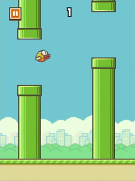
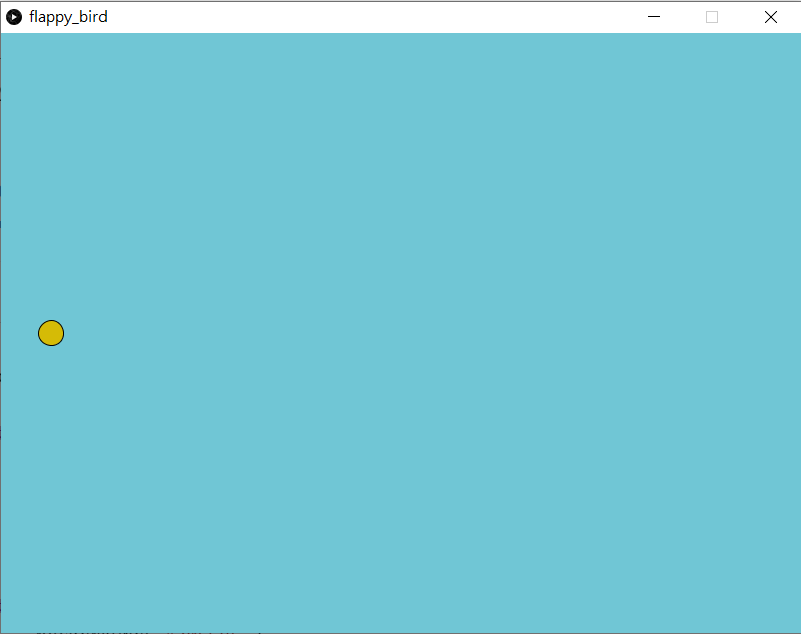
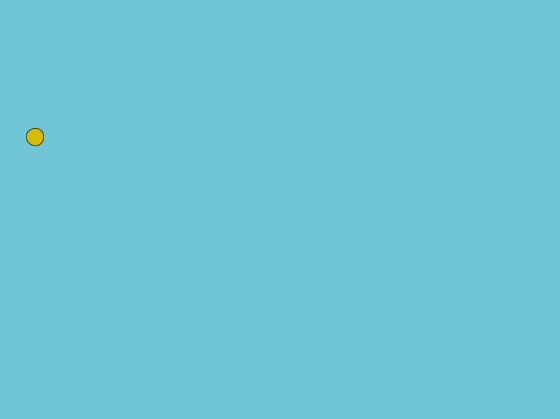
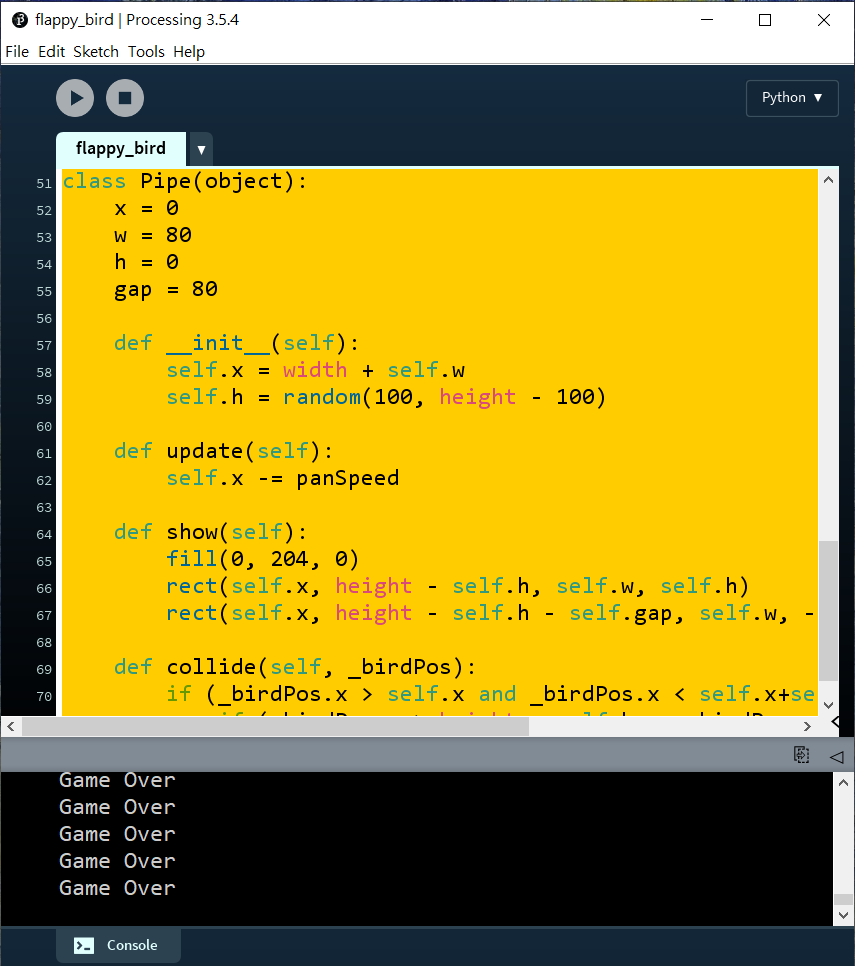
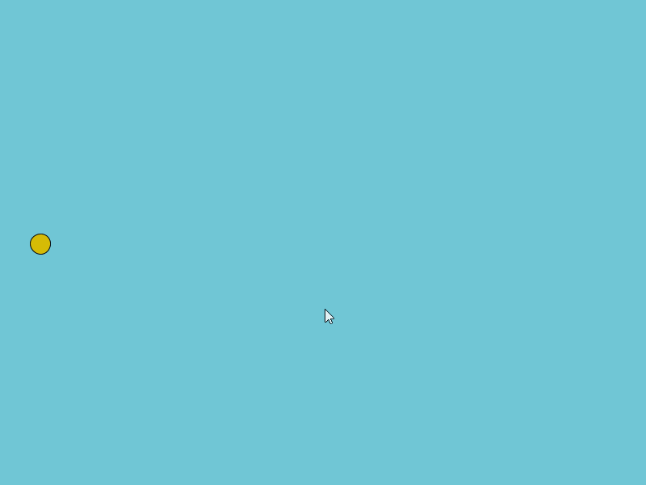
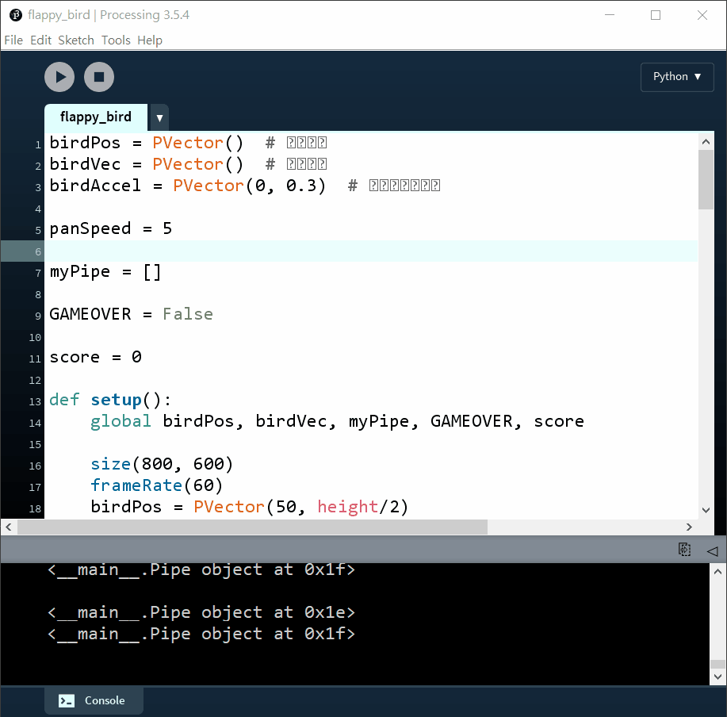

# 4. Flappy Bird

> 《Flappy Bird》是一款2013年鳥飛類遊戲，由越南河內獨立遊戲開發者阮河東（Dong Nguyen）開發，另一個獨立遊戲開發商GEARS Studios發佈。此遊戲原本於2013年5月發佈，平台為iPhone 5。同年9月，作者將遊戲更新至iOS 6。於2014年1月，此遊戲成為美國及中國iTunes最受歡迎免費應用軟件，並在同月被英國App Store描述為「新憤怒鳥」。此遊戲更成為1月下載次數最多的免費應用軟件。此遊戲的下載次數至今已超過5000萬次。



[TOC]

## 4.0 本章重點

1. 複習如何用歐拉方法模擬物理加速度
2. ==***物件導向, python class***==
3. Python `for`的另一個列表語法
4. 程式常用技巧: 只執行一次

## 4.1 開始遊戲

```python
birdPos = PVector()

def setup():
    global birdPos

    size(800, 600)
    birdPos = PVector(50, height/2)

def draw():
    background("#70C6D5")

    fill("#D5BB06")
    ellipse(birdPos.x, birdPos.y, 25, 25)
```



首先我們如常，一個processing.py的程式，基本包括了宣告區，`setup()`和`draw()`。開一個800x600的畫面，開一個鳥的位置(`birdPos`)的向量變數，在`setup()`區中設定初始值，之後在`draw()`區中繪畫。

## 4.2 讓鳥自由落體

```python
birdPos = PVector()     #鳥的位置
birdVec = PVector()     #鳥的速度
birdAccel = PVector(0, 0.3)   #鳥的向下加速度

def setup():
    global birdPos, birdVec

    size(800, 600)
    frameRate(60)
    birdPos = PVector(50, height/2)
    birdVec = PVector(0, 0)

def draw():
    global birdPos, birdVec

    background("#70C6D5")

    birdVec = birdVec.add(birdAccel)
    birdPos = birdPos.add(birdVec)

    fill("#D5BB06")
    ellipse(birdPos.x, birdPos.y, 25, 25)
```


跟上一章一樣，開兩個向量變數，分別是鳥的速度和加速度。在`setup()`區中設定初速為0，而加速度因為由始至終都不變，可以直接在宣告區中宣告其值。


```python
birdVec = birdVec.add(birdAccel)
birdPos = birdPos.add(birdVec)
```

在`draw()`中，每次更新時都將鳥的速度加上加速度，而位置則加上速度。你可以自行調整一下加速度和`frameRate()`，抄到一個不會出現殘影而又夠快的速度。

## 4.3 讓鳥懂得飛起

```python
birdPos = PVector()     #鳥的位置
birdVec = PVector()     #鳥的速度
birdAccel = PVector(0, 0.3)   #鳥的向下加速度

def setup():
    global birdPos, birdVec

    size(800, 600)
    frameRate(60)
    birdPos = PVector(50, height/2)
    birdVec = PVector(0, 0)

def draw():
    global birdPos, birdVec

    background("#70C6D5")

    birdVec = birdVec.add(birdAccel)
    birdPos = birdPos.add(birdVec)

    fill("#D5BB06")
    ellipse(birdPos.x, birdPos.y, 25, 25)


def keyPressed():
    if (key == ' '):
        birdVec.y = -8
```



```python
def keyPressed():
    if (key == ' '):
        birdVec.y = -8
```

要令鳥懂得"飛"起來，其實只要每次按下控制按鍵時，將鳥速度的y方向變成一個常數，就可以做到類似突然升起的效果，但升起後又會因為加速度再次慢慢降下。

## 4.4 製作水管

```python
birdPos = PVector()  # 鳥的位置
birdVec = PVector()  # 鳥的速度
birdAccel = PVector(0, 0.3)  # 鳥的向下加速度

panSpeed = 5

myPipe = 0


def setup():
    global birdPos, birdVec, myPipe

    size(800, 600)
    frameRate(60)
    birdPos = PVector(50, height/2)
    birdVec = PVector(0, 0)

    myPipe = Pipe()


def draw():
    global birdPos, birdVec

    background("#70C6D5")

    birdVec = birdVec.add(birdAccel)
    birdPos = birdPos.add(birdVec)

    fill("#D5BB06")
    ellipse(birdPos.x, birdPos.y, 25, 25)

    myPipe.update()
    myPipe.show()


def keyPressed():
    if (key == ' '):
        birdVec.y = -8
    if (key == 'R' or key == 'r'):
        setup()
        
# =======================Pipe Object=======================================

class Pipe(object):
    x = 0
    w = 80
    h = 0
    gap = 80

    def __init__(self):
        self.x = width + self.w
        self.h = random(100, height - 100)

    def update(self):
        self.x -= panSpeed

    def show(self):
        fill(0, 204, 0)
        rect(self.x, height - self.h, self.w, self.h)
        rect(self.x, height - self.h - self.gap, self.w, -(height-self.h))
```


要製作水管，就要先討論一下本章最重點的學習內容：物件導向和class。

### 4.4.1 物件導向與class

詳見[這裡](./content_4_1.html)。


```python
class Pipe(object):
    x = 0
    w = 80
    h = 0
    gap = 80

    def __init__(self):
        self.x = width + self.w
        self.h = random(100, height - 100)

    def update(self):
        self.x -= panSpeed

    def show(self):
        fill(0, 204, 0)
        rect(self.x, height - self.h, self.w, self.h)
        rect(self.x, height - self.h - self.gap, self.w, -(height-self.h))
```

建立一個class來做水管的類別。水管包括有它的x位置，寬度和高度，還有上下水管的縫隙間距。設定水管一開始在畫面外的右側，而`h`的意思是畫面頂部到下水管頂部的距離。


## 4.5 測試gameover

```python
birdPos = PVector()  # 鳥的位置
birdVec = PVector()  # 鳥的速度
birdAccel = PVector(0, 0.3)  # 鳥的向下加速度

panSpeed = 5

myPipe = 0

GAMEOVER = False

def setup():
    global birdPos, birdVec, myPipe, GAMEOVER

    size(800, 600)
    frameRate(60)
    birdPos = PVector(50, height/2)
    birdVec = PVector(0, 0)

    myPipe = Pipe()

    GAMEOVER = False

def draw():
    global birdPos, birdVec, GAMEOVER

    background("#70C6D5")

    birdVec = birdVec.add(birdAccel)
    birdPos = birdPos.add(birdVec)

    fill("#D5BB06")
    ellipse(birdPos.x, birdPos.y, 25, 25)

    myPipe.update()
    myPipe.show()

    if myPipe.collide(birdPos) == True or birdPos.y > height:
        GAMEOVER = True
        println("Game Over")


def keyPressed():
    if (key == ' '):
        birdVec.y = -8
    if (key == 'R' or key == 'r'):
        setup()

# =======================Pipe Object=======================================


class Pipe(object):
    x = 0
    w = 80
    h = 0
    gap = 80

    def __init__(self):
        self.x = width + self.w
        self.h = random(100, height - 100)

    def update(self):
        self.x -= panSpeed

    def show(self):
        fill(0, 204, 0)
        rect(self.x, height - self.h, self.w, self.h)
        rect(self.x, height - self.h - self.gap, self.w, -(height-self.h))

    def collide(self, _birdPos):
        if (_birdPos.x > self.x and _birdPos.x < self.x+self.w):
            if (_birdPos.y > height - self.h or _birdPos.y < height - self.h - self.gap):
                return True
```



```python
def collide(self, _birdPos):
	if (_birdPos.x > self.x and _birdPos.x < self.x+self.w):
		if (_birdPos.y > height - self.h or _birdPos.y < height - self.h - self.gap):
			return True
```

在`Pipe`的class中新增一個函數叫`collide()`，這個函數有1個輸入(`self`不是輸入是格式)，輸入鳥的位置，如果鳥的位置和水管的範圍重疊，則`return True`。

```python
if myPipe.collide(birdPos) == True or birdPos.y > height:
	GAMEOVER = True
	println("Game Over")
```

之後就可以去到`draw()`的最後，加入這句，如果鳥撞到柱或者y座標大於`height`就`println("Game Over")`。

##4.6 測試gameover(續)

```python
birdPos = PVector()  # 鳥的位置
birdVec = PVector()  # 鳥的速度
birdAccel = PVector(0, 0.3)  # 鳥的向下加速度

panSpeed = 5

myPipe = 0

GAMEOVER = False


def setup():
    global birdPos, birdVec, myPipe, GAMEOVER

    size(800, 600)
    frameRate(60)
    birdPos = PVector(50, height/2)
    birdVec = PVector(0, 0)

    myPipe = Pipe()

    GAMEOVER = False


def draw():
    if not GAMEOVER:
        runGame()
    else:
        textSize(64)
        textAlign(CENTER, CENTER)
        fill(255, 255, 0)
        text("GAME OVER", width/2, height/2)

def keyPressed():
    if (key == ' '):
        birdVec.y = -8
    if (key == 'R' or key == 'r'):
        setup()

def runGame():
    global birdPos, birdVec, GAMEOVER

    background("#70C6D5")

    birdVec = birdVec.add(birdAccel)
    birdPos = birdPos.add(birdVec)

    fill("#D5BB06")
    ellipse(birdPos.x, birdPos.y, 25, 25)

    myPipe.update()
    myPipe.show()

    if myPipe.collide(birdPos) == True or birdPos.y > height:
        GAMEOVER = True
        println("Game Over")
# =======================Pipe Object=======================================


class Pipe(object):
    x = 0
    w = 80
    h = 0
    gap = 80

    def __init__(self):
        self.x = width + self.w
        self.h = random(100, height - 100)

    def update(self):
        self.x -= panSpeed

    def show(self):
        fill(0, 204, 0)
        rect(self.x, height - self.h, self.w, self.h)
        rect(self.x, height - self.h - self.gap, self.w, -(height-self.h))

    def collide(self, _birdPos):
        if (_birdPos.x > self.x and _birdPos.x < self.x+self.w):
            if (_birdPos.y > height - self.h or _birdPos.y < height - self.h - self.gap):
                return True
```



```python
def runGame():
    global birdPos, birdVec, GAMEOVER

    background("#70C6D5")

    birdVec = birdVec.add(birdAccel)
    birdPos = birdPos.add(birdVec)

    fill("#D5BB06")
    ellipse(birdPos.x, birdPos.y, 25, 25)

    myPipe.update()
    myPipe.show()

    if myPipe.collide(birdPos) == True or birdPos.y > height:
        GAMEOVER = True
        println("Game Over")
```

接著，跟之前的教學一樣，開一個函數叫`runGame()`，將原本在`draw()`的內容複製到這個`runGame()`中。

```python
def draw():
    if not GAMEOVER:
        runGame()
    else:
        textSize(64)
        textAlign(CENTER, CENTER)
        fill(255, 255, 0)
        text("GAME OVER", width/2, height/2)
```

而原本在`draw()`中，改寫為當`GAMEOVER`是`False`時遊戲才運行，否則gameover的話就在畫面上寫上文字。

## 4.7 新增多條水管

```python
birdPos = PVector()  # 鳥的位置
birdVec = PVector()  # 鳥的速度
birdAccel = PVector(0, 0.3)  # 鳥的向下加速度

panSpeed = 5

myPipe = []

GAMEOVER = False

score = 0

def setup():
    global birdPos, birdVec, myPipe, GAMEOVER, score

    size(800, 600)
    frameRate(60)
    birdPos = PVector(50, height/2)
    birdVec = PVector(0, 0)

    myPipe.append(Pipe())

    GAMEOVER = False

    score = 0


def draw():
    global GAMEOVER

    if not GAMEOVER:
        runGame()

    else:
        textSize(64)
        textAlign(CENTER, CENTER)
        fill(255, 255, 0)
        text("GAME OVER", width/2, height/2)


def keyPressed():
    if (key == ' '):
        birdVec.y = -8
    if (key == 'R' or key == 'r'):
        setup()


def runGame():
    global birdPos, birdVec, GAMEOVER, score

    score += 1
    if (score % 100 == 0):
        myPipe.append(Pipe())

    background("#70C6D5")

    birdVec = birdVec.add(birdAccel)
    birdPos = birdPos.add(birdVec)

    fill("#D5BB06")
    ellipse(birdPos.x, birdPos.y, 25, 25)

    for p in myPipe:
        p.update()
        p.show()

        if p.collide(birdPos) == True or birdPos.y > height:
            GAMEOVER = True


# =======================Pipe Object=======================================


class Pipe(object):
    x = 0
    w = 80
    h = 0
    gap = 80

    def __init__(self):
        self.x = width + self.w
        self.h = random(100, height - 100)

    def update(self):
        self.x -= panSpeed

    def show(self):
        fill(0, 204, 0)
        rect(self.x, height - self.h, self.w, self.h)
        rect(self.x, height - self.h - self.gap, self.w, -(height-self.h))

    def collide(self, _birdPos):
        if (_birdPos.x > self.x and _birdPos.x < self.x+self.w):
            if (_birdPos.y > height - self.h or _birdPos.y < height - self.h - self.gap):
                return True
```


```python
myPipe = []

GAMEOVER = False

score = 0
```

將原本最上方宣告區的`myPipe`由原本宣告成***整數***，變成宣告成***列表***。另外新增一個變數叫`score`來紀錄鳥飛得有多遠。


```python
def setup():
    global birdPos, birdVec, myPipe, GAMEOVER, score

    size(800, 600)
    frameRate(60)
    birdPos = PVector(50, height/2)
    birdVec = PVector(0, 0)

    myPipe.append(Pipe())

    GAMEOVER = False

    score = 0
```

在`setup()`區中，用 `myPipe.append(Pipe())`將新的`Pipe()`物件新增到列表中。另外初始化`GAMEOVER`和`score`。


在`runGame()`中，新增每次運行時都將`score`加1，用來紀錄鳥飛行了多少影格。`if (score % 100 == 0):`的意思是`score`除以`100`，餘數為`0`時就執行。即每100影格就新增一條水管。

下面16-21行，跟之前幾乎是一樣的，但新增了一行`for p in myPipe:`。

**`for`常見有兩種格式，一種是`for i in range(n):`，就是直接告訴程式將以下的程式重覆`n`次，每次重覆時都會將`i`加1。而另一種常見的格式是`for obj in list:`，就是直接重覆`list`的長度，每次重覆時，`obj`的內容就是對應的`list[i]`。**


**即，`for obj in list:`跟`for i in range(len(list)):`是一樣的。**


但如果你按下`r`鍵重設遊戲時，你會發現會有上面的bugs。原因是`myPipe`這個列表只有新增，沒有減少，也沒有清空。

##4.8 清空和減少水管列表

```PYTHON
birdPos = PVector()  # 鳥的位置
birdVec = PVector()  # 鳥的速度
birdAccel = PVector(0, 0.3)  # 鳥的向下加速度

panSpeed = 5

myPipe = []

GAMEOVER = False

score = 0

def setup():
    global birdPos, birdVec, myPipe, GAMEOVER, score

    size(800, 600)
    frameRate(60)
    birdPos = PVector(50, height/2)
    birdVec = PVector(0, 0)

    if len(myPipe) > 0:
        myPipe.clear()

    myPipe.append(Pipe())

    GAMEOVER = False

    score = 0


def draw():
    global GAMEOVER

    if not GAMEOVER:
        runGame()

    else:
        textSize(64)
        textAlign(CENTER, CENTER)
        fill(255, 255, 0)
        text("GAME OVER", width/2, height/2)


def keyPressed():
    if (key == ' '):
        birdVec.y = -8
    if (key == 'R' or key == 'r'):
        setup()


def runGame():
    global birdPos, birdVec, GAMEOVER, score

    score += 1
    if (score % 100 == 0):
        myPipe.append(Pipe())

    background("#70C6D5")

    birdVec = birdVec.add(birdAccel)
    birdPos = birdPos.add(birdVec)

    fill("#D5BB06")
    ellipse(birdPos.x, birdPos.y, 25, 25)

    for p in myPipe:
        p.update()
        p.show()

        # if p.collide(birdPos) == True or birdPos.y > height:
        #     GAMEOVER = True
        
        if (p.x < - p.w):
            myPipe.remove(p)
    
    # delete me after testing=============
    for p in myPipe:
        print(p)
    println(' ')
    #=====================================

# =======================Pipe Object=======================================


class Pipe(object):
    x = 0
    w = 80
    h = 0
    gap = 80

    def __init__(self):
        self.x = width + self.w
        self.h = random(100, height - 100)

    def update(self):
        self.x -= panSpeed

    def show(self):
        fill(0, 204, 0)
        rect(self.x, height - self.h, self.w, self.h)
        rect(self.x, height - self.h - self.gap, self.w, -(height-self.h))

    def collide(self, _birdPos):
        if (_birdPos.x > self.x and _birdPos.x < self.x+self.w):
            if (_birdPos.y > height - self.h or _birdPos.y < height - self.h - self.gap):
                return True
```



你可以留意一下console的位置，我將每次`runGame()`時將所有的`myPipe`物件的id都列印出來，然後每次都隔一行，你可以見到，每次列印出來時也只有2個id，證明程式現在懂得將超過畫面的`Pipe()`物件從`myPipe`列表中移除。


```python
 if len(myPipe) > 0:
        myPipe.clear()
```

在`setup()`中新增了一句。當`myPipe`列表長度大於0(即有內容時)就清空列表。

```python
def runGame():
    global birdPos, birdVec, GAMEOVER, score

    score += 1
    if (score % 100 == 0):
        myPipe.append(Pipe())

    background("#70C6D5")

    birdVec = birdVec.add(birdAccel)
    birdPos = birdPos.add(birdVec)

    fill("#D5BB06")
    ellipse(birdPos.x, birdPos.y, 25, 25)

    for p in myPipe:
        p.update()
        p.show()

        # if p.collide(birdPos) == True or birdPos.y > height:
        #     GAMEOVER = True
        
        if (p.x < - p.w):
            myPipe.remove(p)
    
    # delete me after testing=============
    for p in myPipe:
        print(p)
    println(' ')
    #=====================================
```

在`runGame()`中，20-21行，暫時停止gameover功能方便debug，之後23-24行新增了當水管已經移出了畫面時，就在`myPipe`列表中移除當下這個物件。要注意的是，移除一定要在最後才執行，否則移除後下面繼續執行的都是針對下一個id)。

之後就在每次`runGame()`中，將所有`myPipe`列表的內容都列印出來，在python中列印一件物件，只會列印其id，這個id是電腦儲存這個物件的暫存記憶體地址。這一段是用來debug的，測試後沒有問題就可以刪掉。

## 4.9 水管計分

最後
