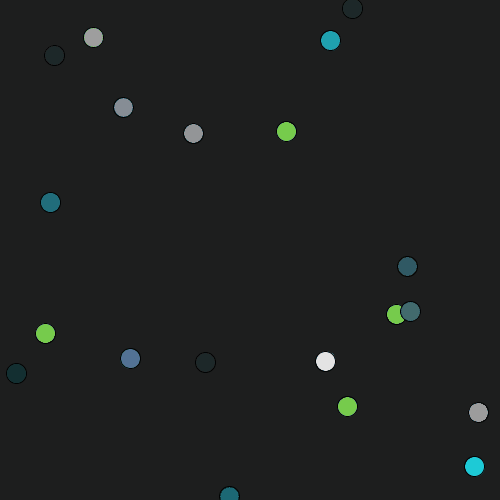
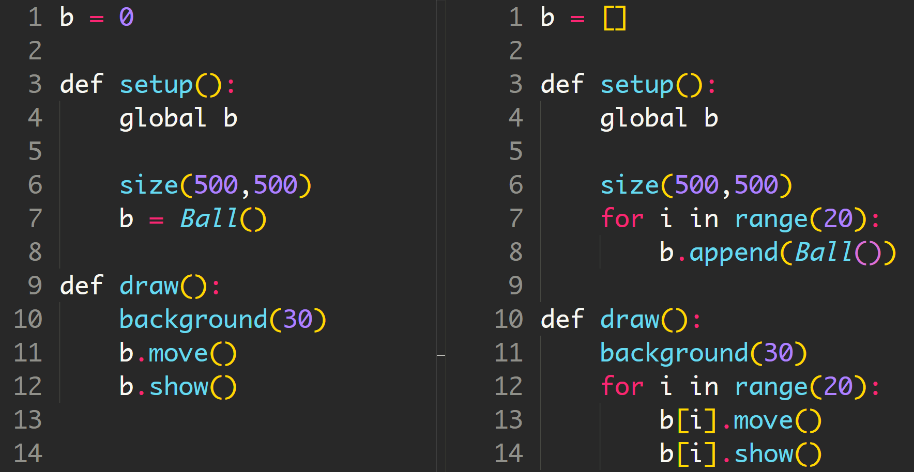

# 物件導向與class

[toc]

## 1. 製作一粒波子

想像一下，如果你現在要在畫面上，製作一粒會四面彈的波子，你會怎樣做？跟之前一樣，你首先需要幾個區：

1. **宣告區:**
	*  波子的位置
	*  波子的速度
	*  波子的顏色
2. **`setup()`:**
	*  初始化波子的位置
	*  初始化波子的速度
	*  初始化波子的顏色
3. **`draw()`:**
	*  填背景
	*  更新波子的位置
	*  繪畫波子

如果用程式碼做出來就會如下：

```python
ballPos = PVector()
ballVec = PVector()
ballColor = color(0)

def setup():
    global ballPos, ballVec, ballColor
    
    size(500,500)
    ballPos = PVector(random(0, width), random(0, height))
    ballVec = PVector(random(-5, 5), random(-5, 5))
    ballColor = color(random(0, 255), random(0, 255), random(0, 255))
    
def draw():
    background(30)
    move()
    show()
    
def move():
    global ballPos
    
    ballPos = ballPos.add(ballVec)
    if (ballPos.x > width or ballPos.x < 0):
        ballVec.x *= -1
    if (ballPos.y > height or ballPos.y < 0):
        ballVec.y *= -1

def show():
    fill(ballColor)
    ellipse(ballPos.x, ballPos.y, 20, 20)
```


##2. 用`for`製作多粒波子

那如果要做20粒的話, 你會怎樣做？之前有教過一個方法，是用List去做，方法如下：

```python
ballPos = []
ballVec = []
ballColor = []

def setup():
    global ballPos, ballVec, ballColor
    
    size(500,500)
    for i in range(20):
        ballPos.append( PVector(random(0, width), random(0, height)) )
        ballVec.append( PVector(random(-5, 5), random(-5, 5)) )
        ballColor.append( color(random(0, 255), random(0, 255), random(0, 255))  )
    
def draw():
    background(30)
    move()
    show()
    
def move():
    global ballPos
    
    for i in range(20):
        ballPos[i] = ballPos[i].add(ballVec[i])
        if (ballPos[i].x > width or ballPos[i].x < 0):
            ballVec[i].x *= -1
        if (ballPos[i].y > height or ballPos[i].y < 0):
            ballVec[i].y *= -1

def show():
    for i in range(20):
        fill(ballColor[i])
        ellipse(ballPos[i].x, ballPos[i].y, 20, 20)
```



## 3. 用class方法歸納多粒波子

上述方法沒有甚麼問題，好好地運作，你當然可以這樣去做。但如果在波子以外，你同時需要其他不同的元素，**例如星球大戰遊戲，有20部飛船，每部飛船發出若干子彈，那就已經有2種元素，如果再加上小行星，就是三種**，而每種元素都有自己對應的變數，那麼一開始的宣告區就會非常多不同變數，**如果命名習慣不好，全部都是x, y, a, b等等，那麼要修改維護就會十分困難**。

那有沒有一種辦法，可以好好歸類這些變數，令程式更好維護呢？那就需要用到物件和class。用回上面的例子，要畫一粒波子，方法如下：

1. **宣告區:**
  *  波子*物件*
2. **setup():**
	* 初始化波子*物件*
3. **draw():**
	* 填背景
	* 更新波子*物件*的位置
	* 繪畫波子*物件*

```python
b = 0

def setup():
    global b
    
    size(500,500)
    b = Ball()
    
def draw():    
    background(30)
    b.move()
    b.show()
    
#=======================ball object=======================================

class Ball(object):    
    def __init__(self):
        self.ballPos = PVector(random(0, width), random(0, height))
        self.ballVec = PVector(random(-5, 5), random(-5, 5))
        self.ballColor = color(random(0, 255), random(0, 255), random(0, 255))

    def move(self):
        self.ballPos = self.ballPos.add(self.ballVec)
        if (self.ballPos.x > width or self.ballPos.x < 0):
            self.ballVec.x *= -1
        if (self.ballPos.y > height or self.ballPos.y < 0):
            self.ballVec.y *= -1

    def show(self):
        fill(self.ballColor)
        ellipse(self.ballPos.x, self.ballPos.y, 20, 20)
```


效果是跟上面一模一樣的，分別只在於程式用上class去做。


我將兩個程式side by side比較一下，你就會見到分別。比較特別的是，所有在class中的變數，都需要特別地用`self`去標明是這個class內的變數，所以看上去感覺會比較複雜一點，但如果你同時有多個差不多的變數，例如上述例子，星球大戰有飛船、子彈、小行星，如果你懶得命名叫`shipPos`, `bulletPos`, `starPos`等等，那在自己的class內，你可以全部統一命名為`Pos`，或者 `x`和`y`，重複都沒有關係，因為注明了是`self`的話，就會知道是這一個class內的`x`和`y`。

## 4. 用class畫20粒波子

```python
b = []

def setup():
    global b
    
    size(500,500)
    for i in range(20):
        b.append(Ball())
    
def draw():    
    background(30)
    for i in range(20):
        b[i].move()
        b[i].show()
    
#=======================ball object=======================================

class Ball(object):    
    def __init__(self):
        self.ballPos = PVector(random(0, width), random(0, height))
        self.ballVec = PVector(random(-5, 5), random(-5, 5))
        self.ballColor = color(random(0, 255), random(0, 255), random(0, 255))

    def move(self):
        self.ballPos = self.ballPos.add(self.ballVec)
        if (self.ballPos.x > width or self.ballPos.x < 0):
            self.ballVec.x *= -1
        if (self.ballPos.y > height or self.ballPos.y < 0):
            self.ballVec.y *= -1

    def show(self):
        fill(self.ballColor)
        ellipse(self.ballPos.x, self.ballPos.y, 20, 20)
```



對比起前面要分別在`setup()`，`draw()`，`move()`和`show()`都各自做for重覆20次，今次用class的方法就十分簡潔，不需要理會class入面的內容，內容是不需要變的，只要用波子物件(`b`)重覆開20個就可以了。

詳細的教程可以參考官網[這裡](https://py.processing.org/tutorials/objects/)。
