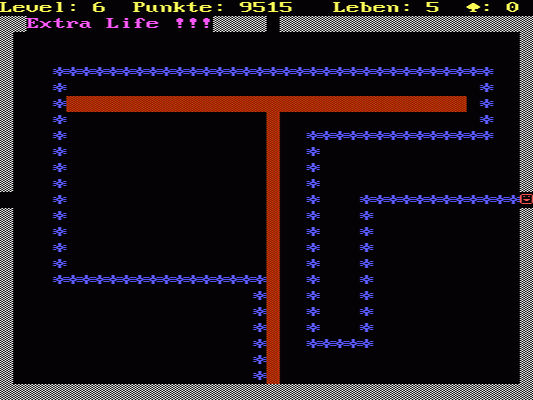
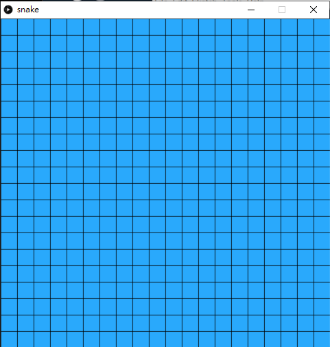
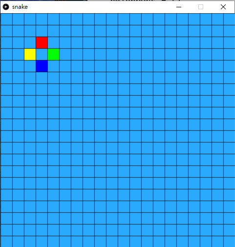
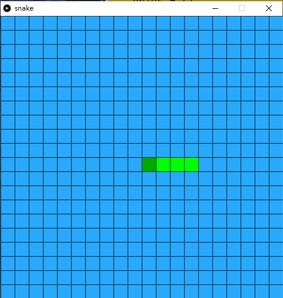
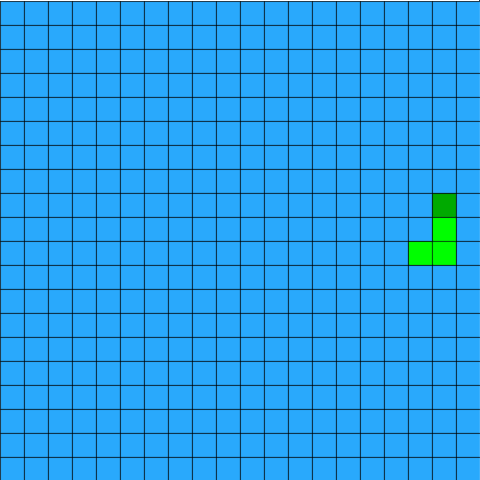
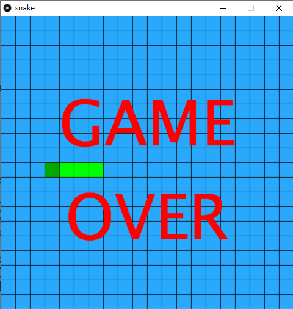
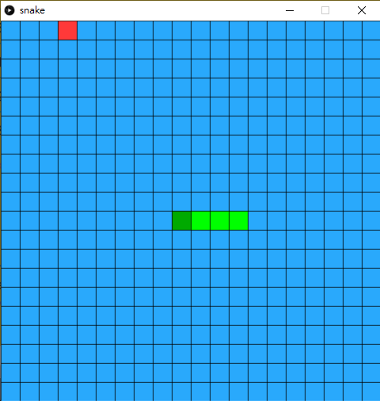
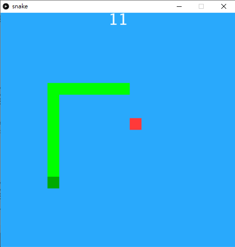

#7. Snake

> 貪食蛇（Snake）是一個起源於1976年的大型電玩遊戲 Blockade。此類遊戲在1990年代由於一些具有小型螢幕的行動電話的引入而再度流行起來，在現在的手機上基本都可安裝此小遊戲。版本亦有所不同。



[toc]

## 7.1 創建class和做準備

`snake.pyde`:

```PYTHON
from spot import *

def setup():
    size(600,600)
    
def draw():
    background(50)
```

`spot.py`:

```python
class Spot(object):
    def __init__(self, _x, _y):
        self.x = _x
        self.y = _y
```


## 7.2 將畫面用spot分格

`snake.pyde`:

```python
from spot import *

grids = []

def setup():
    global grids
    size(600,600)

    grids = []

    for x in range(20):
        tempGrids = []
        for y in range(20):
            tempGrids.append(Spot(x, y, width/20, height/20))
        grids.append(tempGrids)
    
def draw():
    background(50)
    for x in range(20):
        for y in range(20):
            grids[x][y].show('#29A9FC')
```

`spot.py`:

```python
class Spot(object):

    def __init__(self, _x, _y, _w, _h):
        self.x = _x
        self.y = _y
        self.w = _w
        self.h = _h

    def show(self, _color):
        stroke(0)
        fill(_color)
        rect(self.x*width/20, self.y*height/20, self.w, self.h)
```



這個步驟主要是將整個畫面都分成20格x20格。

```python
for i in range(20):
    tempGrids = []
    for j in range(20):
        tempGrids.append(Spot(i, j, width/20, height/20))
    grids.append(tempGrids)
```

在`setup()`中，加入2d array去儲起Spot class，這個格式在第二個遊戲breakout時有做過。

我們在`Spot `class的`show()`中，臨時加上框線來顯示，看看是否正常，debug後就可以不再畫框線，現在則暫時保留。

## 7.3 為每個格加上鄰居

`snake.pyde`:

```python
from spot import *

grids = []

def setup():
    global grids
    size(600,600)

    grids = []

    for x in range(20):
        tempGrids = []
        for y in range(20):
            tempGrids.append(Spot(x, y, width/20, height/20))
        grids.append(tempGrids)
    
def draw():
    background(50)
    for x in range(20):
        for y in range(20):
            grids[x][y].show('#29A9FC')
    
    grids[3][3].addNeighbors(grids)
    grids[3][3].neighbors[0].show('#FF0000')
    grids[3][3].neighbors[1].show('#00FF00')
    grids[3][3].neighbors[2].show('#0000FF')
    grids[3][3].neighbors[3].show('#FFFF00')
```

`spot.py`:

```python
class Spot(object):

    def __init__(self, _x, _y, _w, _h):
        self.x = _x
        self.y = _y
        self.w = _w
        self.h = _h
        self.neighbors = []
        for i in range(4):
            self.neighbors.append(0)
            
    def show(self, _color):
        stroke(0)
        fill(_color)
        rect(self.x*width/20, self.y*height/20, self.w, self.h)

    def addNeighbors(self, _grid):
       #UP
        if (self.y > 0):
            self.neighbors[0] = _grid[self.x][self.y-1]
        # RIGHT
        if (self.x < 19):    # Total 20x20, so the max id is 19
            self.neighbors[1] = _grid[self.x+1][self.y]
        # DOWN
        if (self.y < 19):    # Total 20x20, so the max id is 19
            self.neighbors[2] = _grid[self.x][self.y+1]
        # LEFT
        if (self.x > 0):
            self.neighbors[3] = _grid[self.x-1][self.y]
```



由於貪食蛇的蛇身是連著的，而且一定是格的上下左右鄰居的其中一個，要將蛇越拖越長而且記著蛇走過的路，我們首先為每個格都加入鄰居。這也是用class的好處，class自己是可以包含自己的，你剛開一個class，class入面的變數就可以是這個class的本身。

在`spot.py`中，

```python
def addNeighbors(self, _grid):
    #UP
    if (self.y > 0):
        self.neighbors[0] = _grid[self.x][self.y-1]
    # RIGHT
    if (self.x < 19):    # Total 20x20, so the max id is 19
        self.neighbors[1] = _grid[self.x+1][self.y]
    # DOWN
    if (self.y < 19):    # Total 20x20, so the max id is 19
        self.neighbors[2] = _grid[self.x][self.y+1]
    # LEFT
    if (self.x > 0):
        self.neighbors[3] = _grid[self.x-1][self.y]
```

分別加入上、右、下和左四個鄰居，順序是按順時針的。但要留意，如果格剛好在邊介位置，例如最左。最右。最上和最下，就要加入限制，否則就會超出列表的範圍。

在主程式的`draw()`中，

```python
grids[3][3].addNeighbors(grids)
grids[3][3].neighbors[0].show('#FF0000')
grids[3][3].neighbors[1].show('#00FF00')
grids[3][3].neighbors[2].show('#0000FF')
grids[3][3].neighbors[3].show('#FFFF00')
```

特地為`grid[3][3]`為入鄰居，再將四個鄰居用不同顏色標記出來，用來debug檢查是否正確。**值得留意的是，`grid[3][3]`中的3是array index，index是由`0`開始的，所以index `3`，實際上不是第3格而是第4格。**

###7.3.1 特別處理邊介的鄰居

主程式沒有變，`spot.py`:

```python
class Spot(object):

    def __init__(self, _x, _y, _w, _h):
        self.x = _x
        self.y = _y
        self.w = _w
        self.h = _h
        self.neighbors = []
        for i in range(4):
            self.neighbors.append(0)

    def show(self, _color):
        stroke(0)
        fill(_color)
        rect(self.x*width/20, self.y*height/20, self.w, self.h)

    def addNeighbors(self, _grid):
        #UP
        if (self.y > 0):
            self.neighbors[0] = _grid[self.x][self.y-1]
        # RIGHT
        if (self.x < 19):    # Total 20x20, so the max id is 19
            self.neighbors[1] = _grid[self.x+1][self.y]
        # DOWN
        if (self.y < 19):    # Total 20x20, so the max id is 19
            self.neighbors[2] = _grid[self.x][self.y+1]
        # LEFT
        if (self.x > 0):
            self.neighbors[3] = _grid[self.x-1][self.y]

        if (self.y == 0):
            self.neighbors[0] = _grid[self.x][19]
        if (self.x == 19):
            self.neighbors[1] = _grid[0][self.y]
        if (self.y == 19):
            self.neighbors[2] = _grid[self.x][0]
        if (self.x == 0):
            self.neighbors[3] = _grid[19][self.y]
```
<div style='text-align: center'>
<br></div>

在`spot `class的`addNeighbors()`中，加入如果在邊位時的考量，由於貪食蛇是可以穿牆到畫面的另一邊，故此，邊位的鄰居就是另一邊的格。

```python
 def addNeighbors(self, _grid):
    #UP
    if (self.y > 0):
        self.neighbors[0] = _grid[self.x][self.y-1]
    # RIGHT
    if (self.x < 19):    # Total 20x20, so the max id is 19
        self.neighbors[1] = _grid[self.x+1][self.y]
    # DOWN
    if (self.y < 19):    # Total 20x20, so the max id is 19
        self.neighbors[2] = _grid[self.x][self.y+1]
    # LEFT
    if (self.x > 0):
        self.neighbors[3] = _grid[self.x-1][self.y]

    if (self.y == 0):
        self.neighbors[0] = _grid[self.x][19]
    if (self.x == 19):
        self.neighbors[1] = _grid[0][self.y]
    if (self.y == 19):
        self.neighbors[2] = _grid[self.x][0]
    if (self.x == 0):
        self.neighbors[3] = _grid[19][self.y]
```

在`addNeighbors()`加入最底下的四個考量。之後去主頁，將之前測試的格座標改一改，試一試四個邊位是否正確。

### 7.3.2 測試完成後，為每個格加上鄰居

`snake.pyde`:

```python
from spot import *

grids = []

def setup():
    global grids
    size(600,600)

    grids = []

    for x in range(20):
        tempGrids = []
        for y in range(20):
            tempGrids.append(Spot(x, y, width/20, height/20))
        grids.append(tempGrids)

    for x in range(20):
        for y in range(20):
            grids[x][y].addNeighbors(grids)
    
def draw():
    background(50)
    for x in range(20):
        for y in range(20):
            grids[x][y].show('#29A9FC')
```

`spot.py`:

```python
class Spot(object):

    def __init__(self, _x, _y, _w, _h):
        self.x = _x
        self.y = _y
        self.w = _w
        self.h = _h
        self.neighbors = []
        for i in range(4):
            self.neighbors.append(0)

    def show(self, _color):
        stroke(0)
        fill(_color)
        rect(self.x*width/20, self.y*height/20, self.w, self.h)

    def addNeighbors(self, _grid):
        #UP
        if (self.y > 0):
            self.neighbors[0] = _grid[self.x][self.y-1]
        # RIGHT
        if (self.x < 19):    # Total 20x20, so the max id is 19
            self.neighbors[1] = _grid[self.x+1][self.y]
        # DOWN
        if (self.y < 19):    # Total 20x20, so the max id is 19
            self.neighbors[2] = _grid[self.x][self.y+1]
        # LEFT
        if (self.x > 0):
            self.neighbors[3] = _grid[self.x-1][self.y]

        if (self.y == 0):
            self.neighbors[0] = _grid[self.x][19]
        if (self.x == 19):
            self.neighbors[1] = _grid[0][self.y]
        if (self.y == 19):
            self.neighbors[2] = _grid[self.x][0]
        if (self.x == 0):
            self.neighbors[3] = _grid[19][self.y]
```


為方便大家，我將全部程式一次過貼出來。前一步測試完成後，就可以在`setup()`中，加入:

```python
for x in range(20):
    for y in range(20):
        grids[x][y].addNeighbors(grids)
```

為每個格都加入4個鄰居，這個步驟只要做一次就可以了，所以在`setup()`中完成就可以。在主程式頁面，將原本draw()中的鄰居顯示刪去。

## 7.4 製作貪食蛇的class

`snake.pyde`:

```python
from spot import *
from snake import *

grids = []
snake = 0

def setup():
    global grids, snake, currentSpot, snake
    size(600,600)

    grids = []

    for x in range(20):
        tempGrids = []
        for y in range(20):
            tempGrids.append(Spot(x, y, width/20, height/20))
        grids.append(tempGrids)

    for x in range(20):
        for y in range(20):
            grids[x][y].addNeighbors(grids)
            
    snake = Snake(grids)
    
def draw():
    global grids, snake, currentSpot

    background(50)

    for x in range(20):
        for y in range(20):
            grids[x][y].show('#29A9FC')

    snake.show()
```

`snake.py`

```python
class Snake(object):
    
    def __init__(self, _grids):
		self.grids = _grids
        self.snakeHead = self.grids[10][10]
        self.snakeBody = []
        for i in range(3,0,-1):
            self.snakeBody.append(self.grids[10+i][10])

    def show(self):
        for i in range(len(self.snakeBody)):
            self.snakeBody[i].show('#00FF00')
        self.snakeHead.show('#00AA00')
```

<u>`spot.py`沒有改變，則不再重覆了。</u>



在`snake.py`的`snake `class中，

```python
def __init__(self, _grids):
    self.grids = _grids
    self.snakeHead = self.grids[10][10]
    self.snakeBody = []
    for i in range(3,0,-1):
        self.snakeBody.append(self.grids[10+i][10])
```

將全個畫的的格匯入這個class中，所以開一個同樣叫`grids`的列表變數。蛇本身有body，而且會隨著吃蘋果越來越長，所有用列表`snakeBody`來裝起，最後就是蛇頭，只有一個，之後會用來裝起格仔的。

接著初始化，蛇頭預設在畫面中央，所以是`grids[10][10]`，之後蛇身一開始時有3格(不計蛇頭，額外有3格)。==值得注意是: 今次的for是次序相反的==，`for i in range(3,0,-1):`的意思是，由`3`開始計到`0`，每次`-1`，之所以要這樣逆次序，是因為`snakeBody`是用來紀錄蛇經過的路徑的，`snakeBody[0]`是蛇尾，也是蛇最舊的路徑。

## 7.5 令蛇懂得行走

`snake.pyd`

```python
from spot import *
from snake import *

grids = []
snake = 0

def setup():
    global grids, snake, currentSpot, snake
    size(600,600)
    frameRate(10)
    
    grids = []

    for x in range(20):
        tempGrids = []
        for y in range(20):
            tempGrids.append(Spot(x, y, width/20, height/20))
        grids.append(tempGrids)

    for x in range(20):
        for y in range(20):
            grids[x][y].addNeighbors(grids)
            
    snake = Snake(grids)
    
def draw():
    global grids, snake, currentSpot

    background(50)

    for x in range(20):
        for y in range(20):
            grids[x][y].show('#29A9FC')

    snake.show()

def keyPressed():
    if (key == CODED and keyCode == UP):
        snake.dirID = 0
    if (key == CODED and keyCode == RIGHT):
        snake.dirID = 1
    if (key == CODED and keyCode == DOWN):
        snake.dirID = 2
    if (key == CODED and keyCode == LEFT):
        snake.dirID = 3
```

`snake.py`:

```python
class Snake(object):
    
    def __init__(self, _grids):
        self.grids = _grids
        self.snakeHead = self.grids[10][10]

        self.dirID = 3  #[0:UP, 1:RIGHT, 2: DOWN, 3: LEFT]
        self.next = 0

        self.snakeBody = []
        for i in range(3,0,-1):
            self.snakeBody.append(self.grids[10+i][10])

    def show(self):
        for i in range(len(self.snakeBody)):
            self.snakeBody[i].show('#00FF00')
        self.snakeHead.show('#00AA00')

        self.next = self.snakeHead.neighbors[self.dirID]
        self.snakeBody.append(self.snakeHead)
        self.snakeHead = self.next
        self.snakeBody.pop(0)
```

<u>spot.py`沒有變，不再重覆。</u>



在`snake `class中，

```python
def __init__(self, _grids):
    self.grids = _grids
    self.snakeHead = self.grids[10][10]

    self.dirID = 3  #[0:UP, 1:RIGHT, 2: DOWN, 3: LEFT]
    self.next = 0

    self.snakeBody = []
    for i in range(3,0,-1):
        self.snakeBody.append(self.grids[10+i][10])
```

加上兩個變數分別為`dirID`和`next`，	`dirID`是neighbors的方向，跟之前一樣上、右、下和左四個鄰居，順序是按順時針。而`next`則是蛇將要行的下一格。

```PYTHON
 def show(self):
    for i in range(len(self.snakeBody)):
        self.snakeBody[i].show('#00FF00')
    self.snakeHead.show('#00AA00')

    self.next = self.snakeHead.neighbors[self.dirID]
    self.snakeBody.append(self.snakeHead)
    self.snakeHead = self.next
    self.snakeBody.pop(0)
```

在下面的`show()`中，顯示完之後，按照前進方向更新下一個蛇頭位置，之後將現有的蛇頭加入到蛇身，再將現在的蛇頭更新成一下個蛇頭，最後就用`pop()`，移除蛇身第一個內容(即蛇尾，這就是為何我們一開始要逆次序。


返回在主程式中，

```python
def setup():
    global grids, snake, currentSpot, snake
    size(600,600)
    frameRate(10)
```

在`setup()`之中加入`frameRate()`，設定動畫影格為10 frame per second。

```python
def keyPressed():
    if (key == CODED and keyCode == UP):
        snake.dirID = 0
    if (key == CODED and keyCode == RIGHT):
        snake.dirID = 1
    if (key == CODED and keyCode == DOWN):
        snake.dirID = 2
    if (key == CODED and keyCode == LEFT):
        snake.dirID = 3
```

在程式最下，加上方向鍵控制，改變蛇的`dirID`就能改變其更新的方向。

## 7.6 加入game over

`snake.pyde`:

```python
from spot import *
from snake import *

grids = []
snake = 0

def setup():
    global grids, snake, currentSpot, snake
    size(600,600)
    frameRate(10)
    
    grids = []

    for x in range(20):
        tempGrids = []
        for y in range(20):
            tempGrids.append(Spot(x, y, width/20, height/20))
        grids.append(tempGrids)

    for x in range(20):
        for y in range(20):
            grids[x][y].addNeighbors(grids)
            
    snake = Snake(grids)
    
def draw():
    global grids, snake, currentSpot, gameOver

    if (snake.gameOver == False):
        background(50)

        for x in range(20):
            for y in range(20):
                grids[x][y].show('#29A9FC')

        snake.show()
        snake.check()
    else:
        textSize(128)
        textAlign(CENTER, CENTER)
        fill('#FF0000')
        text("GAME" + '\n' + "OVER", width/2, height/2)

def keyPressed():
    if (key == CODED and keyCode == UP):
        snake.dirID = 0
    if (key == CODED and keyCode == RIGHT):
        snake.dirID = 1
    if (key == CODED and keyCode == DOWN):
        snake.dirID = 2
    if (key == CODED and keyCode == LEFT):
        snake.dirID = 3
    
    if (key == 'r' or key == 'R'):
        setup()
```

`snake.py`:

```python
class Snake(object):
    
    def __init__(self, _grids):
        self.grids = _grids
        self.snakeHead = self.grids[10][10]

        self.dirID = 3  #[0:UP, 1:RIGHT, 2: DOWN, 3: LEFT]
        self.next = 0

        self.snakeBody = []
        for i in range(3,0,-1):
            self.snakeBody.append(self.grids[10+i][10])

        self.gameOver = False

    def show(self):
        
        for i in range(len(self.snakeBody)):
            self.snakeBody[i].show('#00FF00')
        self.snakeHead.show('#00AA00')

        self.next = self.snakeHead.neighbors[self.dirID]
        self.snakeBody.append(self.snakeHead)
        self.snakeHead = self.next
        self.snakeBody.pop(0)
    
    def check(self):
        if self.next in self.snakeBody:
            self.gameOver = True
```

<u>其他兩個分頁spot.py`沒有變。</u>



在`snake `class中，

```python
def __init__(self, _grids):
	#other variables
	self.gameOver = False
```

最初始化的最下加入一個變數叫`gameOver`，設定成`False`。

```python
def check(self):
    if self.next in self.snakeBody:
        self.gameOver = True
```

之後加入一個函數叫`check()`，用來檢查蛇是否撞到自己。由於我們蛇身都是用一個list去裝起的，所以只要蛇的下一步`next`包含在`snakeBody`的陣列中，即蛇撞到自己的蛇身，遊戲結束。

跟之前一樣，將原先`draw()`中的內容都用`if (snake.gameOver == False):`包裹，之後加入`else:`如果輸了就在畫面中央大大隻字顯示game over。

````python
if (key == 'r' or key == 'R'):
    setup()
````

最後在`keyPressed()`中，加入按下`r`鍵就會重新遊戲。

## 7.7 加入目標物蘋果

`snake.pyde`:

```python
from spot import *
from snake import *

grids = []
snake = 0
apples = []

def setup():
    global grids, snake, currentSpot, snake, apples
    size(600,600)
    frameRate(10)
    
    grids = []

    for x in range(20):
        tempGrids = []
        for y in range(20):
            tempGrids.append(Spot(x, y, width/20, height/20))
        grids.append(tempGrids)

    for x in range(20):
        for y in range(20):
            grids[x][y].addNeighbors(grids)
            
    snake = Snake(grids)

    apples = []
    apples.append(addApple())

    
def draw():
    global grids, snake, currentSpot, gameOver

    if (snake.gameOver == False):
        background(50)

        for x in range(20):
            for y in range(20):
                grids[x][y].show('#29A9FC')

        for a in apples:
            a.show('#FF3939')

        snake.show()
        snake.check()
    else:
        textSize(128)
        textAlign(CENTER, CENTER)
        fill('#FF0000')
        text("GAME" + '\n' + "OVER", width/2, height/2)

def keyPressed():
    if (key == CODED and keyCode == UP):
        snake.dirID = 0
    if (key == CODED and keyCode == RIGHT):
        snake.dirID = 1
    if (key == CODED and keyCode == DOWN):
        snake.dirID = 2
    if (key == CODED and keyCode == LEFT):
        snake.dirID = 3
    
    if (key == 'r' or key == 'R'):
        setup()

def addApple():
    tempSpot = grids[int(random(20))][int(random(20))]
    
    if (tempSpot in snake.snakeBody or tempSpot == snake.snakeHead or tempSpot in apples):
        println("redraw")
        addApple()
    
    return tempSpot
```

<u>其餘的程式沒有變。</u>



下一個步驟是加入貪食蛇的目標物蘋果。

```python
apples = []

def setup():
    global grids, snake, currentSpot, snake, apples
    #other things
    apples = []
    apples.append(addApple())
```

一開始宣告一個列表變數叫`apples`，在`setup()`中，為其加入一個新的內容。加入新內容時用一個叫`addApple()`的函數去抽出新的蘋果，下文會詳述。

```python
def addApple():
    tempSpot = grids[int(random(20))][int(random(20))]
    
    if (tempSpot in snake.snakeBody or tempSpot == snake.snakeHead or tempSpot in apples):
        println("redraw")
        addApple()
    
    return tempSpot
```

在主頁的最下，加入一個自訂函數叫`addApple()`。一開始抽出全部`grids`裡面全部格的一個，接著就要對比一下，這個抽出來的格不能是蛇身，不能不蛇頭，也不能是原本`apples`已經有的內容，遇到這情況直接call `addApple()`再抽多一次，否則就`return`抽到的格。

## 7.8 食到蘋果後得分

`snake.pyde`:

```python
from spot import *
from snake import *

grids = []
snake = 0
apples = []

def setup():
    global grids, snake, currentSpot, snake, apples
    size(600,600)
    frameRate(10)
    
    grids = []

    for x in range(20):
        tempGrids = []
        for y in range(20):
            tempGrids.append(Spot(x, y, width/20, height/20))
        grids.append(tempGrids)

    for x in range(20):
        for y in range(20):
            grids[x][y].addNeighbors(grids)
            
    snake = Snake(grids)

    apples = []
    apples.append(addApple())

    
def draw():
    global grids, snake, currentSpot, gameOver

    if (snake.gameOver == False):
        background(50)

        for x in range(20):
            for y in range(20):
                grids[x][y].show('#29A9FC')

        for a in apples:
            a.show('#FF3939')

        snake.show()
        snake.check()
        if snake.ate(apples):
            removeID = apples.index(snake.next)
            apples.pop(removeID)
            apples.append(addApple())
        
        textSize(40)
        textAlign(CENTER, CENTER)
        fill('#FFFFFF')
        text(snake.score, width/2, 12)
    else:
        textSize(128)
        textAlign(CENTER, CENTER)
        fill('#FF0000')
        text("GAME" + '\n' + "OVER", width/2, height/2)

def keyPressed():
    if (key == CODED and keyCode == UP):
        snake.dirID = 0
    if (key == CODED and keyCode == RIGHT):
        snake.dirID = 1
    if (key == CODED and keyCode == DOWN):
        snake.dirID = 2
    if (key == CODED and keyCode == LEFT):
        snake.dirID = 3
    
    if (key == 'r' or key == 'R'):
        setup()

def addApple():
    tempSpot = grids[int(random(20))][int(random(20))]
    
    if (tempSpot in snake.snakeBody or tempSpot == snake.snakeHead or tempSpot in apples):
        println("redraw")
        addApple()
    
    return tempSpot
```

`snake.py`:

```python
class Snake(object):
    
    def __init__(self, _grids):
        self.grids = _grids
        self.snakeHead = self.grids[10][10]

        self.dirID = 3  #[0:UP, 1:RIGHT, 2: DOWN, 3: LEFT]
        self.next = 0

        self.snakeBody = []
        for i in range(3,0,-1):
            self.snakeBody.append(self.grids[10+i][10])

        self.gameOver = False
        self.reward = False
        self.score = 0

    def show(self):
        
        for i in range(len(self.snakeBody)):
            self.snakeBody[i].show('#00FF00')
        self.snakeHead.show('#00AA00')

        self.next = self.snakeHead.neighbors[self.dirID]
        self.snakeBody.append(self.snakeHead)
        self.snakeHead = self.next
        if (not self.reward):
            self.snakeBody.pop(0)
        else:
            self.score += 1
            self.reward = False
    
    def check(self):
        if self.next in self.snakeBody:
            self.gameOver = True
        
    def ate(self, _apples):
        if (self.next in _apples):
            self.reward = True
            return True
        else:
            self.reward = False
            return False
```



在主程式上，

```python
def draw():
    global grids, snake, currentSpot, gameOver

	#another codes

        snake.show()
        snake.check()
        if snake.ate(apples):
            removeID = apples.index(snake.next)
            apples.pop(removeID)
            apples.append(addApple())
        
        textSize(40)
        textAlign(CENTER, CENTER)
        fill('#FFFFFF')
        text(snake.score, width/2, 12)
    else:
       #another codes
```

在遊戲的後，在`snake.show()`和`snake.check()`之後，加入`snake.ate()`的函數，這個函數會在另一版加入，但現在先做用，這個函數的功能就是告訴你蛇是否有食到蘋果，如果是的話就回傳`True`，所以如果吃到的話，我們就要找出那一個蘋果是蛇吃到的(初階段只會有一個蘋果，但遊戲之後可以加入多個蘋果)。

```python
removeID = apples.index(snake.next)
```

上句的功能，`index()`是用來找出`snake.next`的索引，之後就用` apples.pop(removeID)`將該個索引的蘋果移除，再補一個新的。

之後再加上蛇的分數`score`，用來告訴蛇吃了多少蘋果。

在另一個分頁，`snake`class中，

```python
 def __init__(self, _grids):
        self.grids = _grids
        self.snakeHead = self.grids[10][10]

        self.dirID = 3  #[0:UP, 1:RIGHT, 2: DOWN, 3: LEFT]
        self.next = 0

        self.snakeBody = []
        for i in range(3,0,-1):
            self.snakeBody.append(self.grids[10+i][10])

        self.gameOver = False
        self.reward = False
        self.score = 0
```

在`gameOver`外，再加入另外兩個變數，`reward`是一個boolean變數，用來蛇當下的收狀態是否正在吃蘋果，而`score`就是蛇吃了多少蘋果。

```python
def show(self):
        
        for i in range(len(self.snakeBody)):
            self.snakeBody[i].show('#00FF00')
        self.snakeHead.show('#00AA00')

        self.next = self.snakeHead.neighbors[self.dirID]
        self.snakeBody.append(self.snakeHead)
        self.snakeHead = self.next
        if (not self.reward):
            self.snakeBody.pop(0)
        else:
            self.score += 1
            self.reward = False
```

在`show()`中，比較特別的是，在最後將蛇身長度減少的部分，之前每一次執行`show()`時，都會更新將蛇前進一格而扣減最後一格，但今次加入`reward`boolean變數，如果是`False`的話，即現階段沒有吃到蘋果，所以照舊要移除最後一格，但如果是吃到蘋果的話，就不用移除最後一格，而且`score`加一，再將`reward`變回`False`，那這個動作就只會執行一次。(這個技術在[第四章Flappy Bird](../4/content_4.html)時都有介紹過)

```python
 def ate(self, _apples):
        if (self.next in _apples):
            self.reward = True
            return True
        else:
            self.reward = False
            return False
```

在最後，加入另一個函數`ate()`，要將所有的apple匯入，所以中間要加入`_apple`，因為class是不能使用和招喚global變數的，所以要用這方法去匯入。內容方面，如果匯入的蘋果當中，包含蛇頭(或者`next`，`show()`之後兩者是同一格的)，即蛇吃得到蘋果，就回傳`True`和將`reward`轉成`True`。(你也可以在這裡直接回傳需要刪除的蘋果，那在主程式就可以簡潔一點。)

## 7.9 考考你

1. 蛇的行走方向如果是左手邊的話，玩家按右鍵，就會即時game over，同樣情況也出現在其他 方向鍵，加入條件式，防止這個情況，蛇向左行，玩家按右鍵的話不會game over，只會甚麼都沒發生。
2. `score`是5的倍數的話，那`5n+1`關時同一時間就會出現兩顆蘋果，例如第6關, 第11關都會同一時間有2個蘋果。
3. 今次的程式是刻意將所有蛇的行為都包圍在`snake`class中的，你可以試試增加多一條蛇，這條蛇由`w`,`s`,`a`,`d`鍵作為方向鍵來控制。之後有機會再教大家用AI同一時間有很多條蛇在爭蘋果。
