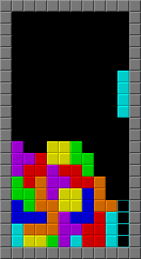
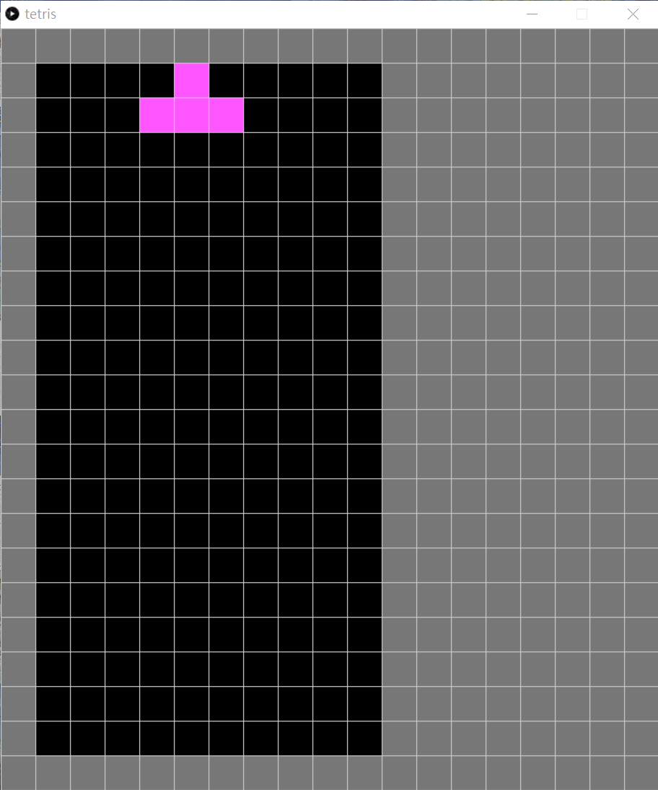
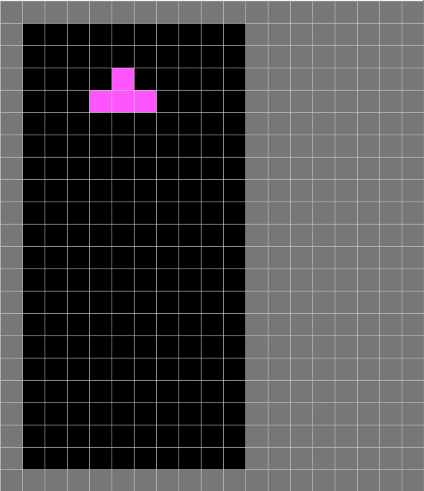

# 8. Tetris

> 《俄羅斯方塊》（俄語：Тетрис，英語：Tetris），是1980年末期至1990年代初期風靡全世界的電腦遊戲，是落下型益智遊戲的始祖，為蘇聯首個在美國發佈的娛樂軟件。此遊戲最初由阿列克謝·帕基特諾夫在蘇聯設計和編寫，於1984年6月6日首次發佈，當時他正在蘇聯科學院電算中心工作。此遊戲的名稱是由希臘語數字「四」的前綴「tetra-」（因所有落下方塊皆由四塊組成）和帕基特諾夫最喜歡的運動網球（「tennis」）拼接而成，華語地區則因遊戲為俄羅斯人發明普遍稱為「俄羅斯方塊」。



[TOC]

## 8.0 本章重點

1. 熟習class的用法
2. `frameRate()`外控制速度的方法

## 8.1 準備畫面和class `Spot`用來裝起所有格

```python
from spot import *
from gameBoard import *

gridSize = 40
gameBoard = 0

def setup():
    global gameBoard
    size(gridSize*(12+7), gridSize*22)  
    gameBoard = GameBoard(gridSize)
    
def draw():
    drawBackground()
    gameBoard.show()

def drawBackground():
    fill('#777777')
    for i in range(12+7):
        for j in range(22):
            rect(i*gridSize, j*gridSize, gridSize, gridSize)
```

```python
from spot import *

class GameBoard(object):
    
    def __init__(self, _gridSize):
        self.grids = []
        for x in range(10):
            tempGrids = []
            for y in range(20):
                tempGrids.append(Spot(x, y, x*_gridSize+_gridSize, y*_gridSize+_gridSize, _gridSize, _gridSize))
            self.grids.append(tempGrids)
            
    def show(self):
        for x in range(10):
            for y in range(20):
                self.grids[x][y].show('#000000') 
```


```python
class Spot(object):
    def __init__(self, _i, _j, _x, _y, _w, _h):
        self.i = _i
        self.j = _j
        self.x = _x
        self.y = _y
        self.w = _w
        self.h = _h

    def show(self, _color):
        fill(_color)
        stroke(200)
        rect(self.x, self.y, self.w, self.h)
```

## 8.2 俄羅斯方塊的元素


```python
from spot import *

class GameBoard(object):
    
    def __init__(self, _gridSize):
        self.grids = []
        for x in range(10):
            tempGrids = []
            for y in range(20):
                tempGrids.append(Spot(x, y, x*_gridSize+_gridSize, y*_gridSize+_gridSize, _gridSize, _gridSize))
            self.grids.append(tempGrids)
            
    def show(self):
        for x in range(10):
            for y in range(20):
                self.grids[x][y].show() 
```

```python
class Spot(object):
    def __init__(self, _i, _j, _x, _y, _w, _h):
        self.i = _i
        self.j = _j
        self.x = _x
        self.y = _y
        self.w = _w
        self.h = _h
        self.name = ''

    def show(self):
        if self.name == '':
            fill(0)
        elif self.name == 'T':
            fill('#FF55FF')
        elif self.name == 'L':
            fill('#C4A484')
        elif self.name == 'J':
            fill('#5555FF')
        elif self.name == 'I':
            fill('#52BAA2')
        elif self.name == 'Z':
            fill('#FF5555')
        elif self.name == 'S':
            fill('#55FF55')
        elif self.name == 'O':
            fill('#FFFF55')
        stroke(200)
        rect(self.x, self.y, self.w, self.h)
```

## 8.3 新增鄰居

```python
from spot import *
from gameBoard import *

gridSize = 40
gameBoard = 0

def setup():
    global gameBoard
    size(gridSize*(12+7), gridSize*22)  
    gameBoard = GameBoard(gridSize)
    gameBoard.addNeighbors()
    gameBoard.grids[5][8].name = 'L'
    println(gameBoard.grids[5][8].neighbors)
    gameBoard.grids[5][8].neighbors[0].name = 'J'
    gameBoard.grids[5][8].neighbors[1].name = 'S'
    gameBoard.grids[5][8].neighbors[2].name = 'Z'
    gameBoard.grids[5][8].neighbors[3].name = 'O'
    
def draw():
    drawBackground()
    gameBoard.show()

def drawBackground():
    fill('#777777')
    for i in range(12+7):
        for j in range(22):
            rect(i*gridSize, j*gridSize, gridSize, gridSize)
```

```python
class Spot(object):
    def __init__(self, _i, _j, _x, _y, _w, _h):
        self.i = _i
        self.j = _j
        self.x = _x
        self.y = _y
        self.w = _w
        self.h = _h
        self.name = ''
        self.neighbors = []
        for i in range(4):
            self.neighbors.append('')

    def show(self):
        if self.name == '':
            fill(0)
        elif self.name == 'T':
            fill('#FF55FF')
        elif self.name == 'L':
            fill('#C4A484')
        elif self.name == 'J':
            fill('#5555FF')
        elif self.name == 'I':
            fill('#52BAA2')
        elif self.name == 'Z':
            fill('#FF5555')
        elif self.name == 'S':
            fill('#55FF55')
        elif self.name == 'O':
            fill('#FFFF55')
        stroke(200)
        rect(self.x, self.y, self.w, self.h)

    def addNeighbors(self, _grid):
        if self.j > 0:
            self.neighbors[0] = _grid[self.i][self.j-1]  #UP
        if self.i < 9:
            self.neighbors[1] = _grid[self.i+1][self.j]  #RIGHT
        if self.j < 19:
            self.neighbors[2] = _grid[self.i][self.j+1]  #DOWN
        if self.i > 0:
            self.neighbors[3] = _grid[self.i-1][self.j]  #LEFT
```

```python
from spot import *

class GameBoard(object):
    
    def __init__(self, _gridSize):
        self.grids = []
        for x in range(10):
            tempGrids = []
            for y in range(20):
                tempGrids.append(Spot(x, y, x*_gridSize+_gridSize, y*_gridSize+_gridSize, _gridSize, _gridSize))
            self.grids.append(tempGrids)

    def addNeighbors(self):
        for i in range(10):
            for j in range(20):
                self.grids[i][j].addNeighbors(self.grids)

    def show(self):
        for x in range(10):
            for y in range(20):
                self.grids[x][y].show() 
```

## 8.4 新增Tetromino Block


```python
from spot import *
from gameBoard import *

gridSize = 40

gameBoard = 0

def setup():
    global gameBoard
    size(gridSize*(12+7), gridSize*22)  
    gameBoard = GameBoard(gridSize)
    gameBoard.addNeighbors()

def draw():
    drawBackground()
    gameBoard.update()
    gameBoard.show()

def drawBackground():
    fill('#777777')
    for i in range(12+7):
        for j in range(22):
            rect(i*gridSize, j*gridSize, gridSize, gridSize)
```

```python
from spot import *
from block import *

class GameBoard(object):  
    def __init__(self, _gridSize):
        self.grids = []
        self.block = Block(3,0,'T', self.grids)
        for x in range(10):
            tempGrids = []
            for y in range(20):
                tempGrids.append(Spot(x, y, x*_gridSize+_gridSize, y*_gridSize+_gridSize, _gridSize, _gridSize))
            self.grids.append(tempGrids)

    def addNeighbors(self):
        for i in range(10):
            for j in range(20):
                self.grids[i][j].addNeighbors(self.grids)

    def show(self):
        self.block.show()
        for x in range(10):
            for y in range(20):
                self.grids[x][y].show()
```

```python
class Spot(object):
    def __init__(self, _i, _j, _x, _y, _w, _h):
        self.i = _i
        self.j = _j
        self.x = _x
        self.y = _y
        self.w = _w
        self.h = _h
        self.name = ''
        self.neighbors = []
        for i in range(4):
            self.neighbors.append('')

    def show(self):
        if self.name == '':
            fill(0)
        elif self.name == 'T':
            fill('#FF55FF')
        elif self.name == 'L':
            fill('#DD6800')
        elif self.name == 'J':
            fill('#004ADD')
        elif self.name == 'I':
            fill('#0DCCCC')
        elif self.name == 'Z':
            fill('#FF5555')
        elif self.name == 'S':
            fill('#00DD26')
        elif self.name == 'O':
            fill('#DDDD00')
        stroke(200)
        rect(self.x, self.y, self.w, self.h)

    def addNeighbors(self, _grid):
        if self.j > 0:
            self.neighbors[0] = _grid[self.i][self.j-1]  #UP
        if self.i < 9:
            self.neighbors[1] = _grid[self.i+1][self.j]  #RIGHT
        if self.j < 19:
            self.neighbors[2] = _grid[self.i][self.j+1]  #DOWN
        if self.i > 0:
            self.neighbors[3] = _grid[self.i-1][self.j]  #LEFT
```

```python
from spot import *

class Block(object):

    shapeIndex = ['I', 'Z', 'S', 'J', 'L', 'T', 'O']

    # Shapes of the blocks
    shapes = [
        [[1, 5, 9, 13], [4, 5, 6, 7]], #type 'I'
        [[4, 5, 9, 10], [2, 6, 5, 9]], #type 'Z'
        [[6, 7, 9, 10], [1, 5, 6, 10]], #type 'S'
        [[1, 2, 5, 9], [0, 4, 5, 6], [1, 5, 9, 8], [4, 5, 6, 10]], #type 'J'
        [[1, 2, 6, 10], [5, 6, 7, 9], [2, 6, 10, 11], [3, 5, 6, 7]], #type 'L'
        [[1, 4, 5, 6], [1, 4, 5, 9], [4, 5, 6, 9], [1, 5, 6, 9]], #type 'T'
        [[1, 2, 5, 6]], #type 'O'
    ]

    def __init__(self, _x, _y, _type, _grid):
        self.x = _x
        self.y = _y
        self.type = _type
        self.grid = _grid

        self.rotation = 0
        self.index = self.shapeIndex.index(self.type)
    
    def shape(self):
        return self.shapes[self.index][self.rotation]

    def rotate(self):
        self.rotation = (self.rotation + 1) % len(self.shapes[self.index])

    def show(self):
        for i in range(4):
            for j in range(4):
                _index = i*4+j
                if _index in self.shape():
                    self.grid[self.x+j][self.y+i].name = self.type
```



##8.5 令Tetromino Block向下

```python
from spot import *
from gameBoard import *

gridSize = 40

gameBoard = 0

def setup():
    global gameBoard, timer
    size(gridSize*(12+7), gridSize*22)  
    gameBoard = GameBoard(gridSize)
    gameBoard.addNeighbors()

def draw():
    drawBackground()
    gameBoard.update()
    gameBoard.show()

def drawBackground():
    fill('#777777')
    for i in range(12+7):
        for j in range(22):
            rect(i*gridSize, j*gridSize, gridSize, gridSize)

```

```python
from spot import *
from block import *

class GameBoard(object):
    
    def __init__(self, _gridSize):
        self.grids = []
        self.block = Block(3,0,'T', self.grids)
        for x in range(10):
            tempGrids = []
            for y in range(20):
                tempGrids.append(Spot(x, y, x*_gridSize+_gridSize, y*_gridSize+_gridSize, _gridSize, _gridSize))
            self.grids.append(tempGrids)
        self.timer = millis()

    def addNeighbors(self):
        for i in range(10):
            for j in range(20):
                self.grids[i][j].addNeighbors(self.grids)

    def update(self):
        if millis() - self.timer > 200:
            self.timer = millis()
            self.clearGrid()
            self.block.goDown()
            if self.block.isWall():
                self.block.setLock()

    def show(self):
        self.block.setType()
        for x in range(10):
            for y in range(20):
                self.grids[x][y].show()

    def clearGrid(self):
         for x in range(10):
            for y in range(20):
                if self.grids[x][y].isLock == False:
                    self.grids[x][y].name = ''
```

```python
class Spot(object):
    def __init__(self, _i, _j, _x, _y, _w, _h):
        self.i = _i
        self.j = _j
        self.x = _x
        self.y = _y
        self.w = _w
        self.h = _h
        self.name = ''
        self.isLock = False
        self.neighbors = []
        for i in range(4):
            self.neighbors.append('')

    def show(self):
        if self.name == '':
            fill(0)
        elif self.name == 'T':
            fill('#FF55FF')
        elif self.name == 'L':
            fill('#DD6800')
        elif self.name == 'J':
            fill('#004ADD')
        elif self.name == 'I':
            fill('#0DCCCC')
        elif self.name == 'Z':
            fill('#FF5555')
        elif self.name == 'S':
            fill('#00DD26')
        elif self.name == 'O':
            fill('#DDDD00')
        stroke(200)
        rect(self.x, self.y, self.w, self.h)

    def addNeighbors(self, _grid):
        if self.j > 0:
            self.neighbors[0] = _grid[self.i][self.j-1]  #UP
        if self.i < 9:
            self.neighbors[1] = _grid[self.i+1][self.j]  #RIGHT
        if self.j < 19:
            self.neighbors[2] = _grid[self.i][self.j+1]  #DOWN
        if self.i > 0:
            self.neighbors[3] = _grid[self.i-1][self.j]  #LEFT
```

```python
from spot import *

class Block(object):

    shapeIndex = ['I', 'Z', 'S', 'J', 'L', 'T', 'O']

    # Shapes of the blocks
    shapes = [
        [[1, 5, 9, 13], [4, 5, 6, 7]], #type 'I'
        [[4, 5, 9, 10], [2, 6, 5, 9]], #type 'Z'
        [[6, 7, 9, 10], [1, 5, 6, 10]], #type 'S'
        [[1, 2, 5, 9], [0, 4, 5, 6], [1, 5, 9, 8], [4, 5, 6, 10]], #type 'J'
        [[1, 2, 6, 10], [5, 6, 7, 9], [2, 6, 10, 11], [3, 5, 6, 7]], #type 'L'
        [[1, 4, 5, 6], [1, 4, 5, 9], [4, 5, 6, 9], [1, 5, 6, 9]], #type 'T'
        [[1, 2, 5, 6]], #type 'O'
    ]

    def __init__(self, _x, _y, _type, _grid):
        self.x = _x
        self.y = _y
        self.type = _type
        self.grid = _grid

        self.rotation = 0
        self.index = self.shapeIndex.index(self.type)
    
    def shape(self):
        return self.shapes[self.index][self.rotation]

    def rotate(self):
        self.rotation = (self.rotation + 1) % len(self.shapes[self.index])

    def setType(self):
        for i in range(4):
            for j in range(4):
                _index = i*4+j
                if _index in self.shape():
                    self.grid[self.x+j][self.y+i].name = self.type

    def isWall(self):
        isWall = False
        for i in range(4):
            for j in range(4):
                _index = i*4+j
                if _index in self.shape():
                    if i+self.y>=19 or self.x+j>=9 or self.x+j<=0:
                        isWall = True
        return isWall

    def isBlocked(self, _direction):
        isBlocked = False
        for i in range(4):
            for j in range(4):
                _index = i*4+j
                if _index in self.shape():
                    if self.grid[self.x+j][self.y+i].neighbors[_direction].isLock == True:
                        isBlocked = True
        return isBlocked

    def setLock(self):
        for i in range(4):
            for j in range(4):
                _index = i*4+j
                if _index in self.shape():
                    self.grid[self.x+j][self.y+i].isLock = True

    def goDown(self):
        if not self.isWall() and not self.isBlocked(2):
            self.y += 1
```



##8.6 令Tetromino Block懂得堆疊

```python
from spot import *
from block import *

class GameBoard(object):
    
    def __init__(self, _gridSize):
        self.grids = []
        self.block = Block(3,0,'T', self.grids)
        for x in range(10):
            tempGrids = []
            for y in range(20):
                tempGrids.append(Spot(x, y, x*_gridSize+_gridSize, y*_gridSize+_gridSize, _gridSize, _gridSize))
            self.grids.append(tempGrids)
        self.timer = millis()

    def addNeighbors(self):
        for i in range(10):
            for j in range(20):
                self.grids[i][j].addNeighbors(self.grids)

    def update(self):
        if millis() - self.timer > 200:
            self.timer = millis()
            self.clearGrid()
            self.block.goDown()
            
            if self.block.isWall() or self.block.isBlocked(2):
                self.block.setType()
                self.block.setLock()
                self.block = Block(3,0,'T', self.grids)
            
    def show(self):
        self.block.setType()
        for x in range(10):
            for y in range(20):
                self.grids[x][y].show()

    def clearGrid(self):
        for x in range(10):
            for y in range(20):
                if self.grids[x][y].isLock == False:
                    self.grids[x][y].name = ''
```

