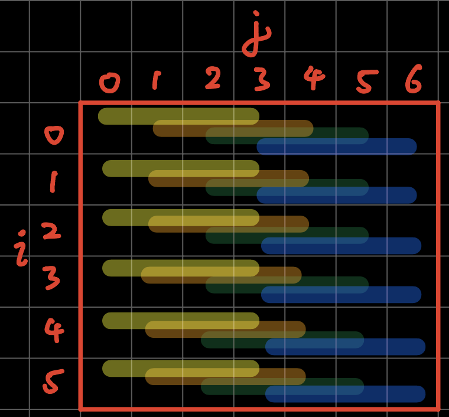

#9. Connect 4 (1974)

> 屏風式四子棋（Connect Four），簡稱四子棋，是Howard Wexler在1974年推出的連棋類遊戲。


[TOC]

## 9.0 本章重點

1. 怎樣用演算法去製這一個會捉棋的AI。

##9.1 建立spot class, gameBoard class和遊戲畫面

`connectFour.pyde`:

```python
from spot import *
from gameBoard import *

gameBoard = 0

def setup():
    global grids, gameBoard

    size(700, 600)
    ellipseMode(CENTER)
    frameRate(10)

    gameBoard = GameBoard()

def draw():
    background(200)
    gameBoard.display()
```

`gameBoard.py`:

```python
from spot import *

class GameBoard(object):
    def __init__(self ): 
        self.grids = []
        for i in range(6):
            temp = []
            for j in range(7):
                temp.append(Spot(i, j, width/7*(j+.5),height/6*(i+.5), ''))
            self.grids.append(temp)
        
    def display(self):
        for i in range(6):
            for j in range(7):
                self.grids[i][j].display()
```

`spot.py`:

```python
class Spot(object):
    def __init__(self, _i, _j, _x, _y, _value):
        self.i = _i
        self.j = _j
        self.x = _x
        self.y = _y
        self.value = ''

    def display(self):
        stroke('#000000')
        strokeWeight(2)
        fill(self.matchColor(self.value))
        ellipse(self.x, self.y, 80, 80)

    def matchColor(self, _value):
        if _value == '':
            return '#FFFFFF'
        elif _value == 'R':
            return '#FF5641'
        elif _value == 'Y':
            return '#FFDF37' 
```


跟之前的俄羅斯方塊一樣，我們用一個叫`GameBoard`的class來裝起整個遊戲。之後要寫人工智能去跟玩家遊玩的話會容易後多。

```python
class Spot(object):
    def __init__(self, _i, _j, _x, _y, _value):
        self.i = _i
        self.j = _j
        self.x = _x
        self.y = _y
        self.value = ''
```

在`Spot`這個class中，`i`和`j`是用來紀錄畫面的col和row的，而`x`和`y`則是其座標，方便直接顯示；而`value`則是用來紀錄其內容，沒有填入任任何顏色時就是`''`，填入黃色和紅色的話則分別是`Y`和`R`，用字符去紀錄。

## 9.2 加入mouse操控

`connect.pyde`:

```python
from spot import *
from gameBoard import *

gameBoard = 0


def setup():
    global grids, gameBoard

    size(700, 600)
    ellipseMode(CENTER)
    frameRate(10)

    gameBoard = GameBoard()


def draw():
    background(200)
    gameBoard.display()


def mousePressed():
    global gameBoard
    for i in range(7):
        if (mouseX > width/7*i and mouseX < width/7*(i+1)):
            if gameBoard.colHeight[i] < 6:
                gameBoard.colHeight[i] += 1
                gameBoard.currentCol = i
                gameBoard.currentRow = 0     
  
    print(gameBoard.colHeight)
```

`gameBoard.py`:

```python
from spot import *


class GameBoard(object):

    def __init__(self):
        self.grids = []
        for i in range(6):
            temp = []
            for j in range(7):
                temp.append(Spot(i, j, width/7*(j+.5), height/6*(i+.5), ''))
            self.grids.append(temp)

        self.currentRow = 0
        self.currnetCol = 0
        self.colHeight = [0, 0, 0, 0, 0, 0, 0]

    def display(self):
        for i in range(6):
            for j in range(7):
                self.grids[i][j].display()
```

**<u>`spot.py`沒有改變。</u>**


首先在`gameBoard`中，

```python
class GameBoard(object):
    def __init__(self):
        #===============other codes==============
        self.currentRow = 0
        self.currnetCol = 0
        self.colHeight = [0, 0, 0, 0, 0, 0, 0]
```

加入3個變數，`currnetCol`為用來紀錄之後選擇要入棋的欄，而`currentRow`是用來紀錄該疊高到哪一個格，`colHeight`則用來紀錄每一欄的高度，每填一粒棋的話該行的高度就加一。


在主程式中，

```python
def mousePressed():
    global gameBoard
    for i in range(7):
        if (mouseX > width/7*i and mouseX < width/7*(i+1)):
            if gameBoard.colHeight[i] < 6:
                gameBoard.colHeight[i] += 1
                gameBoard.currentCol = i
                gameBoard.currentRow = 0     
  
    print(gameBoard.colHeight)
```

加入一個滑鼠函數，如果滑鼠在相對應的位置按下按鍵，則將`currentCol`設為`i`，即你按下的欄數，`currentRow`暫時設定為`0`，而`colHeight`則將相對應的欄加1。之後print `colHeight`出來debug。

## 9.3 測試落子

`connectFour.pyde`:

```python
from spot import *
from gameBoard import *

gameBoard = 0


def setup():
    global grids, gameBoard

    size(700, 600)
    ellipseMode(CENTER)
    frameRate(10)

    gameBoard = GameBoard()


def draw():
    background(200)
    gameBoard.display()


def mousePressed():
    global gameBoard
    for i in range(7):
        if (mouseX > width/7*i and mouseX < width/7*(i+1)):
            gameBoard.trigger(i)
```

`gameBoard.py`:

```python
from spot import *


class GameBoard(object):

    def __init__(self):
        self.grids = []
        for i in range(6):
            temp = []
            for j in range(7):
                temp.append(Spot(i, j, width/7*(j+.5), height/6*(i+.5), ''))
            self.grids.append(temp)

        self.currentRow = 0
        self.currentCol = 0
        self.colHeight = [0, 0, 0, 0, 0, 0, 0]
        self.currentPlayer = 'R'

    def display(self):
        for i in range(6):
            for j in range(7):
                self.grids[i][j].display()

    def swapPlayer(self):
        if self.currentPlayer == 'R':
            self.currentPlayer = 'Y'
        elif self.currentPlayer == 'Y':
            self.currentPlayer = 'R'

    def trigger(self, i):
        if self.colHeight[i] < 6:
                self.colHeight[i] += 1
                self.currentCol = i
                self.currentRow = 6 - self.colHeight[i]
                self.grids[self.currentRow][self.currentCol].value = self.currentPlayer
                self.swapPlayer()
```

**<u>`spot.py`沒有改變。</u>**


在主程式中，

```python
def mousePressed():
    global gameBoard
    for i in range(7):
        if (mouseX > width/7*i and mouseX < width/7*(i+1)):
            gameBoard.trigger(i)
```

將原本直接測試`colHeight`是否能夠相加堆疊的功能，轉成一個`gameBoard` class的函數，方便之後跟電腦對玩時電腦操作。


在`gameBoard.py`中，先看看最下面的`trigger()`函數，

```python
def trigger(self, i):
    if self.colHeight[i] < 6:
        self.colHeight[i] += 1
        self.currentCol = i
        self.currentRow = 6 - self.colHeight[i]
        self.grids[self.currentRow][self.currentCol].value = self.currentPlayer
        self.swapPlayer()
```

承上面主程式的`gameBoard.trigger()`，在這個class中，開一個叫`trigger()`的函數，就是落棋落在哪一欄。如果該欄未滿(`if self.colHeight[i] < 6:`)，就將該欄的高度`self.colHeight[i]`加一，`currentCol`指定在這一行，`currentRow`直接指定為`6-colHeight[i]`，即該欄堆疊的高度，之後就將該個格填成`currentPlayer`，這個變數只有`R`和`Y`兩個值，用來紀錄現在的回合是哪個顏色，最後就用`swapPlayer()`交換顏色。


```python
def swapPlayer(self):
    if self.currentPlayer == 'R':
        self.currentPlayer = 'Y'
    elif self.currentPlayer == 'Y':
        self.currentPlayer = 'R'
```

而上面的`swapPlayer()`函數，則是用來交換`R`和`Y`兩個值。


最後記得在最上面的`__init()__`中，加入`self.currentPlayer = 'R'`紅子先下棋。原本我的設計中，是有動畫做落子動作，模擬現實情況棋子會一步一步落下的，但為簡潔起見，這次的遊戲重點並不在此，就不做這個功能了，如果你有與趣做到一步一步落棋的效果，可以參考上一章[tetris遊戲](../8/content_8.html)。

## 9.4 檢查是否勝出

`connectFour.pyde`:

```python
from spot import *
from gameBoard import *

gameBoard = 0


def setup():
    global grids, gameBoard

    size(700, 600)
    ellipseMode(CENTER)
    frameRate(10)

    gameBoard = GameBoard()


def draw():
    background(200)
    gameBoard.display()
   

def mousePressed():
    global gameBoard
    for i in range(7):
        if (mouseX > width/7*i and mouseX < width/7*(i+1)):
            gameBoard.trigger(i)
            winner = gameBoard.checkWin()
            print(winner)
```

`gameBoard.py`:

```python
from spot import *


class GameBoard(object):

    def __init__(self):
        self.grids = []
        for i in range(6):
            temp = []
            for j in range(7):
                temp.append(Spot(i, j, width/7*(j+.5), height/6*(i+.5), ''))
            self.grids.append(temp)

        self.currentRow = 0
        self.currentCol = 0
        self.colHeight = [0, 0, 0, 0, 0, 0, 0]
        self.currentPlayer = 'R'

    def display(self):
        for i in range(6):
            for j in range(7):
                self.grids[i][j].display()

    def swapPlayer(self):
        if self.currentPlayer == 'R':
            self.currentPlayer = 'Y'
        elif self.currentPlayer == 'Y':
            self.currentPlayer = 'R'

    def trigger(self, i):
        if self.colHeight[i] < 6:
            self.colHeight[i] += 1
            self.currentCol = i
            self.currentRow = 6 - self.colHeight[i]
            self.grids[self.currentRow][self.currentCol].value = self.currentPlayer
            self.swapPlayer()

    def checkWin(self):
        gs = self.grids

        # check horizontal
        for i in range(6):
            for j in range(4):
                if gs[i][j].value == gs[i][j+1].value == gs[i][j+2].value == gs[i][j+3].value\
                        and gs[i][j].value != '':
                    return gs[i][j].value

        # check vertical
        for i in range(3):
            for j in range(7):
                if gs[i][j].value == gs[i+1][j].value == gs[i+2][j].value == gs[i+3][j].value\
                        and gs[i][j].value != '':
                    return gs[i][j].value

        # check right cross
        for i in range(3):
            for j in range(4):
                if gs[i][j].value == gs[i+1][j+1].value == gs[i+2][j+2].value == gs[i+3][j+3].value\
                        and gs[i][j].value != '':
                    return gs[i][j].value

        # check left cross
        for i in range(3):
            for j in range(3, 7):
                if gs[i][j].value == gs[i+1][j-1].value == gs[i+2][j-2].value == gs[i+3][j-3].value\
                        and gs[i][j].value != '':
                    return gs[i][j].value
```

**<u>`spot.py`沒有改變。</u>**


先看看`gameBoard.py`的class，主要是在最下方加入了`checkWin()`的函數，這部分我直接用圖片去說明：



```python
# check horizontal
for i in range(6):
    for j in range(4):
        if gs[i][j].value == gs[i][j+1].value == gs[i][j+2].value == gs[i][j+3].value\
                and gs[i][j].value != '':
            return gs[i][j].value
```

如圖所示，我們首先檢查打橫是否有四個連續一樣，但又不是`''`空內容的格，由於打橫只有7欄，我們又連續檢查到`j+3`(即當格後的第4格)，所以`j`只需要`for j in range(4)`，例如上圖藍色的檢查條，只由`j=3`出發，去到`j=6`。


```python
# check vertical
for i in range(3):
    for j in range(7):
        if gs[i][j].value == gs[i+1][j].value == gs[i+2][j].value == gs[i+3][j].value\
                and gs[i][j].value != '':
            return gs[i][j].value
```

同理，最後藍色的檢查條只有`i=2`到`i=5`，所以i只需要`for i in range(3)`就夠了。


```python
# check right cross
for i in range(3):
    for j in range(4):
        if gs[i][j].value == gs[i+1][j+1].value == gs[i+2][j+2].value == gs[i+3][j+3].value\
                and gs[i][j].value != '':
            return gs[i][j].value
```


```python
# check left cross
for i in range(3):
    for j in range(3, 7):
        if gs[i][j].value == gs[i+1][j-1].value == gs[i+2][j-2].value == gs[i+3][j-3].value\
                and gs[i][j].value != '':
            return gs[i][j].value
```

其他我就不再冗述了。當然，我做我方法是分開4次for loop，分別檢查打橫、打直和兩個打斜。你也可以只用一個for loop，同時檢查4個分向。又或者，栱子是由最底部開始堆疊的，所以由最下方檢查到最上方，會比較快找出贏家，減少運算時間。

## 9.5 加入game over和you win

`connectFour.pyde`:

```python
from spot import *
from gameBoard import *

gameBoard = 0


def setup():
    global grids, gameBoard

    size(700, 600)
    ellipseMode(CENTER)
    frameRate(10)

    gameBoard = GameBoard()


def draw():
    background(200)
    gameBoard.display()
   

def mousePressed():
    global gameBoard
    for i in range(7):
        if (mouseX > width/7*i and mouseX < width/7*(i+1)):
            gameBoard.trigger(i)
```

`gameBoard.py`:

```python
from spot import *


class GameBoard(object):

    def __init__(self):
        self.grids = []
        for i in range(6):
            temp = []
            for j in range(7):
                temp.append(Spot(i, j, width/7*(j+.5), height/6*(i+.5), ''))
            self.grids.append(temp)

        self.currentRow = 0
        self.currentCol = 0
        self.colHeight = [0, 0, 0, 0, 0, 0, 0]
        self.currentPlayer = 'R'
        self.gameOver = False
        self.winner = None

	def display(self):
        for i in range(6):
                for j in range(7):
                    self.grids[i][j].display()
        if self.gameOver == True:            
            textAlign(CENTER, CENTER)
            textSize(100)
            fill('#0000FF')
            if self.winner == 'R':
                text('YOU WIN!!!!', width/2, height/2)
            elif self.winner == 'Y':
                text('GAME OVER', width/2, height/2)
            

    def swapPlayer(self):
        if self.currentPlayer == 'R':
            self.currentPlayer = 'Y'
        elif self.currentPlayer == 'Y':
            self.currentPlayer = 'R'

    def trigger(self, i):
        if self.gameOver == False:
            if self.colHeight[i] < 6:
                self.colHeight[i] += 1
                self.currentCol = i
                self.currentRow = 6 - self.colHeight[i]
                self.grids[self.currentRow][self.currentCol].value = self.currentPlayer
                self.winner = self.checkWin()
                if self.winner != None:
                    self.gameOver = True
                    return
                self.swapPlayer()

    def checkWin(self):
        gs = self.grids

        # check horizontal
        for i in range(6):
            for j in range(4):
                if gs[i][j].value == gs[i][j+1].value == gs[i][j+2].value == gs[i][j+3].value\
                        and gs[i][j].value != '':
                    return gs[i][j].value

        # check vertical
        for i in range(3):
            for j in range(7):
                if gs[i][j].value == gs[i+1][j].value == gs[i+2][j].value == gs[i+3][j].value\
                        and gs[i][j].value != '':
                    return gs[i][j].value

        # check right cross
        for i in range(3):
            for j in range(4):
                if gs[i][j].value == gs[i+1][j+1].value == gs[i+2][j+2].value == gs[i+3][j+3].value\
                        and gs[i][j].value != '':
                    return gs[i][j].value

        # check left cross
        for i in range(3):
            for j in range(3, 7):
                if gs[i][j].value == gs[i+1][j-1].value == gs[i+2][j-2].value == gs[i+3][j-3].value\
                        and gs[i][j].value != '':
                    return gs[i][j].value
```

**<u>`spot.py`沒有改變。</u>**


主要改變都是在`gameBoard`的class，但先說明一下主程式：

```python
def mousePressed():
    global gameBoard
    for i in range(7):
        if (mouseX > width/7*i and mouseX < width/7*(i+1)):
            gameBoard.trigger(i)
```

將原本`            winner = gameBoard.checkWin()`和`print(winner)`都刪除，一會兒`gameBoard`的class中，因我們要紀錄誰是贏家做出對應的反應。


在`gameBoard.py`中，

```python
 def __init__(self):
    #====other codes======
    self.currentPlayer = 'R'
    self.gameOver = False
    self.winner = None
```

在初始化的最下，加入`gameOver`和`winner`兩個變數。


```python
def display(self):
    for i in range(6):
            for j in range(7):
                self.grids[i][j].display()
    if self.gameOver == True:            
        textAlign(CENTER, CENTER)
        textSize(100)
        fill('#0000FF')
        if self.winner == 'R':
            text('YOU WIN!!!!', width/2, height/2)
        elif self.winner == 'Y':
            text('GAME OVER', width/2, height/2)
```

在顯示函數中，加入，如果`gameOver`的話，就看看`winner`是誰，是`R`的話即我方贏，如`Y`的話即電腦贏。


```python
def trigger(self, i):
    if self.gameOver == False:
        if self.colHeight[i] < 6:
            self.colHeight[i] += 1
            self.currentCol = i
            self.currentRow = 6 - self.colHeight[i]
            self.grids[self.currentRow][self.currentCol].value = self.currentPlayer
            self.winner = self.checkWin()
            if self.winner != None:
                self.gameOver = True
                return
            self.swapPlayer()
```

下棋的函數中，首先要加入一個限制，只有在`self.gameOver == False`的情況下才會下棋。其次，將原本在主程式的`self.winner = self.checkWin()`搬過來，同時保留`winner`變數，如果`winner`有內容的話，就將`gameOver`變成`True`。


到這裡，今次的遊戲，手動版就暫時作結，因遊戲規則和畫面都十分簡單，而且為聚焦於遊戲本身，我也刻意地減少了動畫效果和美化。下一節會首先介紹一下遊戲AI的演算法，之後就會教大家用minmax演算法製造一個AI跟玩家對奕。
