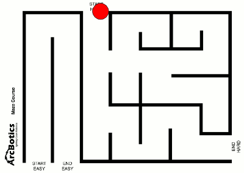
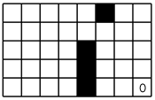

#Appendix 1 Artificial Intelligence

[TOC]

## 1.1 Introduction

### A Brief History of Artificial Intelligence

<iframe  height="315" src="https://www.youtube.com/embed/056v4OxKwlI" title="YouTube video player" frameborder="0" allow="accelerometer; autoplay; clipboard-write; encrypted-media; gyroscope; picture-in-picture" allowfullscreen></iframe>

### What's intelligent about artificial intelligence?

<iframe height="315" src="https://www.youtube.com/embed/xR6j9TLZdAw" title="YouTube video player" frameborder="0" allow="accelerometer; autoplay; clipboard-write; encrypted-media; gyroscope; picture-in-picture" allowfullscreen></iframe>

## 1.2 Why Neural Networks can learn (almost) anything

<iframe height="315" src="https://www.youtube.com/embed/0QczhVg5HaI" title="YouTube video player" frameborder="0" allow="accelerometer; autoplay; clipboard-write; encrypted-media; gyroscope; picture-in-picture" allowfullscreen></iframe>

### Neural Network is not prefect

## 1.3 How Neural Network work?

###A Neural Network Playground

https://playground.tensorflow.org/

### Teachable Machine

https://teachablemachine.withgoogle.com/

##1.4 Neuro Evolution of Augmenting Topologies (NEAT)

<iframe  height="315" src="https://www.youtube.com/embed/qv6UVOQ0F44" title="YouTube video player" frameborder="0" allow="accelerometer; autoplay; clipboard-write; encrypted-media; gyroscope; picture-in-picture" allowfullscreen></iframe>

<iframe height="315" src="https://www.youtube.com/embed/WSW-5m8lRMs" title="YouTube video player" frameborder="0" allow="accelerometer; autoplay; clipboard-write; encrypted-media; gyroscope; picture-in-picture" allowfullscreen></iframe>

