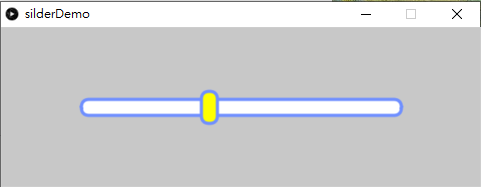
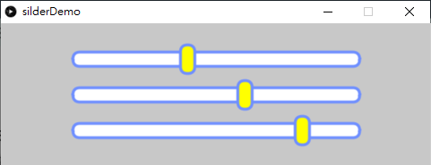

# GUI: Slider

跟按鍵一樣，另一個常用的用戶介面為滑動標示。這個滑動會比按鍵稍為複雜，但學好之後就很易理解。



[toc]

##1. 不使用class

```python
#create a silder demo using processing.py

bWidth = bHeight = 0	#bar width and height
bXpos = bYpos = 0 #bar x and y position
sPos = 0 #slider position
sPosMin = SPosMax = 0 #slider position min and max
isOver = False #is mouse over slider
ratio = 0 #ratio of slider position to bar width

sliderMinValue = 0 #slider min value
sliderMaxValue = 100 #slider max value
sliderValue = 40 #slider value

def setup():
	global bXpos, bYpos, bWidth, bHeight, sPosMin, sPosMax, sPos
	size(600,200)
	rectMode(CENTER)
	bXpos = width/2
	bYpos = height/2
	bWidth = 400
	bHeight = 20
	sPosMin = bXpos - bWidth/2
	sPosMax = bXpos + bWidth/2
	sPos = map(sliderValue,sliderMinValue,sliderMaxValue,sPosMin,sPosMax)

def draw():
	background(200)

	#draw the slider
	fill(255)
	stroke('#6F8FFF')
	strokeWeight(4)
	rect(bXpos,bYpos,bWidth,bHeight,10,10,10,10)
	#draw the slider button
	if isOver:
		fill('#AAAA00')
	else:
		fill('#FFFF00')
	rect(sPos,bYpos,20,40,10,10,10,10)


def mousePressed():
	global isOver, ratio, sliderValue
	if (mouseX > sPos-10 and mouseX < sPos+10 and mouseY > bYpos-20 and mouseY < bYpos+20):
		isOver = True
	else:
		isOver = False

def mouseDragged():
	global isOver, sliderValue, sPos
	if isOver:
		if mouseX > sPosMin and mouseX < sPosMax:
			sPos = mouseX
			sliderValue = map(sPos,sPosMin,sPosMax,sliderMinValue,sliderMaxValue)

		#snap to the min or max value
		if mouseX < sPosMin:
			sliderValue = sliderMinValue
			sPos = map(sliderValue,sliderMinValue,sliderMaxValue,sPosMin,sPosMax)
		if mouseX > sPosMax:
			sliderValue = sliderMaxValue
			sPos = map(sliderValue,sliderMinValue,sliderMaxValue,sPosMin,sPosMax)
		
		print(sliderValue)

def mouseReleased():
	global isOver
	isOver = False
```

## 2. 使用class



```python
# create a silder demo using processing.py

# create a class for the slider
class Slider:
    def __init__(self, minValue, maxValue, initialValue):
        self.minValue = minValue  # minimum value of the slider
        self.maxValue = maxValue  # maximum value of the slider
        self.value = initialValue 	# current value of the slider
        self.bWidth = self.bHeight = 0  # width and height of the slider bar
        self.bXpos = self.bYpos = 0  # x and y position of the slider bar
        self.sPos = 0  # x position of the slider button
        self.sPosMin = self.sPosMax = 0  # min and max x position of the slider button
        self.isOver = False  # is the mouse over the slider button?

    def setSize(self, _bXpos, _bYpos, _bWidth, _bHeight): #set the size of the slider
        self.bXpos = _bXpos
        self.bYpos = _bYpos
        self.bWidth = _bWidth
        self.bHeight = _bHeight
        
        self.sPosMin = self.bXpos - self.bWidth / 2 #set the min and max x position of the slider button
        self.sPosMax = self.bXpos + self.bWidth / 2
        self.sPos = map(self.value, self.minValue,
                        self.maxValue, self.sPosMin, self.sPosMax) #set the x position of the slider button

    def show(self):
        fill(255)
        stroke('#6F8FFF')
        strokeWeight(4)
        rect(self.bXpos, self.bYpos, self.bWidth, self.bHeight, 10, 10, 10, 10)
        if self.isOver:
            fill('#AAAA00')
        else:
            fill('#FFFF00')
        rect(self.sPos, self.bYpos, 20, 40, 10, 10, 10, 10)

    def mousePressed(self):
        if (mouseX > self.sPos - 10 and mouseX < self.sPos + 10 and
            mouseY > self.bYpos - 20 and mouseY < self.bYpos + 20):
            self.isOver = True
        else:
            self.isOver = False

    def mouseDragged(self):
        if self.isOver:
            if mouseX > self.sPosMin and mouseX < self.sPosMax:
                self.sPos = mouseX
                self.value = map(self.sPos, self.sPosMin,
                                 self.sPosMax, self.minValue, self.maxValue)

			# snap the slider button to the min or max position if the mouse is out of the slider bar
            if mouseX < self.sPosMin:
                self.value = self.minValue
                self.sPos = map(self.value, self.minValue,
                                self.maxValue, self.sPosMin, self.sPosMax)

            if mouseX > self.sPosMax:
                self.value = self.maxValue
                self.sPos = map(self.value, self.minValue,
                                self.maxValue, self.sPosMin, self.sPosMax)

            print(self.value)

    def mouseReleased(self):
        self.isOver = False

# main program=======================================================
slider1 = Slider(0, 100, 40)
slider2 = Slider(0, 100, 60)
slider3 = Slider(0, 100, 80)


def setup():
    size(600, 200)
    rectMode(CENTER)
    slider1.setSize(width/2, height/2-height/4, 400, 20)
    slider2.setSize(width/2, height/2, 400, 20)
    slider3.setSize(width/2, height/2+height/4, 400, 20)


def draw():
    background(200)
    slider1.show()
    slider2.show()
    slider3.show()


def mousePressed():
    slider1.mousePressed()
    slider2.mousePressed()
    slider3.mousePressed()


def mouseDragged():
    slider1.mouseDragged()
    slider2.mouseDragged()
    slider3.mouseDragged()


def mouseReleased():
    slider1.mouseReleased()
    slider2.mouseReleased()
    slider3.mouseReleased()
```

