# Asteroids

> 《爆破彗星》（英語：Asteroids）是Atari公司在1979年發行的一個大型電玩遊戲。它是大型電玩黃金年代裏其中一個最受歡迎及具影響力的遊戲。《爆破彗星》使用向量圖形與二維視角。玩家需要操控一架太空飛行器去避開及以子彈摧毀飛來飛去的彗星。

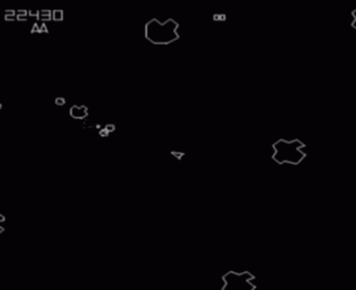

[toc]

##0. 本章重點

1. 熟習class的用法
2. 明白object入面可以指向另一個object
3. `pushMatrix()` ，`popMatrix()`， `translate()`和 `rotate()`的用法
4. Processing mode怎樣分頁

## 1. 製作飛船

```PYTHON
rocket = 0

def setup():
    global rocket
    size(800,800)
    rocket = Rocket()

def draw():
    background(50)
    rocket.show()
    
class Rocket(object):

    def __init__(self):
        self.pos =  PVector(width/2, height/2)
        self.vec =  PVector(0,0)
        self.accel =  PVector(0,-1)
        self.heading = 0

    def show(self):
        scale = 10
        pushMatrix()
        translate(self.pos.x, self.pos.y)
        rotate(radians(self.heading))
        beginShape()
     	vertex(0  *scale , 0    *scale)
        vertex(1  *scale , 0.6  *scale)
        vertex(0  *scale , -3   *scale)
        vertex(-1 *scale , 0.6  *scale)
        endShape()
        popMatrix()
```

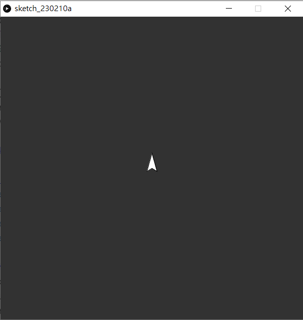

開一個新的`class`，名字為`Rocket`，這艘飛船有自己的位置，速度和加速度，所以分別開3個`PVector`，`pos`, `vec`和`accel`，另外飛船有一個指向，就是船頭的方向，名叫`heading`。
```python
def show(self):
    scale = 10
    pushMatrix()
    translate(self.pos.x, self.pos.y)
    rotate(radians(self.heading))
    beginShape()
  	vertex(0  *scale , 0    *scale)
    vertex(1  *scale , 0.6  *scale)
    vertex(0  *scale , -3   *scale)
    vertex(-1 *scale , 0.6  *scale)
    endShape()
    popMatrix()
```

在class `Rocket`中，`pushMatrix()`和`popMatrix()`是用來告訴程式，兩者之間的所有`translate()`和`rotate()`都是暫時的。Python Mode for Processing在繪圖圖形時，有兩種方法，一是直接指定在某座標點繪圖某圖形，好處是簡單直覺，但如果好像今次般，除了基本的偏移(translate)外，還要加上旋轉角度的話，計算座標就會十分麻煩，涉及到旋轉矩陣，所以今次我們用`translate()`和`rotate()`的方法，將整個座標系統的原點改變，再用`vertex()`繪劃火箭形將的箭頭。

## 2. 為每個class開一個獨立分頁

`asteroids.pyde`:

```python
from rocket import *

rocket = 0

def setup():
    global rocket
    size(800,800)
    rocket = Rocket()

def draw():
    background(50)
    rocket.show()
```

`rocket.py`:

```python
class Rocket(object):

    def __init__(self):
        self.pos =  PVector(width/2, height/2)
        self.vec =  PVector(0,0)
        self.accel =  PVector(0,-1)
        self.heading = 0

    def show(self):
        scale = 10
        pushMatrix()
        translate(self.pos.x, self.pos.y)
        rotate(radians(self.heading))
        beginShape()
        vertex(0  *scale , 0    *scale)
        vertex(1  *scale , 0.6  *scale)
        vertex(0  *scale , -3   *scale)
        vertex(-1 *scale , 0.6  *scale)
        endShape()
        popMatrix()
```

<div align='center'>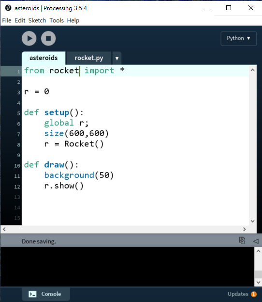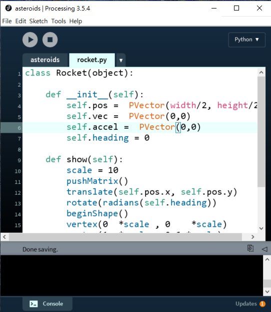</div>

為方便管理整個程式，一般工程師都會習慣將相關的內容放在同一個分頁，每個分頁通常都不會太長。

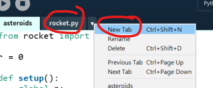

按下`New Tab`，或用`Ctrl+Shift+N`開一個分頁名叫rocket.py，將原本`Rocket`這個class的所有內容都剪下貼到這個分頁。==(注意⚠⚠⚠⚠⚠: `rocket.py`的名字不能完全與`Rocket`這個class相同，我是大小字不同的，否則會有error)==

之後在主頁面最上加上一句`from rocket import *`，這裡的`rocket`是小寫的，即代表著`rocket.py` 這個檔案。

## 3. 令火箭懂得旋轉

`asteroids.pyde`:

```python
from rocket import *

rocket = 0

def setup():
    global rocket;
    size(800,800)
    rocket = Rocket()

def draw():
    background(50)

    if (keyPressed and key == CODED):
        if (keyCode == LEFT):
            rocket.rotateRocket(-5)
        if (keyCode == RIGHT):
            rocket.rotateRocket(5)

    rocket.show()
```

`rocket.py`:

```python
class Rocket(object):

    def __init__(self):
        self.pos =  PVector(width/2, height/2)
        self.vec =  PVector(0,0)
        self.accel =  PVector(0,-1)
        self.heading = 0   #unit in degrees

    def show(self):
        scale = 10
        pushMatrix()
        translate(self.pos.x, self.pos.y)
        rotate(radians(self.heading))
        beginShape()
        vertex(0  *scale , 0    *scale)
        vertex(1  *scale , 0.6  *scale)
        vertex(0  *scale , -3   *scale)
        vertex(-1 *scale , 0.6  *scale)
        endShape()
        popMatrix()

    def rotateRocket(self, angle):
       self.heading += angle
       self.accel.rotate(radians(angle))
```
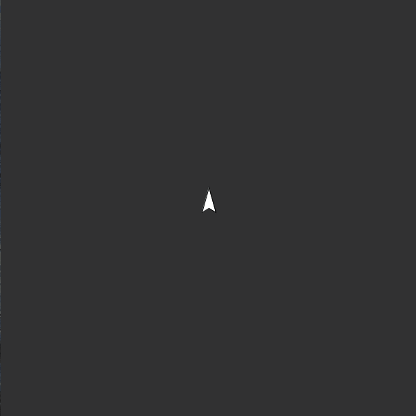

```python
def rotateRocket(self, angle):
    self.heading += angle
    self.accel.rotate(radians(angle))
```

在`rocket.py`中，加入`rotateRocket(self, angle)`的函數，每次當玩家按下左方向鍵或右方向鍵時，就將`heading`(即船指著的方向)累加，而同時也要將加速度`accel`的向量旋轉。

```PYthon
def draw():
    background(50)

    if (keyPressed and key == CODED):
        if (keyCode == LEFT):
            rocket.rotateRocket(-5)
        if (keyCode == RIGHT):
            rocket.rotateRocket(5)

    rocket.show()
```

返回主頁，在`draw()`中，加入按下方向鍵的控制項。`keyPressed()`可以作為一個外置的event，當按下按鍵時先中斷主程式執行再返回，或者作為一個`boolean`變數，當用家按下按鍵時就會變為`True`，而這時就可以讀取鍵盤的內容。由於方向鍵並非像一般字母般係輕易表達，所以processing中將四個方向鍵(`UP`, `DOWN`, `LEFT`, `RIGHT`)，還有`ALT`, `CONTROL`, `SHIFT`都列入特別類型`keyCode`。

## 4. 為火箭加上推進

`asteroids.pyde`:

```python
from rocket import *

rocket = 0

def setup():
    global rocket;
    size(800,800)
    frameRate(60)
    rocket = Rocket()

def draw():
    background(50)
    
    if (keyPressed and key == CODED):
        if (keyCode == LEFT):
            rocket.rotateRocket(-5)
        if (keyCode == RIGHT):
            rocket.rotateRocket(5)
        if (keyCode == UP):
            rocket.propulsion()
    else:
        rocket.isPropulsion = False

    rocket.update()
    rocket.show()
```

`rocket.py`:

```python
class Rocket(object):

    def __init__(self):
        self.pos =  PVector(width/2, height/2)
        self.vec =  PVector(0,0)
        self.accel =  PVector(0,-1)
        self.heading = 0   #unit in degrees
        self.isPropulsion = False

    def show(self):
        if self.isPropulsion == True:
            fill('#FF0000')
        else:
            fill('#FFFFFF')
        scale = 10
        pushMatrix()
        translate(self.pos.x, self.pos.y)
        rotate(radians(self.heading))
        beginShape()
       	vertex(0  *scale , 0    *scale)
        vertex(1  *scale , 0.6  *scale)
        vertex(0  *scale , -3   *scale)
        vertex(-1 *scale , 0.6  *scale)
        endShape()
        popMatrix()

    def rotateRocket(self, angle):
       self.heading += angle
       self.accel.rotate(radians(angle))

    def propulsion(self):
        self.isPropulsion = True
        self.accel.setMag(0.1)
        self.vec = PVector.add(self.vec, self.accel)
        self.vec.limit(6)
    
	def update(self):
        if self.isPropulsion == False:
            self.vec = PVector.mult(self.vec, 0.99)

        self.pos = PVector.add(self.pos, self.vec)
        if (self.pos.x > width):
            self.pos.x = 0
        if (self.pos.x < 0):
            self.pos.x = width
        if (self.pos.y > height):
            self.pos.y = 0
        if (self.pos.y < 0):
            self.pos.y = height    
```

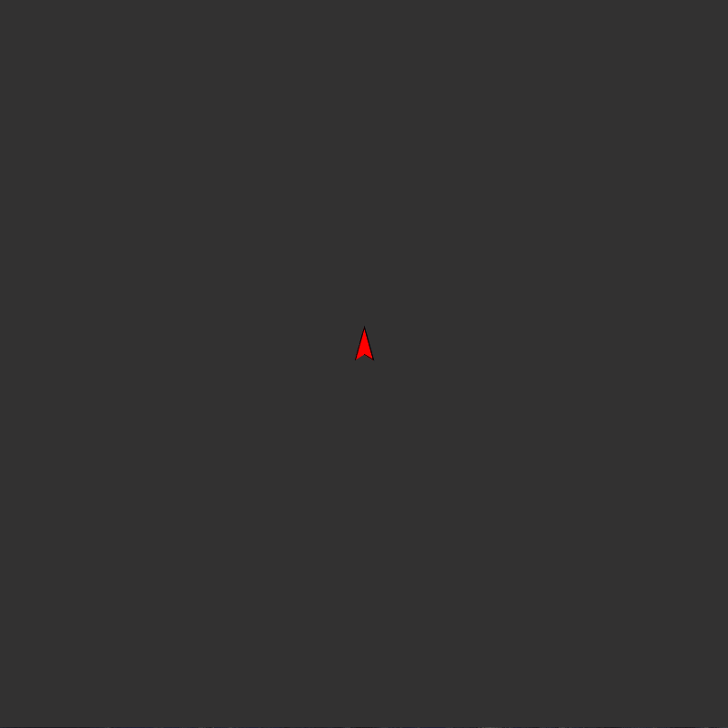

在`rocket.py`的`rocket `class中，加入`propulsion()`，就是推進的意思。這裡模擬在太空中，火箭要在尾部點火推進前進。

```python
def propulsion(self):
    self.isPropulsion = True
    self.accel.setMag(0.1)
    self.vec = PVector.add(self.vec, self.accel)
    self.vec.limit(6)
```

`self.accel.setMag(0.1)`就是將加速度向量的量設定為`0.1`，再將速度向量累加，但速度如果一直累加的話，太大很難控制，為顧及遊戲性，限制速度向量的量為`6`

```python
def update(self):
    if self.isPropulsion == False:
        self.vec = PVector.mult(self.vec, 0.99)

    self.pos = PVector.add(self.pos, self.vec)
    if (self.pos.x > width):
        self.pos.x = 0
    if (self.pos.x < 0):
        self.pos.x = width
    if (self.pos.y > height):
        self.pos.y = 0
    if (self.pos.y < 0):
        self.pos.y = height    
```

跟之前所有物理模擬一樣，我們為程式加入`update()`函數，每一個影格為其位置作更新。如果火箭超出了螢幕，就令火箭在另一邊出現。為增加遊戲可玩性，為火箭加入點阻力，令火箭不在推進的話就會慢下來。

```python
def show(self):
    if self.isPropulsion == True:
        fill('#FF0000')
    else:
        fill('#FFFFFF')
    scale = 10
    pushMatrix()
    translate(self.pos.x, self.pos.y)
    rotate(radians(self.heading))
    beginShape()
    vertex(0  *scale , 0    *scale)
    vertex(1  *scale , 0.6  *scale)
    vertex(0  *scale , -3   *scale)
    vertex(-1 *scale , 0.6  *scale)
    endShape()
    popMatrix()
```

在`rocket `class的`show()`中，加入顏色作推進識別。如果推進中的話，火箭就但是紅色，否則就會變回白色。

```python
def draw():
    background(50)
    
    if (keyPressed and key == CODED):
        if (keyCode == LEFT):
            rocket.rotateRocket(-5)
        if (keyCode == RIGHT):
            rocket.rotateRocket(5)
        if (keyCode == UP):
            rocket.propulsion()
    else:
        rocket.isPropulsion = False

    rocket.update()
    rocket.show()
```

返回主頁的`draw()`中，在方向鍵中加入上方向鍵`UP`，當按下時火箭就會向前推進。在`show()`前記得要先`update()`。

## 5. 加入子彈

`asteroids.pyde`:

```python
from rocket import *
from bullet import *

rocket = 0
bullets = []

def setup():
    global rocket;
    size(800,800)
    frameRate(60)
    rocket = Rocket()
    bullets = []

def draw():
    background(50)
    
    if (keyPressed and key == CODED):
        if (keyCode == LEFT):
            rocket.rotateRocket(-5)
        if (keyCode == RIGHT):
            rocket.rotateRocket(5)
        if (keyCode == UP):
            rocket.propulsion() 
    else:
        rocket.isPropulsion = False

    rocket.update()
    rocket.show()

    for b in bullets:
        b.update()
        b.show()
        if (b.pos.x > width or b.pos.x < 0 or b.pos.y > height or b.pos.y <0):
            bullets.remove(b)

def keyPressed():
    if (key == ' '):
        bullets.append(Bullet(rocket.pos, rocket.accel))
```

`rocket.py`

```python
class Rocket(object):

    def __init__(self):
        self.pos =  PVector(width/2, height/2)
        self.vec =  PVector(0,0)
        self.accel =  PVector(0,-1)
        self.heading = 0   #unit in degrees
        self.isPropulsion = False

    def show(self):
        if self.isPropulsion == True:
            fill('#FF0000')
        else:
            fill('#FFFFFF')
        scale = 10
        pushMatrix()
        translate(self.pos.x, self.pos.y)
        rotate(radians(self.heading))
        beginShape()
       	vertex(0  *scale , 0    *scale)
        vertex(1  *scale , 0.6  *scale)
        vertex(0  *scale , -3   *scale)
        vertex(-1 *scale , 0.6  *scale)
        endShape()
        popMatrix()

    def rotateRocket(self, angle):
       self.heading += angle
       self.accel.rotate(radians(angle))

    def propulsion(self):
        self.isPropulsion = True
        self.accel.setMag(0.1)
        self.vec = PVector.add(self.vec, self.accel)
        self.vec.limit(6)
    
    def update(self):
        if self.isPropulsion == False:
            self.vec = PVector.mult(self.vec, 0.99)

        self.pos = PVector.add(self.pos, self.vec)
        if (self.pos.x > width):
            self.pos.x = 0
        if (self.pos.x < 0):
            self.pos.x = width
        if (self.pos.y > height):
            self.pos.y = 0
        if (self.pos.y < 0):
            self.pos.y = height    
```

`bullet.py`

```python
class Bullet(object):

    def __init__(self, _pos, _vec):
        self.pos =  _pos
        self.vec =  _vec.copy().setMag(4)

    def update(self):
        self.pos = PVector.add(self.pos, self.vec)

    def show(self):
        fill('#FFFF00')
        ellipse(self.pos.x, self.pos.y, 5, 5)
```

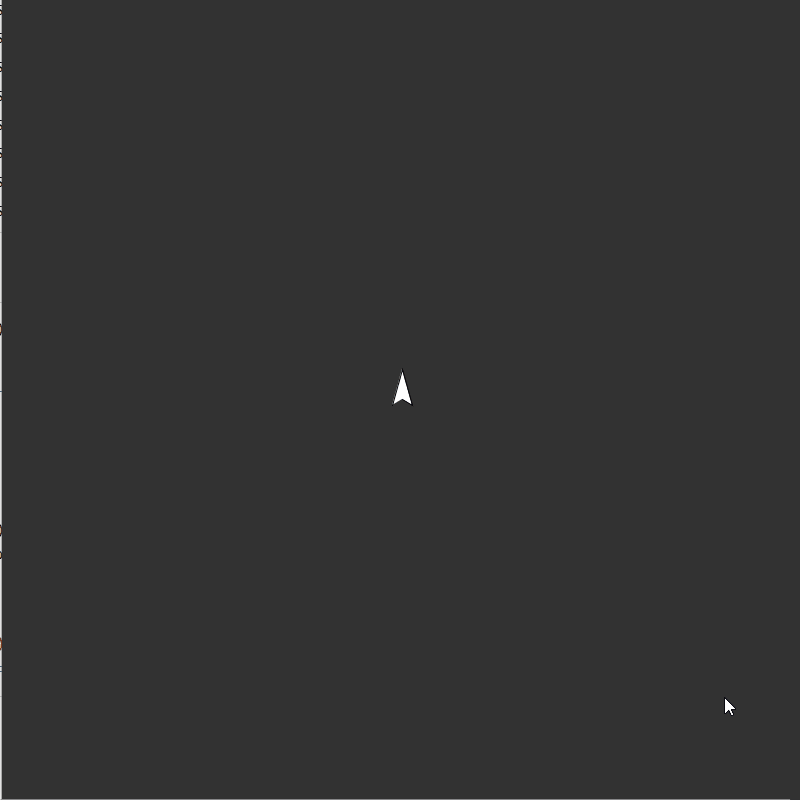

開一個新的分頁叫`bullet.py`，定義一個class叫做`Bullet`，用來管理有關子彈的變數和函數。

```python
class Bullet(object):

    def __init__(self, _pos, _vec):
        self.pos =  _pos
        self.vec =  _vec.copy().setMag(4)

    def update(self):
        self.pos = PVector.add(self.pos, self.vec)

    def show(self):
        fill('#FFFF00')
        ellipse(self.pos.x, self.pos.y, 5, 5)
```

子彈的速度要跟發射子彈時火箭的方向一致，但只需要知道方向就可以，我們固定它的速度為`4`，所以首先要用`self.vec =  _vec.copy().setMag(4)`將輸入的速度向量的長度設定成4個單位。

```python
from rocket import *
from bullet import *

rocket = 0
bullets = []
```

返回主頁，在最上面加入`bullet.py`分頁的內容，之後開一個空的陣列叫`bullets`用來裝起全部子彈。

```python
def keyPressed():
    if (key == ' '):
        bullets.append(Bullet(rocket.pos, rocket.accel))
```

在`setup()`和`draw()`之外，加入`keyPressed()`event，今次不在繼續在`draw()`中加入子彈，原因是`draw()`的更新率太快，按一下鍵就已經產生了十多發子彈。當按下空白鍵，就新增一顆子彈，子彈的位置就是火箭當前的位置，而子彈的速度，是火箭當前的指向，你可以用`heading`變數去指定子彈速度的方向，或直接使用火箭的加速度，這個加速度的方向應該是與heading一致的。

```python
for b in bullets:
	b.update()
    b.show()
    if (b.pos.x > width or b.pos.x < 0 or b.pos.y > height or b.pos.y <0):
    	bullets.remove(b)
```

在主程式最下加入，用來更新和顯示所有子彈，如果子彈超出了畫面，則將子彈從陣列中移除，以免佔用大量內存。

## 6. 加入隕石

`asteroids.pyde`:

```python
from rocket import *
from bullet import *
from rock import *

rocket = 0
bullets = []
rocks = []

def setup():
    global rocket, bullets, rocks;
    size(800,800)
    frameRate(60)
    rocket = Rocket()
    bullets = []
    rocks = []
    for i in range(3):
        rocks.append(Rock(3))
    for i in range(2):
        rocks.append(Rock(2))

def draw():
    background(50)
    
    if (keyPressed and key == CODED):
        if (keyCode == LEFT):
            rocket.rotateRocket(-5)
        if (keyCode == RIGHT):
            rocket.rotateRocket(5)
        if (keyCode == UP):
            rocket.propulsion() 
    else:
        rocket.isPropulsion = False

    rocket.update()
    rocket.show()

    for b in bullets:
        b.update()
        b.show()
        if (b.pos.x > width or b.pos.x < 0 or b.pos.y > height or b.pos.y <0):
            bullets.remove(b)
    
    for r in rocks:
        r.update()
        r.show()

def keyPressed():
    if (key == ' '):
        bullets.append(Bullet(rocket.pos, rocket.accel))
```

`rock.py`

```python
class Rock(object):

    def __init__(self, _level):
        self.pos =  PVector(random(0, width), random(0, height))
        self.vec =  PVector.random2D()
        self.level = _level
        self.angle = random(0, TWO_PI)

    def update(self):
        self.pos = PVector.add(self.pos, self.vec)
        if (self.pos.x > width):
            self.pos.x = 0
        if (self.pos.x < 0):
            self.pos.x = width
        if (self.pos.y > height):
            self.pos.y = 0
        if (self.pos.y < 0):
            self.pos.y = height   
        self.angle += 0.01

    def show(self):
        scale = pow(3, self.level)
        fill('#CBD3FF')
        pushMatrix()
        translate(self.pos.x, self.pos.y)
        rotate(self.angle)
        beginShape()
        vertex(-2  *scale,  scale *  -1)
        vertex(-.5 *scale,  scale *   0)
        vertex(-2  *scale,  scale *   1)
        vertex(-1  *scale,  scale *   2)
        vertex(1   *scale,  scale *   2)
        vertex(2   *scale,  scale *   0)
        vertex(1   *scale,  scale *  -2)
        vertex(-1  *scale,  scale *  -2)
        endShape()
        popMatrix()
```

*<u>`bullet.py` 和`rocket.py`沒有修改，就不貼出來了。</u>*

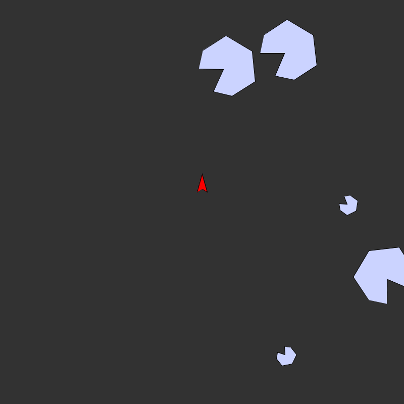

**加入一個叫`rock`的class**，本質上跟其他的class差不多，都是初始化時決定位置和速度，為了其顯示上多點動態，所以也加入了`angle`旋轉角度的變化。

比較特別的是`level`變數，由於原遊戲有幾款不同大小的隕石，當子彈打碎了大隕石後就會變成細隕石，所以要加入`level`變數，數字越大代表`size`越大。

返回主程式頁。

```python
from rocket import *
from bullet import *
from rock import *

rocket = 0
bullets = []
rocks = []
```

在最上匯入`rock.py`的內容，加入一個空的陣列名叫`rocks`。

```Pyhon
def setup():
    global rocket, bullets, rocks;
    size(800,800)
    frameRate(60)
    rocket = Rocket()
    bullets = []
    rocks = []
    for i in range(3):
        rocks.append(Rock(3))
    for i in range(2):
        rocks.append(Rock(2))
```

在`setup()`中，先清空`rocks`的內容變成空陣列，接著加入 3 顆level 3 大小和 2 顆 level 2 大小的隕石。

```python
for r in rocks:
	r.update()
	r.show()
```

在`draw()`的最後，更新和顯示全部隕石。

## 7. 讓子彈能擊碎隕石

`asteroids.pyde`:

```python
from rocket import *
from bullet import *
from rock import *

rocket = 0
bullets = []
rocks = []

def setup():
    global rocket, bullets, rocks;
    size(800,800)
    frameRate(60)
    rocket = Rocket()
    bullets = []
    rocks = []
    for i in range(3):
        rocks.append(Rock(3))
    for i in range(2):
        rocks.append(Rock(2))

def draw():
    background(50)
    
    if (keyPressed and key == CODED):
        if (keyCode == LEFT):
            rocket.rotateRocket(-5)
        if (keyCode == RIGHT):
            rocket.rotateRocket(5)
        if (keyCode == UP):
            rocket.propulsion() 
    else:
        rocket.isPropulsion = False

    rocket.update()
    rocket.show()

    for b in bullets:
        b.update()
        b.show()
        if (b.pos.x > width or b.pos.x < 0 or b.pos.y > height or b.pos.y <0):
            bullets.remove(b)
    
    for r in rocks:
        for b in bullets:
            if (PVector.dist(b.pos, r.pos) < pow(3, r.level)*2):
                if (r.level > 1):
                    for i in range(2):
                        temp = Rock(r.level-1)
                        temp.pos = r.pos
                        rocks.append(temp)
                bullets.remove(b)
                rocks.remove(r)
                break #跳出迴圈, 不用運算全部子彈
                
    for r in rocks:
        r.update()
        r.show()
    
def keyPressed():
    if (key == ' '):
        bullets.append(Bullet(rocket.pos, rocket.accel))
```

*<u>`bullet.py`、`rock.py` 和`rocket.py`沒有修改，就不貼出來了。</u>*

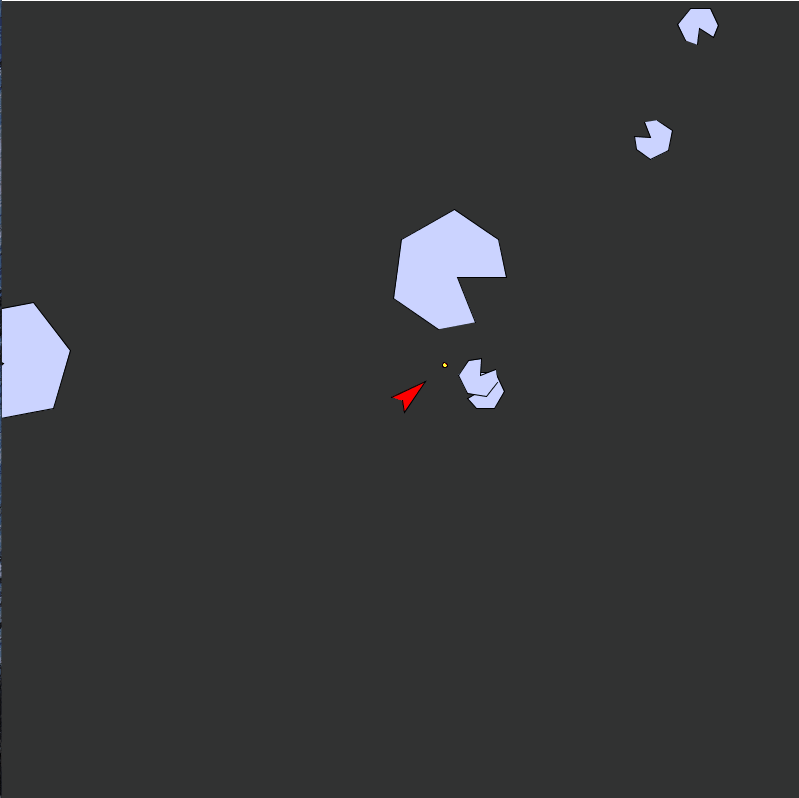

在主程式頁面的`draw()`中，加入每粒隕石對每發子彈的計算。

```python
for r in rocks:
	for b in bullets:
		if (PVector.dist(b.pos, r.pos) < pow(3, r.level)*2):
			if (r.level > 1):
				for i in range(2):
                    temp = Rock(r.level-1)
                    temp.pos = r.pos
                    rocks.append(temp)
                    bullets.remove(b)
                    rocks.remove(r)
                    break #跳出迴圈, 不用運算全部子彈
```

由於隕石的大小是以其基礎`vertex`座標再乘以系數$3^{level}$，而`vertex`座標的最大值為2，所以我簡單當成隕石是一個半徑為$2\times 3^{level}$的圓去計算，而子彈的直徑本身又很少，所以就忽略不計。

隕石每打碎一次後，就會分裂成兩顆細一個level的的小隕石，直到level 1的隕石被擊碎就不再分裂。所以每打中一次，就給一個`for i in range(2):`的for迴圈，`temp = Rock(r.level-1)`重新生成一顆size為`level-1`的隕石，`temp.pos = r.pos`指定`temp`隕石的位置為原本被打中的隕石位置，`rocks.append(temp)`新增到隕石陣列中，之後就將原本的這塊大隕石和子彈都移除。最後， `break`是跳出`for b in bullets:`的for迴圈，不用再計算餘下的子彈，可以直接計算下一塊隕石。

## 8. 加入敵方火箭

`asteroids.pyde`

```python
from rocket import *
from bullet import *
from rock import *

rocket = 0
bullets = []
rocks = []
enemy = 0
timer = 0
timer1 = 0

def setup():
    global rocket, bullets, rocks, enemy;
    size(800,800)
    frameRate(60)
    rocket = Rocket()
    bullets = []
    rocks = []
    enemy = Rocket()

    for i in range(3):
        rocks.append(Rock(3))
    for i in range(2):
        rocks.append(Rock(2))

def draw():
    global timer, timer1

    background(50)
    
    if (keyPressed and key == CODED):
        if (keyCode == LEFT):
            rocket.rotateRocket(-5)
        if (keyCode == RIGHT):
            rocket.rotateRocket(5)
        if (keyCode == UP):
            rocket.propulsion() 
    else:
        rocket.isPropulsion = False

    rocket.update()
    rocket.show()

    for b in bullets:
        b.update()
        b.show()
        if (b.pos.x > width or b.pos.x < 0 or b.pos.y > height or b.pos.y <0):
            bullets.remove(b)
    
    for r in rocks:
        for b in bullets:
            if (PVector.dist(b.pos, r.pos) < pow(3, r.level)*2):
                if (r.level > 1):
                    for i in range(2):
                        temp = Rock(r.level-1)
                        temp.pos = r.pos
                        rocks.append(temp)
                bullets.remove(b)
                rocks.remove(r)
                break #跳出迴圈, 不用運算全部子彈
        
    for r in rocks:
        r.update()
        r.show()
    
    enemy2rocketAngle = PVector.sub(rocket.pos, enemy.pos).heading()
    enemy.accel = PVector.fromAngle(enemy2rocketAngle).setMag(0.1)
    enemy.heading = degrees(enemy2rocketAngle)+90
    if (millis() - timer1 >= 150):
        enemy.propulsion()
        timer1 = millis()
    if (millis() - timer >= 500):
        bullets.append(Bullet(enemy.pos, enemy.accel))
        timer = millis()
    enemy.update()
    enemy.show()

def keyPressed():
    if (key == ' '):
        bullets.append(Bullet(rocket.pos, rocket.accel))
```
**<u>*其他版面沒有變，所以就不再貼出來。*</u>**

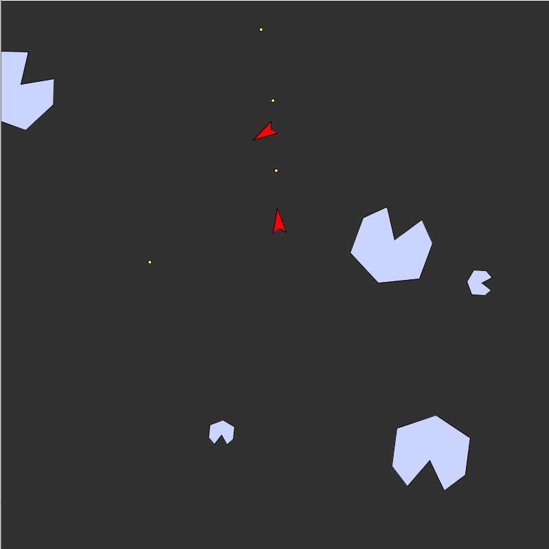

```python
rocket = 0
bullets = []
rocks = []
enemy = 0
timer = 0
timer1 = 0
```

在一開始的宣告區，加入`enemy`敵人的火箭，之後宣告多兩個時間的變數一會兒用。

```python
def setup():
    global rocket, bullets, rocks, enemy;
    size(800,800)
    frameRate(60)
    rocket = Rocket()
    bullets = []
    rocks = []
    enemy = Rocket()

    for i in range(3):
        rocks.append(Rock(3))
    for i in range(2):
        rocks.append(Rock(2))
```

在`setup()`中宣告enemy，記得要先將`enemy`變成宣告成`global`。

```python
enemy2rocketAngle = PVector.sub(rocket.pos, enemy.pos).heading()
enemy.accel = PVector.fromAngle(enemy2rocketAngle).setMag(0.1)
enemy.heading = degrees(enemy2rocketAngle)+90
if (millis() - timer1 >= 150):
    enemy.propulsion()
    timer1 = millis()
if (millis() - timer >= 500):
    bullets.append(Bullet(enemy.pos, enemy.accel))
    timer = millis()
enemy.update()
enemy.show()
```

在`draw()`的最後，更新一下`enemy`的行為。首先，敵船永遠指著我方的火箭，用向量運算就十分簡單，只要將再個位置向量相減就是方向向量(由於processing中y軸是跟數學中的y軸正負極相反的，所以向量相減的次序跟數學是相反的)。

接著用`PVector.fromAngle(enemy2rocketAngle).setMag(0.1)`，用一個指定的角度建立一個新的向量，今次則是指定用剛剛找到的兩者間的角度來建立，並設定其值為`0.1`。

`enemy.heading = degrees(enemy2rocketAngle)+90`，`rocket `class的`heading`變數一直都是用degree來表達而非radian，單位小心不要錯，所以要先轉成degrees，再加90度的原因也是因為processing的角度計算，0度是指向天空(即一般數學的y軸方向)，但`PVector`中的角度卻跟數學一樣是由x軸計起的，所以要再加上90度。

```PYTHON
if (millis() - timer >= 500):
	//do somethings
	timer = millis()
```

是一個常見的用法，取代`delay()`等線式的延時方法，上述`500`即每500毫秒執行中間的命令一次。

最後就是更新和顯示。

## 9. 考考你

1. 遊戲到這個階段都沒有game over的。原遊戲的設定是有3條生命的，火箭被隕石或子彈打中後就會失去一條生命，你可以將火箭被打中或擊中後，將其位置放回畫面中間，速度歸零。
