# Minimax 演算法

[toc]

## 0. recursion 遞歸

Fibonacci sequence(費波那契數)是一個常見用來解釋recursion遞歸概念的數列。定義上，
$$
F_0 = 0 \newline F_1 = 1 \newline F_n = F_{n-1} + F_{n-2} (n \geqslant  2)
$$
用文字來說，就是斐波那契數列由0和1開始，之後的費波那契數就是由之前的兩數相加而得出。首幾個費波那契數是：

1、 1、 2、 3、 5、 8、 13、 21、 34、 55、 89、 144、 233、 377、 610、 987……

```PYTHON
def setup():
    for i in range(1,10):
        print(Fibonacci(i))
    exit()
    
def Fibonacci(n):
    if n == 0:
        return 0
    if n == 1:
        return 1
    if n >=2:
        return Fibonacci(n-1)+Fibonacci(n-2)
```

得出結果:

```
1
1
2
3
5
8
13
21
34
```

這個在函數之中call自己的方法叫做遞歸recursion，遞歸在程式中非常常用，但不一定時好方法。

以上述的斐波那契數列為例，

```PYTHON
def setup():
    timer = millis()
    print(Fibonacci(10))
    print(millis()-timer)
    exit()
```

計算$F_{10}$只需要4毫秒，但計算$F_{20}$，時間不是其2倍的8毫秒，而是51毫秒。這是因為，要計算$F_{20}$，就要先計算$F_{19}$和$F_{18}$，要計算$F_{19}$和$F_{18}$，又要先計算$F_{18}$，$F_{17}$和$F_{16}$，如此類推，其實有很多重覆了的計算，會令程式以幾何級的時間遞增。


## 1. 為遊戲加入打和

`connectFour_AI.pyde`:

```python
from spot import *
from gameBoard import *

gameBoard = 0

def setup():
    global grids, gameBoard

    size(700, 600)
    ellipseMode(CENTER)
    frameRate(10)
    gameBoard = GameBoard()

def draw():
    background(200)
    gameBoard.display() 

def mousePressed():
    global gameBoard
    for i in range(7):
        if (mouseX > width/7*i and mouseX < width/7*(i+1)):
            gameBoard.trigger(i)
```

`gameBoard.py`:
```python
from spot import *

class GameBoard(object):

    def __init__(self):
        self.grids = []
        for i in range(6):
            temp = []
            for j in range(7):
                temp.append(Spot(i, j, width/7*(j+.5), height/6*(i+.5), ''))
            self.grids.append(temp)
        self.currentRow = 0
        self.currentCol = 0
        self.colHeight = [0, 0, 0, 0, 0, 0, 0]
        self.currentPlayer = 'R'
        self.gameOver = False
        self.winner = None

    def display(self):
        for i in range(6):
                for j in range(7):
                    self.grids[i][j].display()
        if self.gameOver == True:            
            textAlign(CENTER, CENTER)
            textSize(100)
            fill('#0000FF')
            if self.winner == 'R':
                text('YOU WIN!!!!', width/2, height/2)
            elif self.winner == 'Y':
                text('GAME OVER', width/2, height/2)
            elif self.winner == 'O':
                text('TIE', width/2, height/2)
            
    def swapPlayer(self):
        if self.currentPlayer == 'R':
            self.currentPlayer = 'Y'
        elif self.currentPlayer == 'Y':
            self.currentPlayer = 'R'

    def trigger(self, i):
        if self.gameOver == False:
            if self.colHeight[i] < 6:
                self.colHeight[i] += 1
                self.currentCol = i
                self.currentRow = 6 - self.colHeight[i]
                self.grids[self.currentRow][self.currentCol].value = self.currentPlayer
                self.winner = self.checkWin()
                if self.winner != None:
                    self.gameOver = True
                    return
                self.swapPlayer()
                
    def checkWin(self):
        gs = self.grids

        # check horizontal
        for i in range(6):
            for j in range(4):
                if gs[i][j].value == gs[i][j+1].value == gs[i][j+2].value == gs[i][j+3].value\
                        and gs[i][j].value != '':
                    return gs[i][j].value

        # check vertical
        for i in range(3):
            for j in range(7):
                if gs[i][j].value == gs[i+1][j].value == gs[i+2][j].value == gs[i+3][j].value\
                        and gs[i][j].value != '':
                    return gs[i][j].value

        # check right cross
        for i in range(3):
            for j in range(4):
                if gs[i][j].value == gs[i+1][j+1].value == gs[i+2][j+2].value == gs[i+3][j+3].value\
                        and gs[i][j].value != '':
                    return gs[i][j].value

        # check left cross
        for i in range(3):
            for j in range(3, 7):
                if gs[i][j].value == gs[i+1][j-1].value == gs[i+2][j-2].value == gs[i+3][j-3].value\
                        and gs[i][j].value != '':
                    return gs[i][j].value
                
        # if all the grids are filled, the game is tie
        isAllNull = False
        for i in range(6):
            for j in range(7):
                isAllNull = isAllNull or gs[i][j].value == ''
        if isAllNull == False:
            return 'O'
```

`spot.py`:
```python
class Spot(object):
    def __init__(self, _i, _j, _x, _y, _value):
        self.i = _i
        self.j = _j
        self.x = _x
        self.y = _y
        self.value = ''

    def display(self):
        stroke('#000000')
        strokeWeight(2)
        fill(self.matchColor(self.value))
        ellipse(self.x, self.y, 80, 80)

    def matchColor(self, _value):
        if _value == '':
            return '#FFFFFF'
        elif _value == 'R':
            return '#FF5641'
        elif _value == 'Y':
            return '#FFDF37' 
```


首先在`gameBoard.py`的class中，

```python
 def checkWin(self):
        gs = self.grids
        #other cods
                
        # if all the grids are filled, the game is tie
        isAllNull = False
        for i in range(6):
            for j in range(7):
                isAllNull = isAllNull or gs[i][j].value == ''
        if isAllNull == False:
            return 'O'
```

在`checkWin()`的最後加入`isAllNull = False`，之後對每一個格都做`or`運算，只要其中一個格是沒有填的話，`isAllNull`都會變成`True`，只有在全部都填滿下，`isAllNull`才會運算完42次後都是`False`，如果是`False`的話，即全部格已滿，所以就是打和了。

```python
def display(self):
       #other cods
        if self.winner == 'R':
            text('YOU WIN!!!!', width/2, height/2)
        elif self.winner == 'Y':
            text('GAME OVER', width/2, height/2)
        elif self.winner == 'O':
            text('TIE', width/2, height/2)
```

之後同樣是在`gameBoard.py`中，如果`self.winner == 'O'`，即遊戲打和，則在顯示中加入打和。

## 2. 加入random AI跟玩家對玩

`connectFour_AI.pyde`:

```python
from spot import *
from gameBoard import *

gameBoard = 0


def setup():
    global grids, gameBoard

    size(700, 600)
    ellipseMode(CENTER)
    frameRate(10)

    gameBoard = GameBoard()


def draw():
    background(200)
    gameBoard.display()
   

def mousePressed():
    global gameBoard
    for i in range(7):
        if (mouseX > width/7*i and mouseX < width/7*(i+1)):
            gameBoard.trigger(i)
            if gameBoard.currentPlayer == 'Y':
                    gameBoard.brain.autoPlay()
```

`gameBoard.py`

```python
from spot import *
from AIBrain import *

class GameBoard(object):

    def __init__(self):
        self.grids = []
        for i in range(6):
            temp = []
            for j in range(7):
                temp.append(Spot(i, j, width/7*(j+.5), height/6*(i+.5), ''))
            self.grids.append(temp)

        self.currentRow = 0
        self.currentCol = 0
        self.colHeight = [0, 0, 0, 0, 0, 0, 0]
        self.currentPlayer = 'R'
        self.gameOver = False
        self.winner = None
        self.brain = aiBrain(self)

    def display(self):
        for i in range(6):
                for j in range(7):
                    self.grids[i][j].display()
        if self.gameOver == True:            
            textAlign(CENTER, CENTER)
            textSize(100)
            fill('#0000FF')
            if self.winner == 'R':
                text('YOU WIN!!!!', width/2, height/2)
            elif self.winner == 'Y':
                text('GAME OVER', width/2, height/2)
            elif self.winner == 'O':
                text('TIE', width/2, height/2)
            

    def swapPlayer(self):
        if self.currentPlayer == 'R':
            self.currentPlayer = 'Y'
        elif self.currentPlayer == 'Y':
            self.currentPlayer = 'R'

    def trigger(self, i):
        if self.gameOver == False:
            if self.colHeight[i] < 6:
                self.colHeight[i] += 1
                self.currentCol = i
                self.currentRow = 6 - self.colHeight[i]
                self.grids[self.currentRow][self.currentCol].value = self.currentPlayer
                self.winner = self.checkWin()
                if self.winner != None:
                    self.gameOver = True
                    return
                self.swapPlayer()
                

    def checkWin(self):
        gs = self.grids

        # check horizontal
        for i in range(6):
            for j in range(4):
                if gs[i][j].value == gs[i][j+1].value == gs[i][j+2].value == gs[i][j+3].value\
                        and gs[i][j].value != '':
                    return gs[i][j].value

        # check vertical
        for i in range(3):
            for j in range(7):
                if gs[i][j].value == gs[i+1][j].value == gs[i+2][j].value == gs[i+3][j].value\
                        and gs[i][j].value != '':
                    return gs[i][j].value

        # check right cross
        for i in range(3):
            for j in range(4):
                if gs[i][j].value == gs[i+1][j+1].value == gs[i+2][j+2].value == gs[i+3][j+3].value\
                        and gs[i][j].value != '':
                    return gs[i][j].value

        # check left cross
        for i in range(3):
            for j in range(3, 7):
                if gs[i][j].value == gs[i+1][j-1].value == gs[i+2][j-2].value == gs[i+3][j-3].value\
                        and gs[i][j].value != '':
                    return gs[i][j].value
                
        # if all the grids are filled, the game is tie
        isAllNull = False
        for i in range(6):
            for j in range(7):
                isAllNull = isAllNull or gs[i][j].value == ''
        if isAllNull == False:
            return 'O'
```

`AIBrain.py`:

```python
import copy
import random


class aiBrain(object):

    def __init__(self, _gameBoard):
        self.gameBoard = _gameBoard

    def autoPlay(self):
        bestScore = float('-inf')

        # fill the available colume to an list
        availableCol = []
        for j in range(7):
            if self.gameBoard.grids[0][j].value == '':
                availableCol.append(j)
        # shuffle the list
        random.shuffle(availableCol)

        for move in availableCol:
            score = self.minimax(self.gameBoard, 4, False)
            if (score > bestScore):
                bestScore = score
                bestMove = move
        self.gameBoard.trigger(bestMove)

    def minimax(self, _gameBoard, _depth, _isMaximizing):
        return 1
```


加入一個叫`AIBrain.py`的檔案，這個檔案一開始先做一點簡單的測試。在初始化時，匯入現有的`gameBoard`

```python
class aiBrain(object):

    def __init__(self, _gameBoard):
        self.gameBoard = _gameBoard
```

之後，

```python
 def autoPlay(self):
        bestScore = float('-inf')

        # //fill the available colume to an list
        availableCol = []
        for j in range(7):
            if self.gameBoard.grids[0][j].value == '':
                availableCol.append(j)
        # shuffle the list
        random.shuffle(availableCol)

        for move in availableCol:
            score = self.minimax(self.gameBoard, 4, False)
            if (score > bestScore):
                bestScore = score
                bestMove = move
        self.gameBoard.trigger(bestMove)

    def minimax(self, _gameBoard, _depth, _isMaximizing):
        return 1
```

我們要為下一步所有可能的步數去計分，才知那一個才對AI方最有利。

我們設定玩家方為正分，AI方為負分數，所以每一步越是負得多，即對AI方是最有利的。

一開始設定`bestScore = float('-inf')`，就是負無限大。

將一個叫`availableCol = []`去裝起所有可能的下一步，這7個欄之中，如果`if self.gameBoard.grids[0][j].value == '':`即最上一格為空，即可以填入，所以就將其`append`到`availableCol`。

下一步是`shuffle`即調亂整個列，如果分數是相同的話，則最後結果會有亂數，不會每次都是由左至右。

之後每一個可能的落祺步，都加入一個叫`minimax()`的演算法去幫這一步計分，分數最大的步就是最佳答案，於是我們便落子這一步。但現階段我們的`minimax()`演算法暫時甚麼都沒有，全部回傳的分數都是`1`，我們先試一試這個思路是否行得通。

## 3. 加入dummy AI

`AIBrain.py`:

```python
import copy
import random


class aiBrain(object):

    def __init__(self, _gameBoard):
        self.gameBoard = _gameBoard

    def autoPlay(self):
        bestScore = float('-inf')
        bestMove = random.randint(0, 5)  # the range is a, b+1

        # //fill the available colume to an list
        availableCol = []
        for j in range(7):
            if self.gameBoard.grids[0][j].value == '':
                availableCol.append(j)
        # shuffle the list
        random.shuffle(availableCol)

        for move in availableCol:
            possibleBoard = copy.deepcopy(self.gameBoard)
            possibleBoard.trigger(move)
            score = self.minimax(possibleBoard, 4, False)
            print(move, score)
            if (score > bestScore):
                bestScore = score
                bestMove = move
            print(bestMove)
        print('')
        self.gameBoard.trigger(bestMove)

    def score(self, _winner):
        if _winner == 'R':
            return 10
        elif _winner == 'Y':
            return -10
        elif _winner == 'O':
            return 0

    def minimax(self, _gameBoard, _depth, _isMaximizing):
        winner = _gameBoard.checkWin()
        if winner != None:
            return self.score(winner)
```

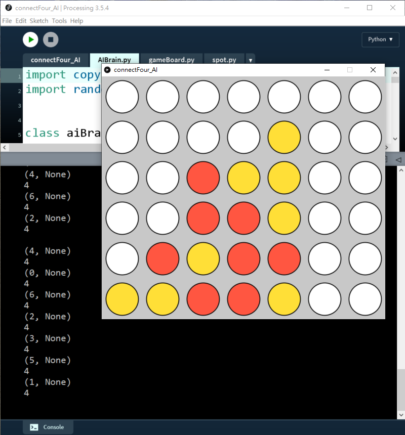


在`AIBrain.py`中，

```python
    for move in availableCol:
        possibleBoard = copy.deepcopy(self.gameBoard)
        possibleBoard.trigger(move)
        score = self.minimax(possibleBoard, 4, False)
        print(move, score)
        if (score > bestScore):
            bestScore = score
            bestMove = move
        print(bestMove)
    print('')
    self.gameBoard.trigger(bestMove)
```

我們用`copy.deepcopy()`去將整個gameboard複製。Python和其他高級語言一樣，如果只用`=`去複製一個class的話，只會複製其id，之後修改這個class的話，被複製的和複製後的class都會改變，所以要用`copy.deepcopy()`去將整個gameboard完全複製。

之後就將當前這一步落子到複製出來的`possibleBoard`，接著就將這個gameboard放到minimax演算法中提出最佳答案。

```python
    def minimax(self, _gameBoard, _depth, _isMaximizing):
        winner = _gameBoard.checkWin()
        if winner != None:
            return self.score(winner)
```

上一步我們的minimax演算法只會回傳`1`分出來，甚麼功能也沒有的。這一步我們幫輸入的gameboard檢查一下有否贏、輸或打和，分別根據這3個情況打分如下:

```python
    def score(self, _winner):
        if _winner == 'R':
            return 10
        elif _winner == 'Y':
            return -10
        elif _winner == 'O':
            return 0
```

贏出的話就打`10`分，輸就是`-10`分，打和就是`0`分。

由於設定了`bestScore`最開始時是負無限大，所以即使AI(黃色棋子)輸出的話是`-10`分，也依然大於負無限大，所以這個dummy AI都會落子，但只限於此。這個AI唯一的功能是如果下一步AI會贏，而玩家又沒有阻擋的話，AI就會懂得落子去贏出遊戲，但這個AI既不懂阻擋玩家，更不會佈局的。

## 4. 加入minimax演算法

```python
import copy
import random


class aiBrain(object):

    def __init__(self, _gameBoard):
        self.gameBoard = _gameBoard

    def autoPlay(self):
        bestScore = float('-inf')
        bestMove = random.randint(0, 5)  # the range is a, b+1

        # //fill the available colume to an list
        availableCol = []
        for j in range(7):
            if self.gameBoard.grids[0][j].value == '':
                availableCol.append(j)
        # shuffle the list
        random.shuffle(availableCol)

        for move in availableCol:
            possibleBoard = copy.deepcopy(self.gameBoard)
            possibleBoard.trigger(move)
            score = self.minimax(possibleBoard, 1, False)
            print(move, score)
            if (score > bestScore):
                bestScore = score
                bestMove = move
            print(bestMove)
        print('')
        self.gameBoard.trigger(bestMove)

    def score(self, _winner):
        if _winner == 'R':
            return 10
        elif _winner == 'Y':
            return -10
        elif _winner == 'O':
            return 0

    def minimax(self, _gameBoard, _depth, _isMaximizing):
        winner = _gameBoard.checkWin()
        if winner != None or _depth == 0:
            return self.score(winner)

        if _isMaximizing:
            bestScore = float('-inf')
            # //fill the available colume to an list
            availableCol = []
            for j in range(7):
                if _gameBoard.grids[0][j].value == '':
                    availableCol.append(j)
            # shuffle the list
            random.shuffle(availableCol)

            for move in availableCol:
                possibleBoard = copy.deepcopy(_gameBoard)
                possibleBoard.trigger(move)
                score = self.minimax(possibleBoard, _depth - 1, False)
                bestScore = max(score, bestScore)
            return bestScore

        else:
            bestScore = float('inf')
            # //fill the available colume to an list
            availableCol = []
            for j in range(7):
                if _gameBoard.grids[0][j].value == '':
                    availableCol.append(j)
            # shuffle the list
            random.shuffle(availableCol)

            for move in availableCol:
                possibleBoard = copy.deepcopy(_gameBoard)
                possibleBoard.trigger(move)
                score = self.minimax(possibleBoard, _depth - 1, True)
                bestScore = min(score, bestScore)
            return bestScore
```

測試`depth = 1`:

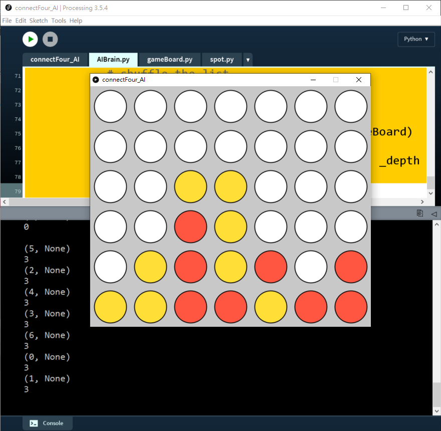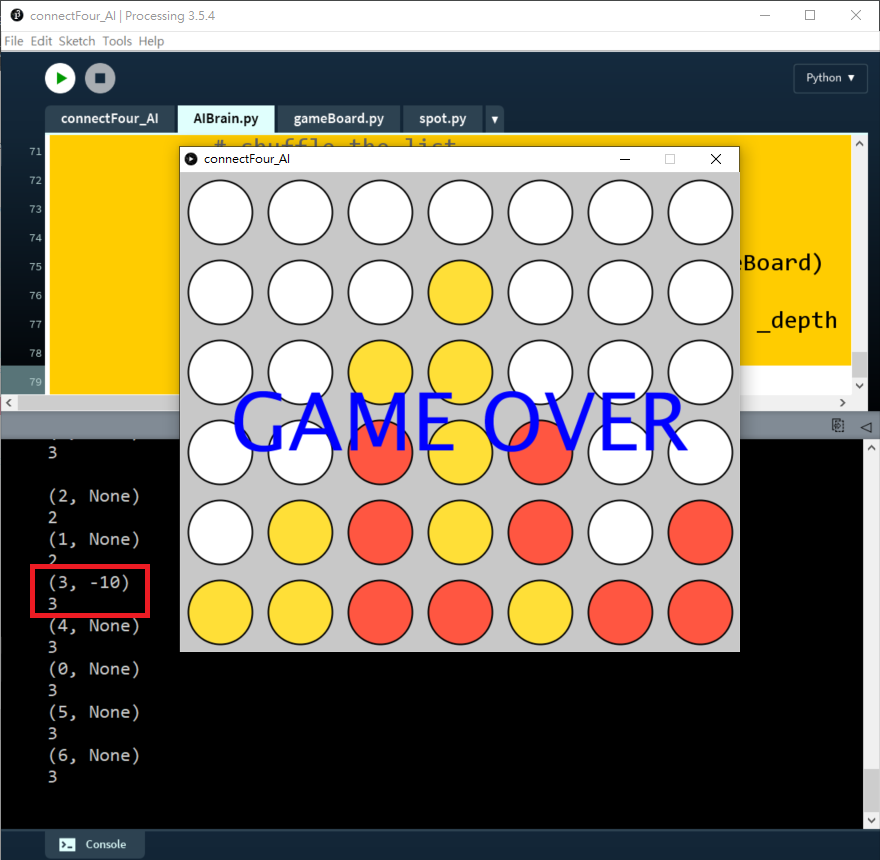

測試`depth = 2`:

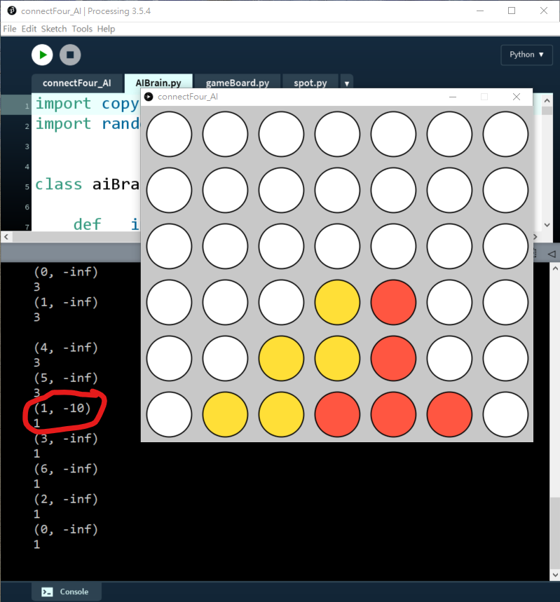

效果：即使`depth`再增加，AI都只會懂得幫自己提早抬轎，而不懂阻擋我。


<iframe width="560" height="315" src="https://www.youtube.com/embed/trKjYdBASyQ?start=137" title="YouTube video player" frameborder="0" allow="accelerometer; autoplay; clipboard-write; encrypted-media; gyroscope; picture-in-picture; web-share" allowfullscreen></iframe>

```python
 def minimax(self, _gameBoard, _depth, _isMaximizing):
        winner = _gameBoard.checkWin()
        if winner != None or _depth == 0:
            return self.score(winner)

        if _isMaximizing:
            bestScore = float('-inf')
            # //fill the available colume to an list
            availableCol = []
            for j in range(7):
                if _gameBoard.grids[0][j].value == '':
                    availableCol.append(j)
            # shuffle the list
            random.shuffle(availableCol)

            for move in availableCol:
                possibleBoard = copy.deepcopy(_gameBoard)
                possibleBoard.trigger(move)
                score = self.minimax(possibleBoard, _depth - 1, False)
                bestScore = max(score, bestScore)
            return bestScore

        else:
            bestScore = float('inf')
            # //fill the available colume to an list
            availableCol = []
            for j in range(7):
                if _gameBoard.grids[0][j].value == '':
                    availableCol.append(j)
            # shuffle the list
            random.shuffle(availableCol)

            for move in availableCol:
                possibleBoard = copy.deepcopy(_gameBoard)
                possibleBoard.trigger(move)
                score = self.minimax(possibleBoard, _depth - 1, True)
                bestScore = min(score, bestScore)
            return bestScore
```

Minimax演算法基本上就是將所有可能的落子造成一個tree diagram，而每一層的tree diagram，跟據玩家的交換，一層的分數需要最少化，下一層的分數需要最大化，如此類推，詳細可以看看上面的影片。


```python
 def minimax(self, _gameBoard, _depth, _isMaximizing):
        winner = _gameBoard.checkWin()
        if winner != None or _depth == 0:
            return self.score(winner)
```

一開始，跟之前一樣，首先檢查有沒有贏、輸或打和，如果這一落子有的話，就可以即時回傳分數。另一個回傳跳出這個`minimax()`函數的情況是`depth==0`到底了，這樣回傳的話由於沒有贏家，會回傳`None`。

```python
if _isMaximizing:
            bestScore = float('-inf')
            # //fill the available colume to an list
            availableCol = []
            for j in range(7):
                if _gameBoard.grids[0][j].value == '':
                    availableCol.append(j)
            # shuffle the list
            random.shuffle(availableCol)

            for move in availableCol:
                possibleBoard = copy.deepcopy(_gameBoard)
                possibleBoard.trigger(move)
                score = self.minimax(possibleBoard, _depth - 1, False)
                bestScore = max(score, bestScore)
            return bestScore
```

之後這一段就跟上面非常相似了，如果是最大化的case，就將`bestScore`設定成負無限大，接著便deepcopy一個新的gameboard，將所有可能的步都試行一次，比較特別的是，這次` score = self.minimax(possibleBoard, _depth - 1, False)`minimax函數我們將函數輸入的`_depth`減1，函數最後的`False`是指`_isMaximizing`，所以如果這次`_isMaximizing`是`True`，那下一步就設定成`False`。

```python
 else:
            bestScore = float('inf')
            # //fill the available colume to an list
            availableCol = []
            for j in range(7):
                if _gameBoard.grids[0][j].value == '':
                    availableCol.append(j)
            # shuffle the list
            random.shuffle(availableCol)

            for move in availableCol:
                possibleBoard = copy.deepcopy(_gameBoard)
                possibleBoard.trigger(move)
                score = self.minimax(possibleBoard, _depth - 1, True)
                bestScore = min(score, bestScore)
            return bestScore
```

程式的下半部分基本上同，不同的是一開始的`bestScore`設定成正無限大，而`score = self.minimax(possibleBoard, _depth - 1, True)`也將最後的`_isMaximizing`部分設定成`True`。


這裡`minimax()`函數入面包裹著`minimax()`函數，就是我們上面所說的 recursion 遞歸。雖然不是最快的方法，但在編程上會簡潔很多。

## 5. 令AI懂得阻擋我方

```python
def autoPlay(self):
    bestScore = float('inf')
    bestMove = random.randint(0, 5)  # the range is a, b+1

    # //fill the available colume to an list
    availableCol = []
    for j in range(7):
        if self.gameBoard.grids[0][j].value == '':
            availableCol.append(j)
    # shuffle the list
    random.shuffle(availableCol)

    for move in availableCol:
        possibleBoard = copy.deepcopy(self.gameBoard)
        possibleBoard.trigger(move)
        score = self.minimax(possibleBoard, 1, True)
        print(move, score)
        if (score < bestScore):
            bestScore = score
            bestMove = move
        print(bestMove)
    print('')
    self.gameBoard.trigger(bestMove)
```

當`depth = 1`:

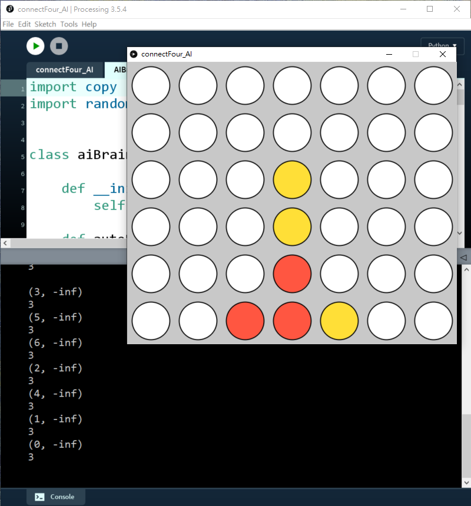

可以見到，如果我落子第2欄(`i=1`)，AI就會知道我下一步會贏，所以要優先落子第1欄)`i=0`)


如果進一步將`depth = 3`:

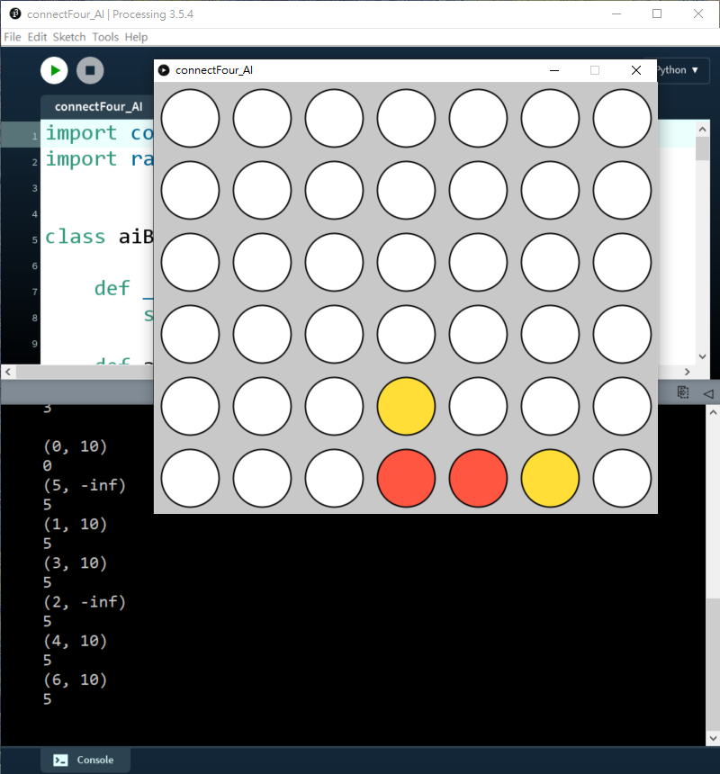

AI甚至懂得防止雙頭蛇，提早在第3欄(`i=2`)或第6欄(`i=6`)阻擋我。


上一步的AI之所以不懂阻擋我方，原因是`bestScore`一開始是設定成負無限大，之後找出最大的`bestScore`來落子，但我們設定分數時，如果AI方贏的話，分數會是`-10`分，所以我們找`bestScore`和`bestMove`時，找的應該是最小的負數，而不是最大的正數。只要交換，就能正確地令AI懂得防守。

## 6. 既能阻擋我方，又懂得贏

```python
import copy
import random


class aiBrain(object):

    def __init__(self, _gameBoard):
        self.gameBoard = _gameBoard

    def autoPlay(self):
        bestScore = float('inf')
        bestMove = random.randint(0, 5)  # the range is a, b+1

        # //fill the available colume to an list
        availableCol = []
        for j in range(7):
            if self.gameBoard.grids[0][j].value == '':
                availableCol.append(j)
        # shuffle the list
        random.shuffle(availableCol)

        for move in availableCol:
            possibleBoard = copy.deepcopy(self.gameBoard)
            possibleBoard.trigger(move)
            score = self.minimax(possibleBoard, 1, True)
            print(move, score)
            if (score < bestScore):
                bestScore = score
                bestMove = move
            print(bestMove)
        print('')
        self.gameBoard.trigger(bestMove)

    def score(self, _winner):
        if _winner == 'R':
            return 10 
        elif _winner == 'Y':
            return -10 
        elif _winner == 'O':
            return 0
        else:
            return 0

    def minimax(self, _gameBoard, _depth, _isMaximizing):
        winner = _gameBoard.checkWin()
        if winner != None or _depth == 0:
            return self.score(winner)

        if _isMaximizing:
            bestScore = 0
            # //fill the available colume to an list
            availableCol = []
            for j in range(7):
                if _gameBoard.grids[0][j].value == '':
                    availableCol.append(j)
            # shuffle the list
            random.shuffle(availableCol)

            for move in availableCol:
                possibleBoard = copy.deepcopy(_gameBoard)
                possibleBoard.trigger(move)
                score = self.minimax(possibleBoard, _depth - 1, False)
                bestScore += score
            return bestScore

        else:
            bestScore = 0
            # //fill the available colume to an list
            availableCol = []
            for j in range(7):
                if _gameBoard.grids[0][j].value == '':
                    availableCol.append(j)
            # shuffle the list
            random.shuffle(availableCol)

            for move in availableCol:
                possibleBoard = copy.deepcopy(_gameBoard)
                possibleBoard.trigger(move)
                score = self.minimax(possibleBoard, _depth - 1, True)
                bestScore += score
            return bestScore
```

由於經過了`minimax()`函數後，如果沒有結果，也會回傳`-inf`，而在比較最少的時間，所有沒有特定結果的case都會全部變了做`-inf`，所以AI只懂得防守而不懂得進攻。要改良的話方法很簡單，只要將`minimax()`入面的`bestScore`設成`0`，之後在最後比較`bestScore`的部分，不做min或max，而是改用將所有結果累加。


當`depth=1`，AI懂得去阻擋我贏

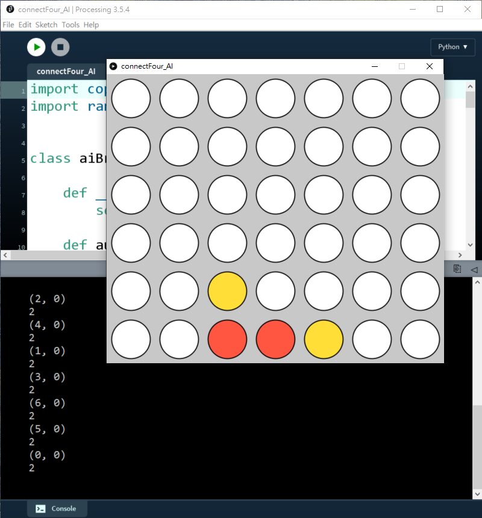

而且也懂得去贏:

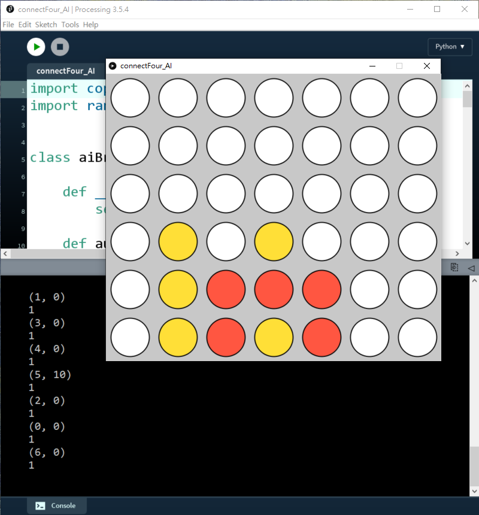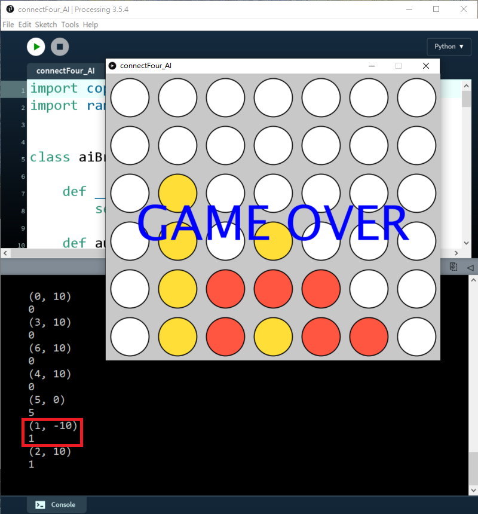

但反而`depth=3`或以上的話，效果反而一點也不明顯，好似突然變蠢了一樣。如下圖，當`depth=3`，明明只要下最右手邊的話就會即時贏，AI反而是阻擋我繼續下第三行而不去贏。

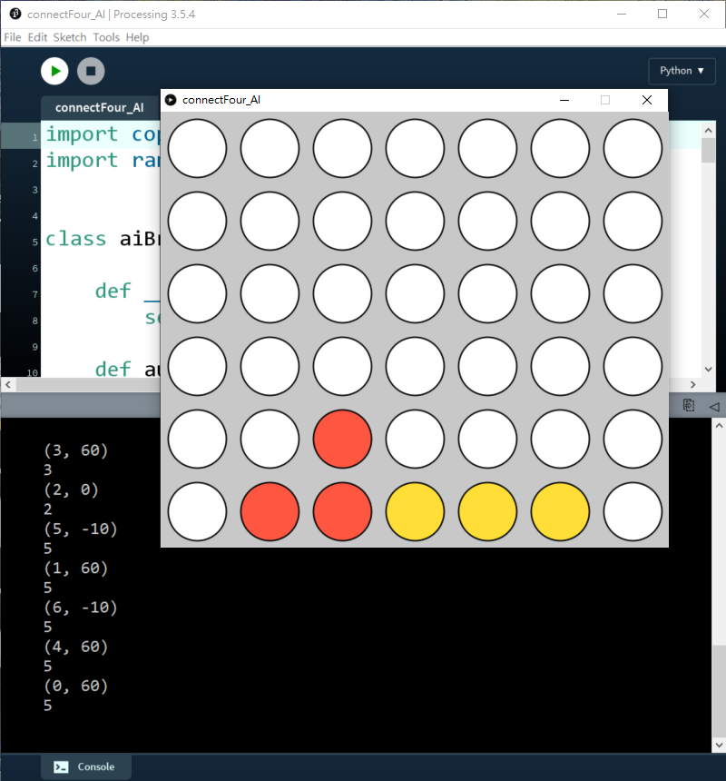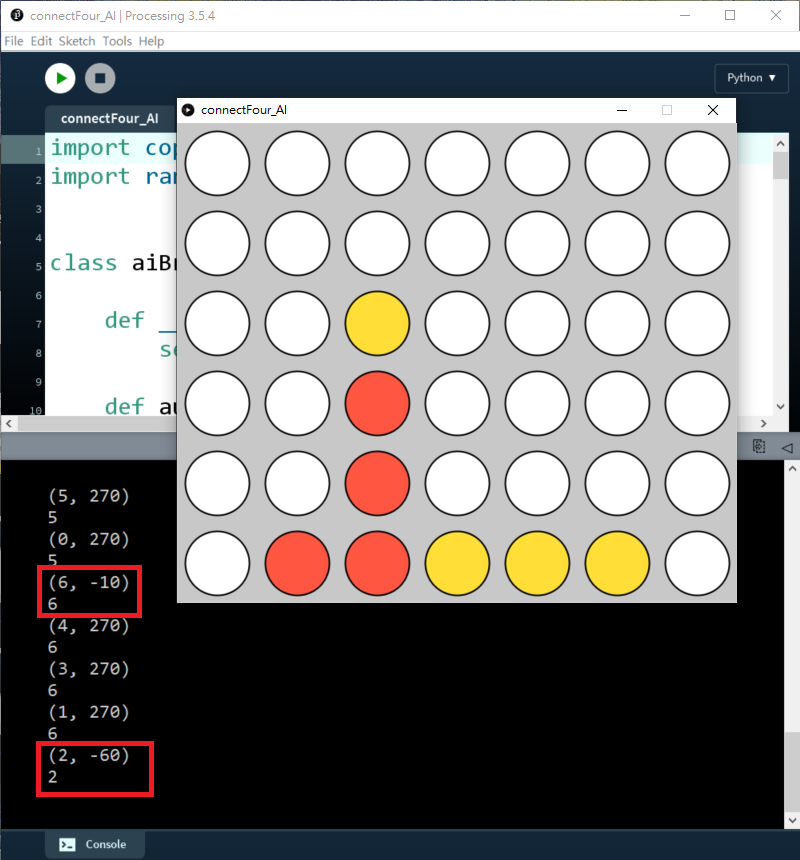

原因是：上述演算法沒有考慮深度的優先，如果下最右手邊(`i=6`)，遊戲就會即時贏，所以分數只有`-10`，但如果下第三行(`i=2`)，由於遊戲未完，演算法會繼續往下兩步(`depth=3`)，所以會累加之後步的分數，所以反而會比即時贏的分數更少。

普通的minimax演算法，分數是會繼承tree diagram下層的分數，再分min或max，但這樣的方法，如果下一步有即時出現贏或即時輸，它能有效的防守或進攻，但它卻不懂得需要佈局、或走某一步對之後的局面更有利的情況，這是因為minimax演算法缺乏了深度的資訊。例如，minimax對於兩步之後能贏或四步之後才能贏的case，都會給出同等的分數。而我們上面的演算法改了用累加分數，則會累加之後步數，搜尋深度越深分數就會越大。

## 7. 令分數與`depth`成關係

```PYTHON
import copy
import random


class aiBrain(object):

    def __init__(self, _gameBoard):
        self.gameBoard = _gameBoard

    def autoPlay(self):
        bestScore = float('inf')
        bestMove = random.randint(0, 5)  # the range is a, b+1

        # //fill the available colume to an list
        availableCol = []
        for j in range(7):
            if self.gameBoard.grids[0][j].value == '':
                availableCol.append(j)
        # shuffle the list
        random.shuffle(availableCol)

        for move in availableCol:
            possibleBoard = copy.deepcopy(self.gameBoard)
            possibleBoard.trigger(move)
            score = self.minimax(possibleBoard, 3, True)
            print(move, score)
            if (score < bestScore):
                bestScore = score
                bestMove = move
            print(bestMove)
        print('')
        self.gameBoard.trigger(bestMove)

    def score(self, _winner):
        if _winner == 'R':
            return 10 
        elif _winner == 'Y':
            return -10 
        elif _winner == 'O':
            return 0
        else:
            return 0

    def minimax(self, _gameBoard, _depth, _isMaximizing):
        winner = _gameBoard.checkWin()
        if winner != None or _depth == 0:
            return self.score(winner) * (10**_depth)

        if _isMaximizing:
            bestScore = 0
            # //fill the available colume to an list
            availableCol = []
            for j in range(7):
                if _gameBoard.grids[0][j].value == '':
                    availableCol.append(j)
            # shuffle the list
            random.shuffle(availableCol)

            for move in availableCol:
                possibleBoard = copy.deepcopy(_gameBoard)
                possibleBoard.trigger(move)
                score = self.minimax(possibleBoard, _depth - 1, False)
                bestScore += score
            return bestScore

        else:
            bestScore = 0
            # //fill the available colume to an list
            availableCol = []
            for j in range(7):
                if _gameBoard.grids[0][j].value == '':
                    availableCol.append(j)
            # shuffle the list
            random.shuffle(availableCol)

            for move in availableCol:
                possibleBoard = copy.deepcopy(_gameBoard)
                possibleBoard.trigger(move)
                score = self.minimax(possibleBoard, _depth - 1, True)
                bestScore += score
            return bestScore
```

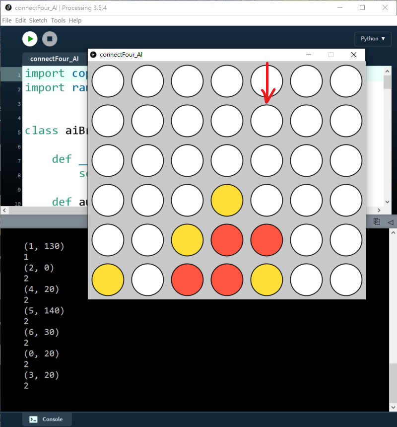


```python
 def minimax(self, _gameBoard, _depth, _isMaximizing):
        winner = _gameBoard.checkWin()
        if winner != None or _depth == 0:
            return self.score(winner) * (10**_depth)
```

要改善這情況，方法是將輸出分數跟深度掛勾。將return的分數加了10的depth次方後，輸出分數就與深度成次方比，下一步會即時贏的話，`depth=3`就會是$-10\times10^3=10,000$分，就會比兩步後再贏多出一個等數級。只要加入這個少少改變，AI就會變得非常厲害，當`depth=2`時，已經會考慮之後的3步去防守和佈局進攻，如果`depth=3`時，就會考慮到之後的4步去防守和進攻，已經可以防守和佈置兩頭蛇了。

