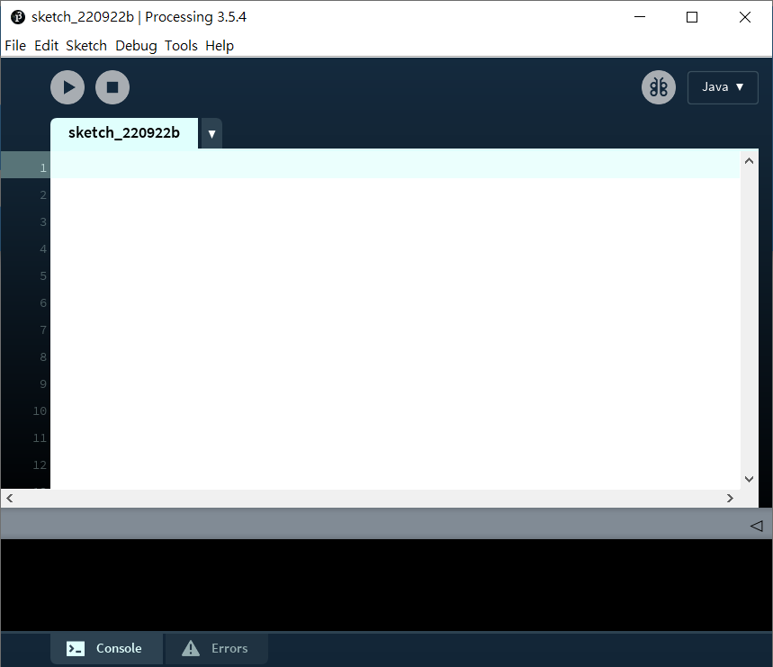
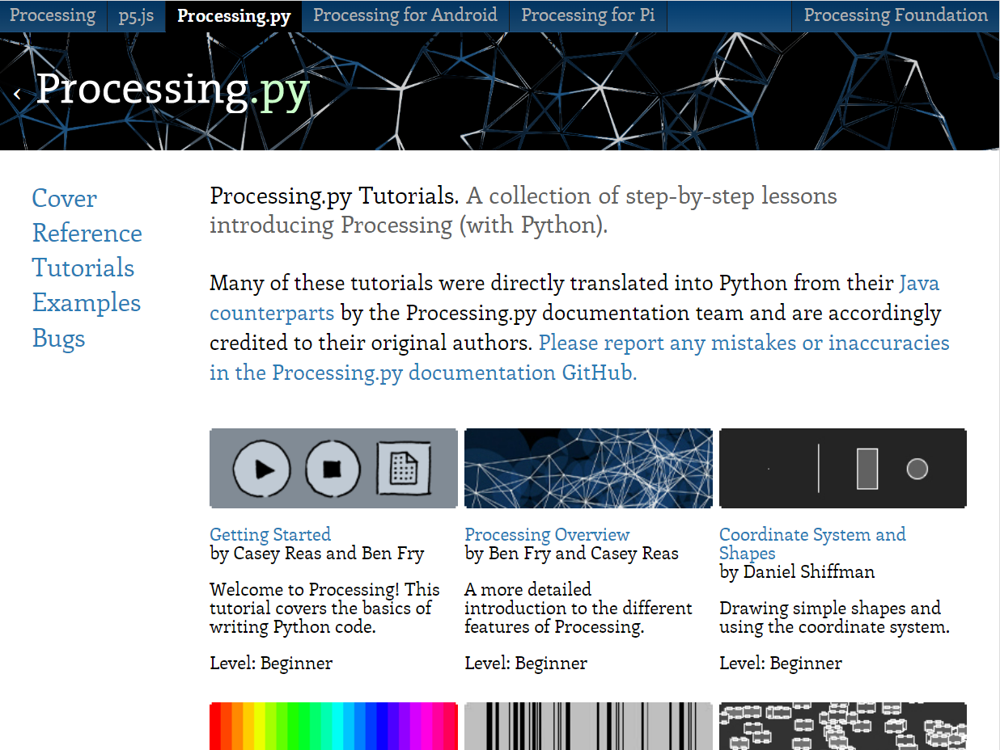
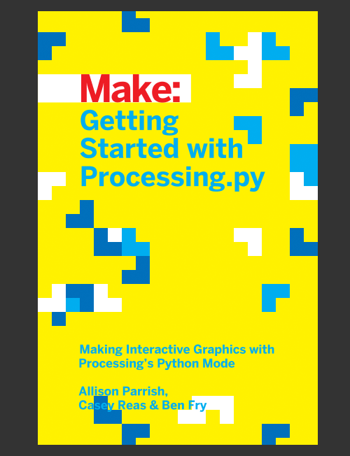

# Getting started with processing.py

[toc]

## 介紹

Processing是一個開源的程式語言，同時也是一個程式語言集成開發環境(IDE)。

> Processing是一種開源程式語言，專門為電子藝術和視覺交互設計而創建，其目的是通過可視化的方式輔助編程教學，並在此基礎之上表達數字創意。

- Processing是java語言，針對圖形圖像語法簡化
- 適合編程藝術表達和編寫小遊戲
- 有java、JavaScript、Android、Python和Ruby版本
- Python版本用Jython編譯成java語言運行
- 2.x版本的指令大多能在Processing python版本中運行
- 不支援用C語言運行的numpy和scipy等工程模組

## Processing下載和資訊

- 可至https://py.processing.org/下載和獲取更多資訊
- 網站內有完整教程，包括下載processing、下載python模組、常用指令等
- 網站也提供寫遊戲時的processing指令和語法使用的教程
- 如有疑問，都可以在網站中找到答案

> https://py.processing.org/tutorials/

## Getting started with processing.py (書本介紹)

- 這是一個processing編程教學系列，包括三本書：processing、p5.js和processing.py。
- 這三本書的內容基本相同，但在語法和功能方面有所不同。
- 這個系列的書籍是很好的編程入門書籍，深入淺出地介紹了基礎語法和功能，並與processing的繪圖和互動功能配合使用。
- 建議在開始學習本網站內容前，先閱讀這個系列的書籍，以對編程有所了解。

