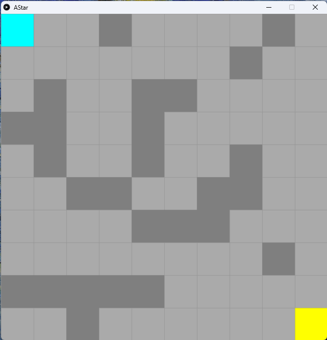
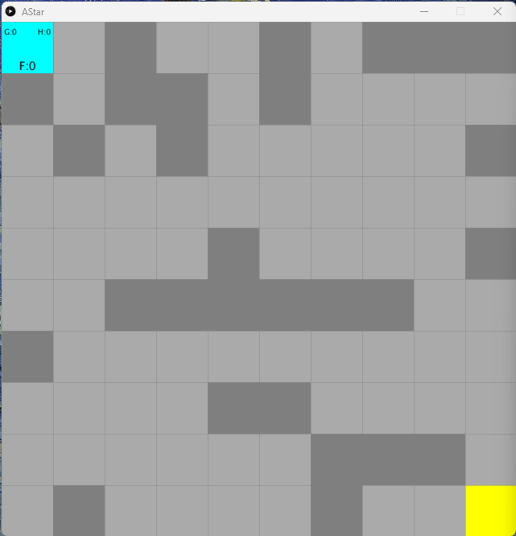
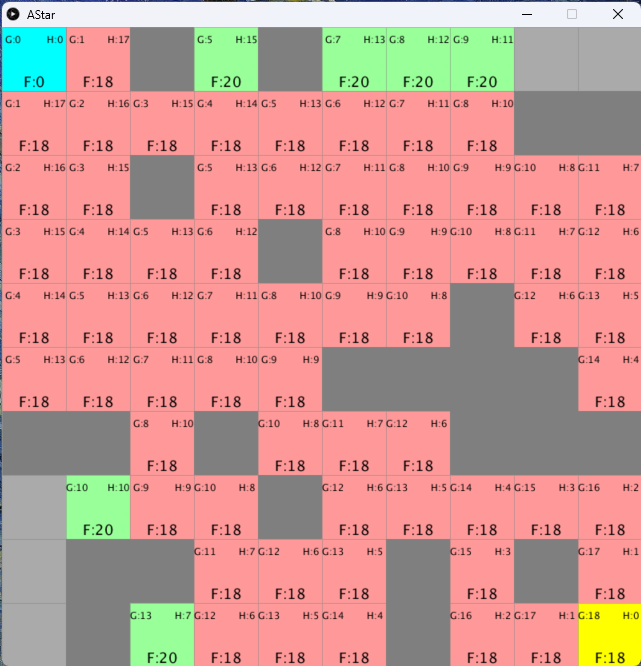
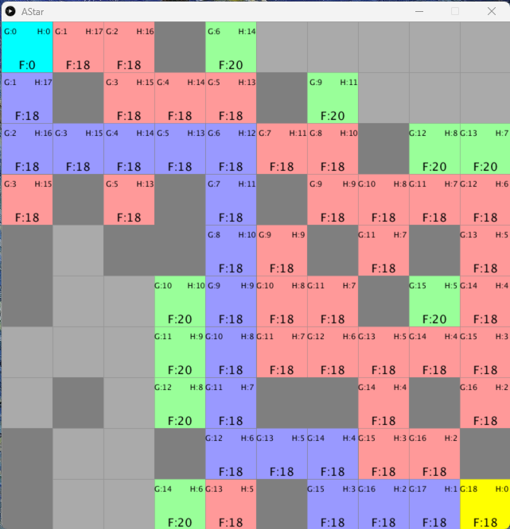
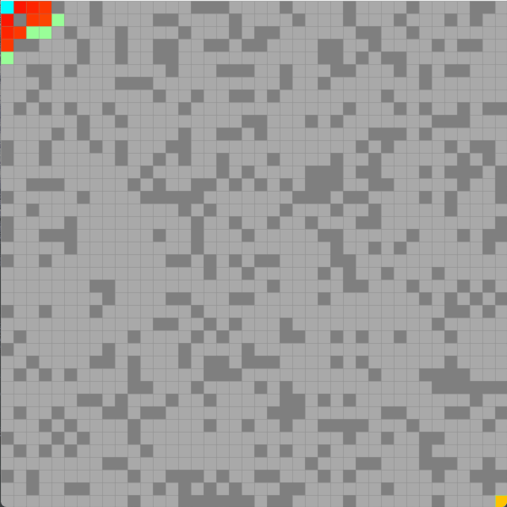

# A*演算法

A* 演算法是一種常見於路徑搜索的演算法。它可以在圖或網格中找到從起點到終點的最短路徑。相較於前一章的洪水演算法，A* 演算法更加高效。常見於2D網格遊戲的路徑運算中。

<iframe src = "/interactive/AStar/index.html" width = "100%" height = "650"></iframe>

[toc]

##1. 準備好網格內容、牆和加入鄰居

```python
# A demo of the A* pathfinding algorithm.
cols = rows = 10
spots = []
start = end = None

def setup():
    global start, end, spots
    size(800, 800)
    rectMode(CENTER)
    textAlign(CENTER, CENTER)

    spots = [[Spot(i, j) for j in range(cols)] for i in range(rows)]

    start = spots[0][0]
    end = spots[cols-1][rows-1]

    for i in range(rows):
        for j in range(cols):          
            spots[i][j].addWall() 

    for i in range(rows):
        for j in range(cols):
            spots[i][j].addNeighbors(spots)

def draw():
    background(0)
    for i in range(rows):
        for j in range(cols):
            spots[i][j].show('#AAAAAA')
    
    start.show('#00FFFF')
    end.show('#FFFF00')

class Spot:

    def __init__(self, _i, _j):
        self.w = width/cols
        self.h = height/rows
        self.i = _i
        self.j = _j
        self.x = self.i * self.w + self.w/2
        self.y = self.j * self.h + self.h/2
        self.wall = False
        self.neighbors = []

    def show(self, _color):
        fill(_color)
        if self.wall:
            fill(127)
        stroke(127)
        strokeWeight(0.5)
        rect(self.x, self.y, self.w, self.h)

    def addWall(self):
        if self != start and self != end:
            self.wall = True if random(1) < 0.25 else False

    def addNeighbors(self, _spots):
        i = self.i
        j = self.j
        if i < cols - 1 and not _spots[i+1][j].wall:
            self.neighbors.append(_spots[i+1][j])
        if i > 0 and not _spots[i-1][j].wall:
            self.neighbors.append(_spots[i-1][j])
        if j < rows - 1 and not _spots[i][j+1].wall:
            self.neighbors.append(_spots[i][j+1])
        if j > 0 and not _spots[i][j-1].wall:
            self.neighbors.append(_spots[i][j-1])
```



因為前一章已經做過一個差不多一模一樣的介面和程序，這裡就不一一講解了，有興趣或問題可以看上一章。

## 2. 準備好每個spot的cost和顯示介面

```python
# A demo of the A* pathfinding algorithm.
cols = rows = 10
spots = []
start = end = None
openSet = []
closeSet = []

def setup():
    global start, end, spots, openSet, closeSet
    size(800, 800)
    rectMode(CENTER)
    textAlign(CENTER, CENTER)

    spots = [[Spot(i, j) for j in range(cols)] for i in range(rows)]

    start = spots[0][0]
    end = spots[cols-1][rows-1]

    for i in range(rows):
        for j in range(cols):          
            spots[i][j].addWall() 

    for i in range(rows):
        for j in range(cols):
            spots[i][j].addNeighbors(spots)

    openSet = [start]
    closeSet = []
    start.gCost = 0
    


def draw():
    background(0)
    for i in range(rows):
        for j in range(cols):
            spots[i][j].show('#AAAAAA')
    
    start.show('#00FFFF')
    end.show('#FFFF00')

class Spot:

    def __init__(self, _i, _j):
        self.w = width/cols
        self.h = height/rows
        self.i = _i
        self.j = _j
        self.x = self.i * self.w + self.w/2
        self.y = self.j * self.h + self.h/2
        self.wall = False
        self.neighbors = []
        self.gCost = float('inf')
        self.hCost = 0
        self.fCost = 0
        self.previous = None

    def show(self, _color):
        fill(_color)
        if self.wall:
            fill(127)
        stroke(127)
        strokeWeight(0.5)
        rect(self.x, self.y, self.w, self.h)
        if self in openSet or self in closeSet:
            fill(0)
            noStroke()
            textSize(12)
            text("G:" + str(self.gCost), self.x - self.w/3, self.y-self.h/3)
            text("H:" + str(self.hCost), self.x + self.w/3, self.y-self.h/3)
            textSize(18)
            text("F:" + str(self.fCost), self.x, self.y+self.h/3)

    def addWall(self):
        if self != start and self != end:
            self.wall = True if random(1) < 0.25 else False

    def addNeighbors(self, _spots):
        i = self.i
        j = self.j
        if i < cols - 1 and not _spots[i+1][j].wall:
            self.neighbors.append(_spots[i+1][j])
        if i > 0 and not _spots[i-1][j].wall:
            self.neighbors.append(_spots[i-1][j])
        if j < rows - 1 and not _spots[i][j+1].wall:
            self.neighbors.append(_spots[i][j+1])
        if j > 0 and not _spots[i][j-1].wall:
            self.neighbors.append(_spots[i][j-1])
```



A* 演算法，每個節點(或網格)的計分方法，都是由兩個cost去組成，`gCost`是指由目標(goal)到現在這一格的距離，而`hCost`是指由起始點到這一格共行了多少距離。最後這兩個cost相加就叫做`fCost`，這個cost就是我們想要的分數。

```python
class Spot:

    def __init__(self, _i, _j):
        #(same as before)
        self.gCost = float('inf')
        self.hCost = 0
        self.fCost = 0
        self.previous = None
```

首先在`Spot` class，加入上文所說的cost。


```python
# A demo of the A* pathfinding algorithm.
cols = rows = 10
spots = []
start = end = None
openSet = []
closeSet = []
```

接著在最上方加入`openSet = []`和`closeSet = []`。A* 演算法會有一個叫`openSet`用來紀錄待計算的格，有點像上一章的等候列，另外經過計算的格會由`openSet`落入`closeSet`中不會再重覆計算。這部分下一節會詳談和實現。


```python
def setup():
    global start, end, spots, openSet, closeSet
	
    #(same as before)
    openSet = [start]
    closeSet = []
    start.gCost = 0
```

接著在`setup()`的最後，開始演算法前第一步是將`start`[^1] 放入`openSet`和計定`start`的`gCost`為`0`[^2]。


```python
class Spot:
    
    def __init__(self):
        #(same as before)
    
    def show(self, _color):
        #(same as before)
    	if self in openSet or self in closeSet:
            fill(0)
            noStroke()
            textSize(12)
            text("G:" + str(self.gCost), self.x - self.w/3, self.y-self.h/3)
            text("H:" + str(self.hCost), self.x + self.w/3, self.y-self.h/3)
            textSize(18)
            text("F:" + str(self.fCost), self.x, self.y+self.h/3)
```

最後返回`Spot `class，將三個相關的cost都顯示出來。


[^1]: 一般路徑演算法都是剛好相反由終點找回起點的，會為方便解說和理解，我終一改為由起點找到終點
[^2]: 理論上是一併計算`hCost`和`fCost`的，但不計算也不會對結果有影響

## 3. 更新每一個格的cost

```python
# A demo of the A* pathfinding algorithm.
cols = rows = 10
spots = []
start = end = None
openSet = []
closeSet = []

def setup():
    global start, end, spots, openSet, closeSet
    size(800, 800)
    rectMode(CENTER)
    textAlign(CENTER, CENTER)
    frameRate(1)

    spots = [[Spot(i, j) for j in range(cols)] for i in range(rows)]

    start = spots[0][0]
    end = spots[cols-1][rows-1]

    for i in range(rows):
        for j in range(cols):          
            spots[i][j].addWall() 

    for i in range(rows):
        for j in range(cols):
            spots[i][j].addNeighbors(spots)

    openSet = [start]
    closeSet = []
    start.gCost = 0
    


def draw():
    background(0)

    # find the lowest index of openset
    lowestIndex = 0
    for i in range(len(openSet)):
        if openSet[i].fCost < openSet[lowestIndex].fCost:
            lowestIndex = i
    
    current = openSet[lowestIndex]

    # update the current spot
    # 1. remove it from openSet
    # 2. add it to closeSet
    # 3. find its neighbors
    # 4. calculate the gCost, hCost, fCost
    # 5. update the previous spot
    # 6. add it to openSet
    openSet.remove(current)
    closeSet.append(current)
    for neighbor in current.neighbors:
        if neighbor not in closeSet and not neighbor.wall:
            tempGCost = current.gCost + 1
            if neighbor in openSet:
                if tempGCost < neighbor.gCost:
                    neighbor.gCost = tempGCost
            else:
                neighbor.gCost = tempGCost
                openSet.append(neighbor)
            neighbor.hCost = walkingDist(neighbor, end)
            neighbor.fCost = neighbor.gCost + neighbor.hCost
            neighbor.previous = current


    for i in range(rows):
        for j in range(cols):
            if spots[i][j] in openSet:
                spots[i][j].show('#99FF99')
            elif spots[i][j] in closeSet:
                spots[i][j].show('#FF9999')
            else:
                spots[i][j].show('#AAAAAA')
    
    start.show('#00FFFF')
    end.show('#FFFF00')

def walkingDist(_spot1, _spot2):
    return abs(_spot1.i - _spot2.i) + abs(_spot1.j - _spot2.j)

class Spot:

    def __init__(self, _i, _j):
        self.w = width/cols
        self.h = height/rows
        self.i = _i
        self.j = _j
        self.x = self.i * self.w + self.w/2
        self.y = self.j * self.h + self.h/2
        self.wall = False
        self.neighbors = []
        self.gCost = float('inf')
        self.hCost = 0
        self.fCost = 0
        self.previous = None

    def show(self, _color):
        fill(_color)
        if self.wall:
            fill(127)
        stroke(127)
        strokeWeight(0.5)
        rect(self.x, self.y, self.w, self.h)
        if self in openSet or self in closeSet:
            fill(0)
            noStroke()
            textSize(12)
            text("G:" + str(self.gCost), self.x - self.w/3, self.y-self.h/3)
            text("H:" + str(self.hCost), self.x + self.w/3, self.y-self.h/3)
            textSize(18)
            text("F:" + str(self.fCost), self.x, self.y+self.h/3)

    def addWall(self):
        if self != start and self != end:
            self.wall = True if random(1) < 0.25 else False

    def addNeighbors(self, _spots):
        i = self.i
        j = self.j
        if i < cols - 1 and not _spots[i+1][j].wall:
            self.neighbors.append(_spots[i+1][j])
        if i > 0 and not _spots[i-1][j].wall:
            self.neighbors.append(_spots[i-1][j])
        if j < rows - 1 and not _spots[i][j+1].wall:
            self.neighbors.append(_spots[i][j+1])
        if j > 0 and not _spots[i][j-1].wall:
            self.neighbors.append(_spots[i][j-1])
```




```python
def draw():
    background(0)

    # find the lowest index of openset
    lowestIndex = 0
    for i in range(len(openSet)):
        if openSet[i].fCost < openSet[lowestIndex].fCost:
            lowestIndex = i
    
    current = openSet[lowestIndex]

    # update the current spot
    # 1. remove it from openSet
    # 2. add it to closeSet
    # 3. find its neighbors
    # 4. calculate the gCost, hCost, fCost
    # 5. update the previous spot
    # 6. add it to openSet
    openSet.remove(current)
    closeSet.append(current)
    for neighbor in current.neighbors:
        if neighbor not in closeSet and not neighbor.wall:
            tempGCost = current.gCost + 1
            if neighbor in openSet:
                if tempGCost < neighbor.gCost:
                    neighbor.gCost = tempGCost
            else:
                neighbor.gCost = tempGCost
                openSet.append(neighbor)
            neighbor.hCost = walkingDist(neighbor, end)
            neighbor.fCost = neighbor.gCost + neighbor.hCost
            neighbor.previous = current
```

A* 演算法會有一個`openSet`和`closeSet`，第一步是將起點加入到`openSet`，之後的每一步，

0. 首先要找到全部`openSet`中，分數(`fCost`)最低的格，設定這一格做`current`
1. 將這一格`current`移出`openSet`
2. 將這一格`current`移入`closeSet`
3. 找出這一格`current`的所有`neighbors`
	4. 計算基於`current`鄰居的`gCost`
	5. 如果鄰居本身就是`openSet`，就對比基於`current`鄰居計算的`gCost`是否少於它的`gCost`
	6. 如果是不在`openSet`的新一格，就更新它的`gCost`
	7. 計算每個鄰居的`hCost`和`fCost`
	8. 更新這個鄰居是從哪裡來


```python
def draw():
    #(same as before)
    for i in range(rows):
        for j in range(cols):
            if spots[i][j] in openSet:
                spots[i][j].show('#99FF99')
            elif spots[i][j] in closeSet:
                spots[i][j].show('#FF9999')
            else:
                spots[i][j].show('#AAAAAA')
    
    start.show('#00FFFF')
    end.show('#FFFF00')
```

之後就為`openSet`和`closeSet`加入不同的顏色方便觀察。


```python
def walkingDist(_spot1, _spot2):
    return abs(_spot1.i - _spot2.i) + abs(_spot1.j - _spot2.j)
```

最後就是加入計算`hCost`的函數。`gCost`是一路走出累加了多少步，需要考慮中途遇到的障礙物，而 `hCost`是預估到終點還有多少步，這個預估是不需要理會障礙物的，就當是完全沒有障礙物，只計算步數。由於我們的計算是只有上、下、左和右，沒有打斜走的，所以由一格到另一格要走的最短路程，就是兩格的`i`的差和`j`的差之和。

## 4. 加入如果沒有答案或已找到路徑

```python
# A demo of the A* pathfinding algorithm.
cols = rows = 10
spots = []
start = end = None
openSet = []
closeSet = []
path = []

def setup():
    global start, end, spots, openSet, closeSet
    size(800, 800)
    rectMode(CENTER)
    textAlign(CENTER, CENTER)
    frameRate(10)

    spots = [[Spot(i, j) for j in range(cols)] for i in range(rows)]

    start = spots[0][0]
    end = spots[cols-1][rows-1]

    for i in range(rows):
        for j in range(cols):          
            spots[i][j].addWall() 

    for i in range(rows):
        for j in range(cols):
            spots[i][j].addNeighbors(spots)

    openSet = [start]
    closeSet = []
    start.gCost = 0
    


def draw():
    global path
    background(0)

    # if openSet is empty, then no solution
    if len(openSet) == 0:
        print("no solution")
        noLoop()
        return
    
    # find the lowest index of openset
    lowestIndex = 0
    for i in range(len(openSet)):
        if openSet[i].fCost < openSet[lowestIndex].fCost:
            lowestIndex = i
    
    current = openSet[lowestIndex]

    # if current is the end, then find the path
    if current == end:
        print("find the path")
        path = [current]
        temp = current
        while temp.previous: # only the start has no previous
            path.append(temp.previous)
            temp = temp.previous
        print("path is found!")
        noLoop()
       
    # update the current spot
    # 1. remove it from openSet
    # 2. add it to closeSet
    # 3. find its neighbors
    # 4. calculate the gCost, hCost, fCost
    # 5. update the previous spot
    # 6. add it to openSet
    openSet.remove(current)
    closeSet.append(current)
    for neighbor in current.neighbors:
        if neighbor not in closeSet and not neighbor.wall:
            tempGCost = current.gCost + 1
            if neighbor in openSet:
                if tempGCost < neighbor.gCost:
                    neighbor.gCost = tempGCost
            else:
                neighbor.gCost = tempGCost
                openSet.append(neighbor)
            neighbor.hCost = walkingDist(neighbor, end)
            neighbor.fCost = neighbor.gCost + neighbor.hCost
            neighbor.previous = current


    for i in range(rows):
        for j in range(cols):
            if spots[i][j] in openSet:
                spots[i][j].show('#99FF99')
            elif spots[i][j] in closeSet:
                spots[i][j].show('#FF9999')
            else:
                spots[i][j].show('#AAAAAA')
    
    # draw the path
        for p in path:
            p.show('#9999FF')

    start.show('#00FFFF')
    end.show('#FFFF00')

def walkingDist(_spot1, _spot2):
    return abs(_spot1.i - _spot2.i) + abs(_spot1.j - _spot2.j)

class Spot:

    def __init__(self, _i, _j):
        self.w = width/cols
        self.h = height/rows
        self.i = _i
        self.j = _j
        self.x = self.i * self.w + self.w/2
        self.y = self.j * self.h + self.h/2
        self.wall = False
        self.neighbors = []
        self.gCost = float('inf')
        self.hCost = 0
        self.fCost = 0
        self.previous = None

    def show(self, _color):
        fill(_color)
        if self.wall:
            fill(127)
        stroke(127)
        strokeWeight(0.5)
        rect(self.x, self.y, self.w, self.h)
        if self in openSet or self in closeSet:
            fill(0)
            noStroke()
            textSize(12)
            text("G:" + str(self.gCost), self.x - self.w/3, self.y-self.h/3)
            text("H:" + str(self.hCost), self.x + self.w/3, self.y-self.h/3)
            textSize(18)
            text("F:" + str(self.fCost), self.x, self.y+self.h/3)

    def addWall(self):
        if self != start and self != end:
            self.wall = True if random(1) < 0.25 else False

    def addNeighbors(self, _spots):
        i = self.i
        j = self.j
        if i < cols - 1 and not _spots[i+1][j].wall:
            self.neighbors.append(_spots[i+1][j])
        if i > 0 and not _spots[i-1][j].wall:
            self.neighbors.append(_spots[i-1][j])
        if j < rows - 1 and not _spots[i][j+1].wall:
            self.neighbors.append(_spots[i][j+1])
        if j > 0 and not _spots[i][j-1].wall:
            self.neighbors.append(_spots[i][j-1])
```



```python
 # if openSet is empty, then no solution
    if len(openSet) == 0:
        print("no solution")
        noLoop()
```

加入兩個考量，如果`openSet`是空的話，而又有未答案的話，即沒有答案。


```python
 # if current is the end, then find the path
    if current == end:
        print("find the path")
        path = [current]
        temp = current
        while temp.previous: # only the start has no previous
            path.append(temp.previous)
            temp = temp.previous
        print("path is found!")
        noLoop()
```

如果找到`end`的話，即找到答案。如果目前所處的位置是終點，就找到了一條路徑。當找到路徑後，程式會列印出「找到路徑」的訊息，並建立一個包含當前位置的列表，接著使用一個暫存變數來追蹤前一個位置，並將前一個位置加入到路徑列表中。直到追蹤到起點，也就是前一個位置沒有「previous」屬性時，迴圈才會停止。最後，程式會列印出「已找到路徑！」的訊息，並退出所有迴圈。

## 考考你



試著將程式美化到我這個效果，我是將所有`closeSet`的顏色，用`map`將其變成`color(map(spots[i][j].gCost, 0, cols + rows, 0, 255)`，記得要在setup將顏色先設定成`colorMode(HSB, 255)`