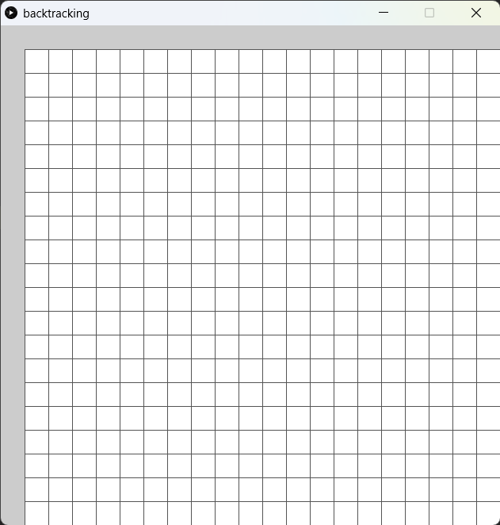
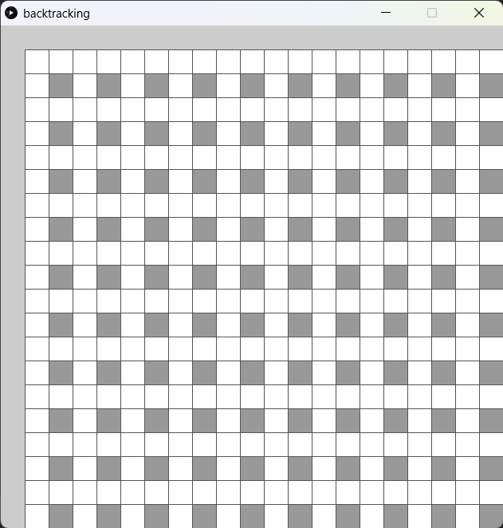
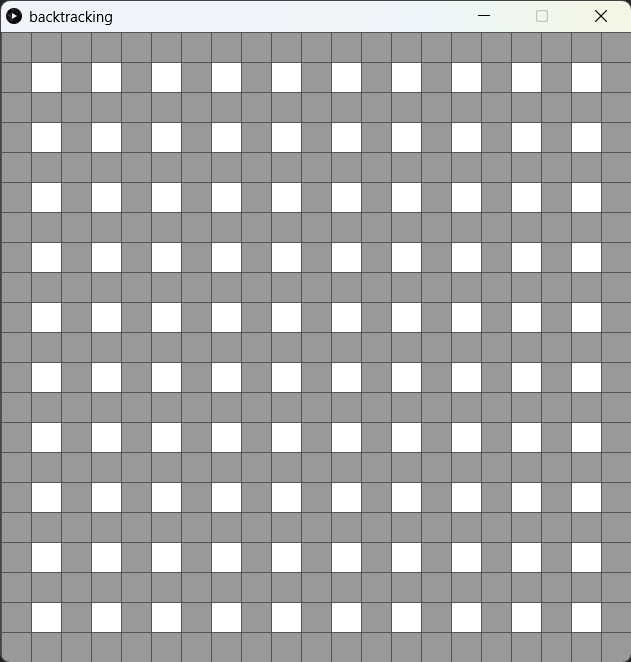

# Maze generation

迷宮生成演算法是一種用於創建迷宮的演算法，其目標是生成一個具有一定難度和趣味性的迷宮。常見的迷宮生成演算法包括深度優先搜索演算法、隨機追踪演算法、分割演算法和Eller's演算法等。

深度優先搜索演算法是一種簡單而有效的迷宮生成演算法。它從一個起始位置開始，在迷宮中隨機選擇一個未訪問的相鄰位置，並將其標記為通過，然後遞歸地探索該位置，直到無法繼續前進為止。然後，回溯回到之前的位置，並選擇另一個未訪問的相鄰位置，重複上述過程，直到所有的位置都被訪問。

以下我們但簡介深度優先搜索法，又叫backtracking。


##1. 準備好格

```python
# A demo of backtracking maze generator

cols = rows = 20
spots = []

def setup():
    global spots
    size(630, 630)
    rectMode(CENTER)

    for i in range(cols):
        temp = []
        for j in range(rows):
            temp.append(Spot(i, j))
        spots.append(temp)

def draw():
    for i in range(cols):
        for j in range(rows):
            spots[i][j].show()

class Spot(object):

    def __init__(self, _i, _j):
        self.i = _i
        self.j = _j
        self.w = width / (cols + 1 )
        self.h = height / (rows +1 )
        self.x = (self.i+1) * self.w + self.w / 2
        self.y = (self.j+1) * self.h + self.h / 2
        self.wall = False

    def show(self):
        stroke('#555555')
        if self.wall:
            fill('#999999')
        else:
            fill(255)
        rect(self.x, self.y, self.w, self.h)
```



跟以往一樣，我們首先準備好格的class。今次比較特別的是，我們會準備n+1格，20x20的話就會是21x21格，因為要為迷宮準備好四面牆。

##2. 加入cell class

```python
# A demo of backtracking maze generator

cols = rows = 20
spots = []
cells = []

def setup():
    global spots, cells
    size(630, 630)
    rectMode(CENTER)

    # create new spots
    for i in range(cols):
        temp = []
        for j in range(rows):
            temp.append(Spot(i, j))
        spots.append(temp)

    # create new cells
    for i in range(cols/2):
        temp = []
        for j in range(rows/2):
            temp.append(Cell(i, j))
        cells.append(temp)
        
    # add spots to each cell and add neighbors to each cell
    for i in range(cols/2):
        for j in range(rows/2):
            cells[i][j].addSpots(spots)
            cells[i][j].addNeighbors(cells)
            

def draw():
    for i in range(cols):
        for j in range(rows):
            spots[i][j].show()

class Spot(object):

    def __init__(self, _i, _j):
        self.i = _i
        self.j = _j
        self.w = width / (cols + 1 )
        self.h = height / (rows +1 )
        self.x = (self.i+1) * self.w + self.w / 2
        self.y = (self.j+1) * self.h + self.h / 2
        self.wall = False

    def show(self):
        stroke('#555555')
        if self.wall:
            fill('#999999')
        else:
            fill(255)
        rect(self.x, self.y, self.w, self.h)

class Cell(object):
    # every cell has 4 spots
    def __init__(self, _i, _j):
        self.i = _i
        self.j = _j
        self.cells = [None, None, None, None]
        self.neighbors = []
        self.visited = False

    def addSpots(self, _spots):
        #every cell has 4 spots, the bottom right is always wall
        i = self.i
        j = self.j
        self.cells[0] = _spots[i*2][j*2] # top left
        self.cells[1] = _spots[i*2+1][j*2] # top right
        self.cells[2] = _spots[i*2+1][j*2+1] # bottom right
        self.cells[3] = _spots[i*2][j*2+1] # bottom left
        self.cells[2].wall = True

    def addNeighbors(self, _cells):
        i = self.i
        j = self.j
        self.neighbors.append(_cells[i-1][j]) if i >0 else None
        self.neighbors.append(_cells[i][j+1]) if j < rows/2-1 else None
        self.neighbors.append(_cells[i+1][j]) if i < cols/2-1 else None
        self.neighbors.append(_cells[i][j-1]) if j >0 else None

    def isVisited(self):
        return self.visited
```



```python
class Cell(object):
    # every cell has 4 spots
    def __init__(self, _i, _j):
        self.i = _i
        self.j = _j
        self.cells = [None, None, None, None]
        self.neighbors = []
        self.visited = False
        
	 def addSpots(self, _spots):
        #every cell has 4 spots, the bottom right is always wall
        i = self.i
        j = self.j
        self.cells[0] = _spots[i*2][j*2] # top left
        self.cells[1] = _spots[i*2+1][j*2] # top right
        self.cells[2] = _spots[i*2+1][j*2+1] # bottom right
        self.cells[3] = _spots[i*2][j*2+1] # bottom left
        self.cells[2].wall = True
```

新增一個cell class，這個class為迷宮的單元格。每個單元格包含4個spot，表示單元和的四個角落，其中右下角的Spot被標記為牆。

```python
  def addNeighbors(self, _cells):
        i = self.i
        j = self.j
        self.neighbors.append(_cells[i-1][j]) if i >0 else None
        self.neighbors.append(_cells[i][j+1]) if j < rows/2-1 else None
        self.neighbors.append(_cells[i+1][j]) if i < cols/2-1 else None
        self.neighbors.append(_cells[i][j-1]) if j >0 else None

    def isVisited(self):
        return self.visited
```

此外，每個單元格還包含了一個neighbors列表，表示與該單元格相鄰的單元格。在program2中，程式會將每個Spot添加到相應的單元格中，並且將每個單元格的相鄰單元格添加到neighbors列表中。這種方法可以減少程式生成迷宮時的計算量，提高程式的性能。


```PYTHON
cols = rows = 20
spots = []
cells = []

def setup():
    global spots, cells
    size(630, 630)
    #(same as before)

    # create new cells
    for i in range(cols/2):
        temp = []
        for j in range(rows/2):
            temp.append(Cell(i, j))
        cells.append(temp)
        
    # add spots to each cell and add neighbors to each cell
    for i in range(cols/2):
        for j in range(rows/2):
            cells[i][j].addSpots(spots)
            cells[i][j].addNeighbors(cells)
```

接著返回主程式，在`setup()`中，新增`cols/2`和`row/2`個cell(因為每4個spot為一個cell，所以只要一半就可以了)，接著跟之前一樣幫這此cell加係鄰居。

##3. 加入左邊界和右邊界

```python
# A demo of backtracking maze generator

cols = rows = 20
spots = []
cells = []
wallSpots = []


def setup():
    global spots, cells, wallSpots
    size(630, 630)
    rectMode(CENTER)

    # create the left and top wall
    for i in range(-1, cols):
        wallSpots.append(Spot(i, -1)) 
    for j in range(-1, rows):
        wallSpots.append(Spot(-1, j)) 

    # create new spots
    for i in range(cols):
        temp = []
        for j in range(rows):
            temp.append(Spot(i, j))
        spots.append(temp)

    # create new cells
    for i in range(cols/2):
        temp = []
        for j in range(rows/2):
            temp.append(Cell(i, j))
        cells.append(temp)

    # add spots to each cell and add neighbors to each cell
    for i in range(cols/2):
        for j in range(rows/2):
            cells[i][j].addSpots(spots)
            cells[i][j].addNeighbors(cells)


def draw():
    # display the wall
    for spot in wallSpots:
        spot.wall = True
        spot.show()

    # display the cells
    for i in range(cols):
        for j in range(rows):
            spots[i][j].show()


class Spot(object):

    def __init__(self, _i, _j):
        self.i = _i
        self.j = _j
        self.w = width / (cols + 1)
        self.h = height / (rows + 1)
        self.x = (self.i+1) * self.w + self.w / 2
        self.y = (self.j+1) * self.h + self.h / 2
        self.wall = False

    def show(self):
        stroke('#555555')
        if self.wall:
            fill('#999999')
        else:
            fill(255)
        rect(self.x, self.y, self.w, self.h)


class Cell(object):
    # every cell has 4 spots
    def __init__(self, _i, _j):
        self.i = _i
        self.j = _j
        self.cells = [None, None, None, None]
        self.neighbors = []
        self.visited = False

    def addSpots(self, _spots):
        # every cell has 4 spots, the bottom right is always wall
        i = self.i
        j = self.j
        self.cells[0] = _spots[i*2][j*2]  # top left
        self.cells[1] = _spots[i*2+1][j*2]  # top right
        self.cells[2] = _spots[i*2+1][j*2+1]  # bottom right
        self.cells[3] = _spots[i*2][j*2+1]  # bottom left
        
        self.cells[1].wall = True
        self.cells[2].wall = True
        self.cells[3].wall = True

    def addNeighbors(self, _cells):
        i = self.i
        j = self.j
        self.neighbors.append(_cells[i-1][j]) if i > 0 else None
        self.neighbors.append(_cells[i][j+1]) if j < rows/2-1 else None
        self.neighbors.append(_cells[i+1][j]) if i < cols/2-1 else None
        self.neighbors.append(_cells[i][j-1]) if j > 0 else None

    def isVisited(self):
        return self.visited
```



```python
# A demo of backtracking maze generator

#(same as before)
wallSpots = []


def setup():
    global spots, cells, wallSpots
    size(630, 630)
    rectMode(CENTER)

    # create the left and top wall
    for i in range(-1, cols):
        wallSpots.append(Spot(i, -1)) 
    for j in range(-1, rows):
        wallSpots.append(Spot(-1, j)) 
	
    #(same as before)

def draw():
    # display the wall
    for spot in wallSpots:
        spot.wall = True
        spot.show()
```

加入一個`wallSpot=[]`，將左邊界和上邊界都填滿，這是迷宮的四面牆。


```python
    def addSpots(self, _spots):
        # every cell has 4 spots, the bottom right is always wall
        i = self.i
        j = self.j
        self.cells[0] = _spots[i*2][j*2]  # top left
        self.cells[1] = _spots[i*2+1][j*2]  # top right
        self.cells[2] = _spots[i*2+1][j*2+1]  # bottom right
        self.cells[3] = _spots[i*2][j*2+1]  # bottom left
        
        self.cells[1].wall = True
        self.cells[2].wall = True
        self.cells[3].wall = True
```

此外，在cell class中，在加係spot的同時，除了右下角的Spot被標記為牆以外，右上角和左下角的Spot也被標記為牆。因backtracking演算法是將走過的地方的牆拆除，而不是建牆的。

##4. Backtracking

```python
# A demo of backtracking maze generator

from random import *

cols = rows = 20
spots = []
cells = []
wallSpots = []
current = None
stack = []


def setup():
    global spots, cells, wallSpots, current
    size(630, 630)
    rectMode(CENTER)
    frameRate(10)

    # create the left and top wall
    for i in range(-1, cols):
        wallSpots.append(Spot(i, -1)) 
    for j in range(-1, rows):
        wallSpots.append(Spot(-1, j)) 

    # create new spots
    for i in range(cols):
        temp = []
        for j in range(rows):
            temp.append(Spot(i, j))
        spots.append(temp)

    # create new cells
    for i in range(cols/2):
        temp = []
        for j in range(rows/2):
            temp.append(Cell(i, j))
        cells.append(temp)

    # add spots to each cell and add neighbors to each cell
    for i in range(cols/2):
        for j in range(rows/2):
            cells[i][j].addSpots(spots)
            cells[i][j].addNeighbors(cells)

    # start from the top left cell
    current = cells[0][0]
    current.visited = True


def draw():
    global current, stack

    # display the wall
    for spot in wallSpots:
        spot.wall = True
        spot.show()
    
    # display the cells
    for i in range(cols):
        for j in range(rows):
            spots[i][j].show()

     # display the current cell
    current.highLight()
   
    # generate the maze
    unvisitedNeighbors = current.checkNeighbors()
    if len(unvisitedNeighbors) > 0:
            next = choice(unvisitedNeighbors)
            stack.append(current)
            removeWall(current, next)
            next.visited = True
            current = next
    elif len(stack) > 0:
        current = stack.pop()
        
   

def removeWall(a, b):
    x = a.i - b.i
    y = a.j - b.j

    if x == 1: # a is on the right of b
        b.cells[1].wall = False
    if x == -1: # a is on the left of b
        a.cells[1].wall = False
    if y == 1: # a is below b
        b.cells[3].wall = False
    if y == -1: # a is above b
        a.cells[3].wall = False


class Spot(object):

    def __init__(self, _i, _j):
        self.i = _i
        self.j = _j
        self.w = width / (cols + 1)
        self.h = height / (rows + 1)
        self.x = (self.i+1) * self.w + self.w / 2
        self.y = (self.j+1) * self.h + self.h / 2
        self.wall = False

    def show(self):
        stroke('#555555')
        if self.wall:
            fill('#999999')
        else:
            fill(255)
        rect(self.x, self.y, self.w, self.h)

    def highLight(self):
        stroke('#555555')
        fill('#FF0000')
        rect(self.x, self.y, self.w, self.h)


class Cell(object):
    # every cell has 4 spots
    def __init__(self, _i, _j):
        self.i = _i
        self.j = _j
        self.cells = [None, None, None, None]
        self.neighbors = []
        self.visited = False

    def addSpots(self, _spots):
        # every cell has 4 spots, the bottom right is always wall
        i = self.i
        j = self.j
        self.cells[0] = _spots[i*2][j*2]  # top left
        self.cells[1] = _spots[i*2+1][j*2]  # top right
        self.cells[2] = _spots[i*2+1][j*2+1]  # bottom right
        self.cells[3] = _spots[i*2][j*2+1]  # bottom left
        
        self.cells[1].wall = True
        self.cells[2].wall = True
        self.cells[3].wall = True

    def addNeighbors(self, _cells):
        i = self.i
        j = self.j
        self.neighbors.append(_cells[i-1][j]) if i > 0 else None
        self.neighbors.append(_cells[i][j+1]) if j < rows/2-1 else None
        self.neighbors.append(_cells[i+1][j]) if i < cols/2-1 else None
        self.neighbors.append(_cells[i][j-1]) if j > 0 else None

    def isVisited(self):
        return self.visited

    def checkNeighbors(self):
        unvisitedNeighbors = []
        for neighbor in self.neighbors:
            if not neighbor.isVisited():
                unvisitedNeighbors.append(neighbor)

        return unvisitedNeighbors

    def highLight(self):
        self.cells[0].highLight()
```


```python
# A demo of backtracking maze generator

from random import *

cols = rows = 20
spots = []
cells = []
wallSpots = []
current = None
stack = []
```

在程式的最開始，加入`current`作為backtracking演算法的現存位置，另外加入`stack`作為演算法的堆疊，用以紀錄演算法到過的地方。


```python
def setup():
    #(same as before)
    # start from the top left cell
    current = cells[0][0]
    current.visited = True
```

在`setup()`的最低下加入`current`的位置，當然你也可以將`current`的初始位置隨機擺放。


```python
def draw():
    #(same as before)
    
    # display the current cell
    current.highLight()
   
    # generate the maze
    unvisitedNeighbors = current.checkNeighbors()
    if len(unvisitedNeighbors) > 0:
            next = choice(unvisitedNeighbors)
            stack.append(current)
            removeWall(current, next)
            next.visited = True
            current = next
    elif len(stack) > 0:
        current = stack.pop()
```

在`draw()`的最底下，加入`highlight()`，highligt current這一格方便觀察。

之後便是核心的backtracking演算法，

1. 找出`current`所有未訪問的鄰居
2. 如果有未訪問的鄰居:
	1. 隨機挑選一個
	2. 將`current`放入`stack`推疊
	3. 將`current`和`next`中間的牆拆去
	4. 將`next`標示為已訪問
	5. 將`next`變成`current`開始新一輪的操作
3. 如果沒有未訪問的鄰居，即到達掘頭路
	1. 就將`stack`推疊逐個釋放出來，直到上一個有鄰居(分岔路)的格。


```python
def removeWall(a, b):
    x = a.i - b.i
    y = a.j - b.j

    if x == 1: # a is on the right of b
        b.cells[1].wall = False
    if x == -1: # a is on the left of b
        a.cells[1].wall = False
    if y == 1: # a is below b
        b.cells[3].wall = False
    if y == -1: # a is above b
        a.cells[3].wall = False
```

在`setup()`和`draw()`外加入`removeWall()`函數。由於所有牆都是cell的右方和下方，所以要分清楚這個兩cell哪一個在左右、哪一個在上下。

## 考考你

為程式加入上一章的AStar找尋路徑的演算法，做到跟我下面的程式一樣，先生成地圖再找路徑

<iframe src="\interactive\mazeGenerator\index.html" weight="100%" height = "650"></iframe>