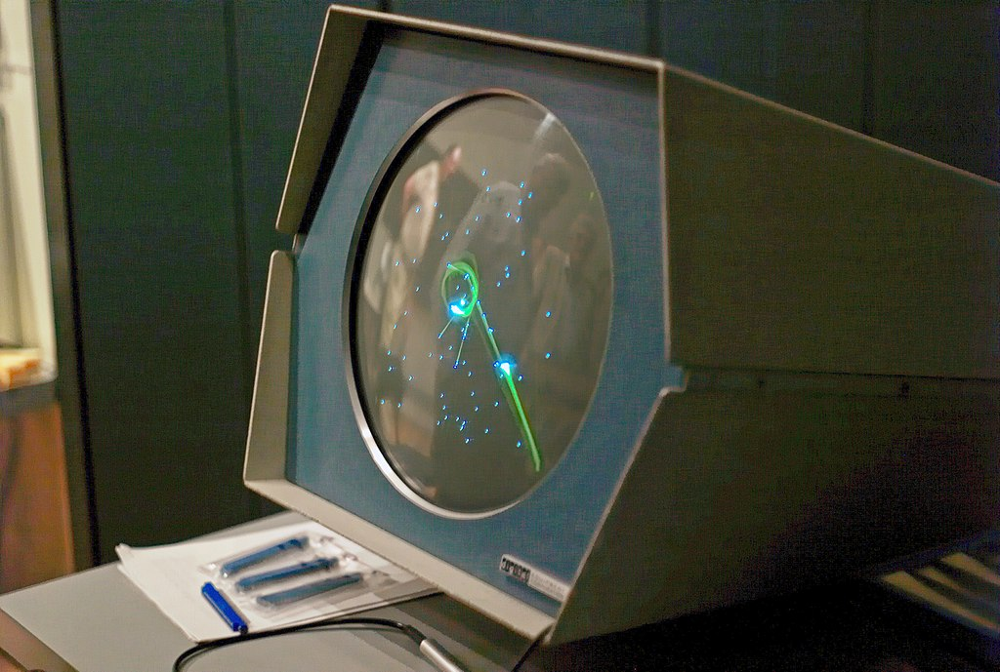
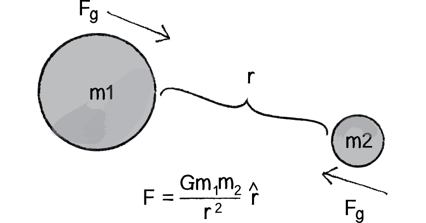
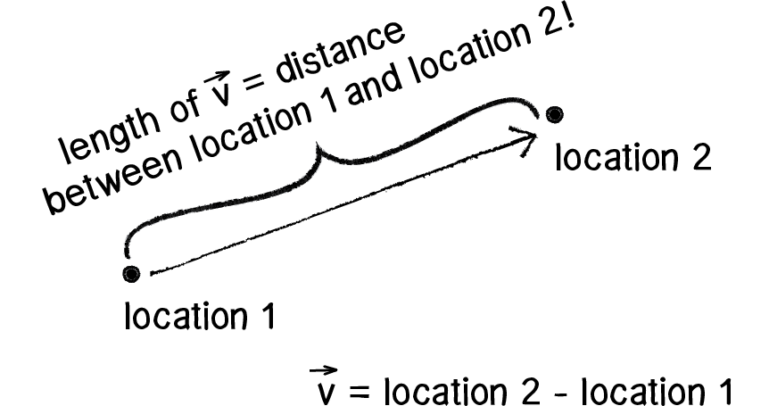
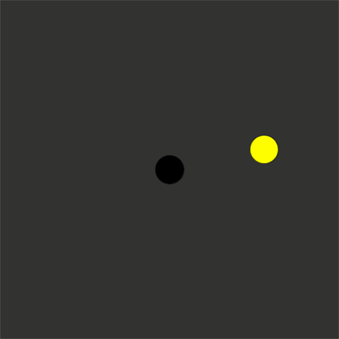
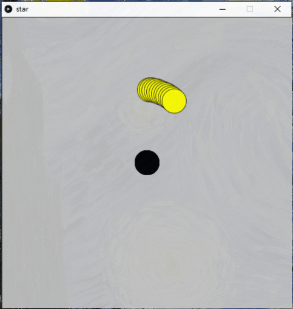
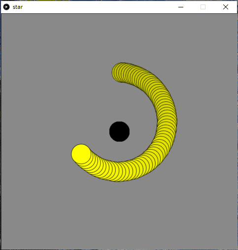
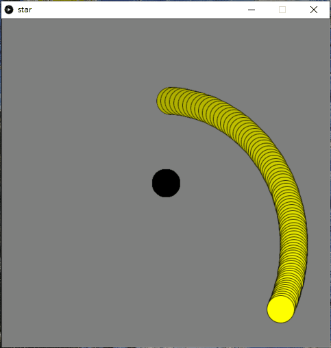
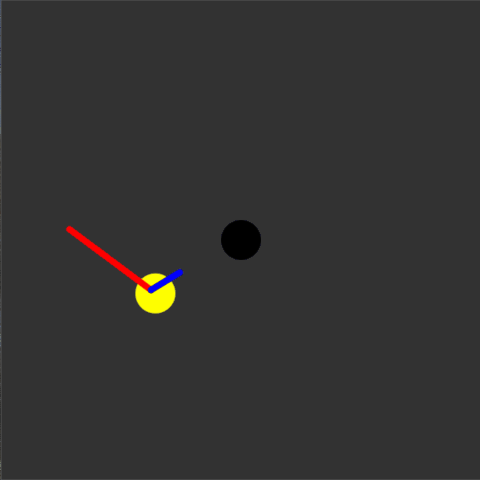
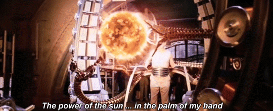

#Spacewar!

> Spacewar!《太空戰爭！》是史帝芬·羅素與馬丁·格雷茨、韋恩·維塔寧、鮑勃·桑德斯、彼得·參孫等人於1962年合作開發的太空戰爭電子遊戲。初時，他們以麻省理工學院新安設的數碼裝置公司PDP-1迷你電腦作遊戲平台，並以PDP-1的匯編語言編寫代碼。後來，遊戲被學院其他學生和員工進一步擴展改良，當中包括丹·愛德華茲和彼得·參孫。程式設計師還把遊戲散佈至其他PDP-1電腦上，使它成為首款在單一機構以外可以接觸得到的遊戲。
>
> 遊戲以星空為背景，兩名玩家須各自操作太空船「楔形船」或「針形船」，在恆星重力穴中移動並射擊對方船隻。每艘太空船都有有限的武器和燃料，即使玩家不加速，太空船仍會保持移動。玩家也可以在恆星附近航行以獲取重力助推。太空船只會在被魚雷擊中、兩船相撞或墜入恆星的情況下被摧毀。遊戲設有超空間跳躍功能，玩家可在任何時候使用，藉此隨機移動至熒幕上任一位置。但在某些版本中，每次使用這項功能都會增加太空船爆炸的風險。



[TOC]

## 0. 本章重點

1. 在遊戲中模擬物理中的引力，明白行星軌跡是怎樣運作
2. 因與上一章十分相似，***<u>本章會作為一個測驗</u>***，如果對內容有困惑，可以參考上一章節

## 1. 萬有引力[^1]


> 重力（英語：gravitation/gravity），是指具有質量的物體之間相互吸引的作用，也是物體重量的來源。在1687年，艾薩克·牛頓在他的《自然哲學的數學原理》一書中發表了萬有引力定律。


如果兩個質點的質量分別為$m_1$和$m_2$，並且它們之間的距離為$r$，則它們之間的引力$F$為:
$$
F = \frac{Gm_1m_2}{r^2}\hat{r}
$$
<div style="text-align: center"></div>

[^1]:https://natureofcode.com/book/chapter-2-forces/

###1.1 用程式實現

```python
m1 = 1000
m2 = 1e6
object1Pos = PVector(0,0)
object2Pos = PVector(0,0)
object1Vec = PVector(0,0)
object2Vec = PVector(0,0)
G = 6.67E-6 #just a random number, not the same as physics

def setup():
    global object1Pos, object2Pos
    size(600,600)
    object1Pos = PVector(random(0, width), random(0, height))
    object2Pos = PVector(width/2, height/2)
    
def draw():
    global object1Pos, object2Pos, object1Vec, object2Vec
    background(50)
    
    r = PVector.sub(object2Pos, object1Pos)
    F = PVector.mult(r.copy().normalize(), G*m1*m2/sq(r.mag()))
    
    object1Vec = PVector.add(object1Vec, F)
    object1Pos = PVector.add(object1Pos, object1Vec)
    
    fill('#FFFF00')
    ellipse(object1Pos.x, object1Pos.y, 50,50)
    fill(0)
    ellipse(object2Pos.x, object2Pos.y, 50,50)
```



### 1.2 轉用class去管理

`star.pyde`

```python
from star import *

star1 = star2 = 0
G = 6.67E-6  #just a random number, not the same as physics

def setup():
    global star1, star2
    size(600,600)
    star1 = Star(1000, PVector(width/2, height/4))
    star2 = Star(1e6, PVector(width/2, height/2))
    
def draw():
    global star1, star2

    background(50)
    
    r = PVector.sub(star2.pos, star1.pos)
    F = PVector.mult(r.copy().normalize(), G*star1.mass*star2.mass/sq(r.mag()))
    
    star1.applyForce(F)
    
    fill('#FFFF00')
    ellipse(star1.pos.x, star1.pos.y, 50,50)
    fill(0)
    ellipse(star2.pos.x, star2.pos.y, 50,50)
```

`star.py`

```python
class Star(object):
    def __init__(self, _mass, _pos):
        self.mass = _mass
        self.pos = _pos
        self.vec = PVector()

    def applyForce(self, _force):
        self.vec = PVector.add(self.vec, _force)
        self.pos = PVector.add(self.pos , self.vec)
```


效果跟之前是一樣的，只是轉了用class的方法去做，而且star1一開始出現的地方也固定了方便觀察，內容都是一樣的。

### 1.3 行星是怎樣轉轉的?

只要將`star1`加入一點點初速，你就會見到完全不一樣的效果。

`star.pyde`

```python
from star import *

star1 = star2 = 0
G = 6.67E-6

def setup():
    
    global star1, star2
    size(600,600)
    star1 = Star(1000, PVector(width/2, height/4))
    star1.vec = PVector(4, 0)
    star2 = Star(1e6, PVector(width/2, height/2))

def draw():
    global star1, star2

    fill(50, 50, 50, 1)
    rect(0, 0 ,width, height)
    
    r = PVector.sub(star2.pos, star1.pos)
    F = PVector.mult(r.copy().normalize(), G*star1.mass*star2.mass/sq(r.mag()))
    
    star1.applyForce(F)
    
    fill('#FFFF00')
    ellipse(star1.pos.x, star1.pos.y, 50,50)
    fill(0)
    ellipse(star2.pos.x, star2.pos.y, 50,50)
```
<div style="text-align: center">

    <br>

</div>

上面這四張圖，`star1.vec`的初始值分別是 `PVector(4, 0)`, ` PVector(5, 0)`,  `PVector(7, 0)`,  `PVector(8, 0)`，大於8的話，中間的`star2`便不能夠吸引`star1`圍繞著轉。



中文學校的初中物理課程就會認識到一個定律叫[開普勒定律](https://zh.wikipedia.org/wiki/%E5%BC%80%E6%99%AE%E5%8B%92%E5%AE%9A%E5%BE%8B)。其主要內容就是透過觀察發現到， **行星軌道不是圓形而是橢圓形**，而且**行星公轉的速度不是均速**而是時快時慢。這些論點，大大地動搖了當時的天文學與物理學。

一個世紀後，牛頓應用他的第二定律和萬有引力定律，在數學上嚴格地証明了開普勒定律，也讓人了解了其中的物理意義。

透過數學公式去計算的話，會涉及到複雜的微分方程，難以向初中生解釋。

但，現在你可以透過自己寫的幾行程式，親自驗算天體軌跡是如何運行和形成的。



至於其他遊戲的部分，幾乎跟上一章是完全一樣的，可以用上一章的內容來修改。
