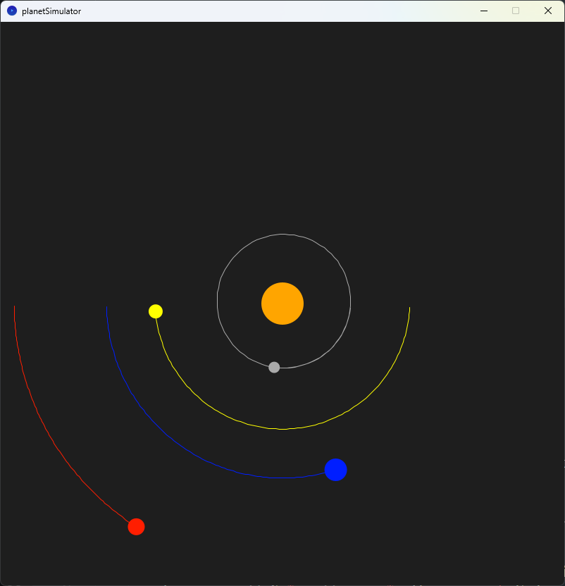

# Planet Simulator

在這一章，我們會跟據之前的萬有引力和行星的軌道特徵，製作一個簡單的行星模擬器。

[toc]

##0. 初始化

`planetSimulator.pyde`

```python
from Planet import *

sun = earth = None
planets = []

def setup():
    size(800, 800)

    frameRate(60)

    sun = Planet(PVector(0, 0), 30, "#FFA500", 1.98892e30)
    sun.isSun = True

    earth = Planet(PVector(-1*Planet.AU, 0), 16, "#001EFF", 5.972e24)

    planets.append(sun)
    planets.append(earth)

def draw():
    background(30)

    for planet in planets:
        planet.draw()
```

`Planet.py`

```python
class Planet:
    AU = 149597870700.0 # AU is the astronomical unit, in meters
    G = 6.67408e-11 # G is the gravitational constant, in m^3 kg^-1 s^-2
    SCALE = 250.0 / AU # 250pixel/AU
    TIMESTEP = 3600.0*24.0 # 1 day, timestep in seconds

    def __init__(self, position, radius, color, mass):
        self.position = position
        self.radius = radius
        self.color = color
        self.mass = mass

        self.isSun = False
        self.distanceToSun = 0

    def draw(self   ):
        x = self.position.x * self.SCALE + width/2
        y = self.position.y * self.SCALE + height/2
      
        fill(self.color)
        ellipse(x, y, self.radius*2, self.radius*2)
```


這兩段程式碼的要點包括：

第一段程式碼：

- 引入`Planet`類別。
- 創建太陽和地球物件。
- 設定畫布尺寸和幀率。
- 將太陽和地球物件加入`planets`列表。
- 在`draw`函式中，設定畫布背景為黑色。
- 遍歷`planets`列表中的每個行星物件，並呼叫其`draw`方法繪製行星。

第二段程式碼：

- 定義`Planet`類別。
- 屬性包括位置、半徑、顏色和質量。
- 輔助屬性包括`isSun`和`distanceToSun`。
- `draw`方法計算並繪製行星的圓形表示。

程式碼的目的是創建和模擬太陽系中的行星運動。

## 1. 增加其他行星

`planetSimulator.pyde`

```python
from Planet import *

sun = earth = mars = mercury = venus = None
planets = []

def setup():
    size(800, 800)

    frameRate(60)

    sun = Planet(PVector(0, 0), 30, "#FFA500", 1.98892e30)
    sun.isSun = True

    earth = Planet(PVector(-1*Planet.AU, 0), 16, "#001EFF", 5.972e24)
    mars = Planet(PVector(-1.524*Planet.AU, 0), 12, "#FF1E00", 6.39e23)
    mercury = Planet(PVector(0.387*Planet.AU, 0), 8, "#AAAAAA", 3.285e23)
    venus = Planet(PVector(0.723*Planet.AU, 0), 10, "#FFFF00", 4.867e24)

    planets.append(sun)
    planets.append(earth)
    planets.append(mars)
    planets.append(mercury)
    planets.append(venus)

def draw():
    background(30)

    for planet in planets:
        # planet.updatePos(planets)
        planet.draw()
```

`Planet.py`

```Python
class Planet:
    AU = 149597870700.0 # AU is the astronomical unit, in meters
    G = 6.67408e-11 # G is the gravitational constant, in m^3 kg^-1 s^-2
    SCALE = 250.0 / AU # 250pixel/AU
    TIMESTEP = 3600.0*24.0 # 1 day, timestep in seconds

    def __init__(self, position, radius, color, mass):
        self.position = position
        self.radius = radius
        self.color = color
        self.mass = mass

        self.isSun = False
        self.distanceToSun = 0

    def draw(self):
        x = self.position.x * self.SCALE + width/2
        y = self.position.y * self.SCALE + height/2
      
        fill(self.color)
        noStroke()
        ellipse(x, y, self.radius*2, self.radius*2)
```


這兩段程式碼與之前相比增加了以下內容：

在`planetSimulator.pyde`中：

- 創建了額外的行星物件，包括火星（Mars）、水星（Mercury）和金星（Venus）。
- 將火星、水星和金星物件加入`planets`列表。

在`Planet.py`中：

- 在`Planet`類別中沒有新增任何功能，只有保留了之前的屬性和方法。

這些變更使得模擬器能夠模擬更多的行星運動，不僅僅是太陽和地球。現在，模擬器可以同時模擬太陽、地球、火星、水星和金星的運動。每個行星都有其自己的位置、半徑、顏色和質量，並且根據這些屬性在畫布上繪製圓形表示。

## 2.  增加引力

`planetSimulator.pyde`

```python
from Planet import *

sun = earth = mars = mercury = venus = None
planets = []

def setup():
    size(800, 800)

    sun = Planet(PVector(0, 0), 30, "#FFA500", 1.98892e30)
    sun.isSun = True

    earth = Planet(PVector(-1*Planet.AU, 0), 16, "#001EFF", 5.972e24)
    mars = Planet(PVector(-1.524*Planet.AU, 0), 12, "#FF1E00", 6.39e23)
    mercury = Planet(PVector(0.387*Planet.AU, 0), 8, "#AAAAAA", 3.285e23)
    venus = Planet(PVector(0.723*Planet.AU, 0), 10, "#FFFF00", 4.867e24)

    planets.append(sun)
    planets.append(earth)
    planets.append(mars)
    planets.append(mercury)
    planets.append(venus)

def draw():
    background(30)

    for planet in planets:
        planet.updatePos(planets)
        planet.draw()


```

`Planet.py`

```python
class Planet:
    AU = 149597870700.0 # AU is the astronomical unit, in meters
    G = 6.67408e-11 # G is the gravitational constant, in m^3 kg^-1 s^-2
    SCALE = 250.0 / AU # 250pixel/AU
    TIMESTEP = 3600.0*24.0 # 1 day, timestep in seconds

    def __init__(self, position, radius, color, mass):
        self.position = position
        self.radius = radius
        self.color = color
        self.mass = mass

        self.isSun = False
        self.distanceToSun = 0

        self.velocity = PVector(0, 0)

    def draw(self):
        x = self.position.x * self.SCALE + width/2
        y = self.position.y * self.SCALE + height/2
      
        fill(self.color)
        noStroke()
        ellipse(x, y, self.radius*2, self.radius*2)

    def attraction(self, other):
        distance = PVector.dist(self.position, other.position)
        force = self.G * self.mass * other.mass / (distance * distance)
        direction = PVector.sub(other.position, self.position).normalize()
        if other.isSun:
            self.distanceToSun = distance
        return PVector.mult(direction, force)
    
    def updatePos(self, planets):
        if not self.isSun:
            force = PVector(0, 0)
            for planet in planets:
                if planet != self:
                    force = PVector.add(force, self.attraction(planet))
            acceleration = PVector.div(force, self.mass)
            self.velocity = PVector.add(self.velocity, PVector.mult(acceleration, self.TIMESTEP))
            self.position = PVector.add(self.position, PVector.mult(self.velocity, self.TIMESTEP))
```


**只見到一個太陽是正常的，因為程式一開始，所有行星已被太陽吸引相撞到太陽。**

這兩段程式碼相較於之前的版本，新增了以下內容：

在`planetSimulator.pyde`中：

- 在`draw`函式中，對`planets`列表中的每個行星物件呼叫`updatePos`方法，以計算行星的運動狀態。
- 在`Planet`物件的創建過程中，為每個行星物件設置了初始速度(`velocity`)，並將其設為`(0, 0)`。

在`Planet.py`中：

- 在`Planet`類別中新增了`attraction`方法，用於計算行星之間的引力。
- 在`Planet`類別中新增了`updatePos`方法，用於根據行星之間的引力更新行星的位置。
- 在`Planet`類別的建構函式中，新增了`velocity`屬性，用於表示行星的初始速度。


在`Planet.py`中的`attraction`方法和`updatePos`方法的功能如下：

`attraction`方法：

- `attraction`方法計算兩個行星物件之間的引力，並返回一個表示引力方向和大小的向量。
- 首先，方法計算兩個行星物件之間的距離，使用`self.position.dist(other.position)`計算兩個位置向量之間的歐氏距離。
- 接著，使用牛頓萬有引力定律計算引力的大小，公式為`force = self.G * self.mass * other.mass / (distance * distance)`，其中`G`是引力常數，`self.mass`和`other.mass`分別是兩個行星的質量。
- 然後，計算引力的方向，使用`direction = PVector.sub(other.position, self.position).normalize()`，這個向量表示從`self.position`指向`other.position`的方向，並將其單位化。
- 如果`other`行星是太陽，則將`distance`賦值給`self.distanceToSun`，以便在後續使用。
- 最後，返回引力向量，為`direction.mult(force)`，將方向乘以大小得到最終的引力向量。

`updatePos`方法：

- `updatePos`方法用於更新行星的位置，根據行星之間的引力相互作用。
- 首先，檢查行星是否為太陽，如果不是太陽，則進行以下計算：
	- 創建一個初始為`(0, 0)`的力(`force`)向量。
	- 對於`planets`列表中的每個行星物件（除了自身），呼叫`attraction`方法，計算與其他行星之間的引力，並將計算結果添加到`force`向量中。
	- 根據牛頓第二定律，`force`等於質量(`self.mass`)乘以加速度(`acceleration`)，所以要計算加速度，需要將`force`除以自身的質量，即`acceleration = force.div(self.mass)`。
	- 根據瞬時速度等於加速度乘以時間間隔(`self.velocity.add(acceleration.mult(self.TIMESTEP))`)，更新行星的速度。
	- 根據速度等於位移乘以時間間隔(`self.position.add(self.velocity.mult(self.TIMESTEP))`)，更新行星的位置。

## 3. 自帶速度

`planetSimulator.pyde`

```python
from Planet import *

sun = earth = mars = mercury = venus = None
planets = []

def setup():
    size(800, 800)

    sun = Planet(PVector(0, 0), 30, "#FFA500", 1.98892e30)
    sun.isSun = True

    earth = Planet(PVector(-1*Planet.AU, 0), 16, "#001EFF", 5.972e24)
    mars = Planet(PVector(-1.524*Planet.AU, 0), 12, "#FF1E00", 6.39e23)
    mercury = Planet(PVector(0.387*Planet.AU, 0), 8, "#AAAAAA", 3.285e23)
    venus = Planet(PVector(0.723*Planet.AU, 0), 10, "#FFFF00", 4.867e24)

    earth.velocity = PVector(0.0, 29780.0)
    mars.velocity = PVector(0.0, 24077.0)
    mercury.velocity = PVector(0.0, 47362.0)
    venus.velocity = PVector(0.0, 35020.0)

    planets.append(sun)
    planets.append(earth)
    planets.append(mars)
    planets.append(mercury)
    planets.append(venus)

def draw():
    background(30)

    for planet in planets:
        planet.updatePos(planets)
        planet.draw()
```


只要為每顆行星增加初速，就可以模擬到運行。

## 4. 加入軌道

`Planet.py`

```python
class Planet:
    AU = 149597870700.0 # AU is the astronomical unit, in meters
    G = 6.67408e-11 # G is the gravitational constant, in m^3 kg^-1 s^-2
    SCALE = 250.0 / AU # 250pixel/AU
    TIMESTEP = 3600.0*24.0 # 1 day, timestep in seconds

    def __init__(self, position, radius, color, mass):
        self.position = position
        self.radius = radius
        self.color = color
        self.mass = mass

        self.isSun = False
        self.distanceToSun = 0

        self.velocity = PVector(0, 0)

        self.orbit = []

    def draw(self):
        x = self.position.x * self.SCALE + width/2
        y = self.position.y * self.SCALE + height/2

        self.orbit.append(PVector(x, y))
        stroke(self.color)
        noFill()
        beginShape()
        for point in self.orbit:
            vertex(point.x, point.y)
        endShape()

        fill(self.color)
        noStroke()
        ellipse(x, y, self.radius*2, self.radius*2)

    def attraction(self, other):
        distance = PVector.dist(self.position, other.position)
        force = self.G * self.mass * other.mass / (distance * distance)
        direction = PVector.sub(other.position, self.position).normalize()
        if other.isSun:
            self.distanceToSun = distance
        return PVector.mult(direction, force)
    
    def updatePos(self, planets):
        if not self.isSun:
            force = PVector(0, 0)
            for planet in planets:
                if planet != self:
                    force = PVector.add(force, self.attraction(planet))
            acceleration = PVector.div(force, self.mass)
            self.velocity = PVector.add(self.velocity, PVector.mult(acceleration, self.TIMESTEP))
            self.position = PVector.add(self.position, PVector.mult(self.velocity, self.TIMESTEP))
```



- 在`Planet`類別的初始化新增：

	```python
	self.orbit = []
	```

	用來紀錄全部軌道的點。

- 在`draw`功能中，新增：

	```python
	self.orbit.append(PVector(x, y))
	stroke(self.color)
	noFill()
	beginShape()
	for point in self.orbit:
	    vertex(point.x, point.y)
	endShape()
	```

	這段程式碼用於繪製行星的軌道。它將每個軌道上的點存儲在`self.orbit`列表中，然後使用`beginShape()`、`vertex()`和`endShape()`函式來繪製軌道的形狀。

	## 5. 加入太陽到各行星的距離

	`Planet.py`

```python
class Planet:
    AU = 149597870700.0 # AU is the astronomical unit, in meters
    G = 6.67408e-11 # G is the gravitational constant, in m^3 kg^-1 s^-2
    SCALE = 250.0 / AU # 250pixel/AU
    TIMESTEP = 3600.0*24.0 # 1 day, timestep in seconds

    def __init__(self, position, radius, color, mass):
        self.position = position
        self.radius = radius
        self.color = color
        self.mass = mass

        self.isSun = False
        self.distanceToSun = 0

        self.velocity = PVector(0, 0)

        self.orbit = []

    def draw(self):
        x = self.position.x * self.SCALE + width/2
        y = self.position.y * self.SCALE + height/2

        self.orbit.append(PVector(x, y))
        stroke(self.color)
        noFill()
        beginShape()
        for point in self.orbit:
            vertex(point.x, point.y)
        endShape()

        fill(self.color)
        noStroke()
        ellipse(x, y, self.radius*2, self.radius*2)
        
        textAlign(CENTER)
        text(nfc(self.distanceToSun,0), x, y-25)

    def attraction(self, other):
        distance = PVector.dist(self.position, other.position)
        force = self.G * self.mass * other.mass / (distance * distance)
        direction = PVector.sub(other.position, self.position).normalize()
        if other.isSun:
            self.distanceToSun = distance
        return PVector.mult(direction, force)
    
    def updatePos(self, planets):
        if not self.isSun:
            force = PVector(0, 0)
            for planet in planets:
                if planet != self:
                    force = PVector.add(force, self.attraction(planet))
            acceleration = PVector.div(force, self.mass)
            self.velocity = PVector.add(self.velocity, PVector.mult(acceleration, self.TIMESTEP))
            self.position = PVector.add(self.position, PVector.mult(self.velocity, self.TIMESTEP))
```


在`draw()`的最後，加入：

```python
 textAlign(CENTER)
 text(nfc(self.distanceToSun,0), x, y-25)
```

`nfc()` 函式用於將數值轉換為指定小數位數的字串。在這個程式碼中，它將 `self.distanceToSun` 的值轉換為小數點後0位的字串。然後，`text()` 函式用於在位置 `(x, y-25)` 繪製這個字串。

從結果你可以發現，行星的半徑並不是固定的，行星的軌道並不是圓型。
