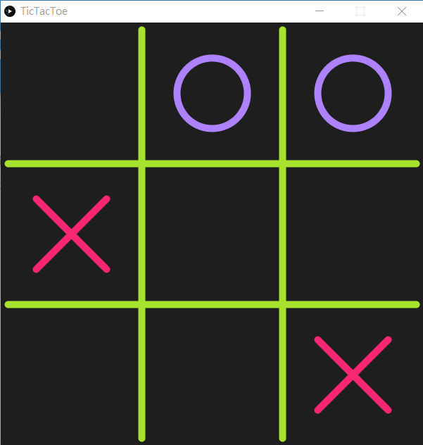

# TEST 1: Tic Tac Toe

> 在三排棋盤上玩的遊戲可以追溯到古埃及，在公元前1300年左右的屋瓦上發現了這種遊戲板。井字遊戲的早期變化是在公元前一世紀左右的羅馬帝國播出的。



下面程式是遊戲大約的框架，其餘部分請自行完成。

```python
'''
create a 3X3 list as game board,
using int -1 as 'X',  +1 as 'O', 0 as empty
'''

gameBoard = []


def setup():
    global gameBoard

    size(600, 600)

    for i in range(3):
        temp = []
        for j in range(3):
            temp.append(0)
        gameBoard.append(temp)


def draw():
    global gameBoard

    background(30)

    gameBoard = [[1,  0, -1],
                 [-1, 1, 0],
                 [0,  0, 1]]
    
    stroke(166, 226, 46)
    line(10, height/3, width-10, height/3)
    line(10, height*2/3, width-10, height*2/3)
    line(width/3, 10, width/3, height-10)
    line(width*2/3, 10, width*2/3, height-10)

    cross(2, 2)
    cross(1, 0)
    circle(0,2)
    circle(0,1)
    ''' for i in range(3):
        for j in range(3):
            if gameBoard[i][j] == -1:
                # draw cross in x,y position
            elif gameBoard[i][j] == 1:
                # draw circle in x,y position
    '''
    
def mousePressed():
    pass
    # control the game here
    # if (mouseX > ??? and mouseX < ??? and mouseY > ??? and mouseY < ???)
    #   gameBoard[?][?] = ?

def cross(i, j):
    # use push() pop() and translate to draw
    push()
    stroke(249, 38, 114)
    strokeWeight(10)
    translate(j*width/3+width/6, i*height/3+height/6)
    line(-50, -50, 50, 50)
    line(50, -50, -50, 50)
    pop()

def circle(i, j):
    # directly use the x y coordinate to draw
    noFill()
    stroke(174, 129, 255)
    strokeWeight(10)
    ellipse(j*width/3+width/6, i*height/3+height/6, 100, 100)
```

