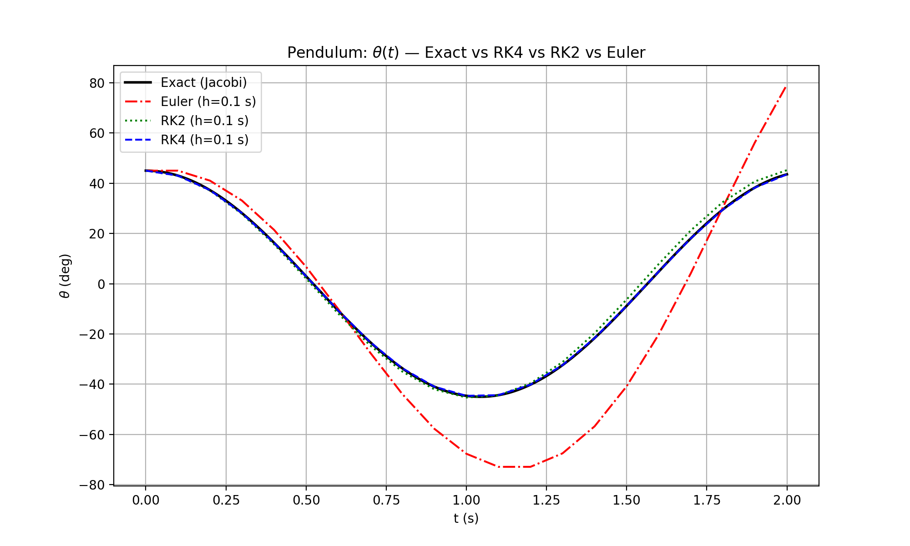

# 數值方法入門：以單擺為例理解 Euler、RK2（midpoint）、RK4（classical）

> 關鍵信息密度高、一步到位。你之後回看，應該可以即刻上手。

## 0. 問題背景與符號

考慮常微分方程（ODE）初值問題：
$$
\dot{y}=f(t,y),\quad y(t_0)=y_0,
$$
當 $f$ 太複雜（或無解析解）時，用數值法由 $t_n\to t_{n+1}=t_n+h$ 逐步積分近似 $y_{n+1}$。

## 1. 從 Taylor 展開到 Euler／RK

以 Taylor 展開：
$$
y(t+h)=y(t)+h f(t,y)+\tfrac{h^2}{2} f'(t,y)+O(h^3).
$$

- **Euler（顯式）**：只保留第一項
	$$
	\boxed{y_{n+1}=y_n+h\,f(t_n,y_n)}
	$$
	幾何上等於**長方形積分**；Local error $O(h^2)$、Global error $O(h)$。

- **RK2（midpoint）**：取**中點斜率**
	$$
	\begin{aligned}
	k_1&=f(t_n,y_n),\\
	k_2&=f\!\Bigl(t_n+\tfrac{h}{2},\,y_n+\tfrac{h}{2}k_1\Bigr),\\
	\boxed{y_{n+1}=y_n+h\,k_2}
	\end{aligned}
	$$
	類似**梯形／中點積分**；Global error $O(h^2)$。

- **RK4（classical）**：四點加權平均
	$$
	\begin{aligned}
	k_1&=f(t_n,y_n),\\
	k_2&=f\!\Bigl(t_n+\tfrac{h}{2},\,y_n+\tfrac{h}{2}k_1\Bigr),\\
	k_3&=f\!\Bigl(t_n+\tfrac{h}{2},\,y_n+\tfrac{h}{2}k_2\Bigr),\\
	k_4&=f(t_n+h,\,y_n+h\,k_3),\\
	\boxed{y_{n+1}=y_n+\tfrac{h}{6}\bigl(k_1+2k_2+2k_3+k_4\bigr)}
	\end{aligned}
	$$
	幾何上＝**多點平均斜率**；Global error $O(h^4)$。

## 2. 單擺（Pendulum）作為非線性測試牀

**模型（無阻尼）**
$$
\ddot{\theta}+\frac{g}{L}\sin\theta=0
\quad\Rightarrow\quad
y=\begin{bmatrix}\theta\\\omega\end{bmatrix},\ 
f(y)=\begin{bmatrix}\omega\\ -\tfrac{g}{L}\sin\theta\end{bmatrix}.
$$

### 2.1 矩陣（向量）更新式（Euler／RK2／RK4）

**Euler**：
$$
\boxed{
y_{n+1}^{(\mathrm{Euler})}=
\begin{bmatrix}
\theta_n+h\,\omega_n\\[4pt]
\omega_n-\dfrac{g\,h}{L}\sin\theta_n
\end{bmatrix}}
$$


**RK2（Midpoint）**：
$$
\boxed{
y_{n+1}^{(\mathrm{RK2})}=
\begin{bmatrix}
\theta_n+h\,\omega_n-\dfrac{g\,h^2}{2L}\sin\theta_n\\[6pt]
\omega_n-\dfrac{g\,h}{L}\sin\!\Bigl(\theta_n+\dfrac{h\,\omega_n}{2}\Bigr)
\end{bmatrix}}
$$


**RK4（Classical）**
 以 $k_1,\dots,k_4$ 的**矩陣式**寫法：
$$
\begin{aligned}
k_1&=\begin{bmatrix}\omega_n\\[2pt]-\dfrac{g}{L}\sin\theta_n\end{bmatrix},\quad
k_2=\begin{bmatrix}
\omega_n+\tfrac{h}{2}k_{1,\omega}\\[4pt]
-\dfrac{g}{L}\sin\!\bigl(\theta_n+\tfrac{h}{2}k_{1,\theta}\bigr)
\end{bmatrix},\\[6pt]
k_3&=\begin{bmatrix}
\omega_n+\tfrac{h}{2}k_{2,\omega}\\[4pt]
-\dfrac{g}{L}\sin\!\bigl(\theta_n+\tfrac{h}{2}k_{2,\theta}\bigr)
\end{bmatrix},\quad
k_4=\begin{bmatrix}
\omega_n+h\,k_{3,\omega}\\[4pt]
-\dfrac{g}{L}\sin\!\bigl(\theta_n+h\,k_{3,\theta}\bigr)
\end{bmatrix},
\end{aligned}
$$

### 2.2 真解（作對照）

單擺精確解可用 **Jacobi 橢圓函數**寫成（中大幅角時如此）；小角近似 $\sin\theta\!\approx\!\theta$ 才退化為簡諧 $\theta(t)\approx\theta_0\cos(\sqrt{g/L}\,t)$。



由上圖可見，如果`h`的值不夠細，即計算精度不夠高，在Euler算法上會嚴重偏移，但在RK4上還保持良好。

## 3. Gravity ODE：何時需要 RK？何時不需要？

**恆定重力：** $\dot x=v,\ \dot v=a=(0,0,-g)$
 解析解：
$$
x(t)=x_0+v_0 t+\tfrac12 a t^2,\quad v(t)=v_0+a t.
$$
→ 這時 **Euler 有 $O(h)$ 誤差**；**RK2 已精確**；**RK4/Adaptive RK 沒必要**。
 **需要 RK 的情形：**

- 空氣阻力（加速度依賴 $v$）：非線性、無解析解
- 變重力場（例如 $g(r)=GM/r^2$）：非線性
- **N-body** 多體引力：無解析解，只能數值法（甚至要保結構積分器）

## 4. 輕量可重用工具：固定步長 Euler／RK2／RK4（Python）

我幫你寫咗**通用整合器模組**（最小但實用）：

- 下載模組： **[ode_integrators.py](ode_integrators.py)** 

- 介面極簡：

```python
from ode_integrators import integrate
ts, ys = integrate(f, t0=0.0, y0=np.array([...]), t1=10.0, h=0.01, method="rk4")
```

- `method` 可選 `"euler" | "rk2" | "rk4"`；固定步長 `h`；回傳等距 `ts`、配對 `ys`。

### 4.1 範例 A：恆定重力（6 維）

```python
import numpy as np
from ode_integrators import integrate

g = 9.81
def grav_rhs(t, y):
    # y = [x, y, z, vx, vy, vz]
    x, y_, z, vx, vy, vz = y
    ax, ay, az = 0.0, 0.0, -g
    return np.array([vx, vy, vz, ax, ay, az], dtype=float)

y0 = np.array([0, 0, 0,   10, 5, 20], dtype=float)
ts, ys = integrate(grav_rhs, t0=0.0, y0=y0, t1=2.0, h=0.1, method="rk2")
```

### 4.2 範例 B：單擺（2 維）

```PYTHON
import numpy as np
from ode_integrators import integrate

g, L = 9.81, 1.0
def pend_rhs(t, y):
    th, om = y
    return np.array([om, -(g/L)*np.sin(th)], dtype=float)

y0 = np.array([np.deg2rad(45.0), 0.0])
ts, ys = integrate(pend_rhs, 0.0, y0, 0.5, 0.05, method="rk4")

theta_deg = np.rad2deg(ys[:,0])
omega_deg_s = np.rad2deg(ys[:,1])
```

> 想要**事件偵測**（撞地、過零交叉）、**能量監控**、或**自動步長**？請看下一節 SciPy。


## 5. 現成高階解算器：SciPy `solve_ivp`（自動步長／誤差控制）

如可用 **SciPy**，建議一般專案直接用 `solve_ivp`：

```python
import numpy as np
from scipy.integrate import solve_ivp

# 單擺例子
g, L = 9.81, 1.0
def f(t, y):
    # y = [theta, omega]
    th, om = y
    return np.array([om, -(g/L)*np.sin(th)], dtype=float)

t_span = (0.0, 10.0)
y0 = np.array([np.deg2rad(45.0), 0.0], dtype=float)

# 常用顯式自適應：RK45（Dormand–Prince）
sol = solve_ivp(f, t_span, y0, method="RK45",
                rtol=1e-6, atol=1e-9, dense_output=True)

# 固定時間網格取樣
t_eval = np.linspace(0, 10, 501)
sol = solve_ivp(f, t_span, y0, method="RK45",
                t_eval=t_eval, rtol=1e-6, atol=1e-9)

ts = sol.t           # (N,)
ys = sol.y.T         # (N, d)  注意：SciPy 的 y 是 (d, N)
```

**方法選擇指引：**

- `RK45`：大多數非剛性問題的默認選擇
- `DOP853`：更高階顯式 RK（步數更省）
- `Radau` / `BDF`：**剛性**問題（隱式，穩定域大）
- `rtol/atol`：誤差控制旋鈕；越嚴格越慢但更準

**Gravity 的建議**

- 恆定重力：**closed-form** 或我上面的 **rk2** 已經夠；
- 變重力場／空阻／N-body：建議 `RK45/DOP853`；剛性時 `Radau/BDF`。

------

## 6. 常見坑位 Checklist

- **步長是時間（秒）**，唔係角度或空間單位
- **單位一致**（deg vs rad、m vs cm、N vs kN）
- **能量漂移**：Euler 會嚴重漂移；RK2 好很多；RK4 更穩
- **剛性系統**：顯式發散 → 試 `Radau/BDF`
- **事件偵測**：`solve_ivp` 的 `events` 可做（撞牆、過零）
- **多體問題**：注意數值穩定性與守恆（考慮 symplectic integrator）

## 附：可直接貼入你筆記的 SymPy 檢核程式（等價驗證＆輸出 LaTeX）

```python
# SymPy: Pendulum ODE updates in matrix form + RK4 equivalence check

import sympy as sp

theta_n, omega_n, h, g, L = sp.symbols('theta_n omega_n h g L', real=True)
y_n = sp.Matrix([theta_n, omega_n])

def f(y):
    th, om = y
    return sp.Matrix([om, -(g/L) * sp.sin(th)])

# Euler
y_euler = sp.simplify(y_n + h * f(y_n))

# RK2 (midpoint)
k1_rk2 = f(y_n)
k2_rk2 = f(y_n + (h/2) * k1_rk2)
y_rk2 = sp.simplify(y_n + h * k2_rk2)

# RK4 (teaching form)
k1 = f(y_n)
k2 = f(y_n + (h/2) * k1)
k3 = f(y_n + (h/2) * k2)
k4 = f(y_n + h * k3)
y_rk4_A = sp.simplify(y_n + (h/6) * (k1 + 2*k2 + 2*k3 + k4))

# RK4 (long-form stages)
theta_1 = theta_n + (h/2)*k1[0];   omega_1 = omega_n + (h/2)*k1[1]
k2_alt  = sp.Matrix([omega_1, -(g/L)*sp.sin(theta_1)])

theta_2 = theta_n + (h/2)*k2_alt[0]; omega_2 = omega_n + (h/2)*k2_alt[1]
k3_alt  = sp.Matrix([omega_2, -(g/L)*sp.sin(theta_2)])

theta_3 = theta_n + h*k3_alt[0];    omega_3 = omega_n + h*k3_alt[1]
k4_alt  = sp.Matrix([omega_3, -(g/L)*sp.sin(theta_3)])

y_rk4_B = sp.simplify(y_n + (h/6) * (k1 + 2*k2_alt + 2*k3_alt + k4_alt))

# Symbolic & numeric checks
print("Symbolic diff:")
sp.pprint(sp.simplify(y_rk4_A - y_rk4_B))

vals = {theta_n: 0.7, omega_n: -0.3, h: 0.05, g: 9.81, L: 1.2}
print("\nNumeric spot-check:", vals)
print("y_rk4_A =", sp.N(y_rk4_A.subs(vals)))
print("y_rk4_B =", sp.N(y_rk4_B.subs(vals)))
print("difference =", sp.N((y_rk4_A - y_rk4_B).subs(vals)))

# LaTeX blocks
print("\nLaTeX Euler:\n", sp.latex(y_euler))
print("\nLaTeX RK2:\n",   sp.latex(y_rk2))
print("\nLaTeX RK4:\n",   sp.latex(y_rk4_A))
```
