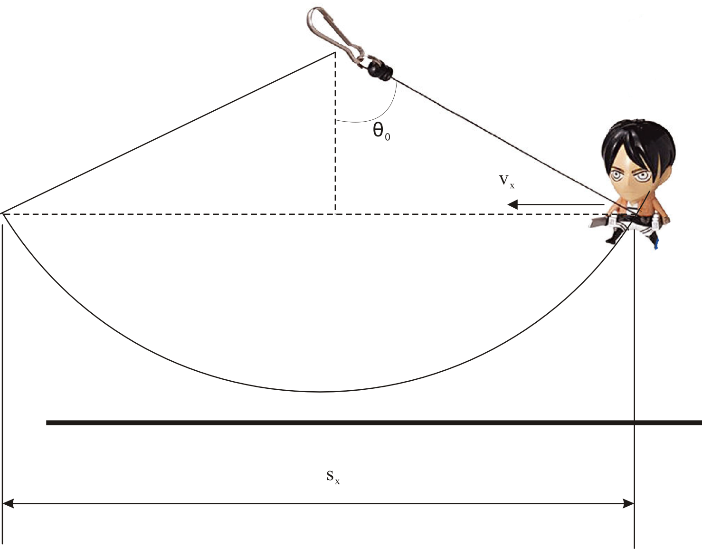
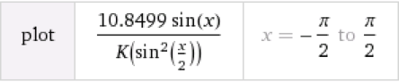
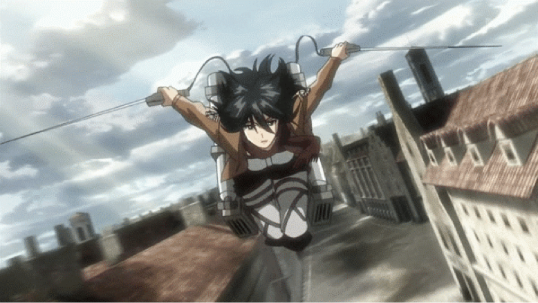
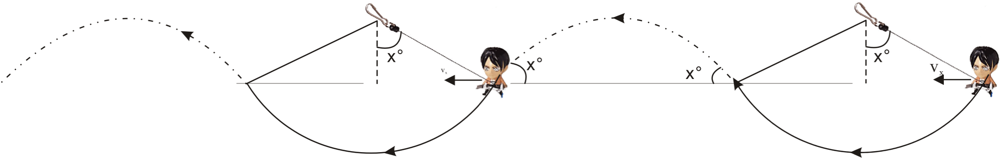
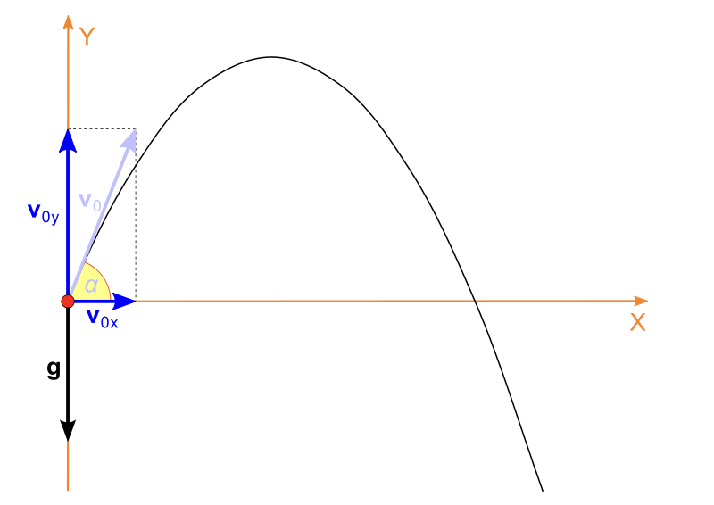

#非專業立體機動裝飾研究報告

> 1. 本篇是看過[【閒聊】人體承受立體機動裝置的加速度](http://m.gamer.com.tw/forum/C.php?bsn=43473&snA=2429&last)(http://m.gamer.com.tw/forum/C.php?bsn=43473&snA=2429&last=) 之後，覺得此篇有趣，會略有不足，所以作出一次推論和估算
> 2. 純為興趣之作，切勿當真
> 3. 本人不負責任何因計算或推導錯誤所引起或產生之任何意外。
>
> 2013年7月18日

近來大熱之「進擊之巨人」，相信不少人有看過。對於其「蜘蛛俠」式的「立體機動裝置」來移動的設定，相信亦有不少人趨之若鶩，想來說一說，好，本文就用我現學現查現賣的物理和數學知識，去分析「立體機動裝置」的真相。

## 艾倫的行進方式

巨人們的可怕，相信經歷過多次入侵的艾倫就最清楚不過。「立體機動裝置」最大的用途，是用來對付身高比人類高很多，但弱點只有後頸一小部分的巨人們。為了補足人體的身高不足，迫不得以用繩(鋼纜?)盪來盪去繞到巨人後頸位置，作出致命一擊。

但巨人們極難對付，每次外查的調查兵團只有10%的人可以回來。所以實際操作上，「立體機動裝置」最大的用途，應當是繼馬匹之外，最有效的保命逃跑工具。

根據維基百科所示: 

1. 假設繩索是無重量，不拉長，一直綳緊；

2. Motion為2D，鐘擺行程為一弧而非橘圖形；

3. 沒有能量流失，忽略空氣阻力和阻力。

則，可得出一條微分方程: 
$$
\frac{d^2\theta}{dt^2}+\frac{g}{l}sin(\theta) = 0  
$$

其中g為地球重力加速度: $9.81 \frac{kg}{m^2}$，$l$為繩索長度，$\theta$為角位移，單位是radians(此為變數，隨時間而變，應為$\theta(t)$，$\theta_0$​為初始角度(即一開始放手時的角度)。此為一微分方程，不能輕易求解。

已知鐘擺會由位能-->動能-->位能

位能轉變: $\Delta U=mgh$

動能轉變: $\Delta K=\frac{1}{2}mv^2$

因為假設沒有能量流失，所以，在每一個角位移($\theta$)，動能差=位能差
$$
\begin{align}
\frac{1}{2}mv^2 &=mgh \\
v &= \sqrt{2gh}
\end{align}
$$
轉成用角位移來表示則為:
$$
\begin{align}
v = l \frac{d\theta}{dt} &=\sqrt{2gh} \\
\frac{d\theta}{dt} &= \frac{1}{l}\sqrt{2gh}
\end{align}
$$
*(一般中學所學應為: $v = r\omega$，$a = \dfrac{v^2}{r}$等公式來表示。但實際上，因現在角速率不是常數，所以$\omega$也不是常數，應用$\dfrac{d\theta}{dt}$表示。)*

如圖所示，
$$
y_0 = l cos(\theta_0)
$$
又，
$$
y_1 = l cos(\theta)
$$
所以，
$$
h = l\left ( cos\theta -cos\theta_0 \right )
$$
代入上式: 
$$
\begin{align}
\frac{d\theta}{dt} &= \frac{1}{l} \sqrt{2gh} \\
\frac{d\theta}{dt} &= \sqrt{\frac{2g}{l}\left ( cos\theta - cos\theta_0 \right )}
\end{align}
$$
中學有學過鐘擺原理，而鐘擺週期為:
$$
T_0 = 2 \pi \sqrt{\frac{l}{g}}
$$
但上式是基於$\theta_0$為一細角度，一般為$5\degree$​以內。而實際應用以下方法求得:

將上式上下倒轉:
$$
\begin{align}
\frac{d\theta}{dt} &= \sqrt{\frac{2g}{l}\left ( cos\theta - cos\theta_0 \right )} \\
\frac{d\theta}{dt} &= \sqrt{\frac{l}{2g}} \frac{1}{\sqrt{cos\theta - cos\theta_0}}
\end{align}
$$
擺動一個周期，角度變化應為:
$$
T = t\left ( \theta_0 \to 0 \to -\theta_0 \to 0 \to \theta_0 \right )
$$
可以簡化為: 
$$
T = 4t\left ( \theta_0 \to 0  \right )
$$
所以，角度由$\theta \to 0$時間應為上式的積分:
$$
T = 4\sqrt{\frac{l}{2g}}\int_{0}^{\theta_0}\frac{1}{\sqrt{cos\theta - cos \theta_0}}dt
$$
好，這條不是人類能理解的積分式，所以我直接複製維基百科的答案:
$$
T = 4 \sqrt{ \frac{l}{g} }K \left ( sin \frac{\theta_0}{2} \right )
$$
其中，$K$為complete elliptic integral of the first kind(不要問我是甚麼……)
$$
 K(k) = \int_{0}^{\frac{\pi}{2}}\frac{1}{\sqrt{1-k^2 sin^2 u}}du
$$
所以，用人類的語言來說，
$$
T = 2\pi \sqrt{\frac{l}{g}} \left ( 1 
+ \frac{1}{16} {\theta_0}^{2} 
+ \frac{11}{3072} {\theta_0}^{4} 
+ \frac{173}{737280} {\theta_0}^{6}
+ \frac{22931}{1321205760} {\theta_0}^{8}
+ \frac{1319183}{951268147200} {\theta_0}^{10}
+ \frac{233526463}{2009078326886400} {\theta_0}^{12}
+ \cdots 
 \right )
$$
而艾倫逃走方向等於巨人前進方向(即水平方向)，為簡單計算水平方向的前進速度，用每半個鞦韆水平方向的位移，除半個周期:

水平方向的位移總量有: 
$$
s_x = 2lsin\theta_0 
$$
所以水平方向逃跑速度:
$$
\begin{align}
v_x &= \frac{2lsin\theta_0}{4 \sqrt{\frac{l}{g}} K  \left ( sin \frac{\theta_0}{2} \right ) /  2}  \\
v_x &= \frac{lsin \theta_0}{\sqrt{\frac{l}{g}} K \left ( sin \frac{\theta_0}{2} \right ) }
\end{align}
$$

根據書中所載，60m級數的巨人只出現過兩次(註: 寫這篇研究時，漫畫內容才進入到艾倫奪還戰)。就假設一般都是和巨人化的艾倫一樣都是15m高的級數。那繩索長度按理就不會準備得太長，而且據書中和動畫所見，都是約4-5層樓高。

就假設繩索長$12m$ (約4層樓高)，$g$為地球重力加速度$9.81 \frac{kg}{m^2}$。

初始角度$\theta_0$的值應在$90\degree$以內，因為大於$90\degree$，擺盪就不會以當初假設繩子一直都是拉直來進行擺盪。

將公式輸入wolframalpha.com (*原來維基百科和wolfram對於K(k)的定義不一樣，差了一個二次方….各位如想代入請注意*)，得出

上圖橫軸為$\theta_0$(radians)，直軸為艾倫每盪一次的水平平均速度($m/s$)。

**==由此得出，當$\theta_0 = 1.38013 rad = 79.076 \degree$，$v_x$得出最大值$5.98104m/s$。==**

即，艾倫最佳的行進方法應為: 向前方傾角$11\degree$處發射繩索，之後經過最低處感受最高速度$13.8m/s$(這個純粹用位能完全轉成動能去計算，中學生應該計得出來，所以不作演示)，再返回原來高度，這時水平方向行進了$23.57m$用了$3.94s$時間，瞬時速率為$0m/s$，之後再發射下一次繩索。

但話說回來==… 好慢呀…==

水平前進的平均速度最大值只有$5.98m/s$，用這個速度跑$100m$賽跑要$16.7$秒才能完成。跟一般小學女生的平均時間差不多。就算是最高速度$13.8m/s$，也不比單車來得快…..難怪沒有瓦斯的部隊注定成為巨人的點心。

## 怎樣才能保命?

那到底要用怎樣的方法來前進才可以保命呢？在還沒研究氣動裝置之前，就讓我試用所有方法去幫助艾倫逃跑吧。

首先得推測逃跑的速度。在漫畫中所見，馬匹是繼「立體機動裝置」外唯一能逃跑的工具。那就是說，艾倫的逃跑速度至少要跟馬匹一樣。上wolframalpha.com一查，原來馬匹陸上行走最高速度是$88km/h$，也就是說$24m/s$。艾倫要保持著這個速度，就不能只夠用上述的方法盪來盪去。從動畫得到靈感(話說我在動畫還未推出的差不多一年前就已經在看漫畫版)，在第六、 第七集動畫中十分活躍的三笠，除了靠著繩索在空中盪之外，有時還會甩開繩索騰空翻滾。

那原來艾倫他們的行進方式應為這樣：

根據維基百科對拋體運動(Projectile motion)所示：

假設以$v_0$拋一物件，其投射角度為$\theta$，則：
$$
v_0 = v_{0_{x}}\textit{\textbf{i}} + v_{0_{y}}\textit{\textbf{j}}
$$
 其中$\textit{\textbf{i}}$和$\textit{\textbf{j}}$為單位向量，即水平和垂直的方向。
$$
\begin{align}
v_{0_{x}} &= v_0 cos\theta \\
v_{0_{y}} &= v_0 sin\theta
\end{align}
$$
那麼，水平和垂直的加速度則是:
$$
\begin{align}
a_x &= 0 \\
a_y &= g
\end{align}
$$
而水平和垂直的位移則是:
$$
\begin{align}
x &= v_0 t cos\theta \\
y &= v_0 t sin \theta - \frac{1}{2} g t^2
\end{align}
$$
$\theta$ 的值越少，則水平方向的速度越快，但與此同時因高度不夠，很快便會墬地；$\theta$的值越大，則騰空時間多了，但水平移動則不遠，只會原地踏步。

假設最遠的水平距離為$x_{max}$， 而其對應的騰空時間為$t_{max}$，為物件再次墬地時，$y$為$0$。 
$$
\begin{align}
0 &= v_0 t_{max} sin\theta - \frac{1}{2}g{t_{max}}^2 \\
t_{max} &= 0 \text{   OR   } \frac{2v_0sin\theta}{g}
\end{align}
$$
這時候，最遠水平距離$x_{max}$為：
$$
\begin{align}
x_{max} &= v_0  t_{max} cos\theta  \\
        &= v_0 \left ( \frac{2v_0sin\theta}{g} \right )cos\theta \\
        &= {v_0}^2 \left(  \frac{2sin\theta cos\theta}{g}   \right) \\
        &=  \frac{{v_0}^2   sin \left ( 2 \theta \right)}{g}   
\end{align}
$$
當$sin(2\theta) = 1$， $x_{max}$有最大值，所以：
$$
\begin{align}
sin(2\theta )&= 1  \\
 \theta      &= 45 \degree
\end{align}
$$
所以投射角應為$45 \degree$。 

